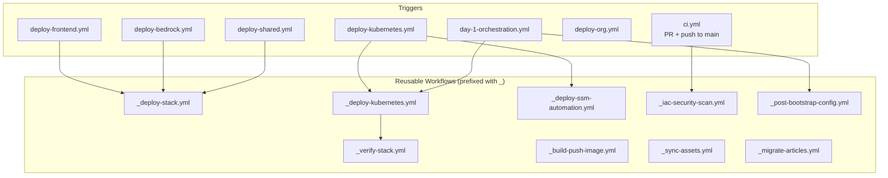

# GitHub Actions Workflows

> 21 workflows implementing CI, deployment, security scanning, and GitOps — all using **OIDC federation** (no static credentials).

## Workflow Architecture

## Workflow Inventory

### Trigger Workflows

| Workflow | Trigger | Purpose |
| :------- | :------ | :------ |
| `ci.yml` | PR, push to main | Lint, typecheck, test, synth, security scan |
| `deploy-kubernetes.yml` | Manual dispatch | Full K8s cluster deployment (12 stacks) |
| `deploy-eks-development.yml` | `workflow_run` after Deploy K8s (Dev) + manual | EKS V1: 6-stack deploy chained on K8s success |
| `deploy-eks-staging.yml` | Manual dispatch | EKS V1: 6-stack deploy to staging |
| `deploy-eks-production.yml` | Manual dispatch (env-gated) | EKS V1: 6-stack deploy to production |
| `destroy-eks-development.yml` | Manual dispatch | Tear down EKS V1 in development |
| `destroy-eks-staging.yml` | Manual dispatch | Tear down EKS V1 in staging |
| `destroy-eks-production.yml` | Manual dispatch (env-gated) | Tear down EKS V1 in production |
| `deploy-frontend.yml` | Manual dispatch | Next.js application deployment |
| `deploy-bedrock.yml` | Manual dispatch | Bedrock AI pipeline (4 stacks) |
| `deploy-shared.yml` | Manual dispatch | Foundation tier (Crossplane, FinOps, Security) |
| `deploy-org.yml` | Manual dispatch | Root account governance stack |
| `deploy-ssm-automation.yml` | Manual dispatch | SSM Automation documents + Step Functions |
| `deploy-post-bootstrap.yml` | Manual dispatch | Post-bootstrap K8s configuration |
| `day-1-orchestration.yml` | Manual dispatch | Full day-1 setup: infra → bootstrap → config |
| `build-ci-image.yml` | Manual dispatch | Build custom CI Docker image |
| `gitops-k8s.yml` | Push to k8s paths | GitOps sync for Kubernetes manifests |
| `publish-article.yml` | Manual dispatch | Bedrock article generation + publish pipeline |

### Reusable Workflows (prefixed with `_`)

| Workflow | Called By | Purpose |
| :------- | :-------- | :------ |
| `_deploy-stack.yml` | Multiple deployers | Generic CDK stack deployment with diff + deploy |
| `_deploy-kubernetes.yml` | `deploy-kubernetes.yml` | K8s-specific deployment with ordered stack dependencies |
| `_deploy-eks.yml` | `deploy-eks-{development,staging,production}.yml` | EKS V1: synth + deploy 6 EKS stacks in dependency order |
| `_destroy-eks.yml` | `destroy-eks-{development,staging,production}.yml` | EKS V1: destroy 6 EKS stacks in reverse dependency order |
| `_deploy-ssm-automation.yml` | `deploy-ssm-automation.yml` | SSM document deployment + validation |
| `_iac-security-scan.yml` | `ci.yml` | Checkov scan with SARIF upload to GitHub Security |
| `_verify-stack.yml` | Post-deploy steps | CloudFormation stack status verification |
| `_build-push-image.yml` | Multiple deployers | Docker build → ECR push |
| `_post-bootstrap-config.yml` | `deploy-post-bootstrap.yml` | K8s post-bootstrap: ArgoCD, monitoring, cert-manager |
| `_sync-assets.yml` | `deploy-frontend.yml` | S3 asset sync for static content |
| `_migrate-articles.yml` | `publish-article.yml` | Article content migration to S3/DynamoDB |

## Conventions

- **Reusable prefix** — workflows starting with `_` are reusable (called via `workflow_call`)
- **OIDC authentication** — all AWS calls use `aws-actions/configure-aws-credentials` with OIDC federation
- **Environment gating** — prod deployments require GitHub Environment approval
