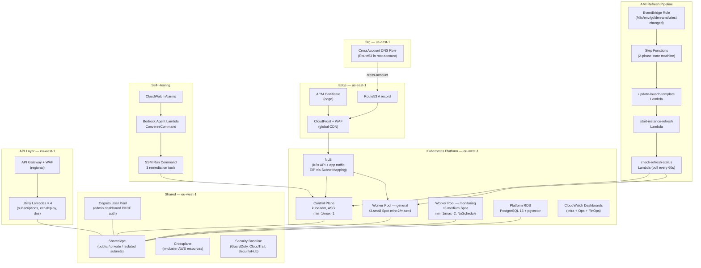

# CDK Platform Infrastructure

[](https://github.com/Nelson-Lamounier/cdk-monitoring/actions/workflows/ci.yml)
[](https://www.npmjs.com/package/@nelsonlamounier/cdk-governance-aspects)
[](https://www.typescriptlang.org/)
[](https://aws.amazon.com/cdk/)
[](./LICENSE)

> AWS CDK v2 TypeScript monorepo: self-managed Kubernetes on EC2 (kubeadm), SharedVpc networking, Cognito authentication, Platform PostgreSQL 16, Bedrock-powered self-healing, and AMI refresh automation — 16 stacks across 3 CDK projects deployed via the Project Factory pattern.

---

## What it does

This repository provisions and manages the complete AWS platform layer for a production SaaS application. It stands up a self-managed Kubernetes cluster (kubeadm, EC2 Spot workers), attaches a SharedVpc used by every project, manages Cognito for the admin dashboard, provisions a Platform PostgreSQL 16 instance with pgvector for application data, and wires two autonomous pipelines: a Bedrock-powered self-healing Lambda that diagnoses and remediates cluster incidents via SSM Run Command, and an AMI Refresh Step Functions state machine that performs rolling node replacement whenever a new Golden AMI is published to SSM.

Infrastructure is defined as TypeScript CDK constructs (aws-cdk-lib 2.232.1, TypeScript 5.9, Node 22) and ships via 11 GitHub Actions workflow files covering CI validation, CDK stack deployment, and Kubernetes cluster day-1 orchestration. The admin-api BFF (Hono, Node 22) lives in `api/admin-api/` and is deployed to Kubernetes via ArgoCD from the sibling `kubernetes-bootstrap` repository.

This repo is the platform infrastructure layer. Application workloads (AI pipelines, Bedrock agents, article ingestion) live in [`ai-applications`](https://github.com/Nelson-Lamounier/ai-applications). The Next.js 15 frontend and admin dashboard live in [`frontend-portfolio`](https://github.com/Nelson-Lamounier/frontend-portfolio). Kubernetes bootstrap scripts, Helm charts, and ArgoCD Applications live in [`kubernetes-bootstrap`](https://github.com/Nelson-Lamounier/kubernetes-bootstrap).

---

## Why this exists

The prior architecture co-located Next.js ECS stacks, platform infrastructure, and AI pipeline definitions in a single monorepo. As the platform matured — gaining a self-managed Kubernetes cluster, Crossplane, Cognito, Platform RDS, and autonomous self-healing — the co-location created hard coupling between application-tier and platform-tier concerns. Changes to the K8s worker node AMI would trigger the same CI pipeline as a React component change.

This repository is the extracted platform infrastructure layer. The split gives each repo a single reason to change: this repo changes when platform infrastructure changes (new stack, IAM policy update, AMI rotation, CDK version bump), not when an application feature ships.

The CDK Project Factory pattern (`infra/bin/app.ts` parses `-c project=X -c environment=Y` and delegates to a typed factory) means the same entry point deploys all 16 stacks across 3 projects without exposing project-specific logic to the orchestrator ([`infra/lib/projects/`](infra/lib/projects/)).

---

## Highlights

- **16 CDK stacks across 3 projects** — `kubernetes` (10 stacks), `shared` (5 stacks), `org` (1 stack); all stacks created by typed `IProjectFactory` implementations registered in `projectFactoryRegistry`; single `bin/app.ts` entry point, zero project logic in the orchestrator ([`infra/lib/projects/`](infra/lib/projects/), [`infra/bin/app.ts`](infra/bin/app.ts))
- **AMI Refresh Step Functions pipeline** — 2-phase rolling node replacement (workers first, then control plane), driven by 3 Node 22 Lambda handlers (`update-launch-template`, `start-instance-refresh`, `check-refresh-status`), X-Ray traced, 2-hour timeout, CloudWatch alarm + SNS notification on state machine failure ([`infra/lib/constructs/events/ami-refresh/`](infra/lib/constructs/events/ami-refresh/))
- **Bedrock self-healing agent** — CloudWatch alarm → EventBridge → Lambda → Bedrock `ConverseCommand` with 3 registered SSM tool actions (`diagnose-alarm`, `ebs-detach`, `analyse-cluster-health`); CDK constructs and CloudWatch dashboard wiring in this repo, Lambda handlers in [`ai-applications`](https://github.com/Nelson-Lamounier/ai-applications) ([docs/projects/self-healing-platform.md](docs/projects/self-healing-platform.md))
- **Published CDK governance package** — [`@nelsonlamounier/cdk-governance-aspects`](https://www.npmjs.com/package/@nelsonlamounier/cdk-governance-aspects) v1.0.0 MIT: `TaggingAspect` (7-tag kebab-case schema, `cost-centre` for Cost Explorer grouping) + `EnforceReadOnlyDynamoDbAspect` (blocks write actions on ECS task roles at synthesis time); applied across all 16 stacks via CDK `Aspects.of()` ([`packages/cdk-governance-aspects/`](packages/cdk-governance-aspects/))
- **Synthesis-time security** — 12 custom Checkov rules ([`.checkov/custom_checks/`](.checkov/custom_checks/)), CDK-Nag `AwsSolutions` compliance across all stacks, `EnforceReadOnlyDynamoDbAspect` fails synthesis on IAM violations before a single `cdk deploy` runs; 34 Jest tests (32 infra + 2 CDK aspect package)
- **9 Architecture Decision Records** documenting every major technology choice with alternatives evaluated, tradeoffs, and rejection rationale ([`docs/decisions/`](docs/decisions/))

---

## Architecture



Platform infrastructure is provisioned by CDK stacks in [`infra/lib/stacks/`](infra/lib/stacks/). Application workloads (Next.js, admin-api, public-api, AI pipelines) run as Kubernetes pods or Jobs deployed by ArgoCD from [`kubernetes-bootstrap`](https://github.com/Nelson-Lamounier/kubernetes-bootstrap) — CDK does not manage pod deployments.

Canonical docs: [cdk-monitoring Platform](docs/projects/cdk-monitoring-platform.md) · [Self-Healing Platform](docs/projects/self-healing-platform.md) · [Request Lifecycle: Viewer to Pod](docs/concepts/request-lifecycle-viewer-to-pod.md)

---

## Tech stack

**Infrastructure as Code**
- AWS CDK v2 / aws-cdk-lib 2.232.1 (TypeScript 5.9, Node 22)
- CloudFormation (synthesised output)
- Crossplane v2 (in-cluster AWS resource management)

**Compute & Networking**
- EC2 Spot instances (Launch Templates, Auto Scaling Groups)
- Kubernetes (kubeadm, self-managed on EC2)
- NLB with EIP SubnetMapping, Security Groups, SharedVpc
- CloudFront + WAF (global edge), API Gateway + WAF (regional)

**Data**
- RDS PostgreSQL 16 with pgvector (platform data + vector embeddings)
- S3 (bootstrap artefacts, static assets, access logs)
- SSM Parameter Store (cross-repo and cross-stack integration bus)

**Auth & Security**
- Cognito (OAuth 2.0 / PKCE, admin dashboard)
- ACM, CDK-Nag (AwsSolutions), 12 custom Checkov rules, Snyk
- GuardDuty, CloudTrail, SecurityHub (SecurityBaselineStack)

**Automation**
- Step Functions (AMI Refresh 2-phase state machine)
- EventBridge (AMI SSM parameter change trigger)
- Bedrock ConverseCommand (self-healing agent inference)
- SSM Run Command (remediation execution)

**Observability**
- CloudWatch (dashboards, alarms, metrics, Logs Insights)
- Grafana + Prometheus + Loki (on K8s, deployed via Helm from kubernetes-bootstrap)

**CI/CD**
- GitHub Actions (11 workflow files — CI, CDK deploy, K8s day-1 orchestration)
- ArgoCD + Argo Rollouts (GitOps delivery, Blue/Green with Prometheus gates)

---

## Key design decisions

| # | Decision | One-line rationale |
|:--|:---------|:-------------------|
| [ADR-001](docs/decisions/0001-self-managed-k8s-vs-eks.md) | Self-managed K8s over EKS | Eliminates ~$73/mo EKS control plane cost; demonstrates kubeadm and cluster lifecycle depth |
| [ADR-002](docs/decisions/0002-tucaken-architecture-migration.md) | K8s Jobs over Lambda/Step Functions for pipelines | Eliminates NAT Gateway costs and cold-start S3 staging overhead; uniform job execution environment |
| [ADR-003](docs/decisions/0003-ssm-over-cloudformation-exports.md) | SSM Parameters over CloudFormation cross-stack exports | `Fn::ImportValue` prevents stack deletion and couples deploy order; SSM decouples all cross-stack and cross-repo discovery |
| [ADR-004](docs/decisions/0004-crossplane-over-terraform-modules.md) | Crossplane over Terraform modules for in-cluster AWS resources | Kubernetes-native GitOps lifecycle for AWS resources declared by workloads; no separate Terraform state |
| [ADR-005](docs/decisions/0005-cognito-over-auth0.md) | Amazon Cognito over Auth0 | Eliminates Auth0 monthly cost; PKCE flow, JWKS validation, and Cognito Plus threat protection at pennies per MAU |
| [ADR-006](docs/decisions/0006-nlb-over-eip-failover-lambda.md) | NLB over EIP-failover Lambda | NLB SubnetMapping permanently binds EIP; TCP health checks route to healthy targets without Lambda-triggered re-association |
| [ADR-007](docs/decisions/0007-gitops-over-direct-k8s-deploy.md) | ArgoCD Image Updater over direct K8s deploy in CI | GitOps delivery survives CI downtime; ArgoCD polls ECR and writes new image tags to Git — no cluster credentials in GitHub secrets |
| [ADR-008](docs/decisions/0008-k8s-job-images-from-configmap-files.md) | Job image URIs from ConfigMap file mounts | ESO syncs ECR image tags to in-cluster ConfigMap; admin-api reads from `/etc/admin-api/images/*` with 30s TTL — no Rollout required on image tag change |
| [ADR-009](docs/decisions/0009-argo-rollouts-blue-green-prometheus.md) | Argo Rollouts Blue/Green with Prometheus pre-promotion analysis | Automated canary analysis gates Blue/Green promotion; manual `kubectl argo rollouts promote` preserves human sign-off before traffic cut |

---

## Repository structure

```
cdk-monitoring/
├── infra/
│   ├── bin/app.ts                    # CDK entry — parses -c project= -c environment=
│   ├── lib/
│   │   ├── projects/                 # KubernetesProjectFactory, SharedProjectFactory, OrgProjectFactory
│   │   ├── factories/                # IProjectFactory interface + projectFactoryRegistry
│   │   ├── stacks/
│   │   │   ├── kubernetes/           # 10 stacks: Base, ControlPlane, WorkerAsg ×2, Data,
│   │   │   │                         #   PlatformRds, AppIam, Api, Edge, Observability
│   │   │   ├── shared/               # 5 stacks: SharedVpc, SecurityBaseline, FinOps,
│   │   │   │                         #   Crossplane, CognitoAuth
│   │   │   └── org/                  # 1 stack: CrossAccountDnsRole
│   │   ├── constructs/               # Reusable L3 CDK constructs
│   │   │   ├── compute/              # LaunchTemplateConstruct, ASG helpers
│   │   │   ├── events/ami-refresh/   # AmiRefreshConstruct + 3 Lambda handlers
│   │   │   ├── networking/           # CloudFrontConstruct, NlbConstruct
│   │   │   ├── observability/        # CloudWatch dashboards, Bedrock observability
│   │   │   └── security/             # Account security baseline
│   │   └── aspects/                  # TaggingAspect, EnforceReadOnlyDynamoDbAspect, cdk-nag
│   ├── lambda/                       # 4 utility Lambdas: dns, ecr-deploy, subscriptions ×2
│   ├── scripts/bootstrap/            # CDKCloudFormationEx.json + bootstrap automation
│   └── tests/                        # 32 Jest test files (unit + integration)
├── api/
│   └── admin-api/                    # Hono BFF (Node 22): Cognito JWKS auth, K8s Job dispatch,
│                                     #   PgBouncer pool, FinOps routes
├── packages/
│   └── cdk-governance-aspects/       # @nelsonlamounier/cdk-governance-aspects v1.0.0 (MIT)
├── docs/                             # 79 knowledge-base documents
│   ├── decisions/                    # 9 ADRs
│   ├── concepts/                     # 18 concept docs
│   ├── projects/                     # 5 project docs
│   ├── patterns/                     # 4 pattern docs
│   ├── tools/                        # 4 tool docs
│   ├── runbooks/                     # 5 operational runbooks
│   └── troubleshooting/              # 21 troubleshooting docs
├── .github/workflows/                # 11 workflow files (7 user-facing + 4 reusable callees)
└── .checkov/custom_checks/           # 12 custom Checkov security rules
```

---

## Documentation

Structured knowledge base: 79 documents across 7 categories. Entry points:

| Document | What it covers |
|:---------|:---------------|
| [cdk-monitoring Platform](docs/projects/cdk-monitoring-platform.md) | **Canonical entry point** — what this repo owns, 16-stack inventory, SSM integration bus, sibling repo relationships |
| [CDK Platform Stacks](docs/projects/cdk-platform-stacks.md) | Full reference for all 16 stacks: regions, dependencies, CDK project membership |
| [Self-Healing Platform](docs/projects/self-healing-platform.md) | Bedrock Agent + AMI Refresh pipelines: failure modes, remediation flows, manual intervention matrix |
| [CDK Construct Architecture](docs/concepts/cdk-construct-architecture.md) | L1/L2/L3 hierarchy, custom L3 constructs, Project Factory pattern, CDK Aspects |
| [CDK Aspects Governance](docs/concepts/cdk-aspects-governance.md) | `TaggingAspect`, `EnforceReadOnlyDynamoDbAspect`, cdk-nag, published npm package, Aspect testing patterns |
| [Request Lifecycle: Viewer to Pod](docs/concepts/request-lifecycle-viewer-to-pod.md) | End-to-end path: DNS → CloudFront → WAF → NLB → Traefik → kube-proxy → Pod, per-hop failure modes |
| [docs/README.md](docs/README.md) | Full index: all 9 ADRs, 18 concepts, 5 projects, 4 patterns, 5 runbooks, 21 troubleshooting docs |

---

## Running locally

```bash
# Install dependencies
yarn install

# Synthesise a project (no AWS credentials needed for synth)
npx cdk synth -c project=kubernetes -c environment=dev

# Diff against deployed stack
npx cdk diff -c project=kubernetes -c environment=dev

# Run all tests
yarn test

# Run linting
yarn lint
```

Available projects: `kubernetes` · `shared` · `org`

Available environments: `dev` · `staging` · `prod`

---

## Deploying

Deployments run via GitHub Actions. The `_deploy-kubernetes.yml`, `_deploy-stack.yml`, `_verify-stack.yml`, and `_build-push-image.yml` workflows are reusable callees — not triggered directly.

| Workflow | Trigger | What it deploys |
|:---------|:--------|:----------------|
| [`ci.yml`](.github/workflows/ci.yml) | Every push | Lint, test, CDK synth validation, Checkov scan |
| [`deploy-shared.yml`](.github/workflows/deploy-shared.yml) | Push to `main` | SharedVpc, Cognito, Crossplane, SecurityBaseline, FinOps |
| [`deploy-kubernetes.yml`](.github/workflows/deploy-kubernetes.yml) | Push to `main` | All 10 K8s platform stacks + AMI Refresh Lambda smoke test |
| [`deploy-api.yml`](.github/workflows/deploy-api.yml) | Push to `main` (api/admin-api/**) | admin-api Docker image → ECR; ArgoCD Image Updater handles rollout |
| [`deploy-org.yml`](.github/workflows/deploy-org.yml) | Push to `main` | Cross-account DNS role (us-east-1) |
| [`day-1-orchestration.yml`](.github/workflows/day-1-orchestration.yml) | Manual dispatch | Bootstrap new K8s nodes via SSM Automation |
| [`build-ci-image.yml`](.github/workflows/build-ci-image.yml) | Manual dispatch | Rebuild the CI Docker image used by deploy workflows |

Application workloads are deployed separately by ArgoCD from [`kubernetes-bootstrap`](https://github.com/Nelson-Lamounier/kubernetes-bootstrap) — CDK does not manage pod deployments.

---

## Related projects

| Repository | Role |
|:-----------|:-----|
| [`kubernetes-bootstrap`](https://github.com/Nelson-Lamounier/kubernetes-bootstrap) | EC2 bootstrap Python scripts (kubeadm day-1), ArgoCD app-of-apps, Helm charts for all platform and application workloads |
| [`ai-applications`](https://github.com/Nelson-Lamounier/ai-applications) | Bedrock self-healing Lambda handlers, article ingestion pipeline, job-strategist, pgvector KB sync |
| [`frontend-portfolio`](https://github.com/Nelson-Lamounier/frontend-portfolio) | Next.js 15 frontend, start-admin TanStack dashboard, Grafana Faro RUM client |

CDK-to-sibling handoffs use SSM Parameter Store: this repo publishes parameters (ECR URIs, RDS endpoint, EIP address, Cognito pool IDs, security group ID, IAM role ARN) that are consumed by kubernetes-bootstrap and ai-applications without CloudFormation export coupling ([ADR-003](docs/decisions/0003-ssm-over-cloudformation-exports.md)).

---

## License

Private — see [LICENSE](./LICENSE).

<!--
Evidence trail (auto-generated):
- Source: infra/bin/app.ts (read on 2026-04-29)
- Source: infra/lib/factories/project-registry.ts (read on 2026-04-29) — 3 projects: SHARED, ORG, KUBERNETES
- Source: infra/lib/projects/kubernetes/factory.ts (read on 2026-04-29) — 10 stack push() calls
- Source: infra/lib/projects/shared/factory.ts (read on 2026-04-29) — 5 stack push() calls
- Source: infra/lib/projects/org/factory.ts (read on 2026-04-29) — 1 stack push() call
- Source: infra/package.json (read on 2026-04-29) — aws-cdk-lib 2.232.1, typescript 5.9.3
- Source: .nvmrc (read on 2026-04-29) — Node 22
- Source: packages/cdk-governance-aspects/package.json (read on 2026-04-29) — v1.0.0, MIT
- Source: .github/workflows/ (listed on 2026-04-29) — 11 YAML workflow files
- Source: .checkov/custom_checks/ (listed on 2026-04-29) — 12 rules
- Source: find infra packages -name "*.test.ts" (run on 2026-04-29) — 34 test files
- Source: infra/lib/constructs/events/ami-refresh/ (listed on 2026-04-29) — 3 Lambda handlers
- Source: infra/lambda/ (listed on 2026-04-29) — 4 active utility Lambdas (eip-failover deprecated)
- Source: docs/decisions/ (listed on 2026-04-29) — 9 ADR files
- Source: docs/ subdirectories (counted on 2026-04-29) — 79 total documents
-->
