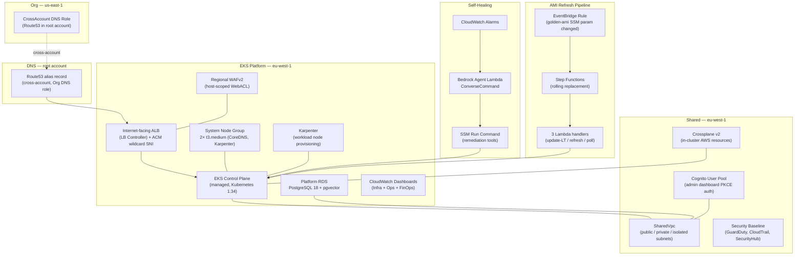

# tucaken-infra

**The AWS platform infrastructure for [Tucaken](https://tucaken.io) — a SaaS that
turns a developer's real code into a job-tailored, evidence-backed resume.** A
job-seeker connects their GitHub account; Tucaken verifies which skills they can
actually prove from their repositories and, given a specific job description,
generates a resume tailored to that role using only skills the candidate can
defend in an interview.

**This repo's role:** the AWS substrate the whole product runs on — the **EKS
cluster** itself, its VPC and networking, the PostgreSQL data layer, the edge
(internet-facing ALB + regional WAFv2), IAM (EKS Pod Identity), and two autonomous operations
pipelines (Golden-AMI node refresh and Bedrock-driven self-healing). Everything
that runs *inside* the cluster — ArgoCD, Helm charts, in-cluster services — lives
in the sibling **kubernetes-bootstrap** repo; the AI/ML job workers live in
**ai-applications**; the user-facing web app and BFF live in **tucaken-app**.

[](https://github.com/Nelson-Lamounier/tucaken-infra/actions/workflows/ci.yml)
[](https://www.npmjs.com/package/@nelsonlamounier/cdk-governance-aspects)
[](https://www.typescriptlang.org/)
[](https://aws.amazon.com/cdk/)
[](./LICENSE)

---

## What it does

This repository provisions and manages the complete AWS platform layer for the
Tucaken SaaS. It stands up an **Amazon EKS cluster** (Kubernetes 1.34), attaches a
`SharedVpc` used by every project, provisions node capacity through Karpenter on
top of a small managed system node group, manages Cognito for the admin
dashboard, and provisions a Platform PostgreSQL instance with pgvector for
application data. It also wires two autonomous pipelines: a Bedrock-powered
self-healing Lambda that diagnoses and remediates cluster incidents via SSM Run
Command, and an AMI Refresh Step Functions state machine that performs rolling
node replacement whenever a new Golden AMI is published to SSM.

Infrastructure is defined as TypeScript CDK constructs (aws-cdk-lib 2.232.1,
TypeScript 5.9, Node 22) and ships via GitHub Actions workflows covering CI
validation, CDK stack deployment, and cluster day-1 orchestration. Application
workloads (the web app, admin-api BFF, and AI Job workers) run as Kubernetes pods
or Jobs deployed by ArgoCD from the sibling
[`kubernetes-bootstrap`](https://github.com/Nelson-Lamounier/kubernetes-bootstrap)
repository — CDK does not manage pod deployments.

## Why this exists

The prior architecture co-located Next.js stacks, platform infrastructure, and AI
pipeline definitions in a single monorepo. As the platform matured — gaining a
managed Kubernetes cluster, Crossplane, Cognito, Platform RDS, and autonomous
self-healing — the co-location created hard coupling between application-tier and
platform-tier concerns. A worker node AMI change would trigger the same CI
pipeline as a React component change.

This repository is the extracted platform infrastructure layer. The split gives
each repo a single reason to change: this repo changes when platform
infrastructure changes (new stack, IAM policy update, AMI rotation, CDK version
bump), not when an application feature ships.

The platform has since **migrated from a self-managed kubeadm cluster to Amazon
EKS** (migration design:
[docs/superpowers/specs/2026-05-05-eks-migration-design.md](docs/superpowers/specs/2026-05-05-eks-migration-design.md)).
The CDK Project Factory pattern (`infra/bin/app.ts` parses
`-c project=X -c environment=Y` and delegates to a typed factory) means a single
entry point deploys every stack across all projects without exposing
project-specific logic to the orchestrator
([`infra/lib/projects/`](infra/lib/projects/)).

## Highlights

- **kubeadm → EKS migration** — the platform moved from a self-managed kubeadm
  control plane to **Amazon EKS 1.34** (verified live: cluster `k8s-eks-development`,
  platform `eks.24`, `ACTIVE`). Node capacity is Karpenter-provisioned on top of a
  2× `t3.medium` managed system node group; IAM uses **Pod Identity over IRSA**
  ([`infra/lib/stacks/kubernetes/`](infra/lib/stacks/kubernetes/))
- **One stack per failure domain** — the EKS surface is decomposed into ordered,
  single-purpose stacks: `EksCluster` → `EksSystemNg` → `EksPodIdentity` →
  `EksAddons` → `EksKarpenter`, with `EksAccess` depending on the cluster only.
  Edge and cost stacks (`EksAlbCerts`, `EksPublicWaf`, `EksScheduler`) are
  independent ([`infra/lib/stacks/kubernetes/`](infra/lib/stacks/kubernetes/))
- **AMI Refresh Step Functions pipeline** — rolling node replacement driven by 3
  Node 22 Lambda handlers (`update-launch-template`, `start-instance-refresh`,
  `check-refresh-status`), X-Ray traced, with a CloudWatch alarm + SNS
  notification on state-machine failure
  ([`infra/lib/constructs/events/ami-refresh/`](infra/lib/constructs/events/ami-refresh/))
- **Bedrock self-healing agent** — CloudWatch alarm → EventBridge → Lambda →
  Bedrock `ConverseCommand` with registered SSM tool actions; CDK constructs and
  dashboard wiring live here, Lambda handlers in
  [`ai-applications`](https://github.com/Nelson-Lamounier/ai-applications)
  (live stacks: `SelfHealing-Agent-development`, `SelfHealing-Gateway-development`)
- **Published CDK governance package** —
  [`@nelsonlamounier/cdk-governance-aspects`](https://www.npmjs.com/package/@nelsonlamounier/cdk-governance-aspects)
  (MIT): `TaggingAspect` (7-tag kebab-case schema, `cost-centre` for Cost
  Explorer grouping) + `EnforceReadOnlyDynamoDbAspect` (blocks write actions at
  synthesis time); applied across all stacks via CDK `Aspects.of()`
  ([`packages/cdk-governance-aspects/`](packages/cdk-governance-aspects/))
- **Synthesis-time security** — 12 custom Checkov rules
  ([`.checkov/custom_checks/`](.checkov/custom_checks/)), CDK-Nag `AwsSolutions`
  compliance, and an Aspect that fails synthesis on IAM violations before a single
  `cdk deploy`; 42 Jest test files
- **9 Architecture Decision Records** documenting every major technology choice
  with alternatives, tradeoffs, and rejection rationale
  ([`docs/decisions/`](docs/decisions/))

## Architecture



Platform infrastructure is provisioned by CDK stacks in
[`infra/lib/stacks/`](infra/lib/stacks/). Application workloads (web app,
admin-api, AI Job workers) run as Kubernetes pods or Jobs deployed by ArgoCD from
[`kubernetes-bootstrap`](https://github.com/Nelson-Lamounier/kubernetes-bootstrap)
— CDK does not manage pod deployments.

## Tech stack

**Infrastructure as Code**
- AWS CDK v2 / aws-cdk-lib 2.232.1 (TypeScript 5.9, Node 22)
- CloudFormation (synthesised output)
- Crossplane v2 (in-cluster AWS resource management)

**Cluster & Compute**
- Amazon EKS 1.34 (managed control plane)
- Karpenter (workload node provisioning) + 2× t3.medium managed system node group
- EC2 Launch Templates, Golden AMIs published to SSM
- EKS Pod Identity (per service-account IAM, over IRSA)

**Networking & Edge**
- Internet-facing ALB via AWS Load Balancer Controller, with ACM wildcard SNI certificates per apex
- Regional WAFv2 host-scoped WebACL on the shared ALB
- SharedVpc (public / private / isolated subnets); Route53 alias via cross-account Org DNS role

**Data**
- RDS PostgreSQL 18 with pgvector (platform data + vector embeddings)
- S3 (bootstrap artefacts, static assets, access logs)
- SSM Parameter Store (cross-repo and cross-stack integration bus)

**Auth & Security**
- Cognito (OAuth 2.0 / PKCE, admin dashboard)
- ACM, CDK-Nag (AwsSolutions), 12 custom Checkov rules, Snyk
- GuardDuty, CloudTrail, SecurityHub (SecurityBaselineStack)

**Automation**
- Step Functions (AMI Refresh rolling replacement)
- EventBridge (Golden-AMI SSM parameter change trigger)
- EventBridge Scheduler (dev cluster auto start/stop for cost control)
- Bedrock ConverseCommand (self-healing agent inference)
- SSM Run Command (remediation execution)

**Observability**
- CloudWatch (dashboards, alarms, metrics, Logs Insights)
- Grafana + Prometheus + Loki (in-cluster, deployed via Helm from kubernetes-bootstrap)

**CI/CD**
- GitHub Actions (21 workflow files — CI, CDK deploy, cluster day-1 orchestration)
- ArgoCD + Argo Rollouts (GitOps delivery, Blue/Green with Prometheus gates)

## Key design decisions

The platform migrated kubeadm → EKS in 2026-05; ADRs 001 and 006 record the
*original* self-managed rationale and remain as decision history (see the
[EKS migration design](docs/superpowers/specs/2026-05-05-eks-migration-design.md)).

| # | Decision | One-line rationale |
|:--|:---------|:-------------------|
| [ADR-001](docs/decisions/0001-self-managed-k8s-vs-eks.md) | Self-managed K8s over EKS *(superseded — since migrated to EKS)* | Original rationale: avoid EKS control-plane cost; demonstrate kubeadm lifecycle depth |
| [ADR-002](docs/decisions/0002-tucaken-architecture-migration.md) | K8s Jobs over Lambda/Step Functions for pipelines | Eliminates NAT and cold-start S3 staging overhead; uniform job execution environment |
| [ADR-003](docs/decisions/0003-ssm-over-cloudformation-exports.md) | SSM Parameters over CloudFormation cross-stack exports | `Fn::ImportValue` couples deploy order and blocks deletion; SSM decouples cross-stack and cross-repo discovery |
| [ADR-004](docs/decisions/0004-crossplane-over-terraform-modules.md) | Crossplane over Terraform modules | Kubernetes-native GitOps lifecycle for AWS resources; no separate Terraform state |
| [ADR-005](docs/decisions/0005-cognito-over-auth0.md) | Amazon Cognito over Auth0 | PKCE flow, JWKS validation, threat protection at pennies per MAU |
| [ADR-006](docs/decisions/0006-nlb-over-eip-failover-lambda.md) | NLB over EIP-failover Lambda *(pre-EKS edge)* | NLB SubnetMapping binds the EIP; TCP health checks route without Lambda re-association |

The GitOps / Argo delivery decisions (ArgoCD Image Updater, K8s Job image URIs
from ESO ConfigMap, Argo Rollouts Blue/Green) live in the
[kubernetes-bootstrap](https://github.com/Nelson-Lamounier/kubernetes-bootstrap/tree/main/docs/decisions)
repo, which owns ArgoCD, Argo Rollouts, and ESO.

## Repository structure

```text
tucaken-infra/
├── infra/
│   ├── bin/app.ts                    # CDK entry — parses -c project= -c environment=
│   ├── lib/
│   │   ├── projects/                 # Kubernetes / Shared / Org project factories
│   │   ├── factories/                # IProjectFactory interface + projectFactoryRegistry
│   │   ├── stacks/
│   │   │   ├── kubernetes/           # EKS set: EksCluster, EksSystemNg, EksPodIdentity,
│   │   │   │                         #   EksAddons, EksKarpenter, EksAccess, EksAlbCerts,
│   │   │   │                         #   EksPublicWaf, EksScheduler + Base, Api, Data, PlatformRds
│   │   │   │   └── deprecated/       # Frozen kubeadm-era stacks (ControlPlane, Edge, WorkerAsg…)
│   │   │   ├── shared/               # SharedVpc, SecurityBaseline, FinOps, Crossplane, CognitoAuth
│   │   │   ├── bedrock/              # Article + (legacy) strategist pipeline stacks
│   │   │   └── org/                  # CrossAccountDnsRole
│   │   ├── constructs/               # Reusable L3 CDK constructs
│   │   │   ├── compute/              # Launch templates, ASG helpers, user-data builder
│   │   │   ├── events/ami-refresh/   # AmiRefreshConstruct + 3 Lambda handlers
│   │   │   ├── security/             # eks-public-waf, WAF rules, account baseline
│   │   │   ├── observability/        # CloudWatch dashboards, Bedrock inference profiles
│   │   │   └── iam/                  # Crossplane IAM construct
│   │   ├── lambda/                   # Utility Lambdas: dns, ecr-deploy, subscriptions
│   │   └── aspects/                  # TaggingAspect, EnforceReadOnlyDynamoDbAspect, cdk-nag
│   └── tests/                        # 42 Jest test files (unit + integration)
├── packages/
│   └── cdk-governance-aspects/       # @nelsonlamounier/cdk-governance-aspects (MIT)
├── docs/                             # 81 knowledge-base documents
│   ├── decisions/  (9)  concepts/ (18)  projects/ (5)  patterns/ (4)
│   ├── tools/      (4)  runbooks/  (5)  troubleshooting/ (21)
│   └── superpowers/                  # EKS migration specs + plans
├── .github/workflows/                # 21 workflow files (user-facing + reusable callees)
└── .checkov/custom_checks/           # 12 custom Checkov security rules
```

## Running locally

```bash
# Install dependencies
yarn install

# Synthesise a project (no AWS credentials needed for synth)
npx cdk synth -c project=kubernetes -c environment=dev

# Diff against the deployed stack
npx cdk diff -c project=kubernetes -c environment=dev

# Run all tests
yarn test

# Run linting
yarn lint
```

Available projects: `kubernetes` · `shared` · `org` · `bedrock` · `self-healing`

Available environments: `dev` · `staging` · `prod`

## Deploying

Deployments run via GitHub Actions. The `_deploy-eks.yml`,
`_deploy-kubernetes.yml`, `_deploy-stack.yml`, `_verify-stack.yml`, and
`_build-push-image.yml` workflows are reusable callees — not triggered directly.

| Workflow | Trigger | What it deploys |
|:---------|:--------|:----------------|
| [`ci.yml`](.github/workflows/ci.yml) | Every push | Lint, test, CDK synth validation, Checkov scan |
| [`deploy-shared.yml`](.github/workflows/deploy-shared.yml) | Push to `main` | SharedVpc, Cognito, Crossplane, SecurityBaseline, FinOps |
| [`deploy-eks-development.yml`](.github/workflows/deploy-eks-development.yml) | Push to `main` (relevant paths) | EKS cluster, system node group, Pod Identity, addons, Karpenter, ALB certs, WAF, scheduler |
| [`deploy-org.yml`](.github/workflows/deploy-org.yml) | Push to `main` | Cross-account DNS role (us-east-1) |
| [`bootstrap-argocd.yml`](.github/workflows/bootstrap-argocd.yml) | Manual dispatch | Install ArgoCD into the cluster |
| [`day-1-orchestration.yml`](.github/workflows/day-1-orchestration.yml) | Manual dispatch | Cluster day-1 bootstrap via SSM Automation |
| [`build-ci-image.yml`](.github/workflows/build-ci-image.yml) | Manual dispatch | Rebuild the CI Docker image used by deploy workflows |

Application workloads are deployed separately by ArgoCD from
[`kubernetes-bootstrap`](https://github.com/Nelson-Lamounier/kubernetes-bootstrap)
— CDK does not manage pod deployments.

## Related projects

| Repository | Role |
|:-----------|:-----|
| [`tucaken-app`](https://github.com/Nelson-Lamounier/tucaken-app) | User-facing web app (TanStack Start SSR) and the admin-api BFF that authenticates requests, owns the Postgres layer, and dispatches AI Jobs |
| [`ai-applications`](https://github.com/Nelson-Lamounier/ai-applications) | AI/ML backend — GitHub ingestion, skill-evidence extraction, JD-strategist, multi-agent resume synthesis (Bedrock); runs as Kubernetes Jobs |
| [`kubernetes-bootstrap`](https://github.com/Nelson-Lamounier/kubernetes-bootstrap) | In-cluster platform — ArgoCD app-of-apps, Helm charts, secrets, observability, ingress, and the Tucaken backend workloads |

CDK-to-sibling handoffs use SSM Parameter Store: this repo publishes parameters
(ECR URIs, RDS endpoint, Cognito pool IDs, security group IDs, IAM role ARNs) that
are consumed by kubernetes-bootstrap and ai-applications without CloudFormation
export coupling ([ADR-003](docs/decisions/0003-ssm-over-cloudformation-exports.md)).

## Documentation

Structured knowledge base: 81 documents across 7 categories. Entry points:

| Document | What it covers |
|:---------|:---------------|
| [cdk-monitoring Platform](docs/projects/cdk-monitoring-platform.md) | What this repo owns, stack inventory, SSM integration bus, sibling repo relationships |
| [Self-Healing Platform](docs/projects/self-healing-platform.md) | Bedrock Agent + AMI Refresh pipelines: failure modes, remediation flows, manual intervention matrix |
| [CDK Construct Architecture](docs/concepts/cdk-construct-architecture.md) | L1/L2/L3 hierarchy, custom L3 constructs, Project Factory pattern, CDK Aspects |
| [CDK Aspects Governance](docs/concepts/cdk-aspects-governance.md) | `TaggingAspect`, `EnforceReadOnlyDynamoDbAspect`, cdk-nag, published npm package |
| [EKS migration design](docs/superpowers/specs/2026-05-05-eks-migration-design.md) | The kubeadm → EKS migration: target architecture, stack decomposition, cutover plan |
| [docs/README.md](docs/README.md) | Full index: 9 ADRs, 18 concepts, 5 projects, 4 patterns, 5 runbooks, 21 troubleshooting docs |

> Note: `docs/projects/cdk-platform-stacks.md` and several project docs still
> describe the pre-EKS (kubeadm) stack set and are pending a refresh.

## License

Private — see [LICENSE](./LICENSE).

<!--
Evidence trail (auto-generated):
- Live: aws cloudformation list-stacks --profile dev-account --region eu-west-1 (run 2026-06-16) — EKS* stacks deployed, no kubeadm ControlPlane/WorkerAsg/NLB
- Live: aws eks describe-cluster --name k8s-eks-development (run 2026-06-16) — version 1.34, platform eks.24, ACTIVE
- Live: aws rds describe-db-instances (run 2026-06-16) — k8s-dev-platform-rds, postgres 18.3, db.t4g.micro
- Live: aws cloudfront list-distributions (run 2026-06-16) — null (no distribution exists; CloudFront retired, edge is the ALB)
- Live: aws elbv2 describe-load-balancers (run 2026-06-16) — k8s-public-f8655bfb7e, internet-facing ALB, active (sole edge)
- Source: infra/bin/app.ts (read 2026-06-16) — projects: kubernetes|shared|org|bedrock|self-healing
- Source: infra/lib/stacks/kubernetes/*.ts (listed 2026-06-16) — active EKS stack set (deprecated/ excluded)
- Source: infra/lib/shared/vpc-stack.ts#L771-L777 (read 2026-06-16) — job-strategist ECR replaces StrategistPipelineStack (Step Functions)
- Source: infra/package.json (read 2026-06-16) — aws-cdk-lib 2.232.1; .nvmrc — Node 22
- Source: packages/cdk-governance-aspects (listed 2026-06-16) — MIT package
- Source: .github/workflows/ (listed 2026-06-16) — 21 YAML workflow files; CI uses -c environment=dev
- Source: .checkov/custom_checks/ (listed 2026-06-16) — 12 rules
- Source: find infra/tests -name "*.test.ts" (run 2026-06-16) — 42 test files
- Source: docs/ subdirectories (counted 2026-06-16) — 81 docs; concepts 18, troubleshooting 21, decisions 9
- Cross-repo: tucaken-app/ai-applications/kubernetes-bootstrap README heads (read 2026-06-16) — product framing + repo roles
-->
