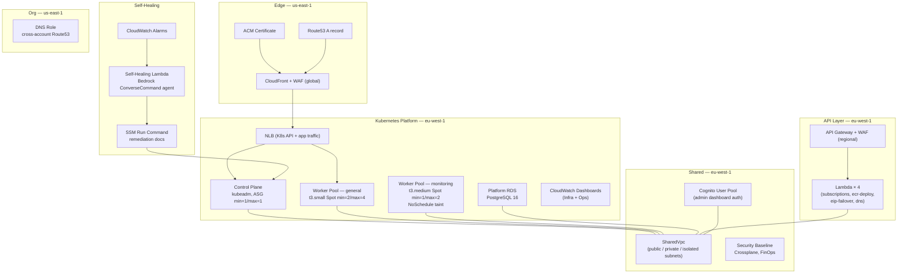

# CDK Platform Infrastructure

[](https://github.com/Nelson-Lamounier/cdk-monitoring/actions/workflows/ci.yml)
[](https://www.npmjs.com/package/@nelsonlamounier/cdk-governance-aspects)
[](https://www.typescriptlang.org/)
[](https://aws.amazon.com/cdk/)
[](./LICENSE)

> AWS CDK TypeScript infrastructure for the Tucaken SaaS platform — self-managed Kubernetes on EC2, SharedVpc networking, Cognito authentication, Platform RDS, and a Bedrock-powered self-healing agent — deployed across 15+ stacks via the Project Factory pattern.

---

## What it does

This repository provisions and manages the complete AWS platform layer for a production SaaS application. It stands up a self-managed Kubernetes cluster (kubeadm, EC2 Spot workers), attaches a SharedVpc used by every project, manages Cognito for the admin dashboard, provisions a Platform PostgreSQL instance for application data, and wires a self-healing Lambda that detects cluster incidents and invokes a Bedrock agent to remediate them autonomously.

Infrastructure ships via 11 GitHub Actions workflows covering CI, CDK deployment, and Kubernetes cluster day-1 orchestration.

---

## Why this exists

The prior architecture was a monorepo that co-located Next.js ECS stacks with platform infrastructure. As the platform matured — gaining a self-managed K8s cluster, Crossplane, Cognito, Platform RDS, and a Bedrock self-healing pipeline — the monorepo design created coupling between application-tier and platform-tier concerns.

This repository is the extracted platform infrastructure layer. Application workloads (AI pipelines, Bedrock agents, article ingestion) live in [`ai-applications`](https://github.com/Nelson-Lamounier/ai-applications). The Next.js frontend lives in [`frontend-portfolio`](https://github.com/Nelson-Lamounier/frontend-portfolio). Kubernetes bootstrap scripts and Helm charts live in [`kubernetes-bootstrap`](https://github.com/Nelson-Lamounier/kubernetes-bootstrap).

The split gives each repo a single reason to change: this repo changes when platform infrastructure changes, not when an application feature ships.

---

## Highlights

- **Self-managed Kubernetes on EC2** — kubeadm control plane + two Spot worker pools (general-purpose `t3.small` min=2/max=4, monitoring-dedicated `t3.medium` with `NoSchedule` taint), provisioned entirely via CDK without EKS fees ([ADR-001](docs/decisions/0001-self-managed-k8s-vs-eks.md))
- **Project Factory pattern** — single `bin/app.ts` entry point delegates to typed factories via `-c project=X -c environment=Y`; no project logic leaks into the orchestrator ([`infra/lib/factories/`](infra/lib/factories/))
- **Self-healing Lambda** — CloudWatch alarm triggers a Bedrock `ConverseCommand` agent that diagnoses Kubernetes incidents and applies SSM Run Command remediations without human intervention ([`infra/lambda/self-healing/`](infra/lambda/self-healing/), [`docs/concepts/self-healing-ssm-integration.md`](docs/concepts/self-healing-ssm-integration.md))
- **Platform RDS** — PostgreSQL 16 in SharedVpc isolated subnets, serving all platform domains (articles, identity, career, config); replaces three separate DynamoDB tables ([`infra/lib/stacks/kubernetes/platform-rds-stack.ts`](infra/lib/stacks/kubernetes/platform-rds-stack.ts))
- **Published npm package** — `@nelsonlamounier/cdk-governance-aspects` ships CDK Aspects for tag enforcement, resource naming, and security baselines as a reusable open-source library ([`packages/cdk-governance-aspects/`](packages/cdk-governance-aspects/))
- **Security-first CDK** — 13 custom Checkov rules, CDK-Nag compliance checks, SAST via Snyk, and cdk-nag suppressions documented with justification ([`.checkov/custom_checks/`](.checkov/custom_checks/))

---

## Architecture



Platform infrastructure is provisioned by CDK stacks defined in [`infra/lib/stacks/`](infra/lib/stacks/). Application workloads (Next.js, admin-api, public-api, AI pipelines) run as Kubernetes pods or Jobs deployed by ArgoCD from [`kubernetes-bootstrap`](https://github.com/Nelson-Lamounier/kubernetes-bootstrap).

---

## Tech stack

**Infrastructure as Code**
- AWS CDK v2 (TypeScript)
- CloudFormation (synthesised output)
- Crossplane v2 (K8s-native cloud resources)

**Compute & Networking**
- EC2 (Spot instances, Launch Templates, ASG)
- Kubernetes 1.29 (kubeadm, self-managed)
- NLB, Security Groups, SharedVpc

**Data**
- RDS PostgreSQL 16 (platform data)
- S3 (scripts bucket, static assets, access logs)
- SSM Parameter Store (cross-repo secret distribution)

**Auth & Security**
- Cognito (OAuth 2.0 / PKCE, admin dashboard)
- ACM, WAF (regional + global), CDK-Nag, Checkov, Snyk

**Observability**
- CloudWatch (dashboards, alarms, metrics)
- Grafana + Prometheus + Loki (on K8s, deployed via Helm)

**CI/CD**
- GitHub Actions (11 workflows — CI, CDK deploy, K8s day-1)
- ArgoCD (GitOps app delivery from kubernetes-bootstrap)

**Serverless**
- Lambda × 4 utility functions + self-healing agent
- API Gateway, EventBridge

---

## Key design decisions

- **Self-managed K8s over EKS** — deliberate learning decision for portfolio depth; eliminates ~$73/mo EKS control plane cost ([ADR-001: self-managed-k8s-vs-eks](docs/decisions/0001-self-managed-k8s-vs-eks.md))
- **Tucaken migration: Lambda/Step Functions → Kubernetes** — ingestion pipelines and AI jobs moved to K8s Jobs to eliminate VPC NAT costs and cold-start S3 staging overhead ([docs/decisions/0002-tucaken-architecture-migration.md](docs/decisions/0002-tucaken-architecture-migration.md))
- **Single Platform RDS over multiple DynamoDB tables** — one PostgreSQL 16 instance in SharedVpc replaces three DynamoDB tables; `pgvector` extension handles embeddings without a second instance ([`infra/lib/stacks/kubernetes/platform-rds-stack.ts`](infra/lib/stacks/kubernetes/platform-rds-stack.ts))
- **Project Factory pattern** — typed factory registry isolates project stacks while sharing VPC, IAM, and compliance concerns ([`infra/lib/factories/`](infra/lib/factories/))
- **Self-healing agent outside Kubernetes** — Lambda is architecturally correct here: if K8s is the failing component, a pod inside the cluster cannot receive or act on the alarm ([`infra/lambda/self-healing/`](infra/lambda/self-healing/))

---

## Repository structure

```
cdk-monitoring/
├── infra/
│   ├── bin/app.ts                  # CDK entry point — parses -c project= -c environment=
│   ├── lib/
│   │   ├── factories/              # Project Factory registry + interfaces
│   │   ├── stacks/
│   │   │   ├── kubernetes/         # 10 K8s platform stacks
│   │   │   ├── shared/             # Cognito, Crossplane, FinOps, SecurityBaseline
│   │   │   └── org/                # Cross-account DNS role
│   │   └── constructs/             # Reusable CDK constructs
│   ├── lambda/                     # 4 utility Lambdas + self-healing agent
│   └── tests/                      # 38 unit + integration test files
├── packages/
│   └── cdk-governance-aspects/     # Published npm package
├── docs/
│   ├── decisions/                  # Architecture Decision Records + migration decisions
│   ├── runbooks/                   # Operational runbooks
│   └── plans/                      # Active migration plans
├── .github/workflows/              # 11 CI/CD workflows
└── .checkov/custom_checks/         # 13 custom Checkov security rules
```

---

## Running locally

```bash
# Install dependencies
yarn install

# Synthesise a project
npx cdk synth -c project=kubernetes -c environment=dev

# Diff against deployed stack
npx cdk diff -c project=kubernetes -c environment=dev

# Run tests
yarn test

# Run linting
yarn lint
```

---

## Deploying

Deployments run via GitHub Actions triggered by push to `main`:

| Workflow | Trigger | What it does |
|---|---|---|
| `ci.yml` | Every push | Lint, test, CDK synth validation |
| `deploy-shared.yml` | Push to main | Deploy Cognito, Crossplane, SharedVpc |
| `deploy-kubernetes.yml` | Push to main | Deploy K8s platform stacks |
| `deploy-api.yml` | Push to main | Deploy API GW + Lambda stacks |
| `deploy-org.yml` | Push to main | Deploy cross-account DNS role |
| `day-1-orchestration.yml` | Manual dispatch | Bootstrap new K8s nodes via SSM |

Application workloads are deployed separately by ArgoCD from [`kubernetes-bootstrap`](https://github.com/Nelson-Lamounier/kubernetes-bootstrap) — CDK does not manage pod deployments.

---

## Related projects

| Repository | Role |
|---|---|
| [`kubernetes-bootstrap`](https://github.com/Nelson-Lamounier/kubernetes-bootstrap) | EC2 bootstrap scripts (kubeadm), ArgoCD app-of-apps, Helm charts for all applications |
| [`ai-applications`](https://github.com/Nelson-Lamounier/ai-applications) | Bedrock pipelines, article ingestion, job-strategist Lambda, pgvector KB sync |
| [`frontend-portfolio`](https://github.com/Nelson-Lamounier/frontend-portfolio) | Next.js 15 frontend, start-admin dashboard, Grafana Faro RUM client |

---

## License

Private — see [LICENSE](./LICENSE).

<!--
Evidence trail (auto-generated):
- Source: infra/lib/stacks/kubernetes/ (read on 2026-04-28)
- Source: infra/lib/stacks/shared/ (read on 2026-04-28)
- Source: infra/lib/stacks/org/ (read on 2026-04-28)
- Source: infra/lambda/README.md (read on 2026-04-28)
- Source: infra/lib/factories/README.md (read on 2026-04-28)
- Source: infra/lib/stacks/kubernetes/README.md (read on 2026-04-28)
- Source: packages/cdk-governance-aspects/README.md (read on 2026-04-28)
- Source: docs/decisions/0001-self-managed-k8s-vs-eks.md (read on 2026-04-28)
- Source: docs/decisions/0002-tucaken-architecture-migration.md (read on 2026-04-28)
- Source: .github/workflows/ (listed on 2026-04-28 — 11 workflows)
- Source: .checkov/custom_checks/ (listed on 2026-04-28 — 13 rules)
- Source: infra/tests/ (counted on 2026-04-28 — 38 test files)
-->
