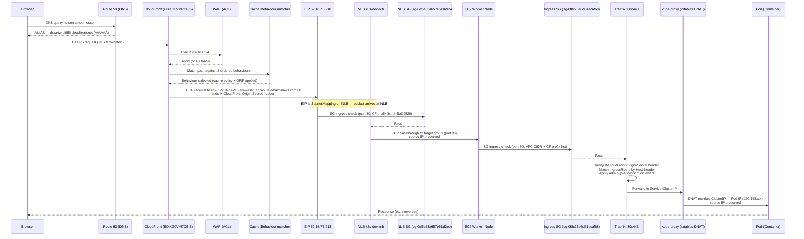

> **Archived 2026-07-06 — superseded.** This document traces the pre-EKS request path (DNS -> CloudFront -> WAF -> NLB -> Traefik -> pod), retired in the kubeadm to Amazon EKS migration. The edge is now a single internet-facing ALB with a regional WAFv2 WebACL ([ADR-0010](../../decisions/0010-alb-wafv2-edge-over-cloudfront-nlb.md)); see [EKS platform architecture](../../concepts/eks-platform-architecture.md). Kept as decision and debugging history — do not treat as current state.

## Overview

Every request to `nelsonlamounier.com` or `admin.nelsonlamounier.com` crosses six distinct infrastructure layers before reaching a container process. This document traces that path hop by hop, naming what each component does, what it adds or strips from the request, and what can fail at each point. The path is the same whether the request is for a Next.js page, an API route, or an admin dashboard.

---

## Full path — sequence diagram

---

## Hop 1 — DNS resolution (Route 53)

**What happens:** The browser queries `nelsonlamounier.com` (or `admin.nelsonlamounier.com`, `www.nelsonlamounier.com`). Route 53 returns an ALIAS record pointing to `dswrdzrbit55l.cloudfront.net`. The ALIAS resolves to one of CloudFront's edge PoP IP addresses.

**What is added or modified:** Nothing in the HTTP layer. The browser learns which CloudFront IP to connect to. The PoP selection is based on the viewer's geographic location and CloudFront's latency-based routing — there is no configuration knob in this repo that controls it.

**What can fail:**
- **Route 53 A record drift** — if the control plane node IP changes (e.g. after cross-AZ recovery), the NLB EIP may shift and the Route 53 A record for the admin subdomain can become stale. This happened in this platform and is documented in [NLB SG Rule Limit and Route53 A Record Drift](../troubleshooting/nlb-sg-rule-limit-and-route53-drift.md).
- **ALIAS propagation delay** — Route 53 ALIAS record changes propagate in seconds, but downstream resolvers may have cached the old answer for up to 60s (Route 53 returns TTL=60 for ALIASes).

**CDK wiring:** The ACM certificate for `nelsonlamounier.com` and all subdomains is validated via DNS using a cross-account role (`CrossAccountCertificateRole`). Certificate creation calls `route53.ARecord` inside `edge-stack.ts` to write the validation CNAME. The A record for the main domain is an alias target pointing at the CloudFront distribution (`edge-stack.ts`).

---

## Hop 2 — CloudFront edge (TLS termination + HTTP/2)

**What happens:** The browser establishes a TLS 1.2+ connection to a CloudFront PoP. CloudFront terminates TLS using the ACM certificate for `*.nelsonlamounier.com`. The request is now decrypted at the edge. CloudFront checks its regional cache before forwarding to origin.

**What is added or modified:**
- TLS is terminated — the origin receives plain HTTP.
- CloudFront adds standard viewer-context headers to the origin request (viewer IP, country, protocol), but only if the selected cache behaviour's OriginRequestPolicy includes them. The repo uses managed ORP `AllViewer` for the default behaviour and custom policies for API routes.
- `X-Forwarded-For` is populated with the viewer's IP.
- The `Authorization` header is forwarded via `CachePolicy` (TTL=0) rather than `OriginRequestPolicy` because CloudFront's `OriginRequestPolicy` blocks the `Authorization` header — see [CloudFront OriginRequestPolicy Blocks Authorization Header](../troubleshooting/cloudfront-authorization-header-origin-request-policy.md).

**Cache behaviour matching:** CloudFront evaluates 8 path patterns in declaration order. The `validateBehaviourOrdering()` static method on `CloudFrontConstruct` enforces at synth time that catch-all patterns (`/api/*`) appear after specific sub-path patterns (`/api/auth/*`). Out-of-order behaviours would silently serve wrong responses — see [CloudFront Behaviour First-Match Auth Failure](../troubleshooting/cloudfront-behaviour-first-match-auth-failure.md).

**AUTH_COOKIES handling:** Cognito session cookies (`CognitoIdentityServiceProvider.*`) are included in the cache key so logged-in and logged-out users get separate cache buckets. Cookie count is capped at 10 per ORP — see [CloudFront OriginRequestPolicy 10-Cookie Limit](../troubleshooting/cloudfront-origin-request-policy-10-cookie-limit.md).

**What can fail:**
- **Behaviour first-match ordering** — caught at synth time by `validateBehaviourOrdering()`. Runtime misconfiguration is not possible once deployed.
- **Cookie count overflow** — 11th cookie is silently dropped. `validateAuthCookies()` in `nextjs.ts` enforces ≤10 at module load time.
- **Cache serving stale content** — CF cache is not purged automatically after deployment. Manual invalidation via `aws cloudfront create-invalidation` is required.
- **TLS certificate expiry** — ACM auto-renews; failure requires DNS validation CNAME to remain intact in Route 53.

**Reference:** [CloudFront Distribution](cloudfront-distribution.md)

---

## Hop 3 — WAF evaluation

**What happens:** Before CloudFront forwards to origin, the associated WAF Web ACL evaluates the request against four managed rules in priority order:

| Priority | Rule | Action |
|:---------|:-----|:-------|
| 1 | `AWSManagedRulesCommonRuleSet` | Block on SQL injection, XSS, known scanner signatures |
| 2 | `AWSManagedRulesKnownBadInputsRuleSet` | Block on log4shell, path traversal |
| 3 | `AWSManagedRulesAmazonIpReputationList` | Block on AWS threat intelligence feeds |
| 4 | `RateLimitRule` — 5000 requests/IP/5 min | Rate limit (429) |

**What is added or modified:** Nothing in the HTTP request itself. WAF either allows the request to continue or returns a `403 Forbidden` / `429 Too Many Requests` response directly from the edge without reaching origin.

**What can fail:**
- **WAF false positive** — a legitimate Next.js form submission may match `CommonRuleSet` if it contains HTML-like content. CloudWatch `aws-waf-logs-*` log group captures blocked requests with the matching rule ID.
- **Rate limit misconfiguration** — 5000 req/5min is generous for a personal portfolio. If the threshold is lowered, high-throughput automation (CI smoke tests, load tests) will self-block.

**Reference:** [CloudFront Distribution — WAF section](cloudfront-distribution.md), [IaC Security — Dual-Layer](../../concepts/iac-security-dual-layer.md)

---

## Hop 4 — Origin request to NLB (CloudFront → EIP)

**What happens:** For cache misses (or non-cacheable paths), CloudFront forwards the request to the origin. The origin is configured as `ec2-52-18-73-218.eu-west-1.compute.amazonaws.com` — the EIP DNS name for the NLB's elastic IP (`52.18.73.218`). CloudFront uses `HTTP_ONLY` (port 80) to reach the origin; there is no TLS re-encryption between CloudFront and NLB.

**What is added or modified:**
- CloudFront injects the `X-CloudFront-Origin-Secret` custom header with a static secret value stored in SSM. This is the only layer preventing direct origin bypass — someone who knows the EIP address and omits this header will be rejected by Traefik.
- The `Origin` header is rewritten to match the CloudFront distribution domain, not the raw EIP DNS name.
- Viewer IP is forwarded as `X-Forwarded-For`.

**Security note:** `HTTP_ONLY` between CloudFront and NLB means traffic on the VPC network is not TLS-encrypted. This is acceptable because both CloudFront and the NLB are in AWS infrastructure — the traffic does not traverse the public internet. All viewer-to-CF traffic is HTTPS.

**What can fail:**
- **EIP not associated** — if the NLB is recreated (e.g. stack replacement), the EIP SubnetMapping must be re-applied. CDK uses L1 `CfnLoadBalancer.subnetMappings` escape hatch for this (`base-stack.ts`) because the L2 `NetworkLoadBalancer` does not expose EIP mappings.
- **Origin secret mismatch** — if the SSM parameter is rotated without updating the CloudFront custom header value (both sides must be rotated atomically), all origin requests will be rejected by Traefik.

**Reference:** [CloudFront Distribution](cloudfront-distribution.md), [NLB Architecture](nlb-architecture.md)

---

## Hop 5 — NLB ingress (Security Group + TCP listener)

**What happens:** The packet arrives at the NLB EIP `52.18.73.218`. The NLB security group `sg-0e5a63a657e61d2eb` is the first gate.

**Ingress rules on NLB SG:**

| Port | Source | Purpose |
|:-----|:-------|:--------|
| 80 | CloudFront managed prefix list `pl-4fa04526` | Web traffic from CF PoPs only |
| 443 | Admin IP CIDR allowlist | Direct HTTPS from admin IP for out-of-band access |

**Egress rules on NLB SG:** locked to `10.0.0.0/16` (VPC CIDR only) — the NLB cannot send traffic outside the VPC.

**TCP passthrough:** The NLB operates at Layer 4. It does not inspect or modify HTTP headers. It load-balances TCP connections across the target group (registered worker node IPs on port 80). The connection is a straight TCP pass-through — the NLB does not terminate or re-encrypt.

**Source IP preservation:** Because the NLB is Layer 4, the source IP visible to the EC2 instance is the viewer's IP (as forwarded in the TCP packet by CloudFront's proxy protocol, if enabled) or the CloudFront PoP IP. Traefik reads `X-Forwarded-For` to get the original viewer IP.

**Health checks:** Target group health check runs on TCP:80. An instance is removed from rotation after 3 consecutive failures × 30s interval = 90s failover. New Spot instances may take up to 2.5 minutes to appear healthy after registration — see [NLB Target Registration Propagation Delay](../troubleshooting/nlb-target-registration-propagation-delay.md).

**What can fail:**
- **SG rule limit (60-rule cap)** — CloudFront prefix list `pl-4fa04526` expands to ~55 CIDRs. Two ports × 55 = 110 rules, which exceeds the 60-rule limit. This platform hit this limit and required consolidating ports — see [NLB SG Rule Limit and Route53 A Record Drift](../troubleshooting/nlb-sg-rule-limit-and-route53-drift.md).
- **Target group draining** — when a Spot instance is reclaimed, the NLB drains in-flight connections (default 300s). Long-lived WebSocket connections can be disrupted.
- **Health check port mismatch** — if Traefik is not listening on port 80 (e.g. config error), the health check fails and the node is deregistered.

**Reference:** [NLB Architecture](nlb-architecture.md), [Security Group Configuration](../../concepts/security-group-configuration.md)

---

## Hop 6 — EC2 worker node ingress (Node Security Group)

**What happens:** The TCP packet reaches the EC2 worker node's network interface. The node-level security group `sg-0f8c23e6d61ecaf68` (`k8s-dev-k8s-ingress`) is evaluated.

**Ingress rules on Ingress SG:**

| Port | Source | Purpose |
|:-----|:-------|:--------|
| 80 | VPC CIDR `10.0.0.0/16` + CF prefix list `pl-4fa04526` | HTTP from NLB or within VPC |
| 443 | Admin IP CIDR allowlist | HTTPS direct access from admin IP |

**What is added or modified:** Nothing at this layer — pure packet filtering. Permitted packets reach the Traefik process bound to port 80.

**What can fail:**
- **SG drift** — if the CloudFront prefix list is updated by AWS (CIDRs added/removed), the SG rule automatically reflects the change. No drift risk from prefix list updates.
- **Admin IP CIDR stale** — if the operator's IP changes and the allowlist is not updated, port 443 direct access is blocked. The SSM RunCommand document can update the CIDR without a CDK redeploy.

**Reference:** [Security Group Configuration](../../concepts/security-group-configuration.md)

---

## Hop 7 — Traefik IngressRoute matching

> **Note:** Traefik configuration lives in `kubernetes-bootstrap`, not in this CDK repository. The behaviour described here is inferred from `docs/concepts/cloudfront-distribution.md`, `docs/concepts/security-group-configuration.md`, and the NLB target port configuration in `infra/lib/stacks/kubernetes/base-stack.ts`. It has not been verified against the Traefik Helm values directly from this session.

**What happens (inferred):** The TCP connection reaches Traefik listening on `:80`. Traefik acts as the Kubernetes Ingress controller. For each request it:

1. **Validates `X-CloudFront-Origin-Secret`** — if the header value does not match the expected secret, the request is rejected at the middleware layer before routing. This is the enforcement point for the origin-bypass mitigation.
2. **Matches the `Host` header** against IngressRoute rules (e.g. `Host(nelsonlamounier.com)` routes to the Next.js service, `Host(admin.nelsonlamounier.com)` to the admin service).
3. **Applies the `admin-ip-allowlist` middleware** for admin IngressRoutes — an additional IP-based gate at L7 before reaching the admin pod.
4. **Forwards to the Kubernetes Service** as the upstream target.

**What is added or modified:** Traefik may strip or add headers (e.g. set `X-Forwarded-Proto: https` based on the originating scheme). The `X-CloudFront-Origin-Secret` header is consumed here and not forwarded to pods.

**What can fail (inferred):**
- **Origin secret mismatch** — all requests rejected until secret is re-synchronised in both CloudFront custom headers and the Traefik middleware config.
- **IngressRoute not found** — if the `Host` header does not match any IngressRoute, Traefik returns 404. This can occur if a new subdomain is added in CloudFront without a matching IngressRoute in the cluster.
- **admin-ip-allowlist stale** — admin access blocked if operator IP changes without updating the middleware ConfigMap.

---

## Hop 8 — kube-proxy DNAT (Service → Pod IP)

> **Note:** kube-proxy operation is inferred from `docs/concepts/security-group-configuration.md` (lines 174-179) and standard Kubernetes networking behaviour. iptables rules are not directly observable from this CDK repository.

**What happens:** Traefik forwards to the Kubernetes Service ClusterIP. kube-proxy has pre-programmed iptables DNAT rules that rewrite the destination from the Service ClusterIP (a virtual IP, e.g. `10.96.x.x`) to one of the backing Pod IPs (in the Calico VXLAN overlay range `192.168.0.0/16`).

**What is added or modified:** The destination IP in the TCP packet is rewritten from ClusterIP to Pod IP. The source IP (Traefik's pod IP) is preserved — pods see Traefik as the direct caller, not the original viewer IP. The `X-Forwarded-For` chain in the HTTP layer carries the viewer IP.

**Network overlay:** If the selected pod is on a different node than Traefik, Calico encapsulates the packet in VXLAN (UDP 4789) for cross-node delivery. The worker nodes have the `CALICO_VXLAN` SG rule permitting UDP 4789 within the VPC.

**What can fail:**
- **Pod not ready** — if kube-proxy's endpoint slice is stale (e.g. pod is terminating), a DNAT rule may route to a pod that is no longer accepting connections, resulting in a connection reset. Kubernetes readiness probes mitigate this by removing pod IPs from the endpoint slice before the pod terminates.
- **Calico overlay failure** — VXLAN encapsulation requires UDP 4789 to be open between nodes. An SG misconfiguration that blocks this port causes cross-node pod communication to fail silently (connections time out rather than being refused).

**Reference:** [Security Group Configuration — kube-proxy DNAT](../../concepts/security-group-configuration.md)

---

## Hop 9 — Pod (container process)

**What happens:** The TCP segment arrives at the Pod IP on the container's network namespace. The application process (Next.js, admin-api, etc.) receives the HTTP request.

**What the pod sees:**
- Source IP: Traefik pod IP (or node IP if hairpinning applies)
- `X-Forwarded-For`: chain accumulated across CloudFront and Traefik
- `Host`: original viewer hostname
- `X-CloudFront-Origin-Secret`: stripped by Traefik (not forwarded)
- `Authorization`: forwarded if the CloudFront cache behaviour has TTL=0 and includes it in the CachePolicy

**What can fail:**
- **Container crash loop** — pod restarts loop; kube-proxy endpoint slice removes and re-adds the pod IP during each restart, causing intermittent 502s at Traefik.
- **OOM kill** — container memory limit exceeded; pod is SIGKILL'd. Kubernetes restarts it but in-flight requests fail.
- **Application error (5xx)** — surfaced to the viewer as a 502/503 from CloudFront if the error persists beyond CloudFront's origin timeout (default 30s for the first byte).

---

## Observability checkpoints

Four logging layers capture traffic at different points in this path:

| Layer | What is logged | Destination | Retention |
|:------|:---------------|:------------|:----------|
| CloudFront access logs | Viewer IP, URI, status, cache hit/miss, WAF decision | S3 | 3 days |
| NLB access logs | Client IP, backend IP, processed bytes, TLS version | S3 | 3 days |
| VPC Flow Logs | Accepted/rejected packets per ENI (5-min aggregates) | CloudWatch Logs | 3 days |
| Traefik request logs | Host, path, upstream latency, status | Loki via Promtail | Managed by Loki retention |

**Debugging decision tree:**
1. **No response at all** → check Route 53 ALIAS, CloudFront distribution status
2. **403 at CloudFront** → WAF blocked; check `aws-waf-logs-*` CloudWatch log group
3. **502 from CloudFront** → origin unreachable or timed out; check NLB health check status and Traefik logs
4. **200 but wrong content** → CF cache serving stale response; check cache behaviour, issue invalidation
5. **Connection timeout to NLB** → SG rule missing or IP not in allowlist; check VPC Flow Logs for REJECT records
6. **Pod responds with 5xx** → application error; check pod logs in Loki

**Reference:** [Networking Observability](../../concepts/networking-observability.md), [CloudWatch & Steampipe Data Paths](../../concepts/cloudwatch-steampipe-data-paths.md)

---

## Deeper detail

- [CloudFront Distribution](cloudfront-distribution.md) — dual-origin setup, behaviour ordering, cache policies, AUTH_COOKIES, WAF, cross-account DNS validation
- [NLB Architecture](nlb-architecture.md) — EIP SubnetMapping, CDK L1 escape hatch, target group health check timing, live state reference
- [Security Group Configuration](../../concepts/security-group-configuration.md) — all six SGs, kube-proxy DNAT source preservation, Calico VXLAN, two-layer perimeter design
- [Networking Observability](../../concepts/networking-observability.md) — VPC Flow Logs, NLB access logs, CloudWatch metrics, troubleshooting decision tree
- [CDK Construct Architecture](../../concepts/cdk-construct-architecture.md) — how `validateBehaviourOrdering()` and `validateAuthCookies()` encode correctness at synth time

---

## Related troubleshooting

- [CloudFront Behaviour First-Match Auth Failure](../troubleshooting/cloudfront-behaviour-first-match-auth-failure.md) — Hop 2 failure: `/api/auth/*` shadowed by `/api/*`
- [CloudFront OriginRequestPolicy Blocks Authorization Header](../troubleshooting/cloudfront-authorization-header-origin-request-policy.md) — Hop 2 failure: `Authorization` stripped in transit
- [CloudFront OriginRequestPolicy 10-Cookie Limit](../troubleshooting/cloudfront-origin-request-policy-10-cookie-limit.md) — Hop 2 failure: Cognito cookies silently dropped
- [NLB SG Rule Limit and Route53 A Record Drift](../troubleshooting/nlb-sg-rule-limit-and-route53-drift.md) — Hop 5 failure: 110 rules > 60-rule cap
- [NLB Target Registration Propagation Delay](../troubleshooting/nlb-target-registration-propagation-delay.md) — Hop 5 failure: new Spot instance absent from health check for up to 2.5 min
- [Traefik Rejects All Requests — X-CloudFront-Origin-Secret Mismatch](../troubleshooting/traefik-origin-secret-rejection.md) — Hop 7 failure: 502 at CloudFront while NLB is healthy; 4-step atomic rotation procedure
- [Calico VXLAN Cross-Node Pod Communication Failure](../troubleshooting/calico-vxlan-cross-node-failure.md) — Hop 8 failure: cross-node pods time out; UDP 4789 SG rule missing or node lacks clusterBase SG

<!--
Evidence trail (auto-generated):
- Source: docs/concepts/cloudfront-distribution.md (read on 2026-04-29) — WAF rules, distribution ID EIXKG0VM7CBIS, EIP origin HTTP_ONLY, X-CloudFront-Origin-Secret, validateBehaviourOrdering, AUTH_COOKIES, validateAuthCookies reference
- Source: docs/concepts/nlb-architecture.md (read on 2026-04-29) — NLB name k8s-dev-nlb, EIP 52.18.73.218, sg-0e5a63a657e61d2eb, health check 3×30s=90s, TCP passthrough, access logs
- Source: docs/concepts/security-group-configuration.md (read on 2026-04-29) — sg-0f8c23e6d61ecaf68 ingress rules, kube-proxy DNAT lines 174-179, Calico VXLAN UDP 4789, pod CIDR 192.168.0.0/16, two-layer perimeter design
- Source: docs/concepts/networking-observability.md (read on 2026-04-29) — four logging layers, retention periods, Traefik→Loki path
- Source: infra/lib/stacks/kubernetes/edge-stack.ts (read on 2026-04-29) — CloudFront origin config, X-CloudFront-Origin-Secret SSM reference
- Source: infra/lib/stacks/kubernetes/base-stack.ts (read on 2026-04-29) — NLB CfnLoadBalancer subnetMappings L1 escape hatch, CloudFront prefix list pl-4fa04526
- Source: infra/lib/constructs/networking/cloudfront.ts (read on 2026-04-29) — validateBehaviourOrdering() lines 480-501, HTTP_ONLY origin protocol
- Inferred (not in this repo): Traefik IngressRoute config, kube-proxy iptables rules, Calico IPAM — marked explicitly in relevant sections
-->
