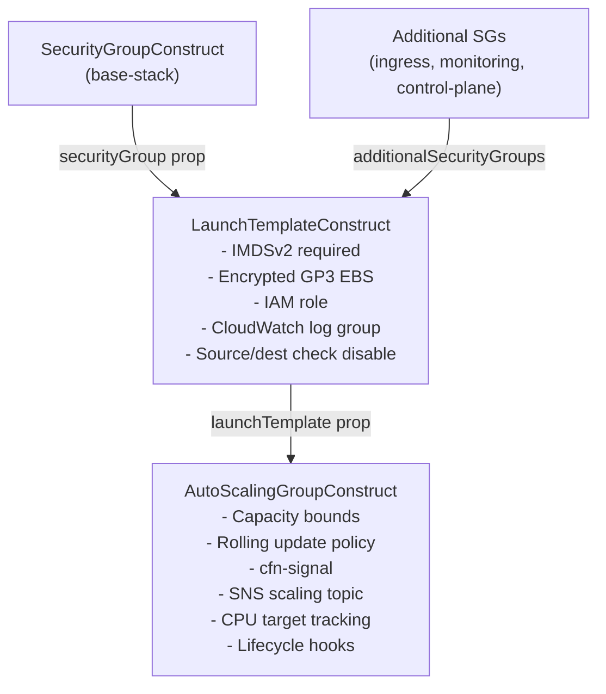

## Overview

Three Auto Scaling Groups run the Kubernetes cluster. Each is wired through a
layered construct hierarchy — SecurityGroup → LaunchTemplate → ASG — so that
each layer handles exactly its own concerns. The constructs are pure blueprints:
they accept their dependencies rather than creating them internally.

All three ASGs use public subnets in a single AZ (`eu-west-1a`) because
SharedVpc has no private subnets. The EBS volume strategy and the Spot
configuration vary by pool.

## Construct hierarchy



Source: `auto-scaling-group.ts:1-30` (design philosophy section),
`launch-template.ts:17-28` (blueprint pattern flow comment).

## Pool definitions

### Control plane — `k8s-dev-asg`

| Property | Value | Source |
|:---------|:------|:-------|
| Min / Max / Desired | 1 / 1 / 1 | `control-plane-stack.ts:213-215` |
| Instance type | t3.medium (env config) | `configurations.ts` compute block |
| Spot | No — On-Demand only | Not set in control-plane stack |
| Data volume | Yes — `/dev/xvdf` (GP3, encrypted, deleteOnTermination) | `control-plane-stack.ts:204` |
| Scaling policy | Disabled | `control-plane-stack.ts:216` |
| Cluster Autoscaler tags | Not set | CA does not manage control plane |
| `desiredCapacity` | **Set to 1** | Single-node: EBS can only attach to one instance |

The control plane is the only ASG where `desiredCapacity` is explicitly set.
The EBS volume that stores etcd and cluster state can only be attached to one
instance at a time — max=1 is a hard architectural constraint, not a cost choice
(`control-plane-stack.ts:207-209` comment).

Scaling policy is disabled: "Kubernetes owns scaling decisions, not AWS. The ASG
provides self-healing (replacement on termination) only."

### General worker pool — `k8s-dev-general-pool-asg`

| Property | Value | Source |
|:---------|:------|:-------|
| Min / Max | 1 / 4 | `worker-asg-stack.ts:614-615`, `configurations.ts` |
| Instance type | t3.small | `configurations.ts:541` / live verified |
| Spot | Yes — `one-time` | `worker-asg-stack.ts:321-328` |
| Data volume | None | No `dataVolumeSizeGb` in worker LT |
| Scaling policy | **Disabled** — CA owns scale | `worker-asg-stack.ts:622` |
| Cluster Autoscaler tags | `k8s.io/cluster-autoscaler/enabled=true` + `k8s.io/cluster-autoscaler/k8s-dev=owned` | `worker-asg-stack.ts:644-651` |
| `desiredCapacity` | **Not set** | `worker-asg-stack.ts:616` comment |
| Workloads | Next.js, start-admin, admin-api, public-api, wiki-mcp, system components | `worker-asg-stack.ts:8-9` |

CPU target tracking is explicitly disabled on the general pool. Cluster
Autoscaler and CPU target tracking both operate by setting `desiredCapacity`
— running both simultaneously causes them to fight and produces oscillating
instance counts (`worker-asg-stack.ts:619-621` comment).

### Monitoring worker pool — `k8s-dev-monitoring-pool-asg`

| Property | Value | Source |
|:---------|:------|:-------|
| Min / Max | 1 / 2 | `worker-asg-stack.ts:614-615`, `configurations.ts` |
| Instance type | t3.medium | `configurations.ts:543` |
| Spot | Yes — `one-time` | `worker-asg-stack.ts:321-328` |
| Data volume | None | No `dataVolumeSizeGb` in worker LT |
| Scaling policy | **Enabled** — 70% CPU target tracking | `auto-scaling-group.ts:398`, live verified |
| Cluster Autoscaler tags | `k8s.io/cluster-autoscaler/enabled=true` + `k8s.io/cluster-autoscaler/k8s-dev=owned` | `worker-asg-stack.ts:644-651` |
| `desiredCapacity` | **Not set** | Prevents reset on redeploy |
| Workloads | Prometheus, Grafana, Loki, Tempo, Alloy, ArgoCD | `worker-asg-stack.ts:10-11` |
| Node taint | `dedicated=monitoring:NoSchedule` (applied by bootstrap) | `worker-asg-stack.ts:74-75` |

The monitoring pool retains CPU target tracking because Cluster Autoscaler is
deployed with `nodeSelector: node-pool=monitoring` — CA runs *on* the monitoring
pool. Granting CA's `SetDesiredCapacity` right to the general-pool node role
would widen the blast radius if a compromised general-pool node tried to
manipulate ASG capacity (`worker-asg-stack.ts:493-508` comment).

## Launch template — key decisions

### IMDSv2 required

`requireImdsv2: true` on all launch templates (`launch-template.ts:308`).
IMDSv2 requires a PUT request to obtain a session token before reading instance
metadata. This prevents SSRF-based metadata credential theft — a container
escape cannot use a GET to steal the instance role token.

### Spot instance configuration via L1 escape hatch

CDK's L2 `LaunchTemplate` does not expose `instanceMarketOptions`. Workers use
the L1 CFN escape hatch to set `MarketType: spot` and `SpotInstanceType: one-time`
(`worker-asg-stack.ts:321-328`):

```typescript
const cfnLt = launchTemplateConstruct.launchTemplate.node
    .defaultChild as ec2.CfnLaunchTemplate;
cfnLt.addPropertyOverride('LaunchTemplateData.InstanceMarketOptions', {
    MarketType: 'spot',
    SpotOptions: { SpotInstanceType: 'one-time' },
});
```

`one-time` (not `persistent`) is correct for ASG instances: if a Spot instance
is interrupted, the ASG launches a replacement automatically. A persistent
request would create a second Spot request that competes with the ASG.

**Why Spot for both worker pools?**
Blue/green rolling updates handle Next.js graceful handoff; ArgoCD tolerates
interruptions by syncing from its remote source of truth on restart. Workers
carry no persistent state — Kubernetes workloads reschedule to the replacement
instance (`worker-asg-stack.ts:128-130` comment).

### Source/destination check disabled

`disableSourceDestCheck: true` on all worker and control-plane templates
(`launch-template.ts:162-167`). AWS drops traffic whose source IP doesn't match
the sending ENI's private IP. Calico pod IPs (e.g. `192.168.x.x`) are overlay
IPs that don't match the ENI — without this flag, all cross-node pod traffic is
silently dropped.

CloudFormation's `LaunchTemplate` resource does not expose `SourceDestCheck`
as a property. The disable is applied via a user data script that calls
`ec2:ModifyInstanceAttribute` on boot using the IMDSv2 instance ID
(`launch-template.ts:336-357`).

### EBS root volume

All pools: `/dev/xvda`, GP3, 30 GB, encrypted, `deleteOnTermination: true`,
3000 IOPS, 125 MiB/s throughput. Confirmed live on `k8s-dev-general-pool-lt`
(AMI `ami-07384919f4372b8bd`, version 49).

Control plane adds a second block device `/dev/xvdf` for etcd and Kubernetes
cluster state (`configurations.ts` `storage.volumeSizeGb`). This is provisioned
by the launch template's `blockDevices` array, not via a separate CDK-managed
`ec2.Volume` — eliminating the legacy `attach-volume` + EBS detach Lambda
pattern. The volume is ephemeral (`deleteOnTermination: true`); cluster state
recovery after replacement uses S3-backed etcd snapshots.

### AMI resolution at deploy time

The machine image is resolved via a CloudFormation SSM parameter type:

```typescript
machineImage: ec2.MachineImage.fromSsmParameter(`${ssmPrefix}/golden-ami/latest`)
```

CloudFormation resolves the SSM parameter to an AMI ID at deploy time. CDK does
not bake the AMI ID at synth time — doing so would require AWS credentials in CI
(to call `DescribeImages`) and would produce a stale ID on every AMI rotation
that skipped a CDK redeploy.

### AMI refresh — `AmiRefreshConstruct`

**Location:** `infra/lib/constructs/events/ami-refresh/ami-refresh-construct.ts`

After initial deploy, AMI rotations are handled entirely by a Step Functions
state machine — no CDK redeploy required. The full flow:

```mermaid
flowchart LR
    AMI["Golden AMI bake\n(external CI pipeline)"]
    SSM["SSM parameter\n/k8s/{env}/golden-ami/latest\nupdated to new AMI ID"]
    EB["EventBridge rule\ndetects SSM Update\non golden-ami/latest"]
    SFN["Step Functions\nstate machine\n(2h timeout)"]

    subgraph Phase1 ["Phase 1 — Workers first"]
        UW["UpdateWorkerTemplates Lambda\nCreateLaunchTemplateVersion\nModifyLaunchTemplate\nUpdateAutoScalingGroup"]
        SW["StartWorkerRefresh Lambda\nStartInstanceRefresh on worker ASGs"]
        PW["Poll loop (60s)\nCheckRefreshStatus\nuntil COMPLETE"]
    end

    subgraph Phase2 ["Phase 2 — Control plane"]
        UC["UpdateControlPlaneTemplate Lambda"]
        SC["StartControlPlaneRefresh Lambda"]
        PC["Poll loop\nuntil COMPLETE"]
    end

    AMI --> SSM --> EB --> SFN
    SFN --> UW --> SW --> PW
    PW -->|COMPLETE| UC --> SC --> PC
```



**Why workers before control plane in a Kubernetes cluster:**
Kubernetes enforces a version skew policy — kubeadm prohibits a control plane
that is more than one minor version behind its workers. If the control plane
were refreshed first with a newer AMI (containing a newer K8s binary), workers
still running the old AMI would exceed the skew limit on next kubeadm join.
Workers refresh first, rejoin the cluster on the new AMI, then the control plane
follows. This matches the Kubernetes upgrade order (workers → control plane).

**What each Lambda actually does:**

`update-launch-template.ts` (verified):
1. Reads the new AMI ID from the SSM parameter
2. Calls `CreateLaunchTemplateVersion` — clones `$Latest` with the new `ImageId`
3. Calls `ModifyLaunchTemplate` to set the new version as `$Default`
4. Calls `UpdateAutoScalingGroup` to point the ASG at `$Default`

`start-instance-refresh.ts`: Calls `StartInstanceRefresh` on the ASG, which
triggers a rolling replacement — AWS terminates one instance at a time,
waits for its replacement to pass health checks, then continues.

`check-refresh-status.ts`: Polls `DescribeInstanceRefreshes` every 60 seconds
(configurable via `pollInterval`, default 60s) with a 40-minute maximum wait.

**Failure alarm (added after a real incident):**
A CloudWatch alarm fires when any execution enters `FAILED` and publishes to an
SNS email topic (`{ssmPrefix}/ami-refresh/alerts-topic-arn`). The alarm was added
after a 48-hour silent failure (2026-04-25 → 2026-04-27) where the IAM role was
missing `ec2:CreateTags` and `iam:PassRole` — the AMI bake succeeded and the SSM
parameter updated, but the state machine failed its auth check and the ASG
`$Default` version never advanced. The alarm description names the three most
common root causes:
`(ami-refresh-construct.ts:329-342)`

> "IAM missing ec2:CreateTags / ec2:RunInstances / iam:PassRole;
> launch-template version drift; ASG instance refresh timeout."

**Why these IAM grants look unusual:**
`UpdateAutoScalingGroup` with a `LaunchTemplate` triggers an internal AWS
authorization simulation that evaluates `ec2:RunInstances`, `ec2:CreateTags`
(because the LT has tag specifications), and `iam:PassRole` on the instance
profile — even though the Lambda never calls those APIs directly. AWS returns
the misleading error "not authorized to use launch template" when any of
these simulation checks fail (`ami-refresh-construct.ts:98-127`).

## Scaling strategy

### `desiredCapacity` is intentionally omitted on worker pools

Setting `desiredCapacity` causes CDK to emit a CloudFormation property that
resets the ASG to the declared value on every `cdk deploy`, wiping Cluster
Autoscaler decisions (tracked at `aws/aws-cdk#5215`). The construct explicitly
comments this at `auto-scaling-group.ts:87-91`:

> "CAUTION: Setting this will reset ASG size on every deployment."

Worker ASGs leave `desiredCapacity` unset — AWS uses `minCapacity` on first
launch, and CA or target tracking takes over from there.

### Cluster Autoscaler tag set

Both worker ASGs carry the CA discovery tags. CA is deployed with
`nodeSelector: node-pool=monitoring` so it runs on the stable monitoring pool
and cannot evict itself. The general pool carries the tags but the CA write
permission (`SetDesiredCapacity`) is only granted to the **monitoring-pool**
instance role, scoping the blast radius
(`worker-asg-stack.ts:492-508`).

| Tag | Value | Scope |
|:----|:------|:------|
| `k8s.io/cluster-autoscaler/enabled` | `true` | ASG (not propagated to instances) |
| `k8s.io/cluster-autoscaler/k8s-dev` | `owned` | ASG only |
| `kubernetes.io/cluster/k8s-dev` | `owned` | ASG + instances (CCM uses this) |
| `k8s:bootstrap-role` | `general-pool` or `monitoring-pool` | ASG + instances (SSM trigger reads this) |
| `k8s:ssm-prefix` | `/k8s/development` | ASG + instances |

`kubernetes.io/cluster/k8s-dev=owned` serves the CCM Node Lifecycle Controller,
which uses it to scope which EC2 instances it manages and to clean up stale
Kubernetes node objects when instances terminate
(`auto-scaling-group.ts:162-168` comment).

## Rolling update policy

All ASGs use `UpdatePolicy.rollingUpdate()`. On control plane: `minInstancesInService: 0`
(only one instance exists, it must terminate before the replacement launches, or the
EBS volume cannot detach). On workers: `minInstancesInService` defaults to
`minCapacity` (keeps one node serving traffic during updates).

`pauseTimeMinutes` is aligned to `signalsTimeoutMinutes` when signals are enabled,
so CloudFormation's PauseTime window is wide enough for the `cfn-signal` to arrive
after the kubeadm bootstrap SSM Automation completes
(`auto-scaling-group.ts:258-263` comment).

## User data — 3-layer bootstrap architecture

User data is intentionally minimal — a "slim trigger" layer:

| Layer | Responsibility | Where |
|:------|:--------------|:------|
| Layer 1 — Golden AMI | Pre-bakes binaries: containerd, kubeadm, Helm, Calico | AMI pipeline (separate repo) |
| Layer 2 — User data | Publish instance ID to SSM, send cfn-signal | `UserDataBuilder.addCustomScript()` in worker/control-plane stacks |
| Layer 3 — SSM Automation | All K8s logic: kubeadm init/join, CNI install, ArgoCD | SSM Automation documents (kubernetes-bootstrap repo) |

User data writes environment variables to `/etc/profile.d/k8s-env.sh` so
that SSM Automation steps can source them when they run on the instance
(`worker-asg-stack.ts:684-694`). Key variables: `STACK_NAME`, `ASG_LOGICAL_ID`,
`SSM_PREFIX`, `NODE_POOL`, `CLUSTER_NAME`, `S3_BUCKET`, `LOG_GROUP_NAME`.

After writing env vars, user data:
1. Resolves the instance ID via IMDSv2 (PUT token → GET instance-id)
2. Writes `{ssmPrefix}/bootstrap/{role}-instance-id` to SSM
3. Calls `cfn-signal` to unblock the CloudFormation rolling update

The actual kubeadm join is performed by SSM Automation, not user data. This
separation means the bootstrap logic can be re-run independently (e.g. after
a failed join) without replacing the EC2 instance.

## IAM policy structure

IAM policies are attached to the instance role inside `KubernetesWorkerAsgStack`,
not inside the ASG or launch template constructs. This keeps the constructs
as pure blueprints.

### Core policies (both pools)

| Policy SID | Actions | Resources | Reason |
|:-----------|:--------|:----------|:-------|
| `ReadK8sJoinParams` | `ssm:GetParameter` | join-token, ca-hash, control-plane-endpoint | kubeadm join needs these three parameters |
| `DecryptSsmSecureStrings` | `kms:Decrypt` | `*` (conditioned on `kms:ViaService=ssm`) | join-token is a SecureString — needs KMS decrypt via SSM service |
| S3 read (via `grantRead`) | `s3:GetObject`, `s3:ListBucket` | scripts bucket | Downloads Python bootstrap scripts from S3 |
| `EcrPullImages` | `ecr:Get*`, `ecr:Batch*`, `ecr:List*`, `ecr:Describe*` | `account/repository/*` | Pull container images |
| `EcrAuthToken` | `ecr:GetAuthorizationToken` | `*` | `GetAuthorizationToken` has no resource constraint |
| `SsmAutomationExecution` | `ssm:StartAutomationExecution`, `ssm:GetAutomationExecution`, `ssm:DescribeAutomationStepExecutions` | automation-definition + automation-execution | Bootstrap orchestrator triggers SSM Automation |
| `SsmPublishBootstrapParams` | `ssm:PutParameter`, `ssm:AddTagsToResource` | `{ssmPrefix}/bootstrap/*` + `{ssmPrefix}/nodes/{poolType}/*` | Instance publishes its ID and registers itself after kubeadm join |
| `PassSsmAutomationRole` | `iam:PassRole` | `*-SsmAutomation-*` (conditioned on `iam:PassedToService=ssm`) | Required to pass execution role to SSM |
| `EbsCsiDriverVolumeLifecycle` | `ec2:CreateVolume`, `ec2:AttachVolume`, etc. | `*` | EBS CSI DaemonSet runs on every node |
| `EbsCsiDriverKms` | `kms:Decrypt`, `kms:Encrypt`, etc. | `*` (conditioned on `kms:ViaService=ec2`) | EBS CSI encrypted volume support |
| `ClusterAutoscalerDescribe` | `autoscaling:Describe*`, `ec2:DescribeLaunchTemplateVersions`, `ec2:DescribeInstanceTypes` | `*` | CA on the monitoring pool needs these on all nodes |
| `CloudWatchGrafanaReadOnly` | `logs:*`, `cloudwatch:GetMetricData`, `cloudwatch:ListMetrics` | `*` | Grafana CloudWatch datasource + log shipping |
| `DynamoDBContentReadOnly` | `dynamodb:GetItem`, `dynamodb:Query`, etc. | `bedrock-dev-ai-content` table + indexes | Next.js article serving |
| `S3ContentReadOnly` | `s3:GetObject`, `s3:ListBucket` | `bedrock-dev-kb-data` bucket | MDX content fetching for Next.js |

### Monitoring-pool-only policies

| Policy | Reason |
|:-------|:-------|
| `ViewOnlyAccess` managed policy | Steampipe cloud inventory queries — Grafana panels query live AWS state |
| `SteampipeCloudInventoryReadOnly` | Additional S3, Route53, CloudFront, WAF read actions not covered by ViewOnlyAccess |
| `ClusterAutoscalerScale` — `autoscaling:SetDesiredCapacity`, `autoscaling:TerminateInstanceInAutoScalingGroup` | CA runs on monitoring pool only; these actions are withheld from general-pool nodes |
| `SnsPublishAlerts` — `sns:Publish` on alerts topic | Grafana contact point publishes alerts |
| `KmsForSns` — `kms:Decrypt`, `kms:GenerateDataKey*` (conditioned on SNS ViaService) | Monitoring alerts topic is KMS-encrypted |

## SNS notification topics

`AutoScalingGroupConstruct` creates an SNS topic per ASG for CloudWatch
AwsSolutions-AS3 compliance (all scaling events must have a notification target).
Topic is KMS-encrypted with `alias/aws/sns` (`auto-scaling-group.ts:270-275`).

The monitoring pool additionally creates a **monitoring alerts** topic
(`{poolId}-monitoring-alerts`) for Grafana alerting. Its ARN is published to
SSM at `{ssmPrefix}/monitoring/alerts-topic-arn-pool` so the ArgoCD bootstrap
script can discover it without a CloudFormation export
(`worker-asg-stack.ts:755-763`).

## Live state — development environment

Verified via `aws autoscaling describe-auto-scaling-groups` on 2026-04-28.

| ASG | Instance | Launch Template | LT Version | State |
|:----|:---------|:----------------|:-----------|:------|
| `k8s-dev-asg` | `i-0724b576613b8965d` | `k8s-dev-lt` | 64 | InService / Healthy |
| `k8s-dev-general-pool-asg` | `i-04280807549995d50` | `k8s-dev-general-pool-lt` | 49 | InService / Healthy |
| `k8s-dev-monitoring-pool-asg` | `i-0580b8816ebdc4ba4` | `k8s-dev-monitoring-pool-lt` | 19 | InService / Healthy |

Scaling policy verified on `k8s-dev-monitoring-pool-asg`:
`TargetTrackingScaling`, metric `ASGAverageCPUUtilization`, target 70%.
No policy exists on `k8s-dev-general-pool-asg` (CA manages it) or `k8s-dev-asg`
(single-node, self-healing only).

Launch template details verified for `k8s-dev-general-pool-lt` (latest version):
- InstanceType: `t3.small`
- AMI: `ami-07384919f4372b8bd`
- IMDSv2: `required`
- EBS `/dev/xvda`: GP3, 30 GB, encrypted

## Tradeoffs

**Public subnets for all ASGs** — SharedVpc has no private subnets (`natGateways: 0`).
Instances in public subnets receive a public IP but are protected by security groups
that block all inbound except cluster-internal, NLB health checks, and admin IPs.
Private subnets with a NAT Gateway would cost ~£30-90/month per AZ — not justified
for a solo-developer environment.

**`deleteOnTermination: true` on data volume** — etcd data is ephemeral; the control
plane recovers cluster state from S3 snapshots. Keeping the data volume would
prevent CloudFormation from completing the rolling update (the old instance can't
terminate with an attached volume unless `deleteOnTermination: true`).

**Concrete names over CDK tokens for cross-stack references** — `concreteAsgName`
and `concreteTemplateName` are plain TypeScript strings built at synth time.
CDK's `autoScalingGroup.autoScalingGroupName` resolves to `this.physicalName`, a
CloudFormation `Ref` token. Passing tokens across stack boundaries forces CDK to
emit `Fn::ImportValue` cross-stack exports, creating a circular dependency because
worker stacks already `addDependency(controlPlaneStack)`
(`worker-asg-stack.ts:777-782` comment).

## Related concepts

- [Security Group Configuration](security-group-configuration.md)
- [CloudWatch Logs Strategy](cloudwatch-logs-strategy.md)
- [SSM Cross-Stack Pattern](../patterns/ssm-cross-stack-pattern.md)
- [ADR-001: Self-Managed K8s vs EKS](../decisions/0001-self-managed-k8s-vs-eks.md)
- [Launch Template Configuration](launch-template-configuration.md)

<!--
Evidence trail (auto-generated):
- Source: infra/lib/constructs/compute/constructs/auto-scaling-group.ts (read on 2026-04-28)
- Source: infra/lib/constructs/compute/constructs/launch-template.ts (read on 2026-04-28)
- Source: infra/lib/constructs/compute/builders/user-data-builder.ts (read on 2026-04-28)
- Source: infra/lib/stacks/kubernetes/worker-asg-stack.ts (read on 2026-04-28)
- Source: infra/lib/stacks/kubernetes/control-plane-stack.ts:130-232 (read on 2026-04-28)
- Source: infra/lib/constructs/events/ami-refresh/ami-refresh-construct.ts (read in full on 2026-04-28)
- Source: infra/lib/constructs/events/ami-refresh/handlers/update-launch-template.ts (read on 2026-04-28)
- Source: infra/lib/config/kubernetes/configurations.ts (read on 2026-04-28)
- Live: aws autoscaling describe-auto-scaling-groups (run on 2026-04-28, profile dev-account, eu-west-1)
- Live: aws autoscaling describe-policies (run on 2026-04-28) — monitoring-pool CPU 70% confirmed
- Live: aws ec2 describe-launch-template-versions k8s-dev-general-pool-lt (run on 2026-04-28)
-->
