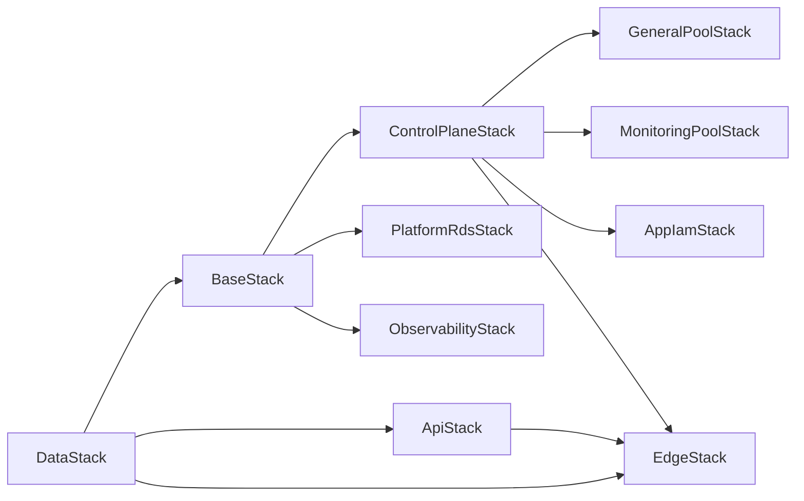

## Overview

Every AWS resource in this repository is deployed through one of three CDK abstraction layers — L1 CFN resources, L2 CDK constructs, or this repo's custom L3 constructs under `infra/lib/constructs/`. CDK Aspects walk the construct tree at synthesis time to apply cross-cutting governance: tagging, IAM guardrails, and compliance checks. A factory layer (`infra/lib/factories/`, `infra/lib/projects/`) composes constructs into environment-specific stack families. The model is correct-by-construction: security defaults, tag schemas, and IAM boundaries are encoded as TypeScript types and runtime errors at synthesis — before any resource reaches CloudFormation.

## The L1 / L2 / L3 layer model

CDK has three official abstraction levels. This repo uses all three deliberately, choosing each level based on what control or opinion is needed.

### L1 — CloudFormation resources

L1 constructs (`CfnXxx`) are direct wrappers over CloudFormation resource types. They have no opinions and expose every CloudFormation property. This repo uses L1 when:

- No CDK L2 exists for the service. `BudgetConstruct` wraps `budgets.CfnBudget` directly (`infra/lib/constructs/finops/budget-construct.ts:155`) because CDK provides no L2 for AWS Budgets.
- Precise resource policy control is needed. `KubernetesBaseStack` uses `route53.CfnRecordSet` to call `.applyRemovalPolicy(cdk.RemovalPolicy.RETAIN)` on a single Route 53 record (`infra/lib/stacks/kubernetes/base-stack.ts:441-451`).
- An L2's auto-generated behaviour would create unwanted side effects. `CloudFrontConstruct` avoids `autoDeleteObjects` on the log bucket to prevent the hidden Lambda and IAM role it provisions (`infra/lib/constructs/networking/cloudfront.ts:278`).

### L2 — CDK managed constructs

L2 constructs (`s3.Bucket`, `cloudfront.Distribution`, `ec2.SecurityGroup`, `kms.Key`) are AWS-opinionated abstractions. They handle resource policies, grants, and common configuration idioms. This repo's L3 constructs always wrap L2 rather than L1 where an L2 exists — to inherit CDK's grant methods (`grantRead`, `grantReadWrite`) and avoid re-implementing resource policy logic.

### L3 — this repo's custom constructs

L3 constructs in `infra/lib/constructs/` wrap L2 with project-specific security defaults, compile-time validation, and environment-aware behaviour. The full inventory is documented in `infra/lib/constructs/README.md`. The representative constructs — `CloudFrontConstruct`, `S3BucketConstruct`, and `BudgetConstruct` — are detailed below.

## Custom L3 constructs and why each exists

### Why not use L2 directly?

CDK's L2 constructs are intentionally permissive — they accept a wide range of configurations without opinions on which is correct for a given project. This repo's L3 constructs encode the specific security posture as a TypeScript type contract. A construct that always sets `enforceSSL: true`, always blocks public access, and emits production warnings for missing versioning cannot be misconfigured silently — the violation surfaces at synthesis before reaching CloudFormation.

The five design principles from `infra/lib/constructs/README.md` govern all constructs:

1. **Inline defaults** — dev-safe fallbacks via `?? literal` inside the construct (never a shared default object)
2. **Config layer overrides** — environment-specific values arrive from `configurations.ts`/`allocations.ts`, passed as props by the stack
3. **Blueprint pattern** — constructs are pure blueprints; stacks compose and wire dependencies
4. **Security by default** — IMDSv2, EBS encryption, least-privilege IAM, `enforceSSL` baked in
5. **Tag delegation** — only component-specific tags (`Component: CloudFront`) in constructs; org tags applied by `TaggingAspect` at app level

### CloudFrontConstruct

`infra/lib/constructs/networking/cloudfront.ts` wraps `cloudfront.Distribution` with:

- **Certificate/domain cross-dependency validation.** The TypeScript type system cannot express "domainNames requires certificate". A runtime check throws at synthesis if `domainNames` is non-empty and `certificate` is absent (`cloudfront.ts:217-223`).
- **Behaviour ordering validation.** CloudFront evaluates `additionalBehaviors` in listed order (first match wins, not most-specific-wins). The static method `validateBehaviourOrdering()` iterates the list and throws if a catch-all `/*` pattern shadows a more-specific sub-path (`cloudfront.ts:480-501`). This prevents silent auth route bypass.
- **Default security headers policy.** A `ResponseHeadersPolicy` with HSTS, X-Frame-Options, X-Content-Type-Options, X-XSS-Protection, and Referrer-Policy is created automatically unless the caller overrides it (`cloudfront.ts:326-353`).
- **Production warnings.** `cdk.Annotations.of(this).addWarning()` fires at synthesis if production logging is disabled (`cloudfront.ts:256-265`).

The construct exposes `distribution`, `distributionId`, `domainName`, and `distributionArn` as public properties. Consuming stacks decide what to export via `CfnOutput` — the construct never creates exports, preventing cross-stack coupling.

### S3BucketConstruct

`infra/lib/constructs/storage/s3-bucket.ts` wraps `s3.Bucket` with:

- **Environment-aware defaults.** `versioned` defaults to `true` in production, `false` otherwise. `removalPolicy` defaults to `RETAIN` in production, `DESTROY` in dev (`s3-bucket.ts:176-181`).
- **Bucket name validation.** A `validateBucketName()` method checks length (3–63), character set (lowercase, digits, hyphens, periods), and consecutive-period rules — throwing at synthesis rather than at CloudFormation create time (`s3-bucket.ts:258-281`).
- **Production safety warnings.** `cdk.Annotations.of(this).addWarning()` fires for `DESTROY` removal policy or disabled versioning in production (`s3-bucket.ts:227-248`).
- **Grant helpers.** `grantRead()`, `grantWrite()`, `grantReadWrite()`, `grantDelete()` delegate to the underlying `s3.Bucket` — callers never import the raw L2 reference.

### BudgetConstruct

`infra/lib/constructs/finops/budget-construct.ts` wraps `budgets.CfnBudget` (L1 direct — no CDK L2 exists for Budgets) with:

- **Threshold normalisation.** Callers pass either plain numbers (`[50, 80, 100]`) or full `BudgetThreshold` objects. The construct normalises plain numbers to `{ notificationType: 'ACTUAL' }` before constructing the CFN resource (`budget-construct.ts:110-116`).
- **Cost filter formatting.** The AWS Budgets `CostFilters.TagKeyValue` format (`user:key$value`) is internal API detail — callers pass a plain `Record<string, string[]>` and the construct formats the strings (`budget-construct.ts:138-148`).
- **Sensible defaults.** Three notification rules (50% actual, 80% actual, 100% forecasted) are set when `thresholds` is omitted (`budget-construct.ts:104-108`).

## CDK Aspects as governance rules

### How Aspects work

A CDK Aspect implements `IAspect` with a single `visit(node: IConstruct)` method. When `Aspects.of(scope).add(aspect)` is called, CDK invokes `visit()` on every node in the construct tree rooted at `scope` during synthesis. The Aspect pattern is the only mechanism that can traverse an entire stack and modify or validate resources without knowing their construct IDs.

### TaggingAspect — single source of truth for tags

`infra/lib/aspects/tagging-aspect.ts` (also published as `@nelsonlamounier/cdk-governance-aspects` v1.0.0) applies a 7-tag kebab-case schema to every taggable resource:

| Tag key | Source | Example |
|:--------|:-------|:--------|
| `project` | caller prop | `k8s-platform` |
| `environment` | caller prop | `development` |
| `owner` | caller prop | `nelson-l` |
| `component` | caller prop | `compute` |
| `managed-by` | hardcoded | `cdk` |
| `version` | caller prop | `1.0.0` |
| `cost-centre` | caller prop (default: `platform`) | `infrastructure` |

The `visit()` method calls `cdk.TagManager.isTaggable(node)` before applying tags — non-taggable resources (custom resources, Lambda code bundles) are silently skipped (`tagging-aspect.ts:96-102`). Tags are set with `node.tags.setTag()` which uses CDK's tag merge semantics: earlier callers win over later ones, so stack-level component tags can override the aspect's defaults if needed.

The `cost-centre` tag enables AWS Cost Explorer cost-allocation grouping when activated in the Billing console → Cost Allocation Tags.

### EnforceReadOnlyDynamoDbAspect — IAM guardrail at synthesis

`infra/lib/aspects/enforce-readonly-dynamodb-aspect.ts` enforces the architectural boundary between compute (read-only DynamoDB access) and the write path (API Gateway → Lambda). The aspect visits every `iam.CfnPolicy` L1 node in the stack, resolves CDK tokens to inspect the actual policy document, and fails synthesis if any `Allow` statement on a role matching the pattern `taskrole` contains a forbidden DynamoDB action.

Forbidden actions are split into two constants:

- `DYNAMODB_WRITE_ACTIONS`: `PutItem`, `DeleteItem`, `UpdateItem`, `BatchWriteItem`
- `DYNAMODB_ADMIN_ACTIONS`: `CreateTable`, `DeleteTable`, `UpdateTable`, `CreateGlobalTable`

The aspect also detects wildcard grants: `dynamodb:*` matches all forbidden actions, and prefix wildcards like `dynamodb:Put*` are resolved against the forbidden list (`enforce-readonly-dynamodb-aspect.ts:189-200`). By default `failOnViolation: true` causes `cdk.Annotations.of(node).addError()`, which fails synthesis.

### applyCdkNag — compliance checks at synthesis

`infra/lib/aspects/cdk-nag-aspect.ts` exposes `applyCdkNag(scope, config)`, which applies third-party cdk-nag rule packs via `Aspects.of(scope).add(...)`. The function supports four packs:

- `CompliancePack.AWS_SOLUTIONS` — general best practices (default)
- `CompliancePack.HIPAA` — HIPAA Security
- `CompliancePack.NIST_800_53` — NIST 800-53 Rev 5
- `CompliancePack.PCI_DSS` — PCI DSS 3.2.1

`applyCommonSuppressions(stack)` applies a set of documented `NagPackSuppression` entries for rules that don't apply to this project's security posture (e.g. `AwsSolutions-EC28` for optional detailed monitoring in dev, `AwsSolutions-IAM4` for SSM/CloudWatch managed policies on EC2).

### The published aspects package

`TaggingAspect` and `EnforceReadOnlyDynamoDbAspect` are published to npm as `@nelsonlamounier/cdk-governance-aspects` (v1.0.0, released 2026-03-19). The source implementations in `infra/lib/aspects/` are the canonical versions; the `packages/cdk-governance-aspects/lib/` directory contains the compiled outputs. Peer dependencies require `aws-cdk-lib >= 2.170.0` and `constructs >= 10.0.0`.

## Compile-time validation patterns

CDK constructs can fail synthesis using two mechanisms: throwing a `new Error()` inside the constructor (immediate halt) or calling `cdk.Annotations.of(node).addError()` (deferred — synthesis completes to collect all errors before halting). This repo uses both.

### validateBehaviourOrdering — CloudFront route shadowing

Defined as a private static method on `CloudFrontConstruct` (`cloudfront.ts:480-501`). Called inside the constructor before the `cloudfront.Distribution` is created.

The algorithm iterates `additionalBehaviors` in insertion order. For each pattern ending in `/*`, it checks whether any **later** pattern starts with the same prefix. If yes, it throws:

```ts
throw new Error(
    `CloudFront behaviour ordering error: catch-all pattern ` +
    `"${current}" (index ${i}) appears before more-specific ` +
    `"${later}" (index ${j}). CloudFront uses first-match-wins ` +
    `ordering — the specific pattern will never match.`
);
```

The error fires at `cdk synth` / CI, before any CloudFormation template is generated. In `KubernetesEdgeStack`, the `/api/auth/*` behaviour is deliberately listed before `/api/*` for exactly this reason (`edge-stack.ts:595-598`).

### validateAuthCookies — CloudFront cookie list limits

Defined in `infra/lib/config/nextjs.ts` (lines 76–89, per `docs/concepts/cloudfront-distribution.md`). CloudFront OriginRequestPolicy enforces a hard limit of 10 cookies. The `validateAuthCookies()` function runs at module load time and throws if:

- The cookie list exceeds 10 entries
- Any entry contains a wildcard (`*`) — CloudFront treats these as literal strings, not globs, forwarding zero matching cookies
- The list contains duplicate cookie names

The validator fires the moment `nextjs.ts` is imported — earlier than construct instantiation. This catches misconfiguration before synthesis even starts.

### Inline constructor validation

Several constructs perform additional validation in their constructors:

- `KubernetesEdgeStack` throws and adds a `cdk.Annotations.of(this).addError()` if `env.region` is not `us-east-1` (`edge-stack.ts:241-251`).
- `S3BucketConstruct` throws immediately if the bucket name violates S3 naming rules (`s3-bucket.ts:186-188`, `s3-bucket.ts:258-281`).
- `CloudFrontConstruct` throws if `domainNames` is non-empty but `certificate` is absent (`cloudfront.ts:217-223`).

## The factory pattern

### IProjectFactory interface

`infra/lib/factories/project-interfaces.ts` defines the contract that all project factories implement:

```ts
interface IProjectFactory<TContext extends ProjectFactoryContext> {
    readonly project: Project;
    readonly environment: Environment;
    readonly namespace: string;
    createAllStacks(scope: cdk.App, context: TContext): ProjectStackFamily;
}
```

`ProjectStackFamily` returns `stacks: cdk.Stack[]` and `stackMap: Record<string, cdk.Stack>` — the full stack family for that project. Each factory resolves its own VPC lookups, SSM paths, and environment-specific configuration internally. The entry point only provides the target environment.

### Project registry

`infra/lib/factories/project-registry.ts` maps `Project` enum values to factory constructors:

```ts
const projectFactoryRegistry: Record<Project, ProjectFactoryConstructor> = {
    [Project.SHARED]: SharedProjectFactory,
    [Project.ORG]: OrgProjectFactory,
    [Project.KUBERNETES]: KubernetesProjectFactory,
};
```

`getProjectFactoryFromContext(projectStr, environmentStr)` validates the CDK context values, resolves short names (`dev → development`), and returns the correct factory. This is the bridge between CDK CLI invocation (`-c project=k8s -c environment=dev`) and the stack family.

### KubernetesProjectFactory

`infra/lib/projects/kubernetes/factory.ts` is the most complex factory — it creates 8+ stacks in explicit dependency order:



Dependencies are wired with `stackB.addDependency(stackA)` to ensure CloudFormation deploys in topological order. The `AmiRefreshConstruct` is scoped inside `controlPlaneStack` but receives Launch Template names from worker stacks as concrete strings (not CDK tokens) to avoid a cross-stack export cycle (`factory.ts:576-589`).

## Construct testing patterns

Unit tests use the CDK Assertions library (`aws-cdk-lib/assertions`). The shared fixtures in `infra/tests/fixtures/test-app.ts` provide three helpers:

- `createTestApp()` — creates a `cdk.App` with `aws:cdk:bundling-stacks: []` to skip Lambda bundling in tests
- `createStackWithTemplate<T>(factory)` — wraps a stack factory, returns `{ stack, template, app }`
- `createStackWithHelper<T, H>(helperFactory, stackFactory)` — for stacks that require dependencies (VPC, security groups) from another stack

Tests assert on the synthesised CloudFormation template using `template.hasResourceProperties()` and `Match.objectLike()` / `Match.arrayWith()` matchers. Example from `budget-construct.test.ts:66-73`:

```ts
template.hasResourceProperties('AWS::Budgets::Budget', {
    Budget: Match.objectLike({
        BudgetType: 'COST',
        TimeUnit: 'MONTHLY',
    }),
});
```

Integration tests in `infra/tests/integration/` run against real AWS resources. They are separated from unit tests by directory and are excluded from the standard `jest` run — they require live AWS credentials and an existing cluster environment.

## Tradeoffs

**L3 constructs duplicate AWS L2 defaults.** When CDK updates an L2 with a new security default, the L3 wrapper may not inherit it automatically. This is the cost of explicit control: every default is visible in code and versioned, but requires deliberate updates when CDK changes its opinions.

**Synthesis-time validation over test coverage.** Validation inside construct constructors catches entire categories of misconfiguration without requiring unit test cases. The tradeoff is that synthesis failures produce TypeScript stack traces, not human-readable test output. The `cdk.Annotations` error mechanism is less disruptive — it collects all errors before halting.

**Factory pattern centralises orchestration.** All stack dependency wiring lives in one file (`factory.ts`). This makes the dependency graph readable and auditable. The tradeoff is that `factory.ts` becomes a wide file; adding a new stack requires editing it rather than being self-contained.

**Published aspects package.** Extracting `TaggingAspect` and `EnforceReadOnlyDynamoDbAspect` to `@nelsonlamounier/cdk-governance-aspects` makes them reusable across CDK projects. The tradeoff is dual-maintenance: changes to the internal `infra/lib/aspects/` implementations must also be reflected in the package source and released with a version bump.

## Deeper detail

- [CloudFront Distribution](../_archive/concepts/cloudfront-distribution.md) — complete cache behaviour table, origin request policies, auth cookie limits, WAF rules, and live state
- [CDK Aspects Governance](cdk-aspects-governance.md) — how `visit()` is scheduled, token resolution in `EnforceReadOnlyDynamoDbAspect.inspectPolicyDocument()`, three annotation mechanisms, NagSuppressions API
- [Creating a New CDK Construct](../runbooks/creating-a-new-cdk-construct.md) — domain placement, inline defaults, exports, test fixture boilerplate, verification checklist
- [CDK Aspects Validation Failures](../troubleshooting/cdk-aspects-validation-failures.md) — `AwsSolutions-L1` on framework Lambdas, `EnforceReadOnlyDynamoDb` false positives, suppression recipes

## Related concepts

- [ASG Configuration](asg-configuration.md)
- [Launch Template Configuration](launch-template-configuration.md)
- [IAC Security Dual-Layer](iac-security-dual-layer.md)
- [FinOps Observability](finops-observability.md)
- [CloudWatch Logs Strategy](cloudwatch-logs-strategy.md)

<!--
Evidence trail (auto-generated):
- Source: infra/lib/constructs/README.md (read on 2026-04-29)
- Source: infra/lib/constructs/networking/cloudfront.ts (read on 2026-04-29)
- Source: infra/lib/constructs/storage/s3-bucket.ts (read on 2026-04-29)
- Source: infra/lib/constructs/finops/budget-construct.ts (read on 2026-04-29)
- Source: infra/lib/aspects/tagging-aspect.ts (read on 2026-04-29)
- Source: infra/lib/aspects/enforce-readonly-dynamodb-aspect.ts (read on 2026-04-29)
- Source: infra/lib/aspects/cdk-nag-aspect.ts (read on 2026-04-29)
- Source: infra/lib/factories/project-interfaces.ts (read on 2026-04-29)
- Source: infra/lib/factories/project-registry.ts (read on 2026-04-29)
- Source: infra/lib/projects/kubernetes/factory.ts (read on 2026-04-29)
- Source: infra/lib/stacks/kubernetes/edge-stack.ts (read on 2026-04-29)
- Source: infra/lib/stacks/kubernetes/base-stack.ts (read on 2026-04-29)
- Source: infra/tests/fixtures/test-app.ts (read on 2026-04-29)
- Source: infra/tests/unit/constructs/finops/budget-construct.test.ts (read on 2026-04-29)
- Source: packages/cdk-governance-aspects/README.md (read on 2026-04-29)
- Source: packages/cdk-governance-aspects/CHANGELOG.md (read on 2026-04-29)
- Source: docs/concepts/cloudfront-distribution.md (read on 2026-04-29) — validateAuthCookies line reference
-->
