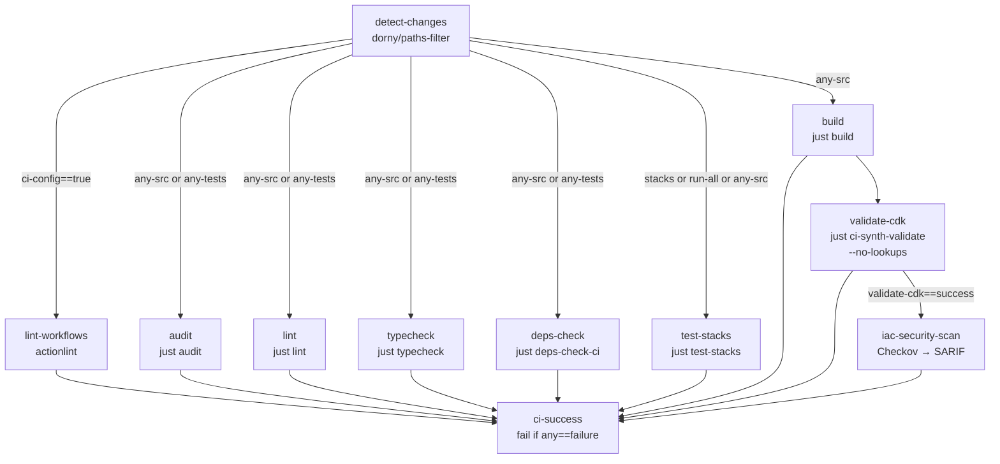

# CI/CD Pipeline Architecture

## Overview

The pipeline is split into two independent concerns: a **CI pipeline** (`ci.yml`) that runs on every push and pull request, and a set of **CD workflows** (`deploy-api.yml`, `deploy-kubernetes.yml`) that push artifacts or deploy infrastructure on merges to `develop`.

All script execution flows through the `justfile` task runner so that local development and CI use identical execution paths (`.github/workflows/ci.yml`, lines 1–17). Jobs run inside a custom CI container image published to GHCR (`ghcr.io/nelson-lamounier/cdk-monitoring/ci:latest`) which eliminates per-job tool installation overhead for Node.js, Yarn, CDK, Helm, AWS CLI, and `just` (`.github/workflows/ci.yml`, line 163).

## How the CI job DAG works

Change detection runs first and gates all expensive jobs. A `detect-changes` job uses `dorny/paths-filter` (pinned to commit `de90cc6`) to emit boolean outputs for six path groups: `stacks`, `aspects`, `ci-config`, `any-src`, `any-tests`, `scripts-ops`. A computed `run-all` flag is set to `true` when `aspects` or `ci-config` changed, triggering a full test run regardless of which source files are touched (`.github/workflows/ci.yml`, lines 46–101).

## Implementation in this codebase

### Custom CI container

Jobs that need Node, Yarn, CDK, or `just` declare `container: ghcr.io/nelson-lamounier/cdk-monitoring/ci:latest`. The composite action `.github/actions/setup-node-yarn/action.yml` detects whether it is running inside the container (by probing for `node`, `just`, `helm`, and `aws` in PATH) and skips tool installation when already present, falling back to `actions/setup-node` and a manual `just` download only on bare runners (`.github/actions/setup-node-yarn/action.yml`, lines 36–119).

Dependency caching hashes the root `yarn.lock` plus all workspace `package.json` files to produce a stable cache key. `yarn install --immutable` enforces lockfile consistency (`.github/actions/setup-node-yarn/action.yml`, lines 122–215).

### Workflow linting with actionlint

The `lint-workflows` job installs `actionlint` and validates all `*.yml` files under `.github/workflows/`. `shellcheck` integration is explicitly disabled (`-shellcheck=""`) because GitHub Actions expression substitutions (e.g., `${{ steps.x.outputs.y }}`) produce false positives for SC2086 and SC2129 in `run:` blocks. Actionlint's own expression and action-input checks cover the meaningful cases (`.github/workflows/ci.yml`, lines 120–154).

### CDK synthesis with cached context

`validate-cdk` and `iac-security-scan` both invoke `just ci-synth-validate`, which runs `cdk synth --no-lookups`. This skips live AWS API calls and relies on the committed `cdk.context.json` cache. Two CDK projects are synthesised: `k8s` (cluster stacks: Base, ControlPlane, Workers, Edge, API) and `shared` (SharedVpcStack) (`.github/workflows/ci.yml`, lines 362–383). Snapshot tests are explicitly excluded from CI; they run locally only and are committed with code changes (`.github/workflows/ci.yml`, lines 335–339).

### IaC security scan — blocking on CRITICAL/HIGH

`iac-security-scan` runs only when `validate-cdk` succeeds. It re-synthesises templates, runs Checkov via `just ci-security-scan` (backed by `scripts/ci/security-scan.ts` and `.checkov/config.yaml`), and uploads the resulting SARIF file to the GitHub Security tab via `github/codeql-action/upload-sarif` (pinned to `b5ebac6`) with `continue-on-error: true` on the upload step so a SARIF upload failure does not mask a real security finding (`.github/workflows/ci.yml`, lines 400–437). The local complement is the `cdk-nag` CDK Aspect, which provides real-time feedback during `cdk synth` without requiring a CI run.

### AWS credentials — OIDC with identity masking

The composite action `.github/actions/configure-aws/action.yml` wraps `aws-actions/configure-aws-credentials` (pinned to `8df5847`, v6.0.0) and adds an explicit post-step that extracts the IAM role unique ID (`AROA…`) via `aws sts get-caller-identity` and masks it with `::add-mask::`. The account ID is also masked. This prevents the role ID from appearing in CDK deploy output, test results, or error traces in public repository logs (`.github/actions/configure-aws/action.yml`, lines 40–52).

### Reusable stack deploy workflow

`_deploy-stack.yml` is a `workflow_call` workflow parameterised by `stack-name`, `project`, `environment`, and a suite of optional stack-specific inputs (domain name, hosted zone ID, notification email, etc.). It executes four ordered steps: pre-flight checks (`just ci-preflight`), orphaned CloudFormation resource rescue (`just ci-cfn-rescue`), CDK deploy (`just ci-deploy`), and failure diagnosis (`just ci-diagnose`). Sensitive inputs (secrets, IPs, email addresses) are explicitly masked with `::add-mask::` before being written to `$GITHUB_ENV` using `printf` rather than `echo` to avoid stdout exposure (`.github/workflows/_deploy-stack.yml`, lines 154–337).

### Admin API deploy — build-only, GitOps handoff

`deploy-api.yml` builds the `api/admin-api/` Docker image using `docker/build-push-action`, saves it as a tar archive via GitHub Actions cache, then pushes it to the ECR repository whose URI is read from SSM (`/shared/ecr-admin-api/{env}/repository-uri`). The workflow does not write to SSM, does not invoke kubectl, and does not run `deploy.py`. Image tagging uses `{sha}-r{run_attempt}` for full traceability. After the ECR push, ArgoCD Image Updater (cluster-resident) polls ECR and drives the rollout (`.github/workflows/deploy-api.yml`, lines 1–38, 65–176).

## Tradeoffs

| Decision | Rationale | Accepted cost |
|---|---|---|
| Custom CI container on GHCR | Eliminates per-job tool install; enforces identical versions across jobs | Container must be rebuilt and repushed when tool versions change |
| `--no-lookups` CDK synth | No AWS credentials needed for CI synthesis; prevents flaky context misses | Context can drift if `cdk.context.json` is not refreshed after infrastructure changes |
| actionlint without shellcheck | Avoids false positives from GitHub Actions expression syntax | Genuine shell bugs in `run:` steps could go undetected if not caught by actionlint's own checks |
| SARIF upload `continue-on-error: true` | Prevents upload failures (GitHub API transient errors) from masking real Checkov findings | A persistent upload failure would silently omit Security tab annotations |
| Snapshot tests local-only | Keeps CI deterministic; avoids snapshot update cycles on CI | Engineers must remember to update and commit snapshots locally before pushing |
| ArgoCD Image Updater for deploy | Removes GHA runner dependency from Kubernetes-level operations; kubernetes-bootstrap repo owns K8s ops | No GHA job confirms whether the rollout succeeded; promotion is manual or driven by Argo Rollouts analysis |

## Related concepts

- [GitOps over direct k8s deploy (relocated to kubernetes-bootstrap)](https://github.com/Nelson-Lamounier/kubernetes-bootstrap/tree/main/docs/decisions) — decision record for removing the k8s-runner deploy job
- [docs/adrs/0001-self-managed-k8s-vs-eks.md](../decisions/0001-self-managed-k8s-vs-eks.md) — why the cluster is self-managed, affecting how deploy workflows interact with it

<!--
Evidence trail (auto-generated):
- Source: .github/workflows/ci.yml (read on 2026-04-28)
- Source: .github/workflows/deploy-api.yml (read on 2026-04-28)
- Source: .github/workflows/deploy-kubernetes.yml (read on 2026-04-28)
- Source: .github/workflows/_deploy-stack.yml (read on 2026-04-28)
- Source: .github/actions/setup-node-yarn/action.yml (read on 2026-04-28)
- Source: .github/actions/configure-aws/action.yml (read on 2026-04-28)
- Git: git log --oneline -- .github/workflows/deploy-api.yml (run on 2026-04-28)
-->
