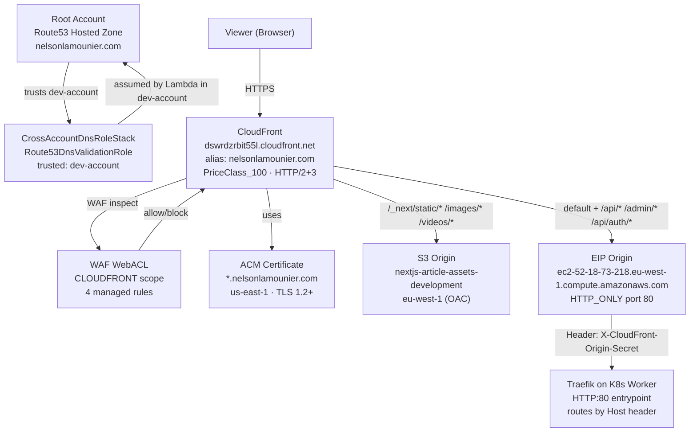

## Overview

`KubernetesEdgeStack` (`infra/lib/stacks/kubernetes/edge-stack.ts`) is
**always deployed in `us-east-1`** — a hard constraint enforced by both a
runtime check and a synthesizer annotation. It owns:

1. An ACM certificate with cross-account DNS validation
2. A WAF Web ACL (CLOUDFRONT scope)
3. A `CloudFrontDistribution` with dual-origin (EIP + S3 OAC)
4. Cross-region SSM reads (eu-west-1 → us-east-1 via AwsCustomResource)
5. Route 53 DNS records written via a cross-account Lambda

The compute stack (`KubernetesBaseStack`, `eu-west-1`) holds the Elastic IP
and S3 assets bucket. EdgeStack reads both from SSM at deploy time. The CI
pipeline guarantees ordering: `deploy-base` runs before `deploy-edge`.

## Architecture overview



## Cross-region SSM reads (us-east-1 → eu-west-1)

EdgeStack must read three values provisioned by stacks in `eu-west-1`:

| SSM Path | Source | Value read |
|:---------|:-------|:-----------|
| `/k8s/development/elastic-ip` | `KubernetesBaseStack` | `52.18.73.218` |
| `/nextjs/development/assets-bucket-name` | Data stack | `nextjs-article-assets-development` |
| `/k8s/development/cloudfront-origin-secret` | CI seed job | 64-char hex secret |

CDK `ssm.StringParameter.valueForStringParameter` only resolves SSM in the
stack's own region. `AwsCustomResource` with the `ssm:GetParameter` action is
used instead (`edge-stack.ts:356-423`). A single shared `AwsCustomResourcePolicy`
grants:

```typescript
actions: ['ssm:GetParameter'],
resources: [
    `arn:aws:ssm:eu-west-1:${account}:parameter/k8s/development/elastic-ip`,
    `arn:aws:ssm:eu-west-1:${account}:parameter/nextjs/development/assets-bucket-name`,
    `arn:aws:ssm:eu-west-1:${account}:parameter/k8s/development/cloudfront-origin-secret`,
],
// + kms:Decrypt for SecureString parameters
```

The origin secret is a `SecureString` — the call includes `withDecryption: true`
and the policy additionally grants `kms:Decrypt` on `'*'` (the KMS key ARN is
not known at synth time; it lives in eu-west-1).

## EIP origin — why HTTP_ONLY and DNS hostname conversion

CloudFront enforces two constraints that the EIP origin must satisfy:

**1. CloudFront rejects raw IP addresses as origin domain names.**
The EIP is converted to the AWS EC2 public DNS hostname at synth time using
CloudFormation intrinsics:

```typescript
// edge-stack.ts:443-447
const eipDnsName = cdk.Fn.join('', [
    'ec2-',
    cdk.Fn.join('-', cdk.Fn.split('.', eipAddress)),   // 52.18.73.218 → 52-18-73-218
    '.eu-west-1.compute.amazonaws.com',
]);
```

This hostname resolves to the same IP. **Prerequisite:** the VPC must have
`enableDnsHostnames = true`. Without it, AWS does not assign the
`ec2-x-x-x-x.region.compute.amazonaws.com` hostname.

**2. Traefik's Let's Encrypt cert covers `ops.nelsonlamounier.com` only, not
the main domain.**
If CloudFront attempted HTTPS to the origin, the TLS handshake would fail with
a hostname mismatch (`nelsonlamounier.com` ≠ `ops.nelsonlamounier.com`).
`HTTP_ONLY` protocol avoids the TLS check entirely. TLS is terminated at
CloudFront edge using the ACM certificate (`*.nelsonlamounier.com`).

## Origin secret — bypass mitigation

CloudFront injects a custom header on every request to the EIP origin:

```
X-CloudFront-Origin-Secret: <64-char hex>
```

Traefik's `IngressRoute` (managed by ArgoCD) rejects requests missing or
with an incorrect value. This prevents scanners and bots from reaching
the application directly on port 80, bypassing WAF.

**Secret lifecycle (zero-downtime rotation):**
1. Generate new secret: `NEW=$(openssl rand -hex 32)`
2. Update SSM parameter (`--overwrite`) and redeploy edge stack
   → CloudFront propagates new header to all edge nodes (≤15 min)
3. While propagating: patch Traefik via `deploy.py` to accept both values:
   `cloudfront.originSecret = "OLD_HEX|NEW_HEX"` (Traefik HeadersRegexp)
4. After propagation: redeploy with `NEW_HEX` only

Source: `edge-stack.ts:396-466` (comment block).

**Additional defence:** NLB SG restricts port 80 inbound to the CloudFront
origin-facing prefix list (`pl-4fa04526`) — so even without the header check,
only CloudFront edge nodes can reach the origin TCP port.

## S3 origin — Origin Access Control (OAC)

```typescript
const s3Origin = origins.S3BucketOrigin.withOriginAccessControl(staticAssetsBucket);
```

OAC uses a SigV4-signed request to the S3 bucket, replacing the older
Origin Access Identity (OAI). The bucket policy (managed by CDK) allows
`s3:GetObject` only from this CloudFront distribution's service principal
— the bucket has no public access.

## Cache behaviours — full table

CloudFront evaluates `additionalBehaviors` in **listed order** (first match
wins, not most-specific-wins). The ordering is enforced by a compile-time
validation in `CloudFrontConstruct.validateBehaviourOrdering()`.

| # | Path pattern | Origin | Cache policy | Origin request policy | Allowed methods | Compress |
|:--|:-------------|:-------|:-------------|:----------------------|:----------------|:---------|
| default | `*` (catch-all) | EIP | `DynamicContent` (0/300s default/max) | `EipORP` | GET HEAD OPTIONS | yes |
| 1 | `/_next/static/*` | S3 | `StaticAssets` (1yr) | — | GET HEAD | yes |
| 2 | `/_next/data/*` | S3 | `DynamicContent` | — | GET HEAD | yes |
| 3 | `/images/*` | S3 | `StaticAssets` (1yr) | — | GET HEAD | yes |
| 4 | `/videos/*` | S3 | `StaticAssets` (1yr) | — | GET HEAD | yes |
| 5 | `/api/auth/*` | EIP | `AuthNoCache` (0/1s) | `AdminORP` | ALL (7) | no |
| 6 | `/admin/*` | EIP | `AuthNoCache` (0/1s) | `AdminORP` | ALL (7) | yes |
| 7 | `/api/admin/*` | EIP | `AuthNoCache` (0/1s) | `AdminORP` | ALL (7) | yes |
| 8 | `/api/*` | EIP | `CachingDisabled` | `EipORP` | ALL (7) | no |

**Why `/api/auth/*` appears before `/api/admin/*` and `/api/*`:**
If `/api/*` preceded `/api/auth/*`, the auth callback behaviour would never
match — CloudFront uses first-match ordering, not path specificity. The
`validateBehaviourOrdering()` method throws at synth time if a catch-all
shadows a more-specific sub-path (`edge-stack.ts:595-598` comment).

## Cache policies

### StaticAssets (immutable assets)

```
defaultTtl: 365 days   maxTtl: 365 days   minTtl: 1 day
headerBehavior: none   queryString: none   cookie: none
encoding: gzip + brotli
```

Used for `/_next/static/*`, `/images/*`, `/videos/*`. Next.js build assets
include a content hash in the filename; they never change in place.

### DynamicContent (Next.js ISR pages)

```
defaultTtl: 0 s   maxTtl: 300 s   minTtl: 0 s
headerBehavior: allow [Accept, Accept-Language]
queryString: all   cookie: none
encoding: gzip + brotli
```

Default TTL of 0 means CloudFront defers to the origin's `Cache-Control`
header. If Next.js ISR routes send `Cache-Control: s-maxage=<N>, stale-while-revalidate`,
CloudFront caches up to 300s. If Traefik strips or overrides these headers,
caching is disabled silently — Traefik must be configured to pass
`Cache-Control` through untouched.

### AuthNoCache (auth / admin routes)

```
defaultTtl: 0 s   maxTtl: 1 s   minTtl: 0 s
headerBehavior: allow [Authorization]
queryString: all   cookie: all
encoding: none
```

`maxTtl: 1s` (not 0) is required. CloudFront rejects any `CacheCookieBehavior`
other than `none` when `maxTtl = 0`. The 1s maximum is never used in practice
because the origin always sends `Cache-Control: no-store` on auth routes.

The `Authorization` header is included in the cache key (required by CloudFront
for `CacheHeaderBehavior.allowList`) so `admin-api` receives the Bearer token.
With effective TTL of 0, the cache key is never actually used for caching.

### CachingDisabled (managed)

AWS managed policy `4135ea2d-6df8-44a3-9df3-4b5a84be39ad` — zero TTL, no
caching. Used for `/api/*` (general API routes that are not admin/auth).

## Origin request policies

### EipOriginRequestPolicy — default public routes

```typescript
headerBehavior: allowList(
    'Host', 'CloudFront-Viewer-Country',
    'CloudFront-Is-Mobile-Viewer', 'CloudFront-Is-Desktop-Viewer',
    'User-Agent', 'Content-Type', 'x-tsr-serverFn',
)
queryString: all
cookie: none
```

`Host` header is forwarded so Traefik can route by hostname.
`CloudFront-Viewer-Country` enables server-side geo-personalisation.
`x-tsr-serverFn` is a TanStack Start / server function header.
No cookies forwarded — public pages are stateless.

### AdminOriginRequestPolicy — auth and admin routes

```typescript
headerBehavior: allowList(same 7 headers as above)
queryString: all
cookie: allowList(...AUTH_COOKIES)  // 10 cookies max
```

Extends the EIP policy with explicit cookie forwarding for all Cognito PKCE
and NextAuth.js cookies. See [AUTH_COOKIES](#auth_cookies) below.

## AUTH_COOKIES — forwarded cookie list

Defined in `infra/lib/config/nextjs.ts:76-89`. Validated at module load time
(`validateAuthCookies()`):

| Cookie | System | Purpose |
|:-------|:-------|:--------|
| `__session` | Cognito PKCE (active) | JWT access token |
| `oauth_state` | Cognito PKCE (active) | PKCE state parameter |
| `pkce_verifier` | Cognito PKCE (active) | PKCE code verifier |
| `__Secure-authjs.session-token` | NextAuth.js (retained) | Primary session token |
| `__Host-authjs.csrf-token` | NextAuth.js (retained) | CSRF double-submit |
| `authjs.callback-url` | NextAuth.js (retained) | OAuth callback URL |
| `__Secure-authjs.callback-url` | NextAuth.js (retained) | Secure variant |
| `authjs.session-token` | NextAuth.js (retained) | Non-secure session fallback |
| `authjs.csrf-token` | NextAuth.js (retained) | Non-secure CSRF fallback |
| `__Secure-authjs.state` | NextAuth.js (retained) | Safety margin |

**Hard limit:** CloudFront OriginRequestPolicy allows a maximum of 10 cookies.
The validation function enforces this at `cdk synth` time — the deploy fails
before reaching AWS if the list exceeds 10 or contains duplicates or wildcards.

**Why both `__Secure-` and non-prefixed variants:** CloudFront connects to
Traefik via `HTTP_ONLY`. The browser sees HTTPS (CloudFront edge) and sets
`__Secure-` prefixed cookies. But CloudFront strips the `__Secure-` prefix
when forwarding over HTTP to the origin. Including both variants ensures the
session cookie is recognised regardless of how the cookie name arrives.

**Note on wildcards:** CloudFront treats `*authjs*` as a literal string, not
a glob. Wildcard cookie names must never be used — they forward exactly zero
cookies matching the intended pattern. The validator catches this.

## Response headers policy — security headers

Created in `CloudFrontConstruct` (`cloudfront.ts:326-353`). Applied to all
behaviors via the `defaultResponseHeadersPolicy`:

| Header | Value | `override` |
|:-------|:------|:-----------|
| `Strict-Transport-Security` | `max-age=31536000; includeSubDomains; preload` | `false` |
| `X-Content-Type-Options` | `nosniff` | `false` |
| `X-Frame-Options` | `DENY` | `false` |
| `X-XSS-Protection` | `1; mode=block` | `false` |
| `Referrer-Policy` | `strict-origin-when-cross-origin` | `false` |

All headers use `override: false` — CloudFront preserves the origin's value
if already set. This avoids silently overwriting `frame-ancestors` directives
or application-specific HSTS configuration.

Live distribution ID: `EIXKG0VM7CBIS`; response headers policy ID:
`1a2548dd-17e7-4b73-8684-b988e81d447a` (verified 2026-04-28).

## WAF Web ACL

`WafWebAclConstruct` with `scope: 'CLOUDFRONT'`. Must be in `us-east-1`.
WAF ARN: `arn:aws:wafv2:us-east-1:771826808455:global/webacl/CloudFrontWebAcl623BEE49-Di89LQGlNO3b/068ebad6-12e4-489d-a144-20998be371b5`

### Rule set (built by `buildWafRules`)

| Priority | Rule | Action |
|:---------|:-----|:-------|
| 0 | `AllowListedIPs` (when `restrictAccess=true`) | ALLOW |
| 1 | `AWSManagedRulesCommonRuleSet` (SQLi, XSS) | per-rule |
| 2 | `AWSManagedRulesKnownBadInputsRuleSet` (Log4j etc.) | per-rule |
| 3 | `AWSManagedRulesAmazonIpReputationList` | per-rule |
| 4 | `RateLimitRule` — 5000 req/IP/5min | BLOCK |

**SizeRestrictions_BODY excluded from CommonRuleSet:** Next.js ISR payloads
can be large. The `SizeRestrictions_BODY` rule in `AWSManagedRulesCommonRuleSet`
would block legitimate large page data responses. Excluded by default in
`buildWafRules` (`commonRuleExclusions = ['SizeRestrictions_BODY']`).

### Pre-launch access restriction

```typescript
// In GitHub Environment variables:
// Variable: RESTRICT_ACCESS = "true"
// Secret:   ALLOW_IPV4 = "<your-ipv4>/32"
// Secret:   ALLOW_IPV6 = "<your-ipv6>/128"
```

When `restrictAccess=true`:
- WAF default action → `BLOCK` (deny all traffic)
- `AllowListedIPs` rule at priority 0 allows listed IPv4/IPv6 CIDR ranges
- To go live: set `RESTRICT_ACCESS=false` in GitHub Environment, rerun pipeline
- No code change, commit, or PR needed — the WAF default action flips at synth time

## ACM certificate — cross-account DNS validation

The certificate is issued in `us-east-1` (required by CloudFront). Validation
requires a `CNAME` record in the Route 53 hosted zone, which lives in the
**root account** — a different AWS account from the dev account where the
EdgeStack deploys.

### CrossAccountDnsRoleStack

Deployed in the **root account** by `infra/lib/stacks/org/dns-role-stack.ts`:

```
Root Account
└── Route53DnsValidationRole
    Trust policy: AccountPrincipal(dev-account-id)
    Permissions:
      route53:ChangeResourceRecordSets  → hostedzone/<ZONE_ID>
      route53:ListResourceRecordSets    → hostedzone/<ZONE_ID>
      route53:GetChange                 → change/*
      route53:ListHostedZones           → *
    Optional: sts:ExternalId condition (externalId prop)
```

`trustedAccountIds` lists each of dev, staging, and production account IDs.
The trust is account-level (`AccountPrincipal`), not role-level — any service
in the trusted account (Lambda, CDK custom resources) can assume it.

### Validation Lambda (`AcmCertificateDnsValidationConstruct`)

`edge-stack.ts:285-324` creates a `LambdaFunctionConstruct` for ACM DNS
validation. The Lambda:

1. Assumes `CrossAccountRoleArn` in the root account via STS
2. Creates the `_acme-challenge.<domain>` CNAME validation record in Route 53
3. Polls ACM until the certificate status is `ISSUED`

The same Lambda is **reused** as the `dnsAliasProvider` for writing the
CloudFront alias A record and the ops/runners A records
(`edge-stack.ts:691-694`). Reuse is intentional — the Lambda already has the
cross-account IAM permissions, and a separate Lambda would duplicate the role
assumption logic.

`forceUpdate: process.env.GITHUB_SHA` causes CloudFormation to run the Lambda
on every deploy. The Lambda's `isCertificateValid` + `findExistingIssuedCertificate`
checks make this a fast no-op when the cert is already ISSUED.

## DNS records

All three DNS records are written by the reused validation Lambda via
`CrossAccountRoleArn`:

| Record | Type | Value | Purpose |
|:-------|:-----|:------|:--------|
| `nelsonlamounier.com` | ALIAS | CloudFront domain | Main site → CloudFront |
| `ops.nelsonlamounier.com` | A | `52.18.73.218` (EIP) | Admin access → EIP |
| `runners.nelsonlamounier.com` | A | `52.18.73.218` (EIP) | GitHub ARC webhook |

The ALIAS record for the main domain points to the CloudFront distribution
domain (`dswrdzrbit55l.cloudfront.net`). Route 53 ALIAS records resolve
inside AWS at no cost per query.

The A records for `ops.*` and `runners.*` point directly to the EIP, bypassing
CloudFront entirely — these paths need direct HTTPS access to Traefik and cannot
go through CloudFront's HTTPS→HTTP_ONLY origin chain.

## SSM parameters published

EdgeStack writes four parameters to SSM (in `us-east-1`) after the distribution
is provisioned, defined in `infra/lib/config/ssm-paths.ts`:

| Parameter | Value |
|:----------|:------|
| `/nextjs/development/k8s/acm-certificate-arn` | ACM cert ARN |
| `/nextjs/development/k8s/waf-arn` | WAF WebACL ARN |
| `/nextjs/development/k8s/cloudfront-distribution-domain` | `dswrdzrbit55l.cloudfront.net` |
| `/nextjs/development/k8s/cloudfront-distribution-id` | `EIXKG0VM7CBIS` |

The distribution ID is used by the CI pipeline for cache invalidation:

```bash
aws cloudfront create-invalidation \
  --distribution-id EIXKG0VM7CBIS \
  --paths '/*'
```

## Access logging

Enabled across all environments (`loggingEnabled: true` from config).
`logIncludeCookies: true` is set on the distribution — cookie values appear in
access logs, useful for debugging auth flows.

| Property | Value |
|:---------|:------|
| Destination | `development-nextjs-cloudfront-logs-771826808455` (S3, us-east-1) |
| Prefix | `cloudfront-development` |
| Retention | 3-day S3 lifecycle auto-delete |
| Cookies | included |

(Verified via `aws cloudfront get-distribution-config` on 2026-04-28.)

## Per-environment settings

| Property | Development | Staging | Production |
|:---------|:------------|:--------|:-----------|
| Price class | `PRICE_CLASS_100` (US/EU) | `PRICE_CLASS_200` (+Asia) | `PRICE_CLASS_ALL` |
| Min TLS | TLS 1.2 (2021) | TLS 1.2 (2021) | TLS 1.2 (2021) |
| HTTP version | HTTP/2+3 | HTTP/2+3 | HTTP/2+3 |
| Logging | enabled | enabled | enabled |
| WAF | attached | attached | attached |
| RESTRICT_ACCESS | configurable | configurable | configurable |

## Live state (verified 2026-04-28)

| Property | Value |
|:---------|:------|
| Distribution ID | `EIXKG0VM7CBIS` |
| Status | `Deployed` |
| Alias | `nelsonlamounier.com` |
| CloudFront domain | `dswrdzrbit55l.cloudfront.net` |
| Price class | `PriceClass_100` |
| HTTP version | `http2and3` |
| WAF | attached (`068ebad6-...`) |
| Origins | 2 (S3 OAC + EIP HTTP_ONLY) |
| Behaviors | 8 additional + 1 default |
| Logging | S3 `development-nextjs-cloudfront-logs-771826808455` |
| Custom error responses | 0 (intentionally removed — see below) |

**Why no custom error responses:** CloudFront error response overrides replace
the entire response body — including JSON API responses — with the HTML page at
`responsePagePath`. This broke JSON APIs returning 4xx/5xx (e.g.
`/api/admin/articles/publish` returning 500 on DynamoDB errors). Next.js handles
its own error pages via `error.tsx` / `not-found.tsx`. `CLOUDFRONT_ERROR_RESPONSES`
is an intentionally empty array (`nextjs.ts:688-696`).

## Tradeoffs

**HTTP_ONLY to origin** — TLS is not verified hop-by-hop to the backend. The
`X-CloudFront-Origin-Secret` header mitigates direct-access bypass. For strict
mTLS, Traefik would need a cert for the main domain — not worth the complexity
given CloudFront's edge TLS is the user-facing boundary.

**OAC instead of OAI** — OAC requires S3 buckets in the same region as
CloudFront or with regional domain names. The S3 bucket is in `eu-west-1`;
the distribution is in `us-east-1` (global). CDK's
`S3BucketOrigin.withOriginAccessControl()` generates the correct
`bucketRegionalDomainName` to handle the cross-region reference.

**AUTH_COOKIES at 10-cookie limit** — the current list has exactly 10 entries.
Adding more requires removing stale cookies first. The synth-time validator
enforces this hard limit.

**No 404 override** — intentional. See live state note above.

## Related

- [Request Lifecycle — Viewer to Pod](request-lifecycle-viewer-to-pod.md) — end-to-end path showing where CloudFront fits among all hops
- [NLB Architecture](nlb-architecture.md)
- [Security Group Configuration](security-group-configuration.md)
- [CloudWatch Logs Strategy](cloudwatch-logs-strategy.md)
- [Networking Observability](../networking-observability.md)
- [ADR-006: NLB over EIP-Failover Lambda](../decisions/0006-nlb-over-eip-failover-lambda.md)

<!--
Evidence trail (auto-generated):
- Source: infra/lib/stacks/kubernetes/edge-stack.ts (read on 2026-04-28)
- Source: infra/lib/constructs/networking/cloudfront.ts (read on 2026-04-28)
- Source: infra/lib/constructs/security/waf-web-acl.ts (read on 2026-04-28)
- Source: infra/lib/constructs/security/waf-rules.ts (read on 2026-04-28)
- Source: infra/lib/stacks/org/dns-role-stack.ts (read on 2026-04-28)
- Source: infra/lib/config/nextjs.ts (read on 2026-04-28)
- Source: infra/lib/config/ssm-paths.ts (grep on 2026-04-28)
- Live: aws cloudfront list-distributions (run on 2026-04-28) — ID EIXKG0VM7CBIS, Deployed
- Live: aws cloudfront get-distribution-config (run on 2026-04-28) — full behaviors, origins, logging verified
-->
