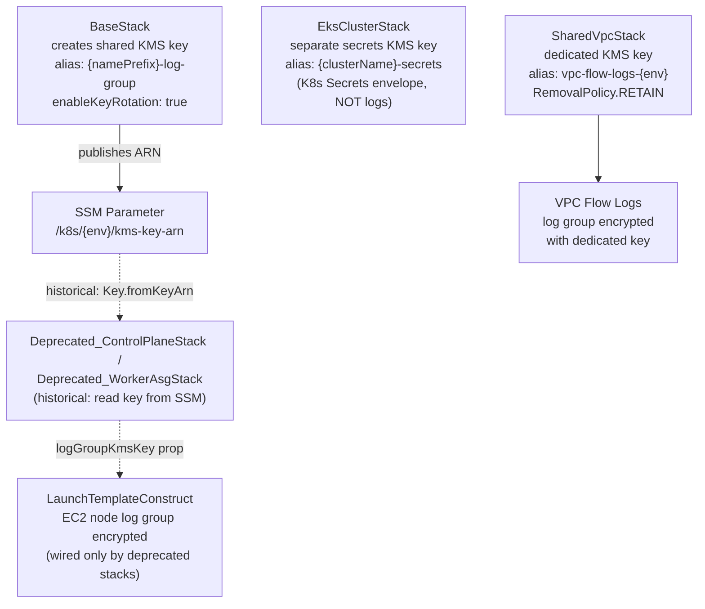

## Overview

CloudWatch Logs in this platform are managed through a set of CDK constructs
and stacks, each owning the log group for the service it provisions. Log groups
are never created outside of CDK except by SSM Automation (which writes
bootstrap/deploy/drift logs that CDK references but does not own). Retention
is tiered per environment, KMS encryption is applied selectively based on data
sensitivity and deployment environment, and a shared platform key is propagated
via SSM Parameter Store to avoid cross-stack hard dependencies.

Since the migration to managed EKS, the single largest CloudWatch Logs cost is
the EKS control-plane log group. That surface — and the decision to drop the
API and AUDIT streams to contain it — is documented in its own section below
and in [ADR-0011 EKS control-plane log cost](../decisions/0011-eks-control-plane-log-cost.md).

> **Migration note.** Several log groups described in earlier revisions of this
> document belonged to the self-hosted kubeadm platform (Deprecated_ControlPlaneStack,
> Deprecated_WorkerAsgStack, the kubeadm edge stack). Those stacks now live under
> `infra/lib/stacks/kubernetes/deprecated/` and are no longer deployed. Where a
> kubeadm-era log group is retained below it is marked **historical** and must
> not be read as a description of the current cluster.

## EKS control-plane logs

The managed control plane emits its logs to a single CDK-owned group,
`/aws/eks/<cluster>/cluster`, provisioned in
`infra/lib/stacks/kubernetes/eks-cluster-stack.ts:85-89`. Retention is
`ONE_MONTH` with `RemovalPolicy.RETAIN` — the group survives a `cdk destroy`
so post-incident forensics are not lost with the stack.

Only three of the five EKS control-plane log types are shipped
(`eks-cluster-stack.ts:76-80`):

- `AUTHENTICATOR` — access / IAM-to-Kubernetes mapping, the primary surface
  for debugging Access Entry problems
- `CONTROLLER_MANAGER` — control-loop health
- `SCHEDULER` — control-loop health

`API` and `AUDIT` are deliberately excluded. Per the in-code comment and the
cdk-nag suppression rationale (`eks-cluster-stack.ts:70-75,118`), the AUDIT
stream alone ingested **~102 GB/mo (~$34/mo, ~93% of the CloudWatch Logs
bill)** while the three retained streams are small. The full cost/benefit
argument — and the condition under which AUDIT is re-enabled (a compliance or
forensics requirement for a Kubernetes audit trail) — lives in
[ADR-0011 EKS control-plane log cost](../decisions/0011-eks-control-plane-log-cost.md).

The `AwsSolutions-EKS2` cdk-nag finding (missing control-plane log types) is
suppressed on the cluster resource with that same rationale so the intentional
drop does not read as an oversight.

## Retention tiers by environment

Retention is set globally per environment in
`infra/lib/config/kubernetes/configurations.ts` and passed as `logRetention`
props down to individual constructs:

| Environment | Retention | Source line |
|:------------|:----------|:------------|
| Development | `ONE_WEEK` | `configurations.ts:579` |
| Staging | `ONE_MONTH` | `configurations.ts:683` |
| Production | `THREE_MONTHS` | `configurations.ts:787` |

Constructs that use a fixed retention (not env-configured) are documented per
service below. Those are cases where the cost/signal ratio was explicit at
author time rather than inherited from the environment default.

## KMS encryption strategy

Encryption is applied at three levels: a shared platform key for
CloudWatch log groups, a dedicated key for VPC Flow Logs, and a separate
Kubernetes Secrets envelope key on the EKS cluster (etcd encryption, not a
log-group key).

`BaseStack` (`infra/lib/stacks/kubernetes/base-stack.ts:290-312`) creates the
shared key with a key policy granting the `logs.{region}.amazonaws.com`
service principal `kms:Encrypt*`, `kms:Decrypt*`, `kms:ReEncrypt*`,
`kms:GenerateDataKey*`, and `kms:Describe*` under an `ArnLike` condition on
`kms:EncryptionContext:aws:logs:arn`. The key ARN is published to
`/k8s/{env}/kms-key-arn` in SSM (`base-stack.ts:428`).

The stacks that historically consumed this key — the kubeadm control-plane and
worker node stacks — now live under
`infra/lib/stacks/kubernetes/deprecated/`. They read the ARN via
`ssm.StringParameter.valueForStringParameter` and passed it as `logGroupKmsKey`
to `LaunchTemplateConstruct`, avoiding a CloudFormation `Fn::ImportValue`
cross-stack hard dependency (see
[ADR-003: SSM over CloudFormation Exports](../decisions/0003-ssm-over-cloudformation-exports.md)).
On the managed EKS platform **no active stack reads this key for node logs** —
EKS node logging is handled by the control-plane group and node-level agents,
not per-instance EC2 log groups. `BaseStack` still creates the key and
publishes the ARN, and the encryption pattern remains live in
`LaunchTemplateConstruct`, but only the deprecated node stacks instantiate it.

Separately, `EksClusterStack` provisions its own KMS key
`alias/{clusterName}-secrets` (`eks-cluster-stack.ts:51-56`) with rotation and
`RemovalPolicy.RETAIN`. This is the envelope key for Kubernetes Secrets in etcd
— it is not a CloudWatch log-group key and does not encrypt any log group.

VPC Flow Logs use a completely separate KMS key provisioned in
`SharedVpcStack` (`infra/lib/shared/vpc-stack.ts:780-822`) with
`RemovalPolicy.RETAIN`. This key is kept independent because VPC Flow Logs
may need to persist beyond a stack destroy, and the shared platform key's
lifecycle is tied to the base networking stack.

Log groups for Bedrock model invocations, Lambda functions, ACM providers,
and Step Functions are not KMS-encrypted in this codebase. The rationale is
that these log groups contain operational metadata (durations, errors, status
codes), not user data or secrets.

## CDK-managed log groups

### EKS control-plane — EksClusterStack

**Pattern:** `/aws/eks/{clusterName}/cluster`

Provisioned by `infra/lib/stacks/kubernetes/eks-cluster-stack.ts:85-89`.
Retention `ONE_MONTH`, `RemovalPolicy.RETAIN`. Only `AUTHENTICATOR`,
`CONTROLLER_MANAGER`, and `SCHEDULER` streams are shipped; `API` and `AUDIT`
are dropped for cost. See the [EKS control-plane logs](#eks-control-plane-logs)
section above and [ADR-0011](../decisions/0011-eks-control-plane-log-cost.md).

### EC2 instance logs — LaunchTemplateConstruct (historical, kubeadm era)

**Pattern:** `/ec2/{namePrefix}/instances`

Provisioned by
`infra/lib/constructs/compute/constructs/launch-template.ts:233-240`.
Retention defaults to `ONE_MONTH` if not provided
(`props.logRetention ?? ONE_MONTH`). KMS encryption is applied when the
calling stack passes `logGroupKmsKey` (see KMS strategy above). The construct
calls `logGroup.grantWrite(role)` (`launch-template.ts:263-265`) on the EC2
instance role so the CloudWatch agent on the node can deliver logs without a
managed policy.

**Status:** This construct is only instantiated by
`Deprecated_ControlPlaneStack` and `Deprecated_WorkerAsgStack` (both under
`infra/lib/stacks/kubernetes/deprecated/`). It is not wired by any active EKS
stack. The construct code is retained as a reference implementation; on managed
EKS, node diagnostics come from the control-plane group and node-level agents,
not this per-instance group.

### Lambda function logs — LambdaFunctionConstruct

**Pattern:** `/aws/lambda/{functionName}`

Provisioned by
`infra/lib/constructs/compute/constructs/lambda-function.ts` (log-group
strategy documented at lines 19-28). The construct creates the log group
**before** the Lambda function and passes it via the `logGroup` prop. This is a
deliberate ordering — if Lambda auto-creates its log group (the default CDK
behaviour), a subsequent deploy that specifies an explicit group fails with a
CloudFormation "already exists" error. Pre-creation transfers ownership to CDK.

Retention defaults to `ONE_MONTH` (`props.logRetention ?? ONE_MONTH`).
No KMS encryption by default; callers may supply a key if needed.

### Step Functions execution logs — AmiRefreshConstruct

**Pattern:** `/aws/vendedlogs/states{ssmPrefix}-ami-refresh`

Provisioned by
`infra/lib/constructs/events/ami-refresh/ami-refresh-construct.ts:296-308`.
Fixed retention: `ONE_WEEK`. Log level: `sfn.LogLevel.ALL` with
`includeExecutionData: true`.

**Why the `vendedlogs` prefix:** AWS Step Functions requires the log group
name to start with `/aws/vendedlogs/states` when using CloudWatch logging.
Logs delivered outside this namespace are silently dropped by the SFN service.
This is an AWS constraint, not a platform choice.

**Why `includeExecutionData`:** The AMI refresh pipeline is a multi-step
orchestration (SSM parameter update -> instance refresh -> health verification).
Input/output data on each state transition is critical for debugging stalled
refreshes. The additional log volume is accepted for this infrequently-run
workflow.

### API Gateway access logs — ApiGatewayConstruct

**Pattern:** Auto-generated name (no hardcoded group name)

Provisioned by
`infra/lib/constructs/networking/api/api-gateway.ts:204-255`.
The log group is created without a `logGroupName` prop, so CloudFormation
assigns a random physical name. KMS encryption is applied when
`props.enableLogEncryption` is `true` (set to `true` in staging and
production configurations).

**Why no hardcoded name:** If a stack is rolled back and redeployed,
CloudFormation attempts to create a log group with the same name as the
deleted one. AWS retains deleted log groups in a deleted state for several
hours, causing the deploy to fail with "log group already exists". The
auto-generated name sidesteps this entirely.

### VPC Flow Logs — SharedVpcStack

**Pattern:** `/vpc/shared-{environment}/flow-logs`

Provisioned by `infra/lib/shared/vpc-stack.ts:780-822`. Traffic type:
`FlowLogTrafficType.ALL`. Retention defaults to `ONE_MONTH` unless overridden
by `props.retentionDays`. Encrypted with a dedicated KMS key with
`RemovalPolicy.RETAIN` (see KMS strategy above).

**Why ALL traffic:** Accepted traffic alongside rejected traffic is required
to reconstruct full session sequences for security investigation. Capturing
only REJECT traffic would miss the context of what preceded an anomaly.

### Bedrock model invocation logs — BedrockObservabilityConstruct

**Pattern:** `/aws/bedrock/{namePrefix}/model-invocations`

Provisioned by
`infra/lib/constructs/observability/bedrock-observability.ts:60-145`.
Fixed retention: 3 days (`LOG_RETENTION_DAYS = 3`). Text delivery only —
image, embedding, and video logging are explicitly disabled. Log delivery is
configured via an account-level API (`PutModelInvocationLoggingConfiguration`)
using `AwsCustomResource`.

**Why 3-day retention:** Bedrock invocation logs are high-volume when the
platform is active. The 3-day window covers operational debugging for recent
model calls without accumulating the significant cost of long-term storage.
No compliance requirement exists for retaining AI model inputs in this
workload.

**Why text only:** Image/embedding/video payloads are large. Enabling full
payload capture for all modalities would increase log ingestion cost by an
order of magnitude. Text-only delivery captures prompts and completions,
which are the diagnostic signal needed.

### ACM DNS validation Lambda logs — AcmCertificateDnsValidationConstruct

**Pattern:** `/aws/lambda/{namePrefix}-cert-provider-{environment}`

Provisioned by
`infra/lib/constructs/security/acm-certificate.ts:185-241`.
Retention is tiered at the construct level (not inherited from environment
config): production=`THREE_MONTHS`, staging=`ONE_MONTH`, development=`ONE_WEEK`.

This construct runs a custom resource Lambda that manages DNS validation
records in Route 53. The tiered retention mirrors the certificate lifecycle —
certificate events in production are audit-relevant for longer.

### EKS ALB certificate validation Lambda logs — EksAlbCertsStack

**Pattern:** `/aws/lambda/{namePrefix}-acm-dns-validation-{environment}`

Provisioned in `infra/lib/stacks/kubernetes/eks-alb-certs-stack.ts:74-86` via
`LambdaFunctionConstruct`. Fixed retention: `TWO_WEEKS`. A single Lambda
services every ALB wildcard certificate's custom-resource lifecycle (the
handler routes by domain). Two-week retention covers post-deploy verification
of certificate issuance.

This is the active EKS replacement for the kubeadm edge stack's utility
Lambdas. The historical `{namePrefix}-dns-alias-provider-{env}` and edge-stack
ACM validation functions lived in the kubeadm edge stack, now under
`infra/lib/stacks/kubernetes/deprecated/edge-stack.ts`, and are no longer
deployed.

## SSM-created log groups (CDK-referenced only)

Three log groups are created by SSM Automation documents at runtime. CDK does
not provision them — they are referenced exclusively by the Operations Dashboard
(`infra/lib/constructs/observability/operations-dashboard.ts`):

| Log Group | Created by | Purpose |
|:----------|:-----------|:--------|
| `/ssm{ssmPrefix}/bootstrap` | SSM Automation | Node bootstrap step output |
| `/ssm{ssmPrefix}/deploy` | SSM Automation | Script sync and deploy logs |
| `/ssm{ssmPrefix}/drift` | SSM Automation | Drift detection runs |

Retention for these groups is set by the SSM document configuration, not CDK.
The Operations Dashboard displays their content via CloudWatch log widget
queries but does not manage their lifecycle.

## CloudTrail — S3 only, not CloudWatch

CloudTrail is configured in
`infra/lib/constructs/security/account-security-baseline.ts` to deliver to
an S3 bucket (`{namePrefix}-cloudtrail-logs`) with a 90-day S3 lifecycle
expiry (`cloudTrailRetentionDays ?? 90`). CloudWatch delivery is not used for
CloudTrail in this platform.

**Why S3 only:** CloudWatch delivery for CloudTrail incurs per-event ingestion
costs that are significant at account-level audit volumes. S3 delivery is
cost-effective for long-term retention and integrates with Athena for
ad-hoc analysis. The Operations Dashboard uses CloudWatch metrics (not log
queries) for CloudTrail event signal.

## Complete log group inventory

| Log Group Pattern | Construct / Stack | Retention | KMS |
|:------------------|:------------------|:----------|:----|
| `/aws/eks/{clusterName}/cluster` | `EksClusterStack` (control plane) | ONE_MONTH (RETAIN) | No — API/AUDIT dropped, 3 streams shipped |
| `/ec2/{namePrefix}/instances` | `LaunchTemplateConstruct` (historical — deprecated stacks only) | Default 1m, configurable | Yes — shared platform key |
| `/aws/lambda/{functionName}` | `LambdaFunctionConstruct` | Default 1m, configurable | Optional |
| `/aws/vendedlogs/states{ssmPrefix}-ami-refresh` | `AmiRefreshConstruct` | ONE_WEEK (fixed) | No |
| Auto-named | `ApiGatewayConstruct` access logs | Configurable | Yes in stg/prod |
| `/vpc/shared-{env}/flow-logs` | `SharedVpcStack` | ONE_MONTH default | Yes — dedicated key (RETAIN) |
| `/aws/bedrock/{namePrefix}/model-invocations` | `BedrockObservabilityConstruct` | 3 DAYS (fixed) | No |
| `/aws/lambda/{namePrefix}-cert-provider-{env}` | `AcmCertificateDnsValidationConstruct` | Env-tiered at construct level | No |
| `/aws/lambda/{namePrefix}-acm-dns-validation-{env}` | `EksAlbCertsStack` | TWO_WEEKS (fixed) | No |
| `/ssm{ssmPrefix}/bootstrap` | SSM Automation (not CDK) | SSM-managed | No |
| `/ssm{ssmPrefix}/deploy` | SSM Automation (not CDK) | SSM-managed | No |
| `/ssm{ssmPrefix}/drift` | SSM Automation (not CDK) | SSM-managed | No |

## Tradeoffs

**Dropping EKS API and AUDIT logs** — The single biggest CloudWatch Logs saving
came from excluding the AUDIT stream (~102 GB/mo, ~$34/mo, ~93% of the
CloudWatch Logs bill per `eks-cluster-stack.ts:118`). The cost is loss of a
Kubernetes audit trail; the mitigation is that AUTHENTICATOR still captures
access decisions and AUDIT can be re-enabled at a single call site if a
compliance need arises. Full rationale in
[ADR-0011](../decisions/0011-eks-control-plane-log-cost.md).

**Selective KMS encryption** — Only log groups containing infrastructure
event data (EC2 node groups on the kubeadm platform, VPC traffic) are
encrypted. Lambda, API Gateway (in dev), Bedrock, and ACM log groups are not
encrypted. This balances compliance posture with operational cost. For a
production system handling PII, all log groups would be encrypted.

**Pre-creation pattern for Lambda logs** — The `LambdaFunctionConstruct`
pre-creates log groups at the cost of a slight increase in stack resource
count. The alternative — relying on Lambda auto-creation — results in
"already exists" failures on any deploy following a rollback, which is a more
disruptive tradeoff.

**Short Bedrock retention** — 3-day retention makes Bedrock logs unsuitable
for security auditing or historical analysis. This is intentional given the
cost profile of model invocation payloads. If audit requirements change, the
`LOG_RETENTION_DAYS` constant in `BedrockObservabilityConstruct` is the
single change point.

## Related concepts

- [Monitoring Strategy](monitoring-strategy.md)
- [Self-Healing + SSM Integration](self-healing-ssm-integration.md)
- [SSM Cross-Stack Pattern](../patterns/ssm-cross-stack-pattern.md)
- [ADR-003: SSM over CloudFormation Exports](../decisions/0003-ssm-over-cloudformation-exports.md)
- [ADR-0011: EKS control-plane log cost](../decisions/0011-eks-control-plane-log-cost.md)

<!--
Evidence trail (auto-generated):
- Source: infra/lib/constructs/compute/constructs/launch-template.ts:230-265 (read on 2026-04-28)
- Source: infra/lib/constructs/compute/constructs/lambda-function.ts:15-34,225-235 (read on 2026-04-28)
- Source: infra/lib/constructs/events/ami-refresh/ami-refresh-construct.ts:296-308 (read on 2026-04-28)
- Source: infra/lib/constructs/networking/api/api-gateway.ts:204-255 (read on 2026-04-28)
- Source: infra/lib/shared/vpc-stack.ts:780-822 (read on 2026-04-28)
- Source: infra/lib/constructs/observability/bedrock-observability.ts:60-145 (read on 2026-04-28)
- Source: infra/lib/constructs/security/acm-certificate.ts:185-241 (read on 2026-04-28)
- Source: infra/lib/constructs/observability/operations-dashboard.ts:179-180,275,303,315,385,513 (read on 2026-04-28)
- Source: infra/lib/constructs/security/account-security-baseline.ts (read on 2026-04-28)
- Refresh 2026-07-06: kubeadm edge-stack.ts, control-plane-stack.ts, worker-asg-stack.ts confirmed moved to infra/lib/stacks/kubernetes/deprecated/ — dropped from sources and body; former citations edge-stack.ts:280-293,685-688 / control-plane-stack.ts:161-164,191 / worker-asg-stack.ts:249-304 no longer resolve to active code.
- Source: infra/lib/stacks/kubernetes/eks-cluster-stack.ts:51-56,70-89,118 (read on 2026-07-06) — control-plane log group /aws/eks/{cluster}/cluster ONE_MONTH RETAIN; clusterLogging AUTHENTICATOR/CONTROLLER_MANAGER/SCHEDULER; API+AUDIT dropped; AUDIT ~102 GB/mo ~$34/mo ~93% of CW Logs bill; secrets KMS key alias/{cluster}-secrets.
- Source: infra/lib/stacks/kubernetes/base-stack.ts:290-312,428 (read on 2026-07-06) — shared LogGroupKey alias {namePrefix}-log-group, logs service principal policy under ArnLike EncryptionContext condition, ARN published to ssmPaths.kmsKeyArn (/k8s/{env}/kms-key-arn).
- Source: infra/lib/config/kubernetes/configurations.ts:579,683,787 (read on 2026-07-06) — logRetention ONE_WEEK/ONE_MONTH/THREE_MONTHS per environment (line numbers moved from 554/658/762).
- Source: infra/lib/stacks/kubernetes/eks-alb-certs-stack.ts:74-86 (read on 2026-07-06) — ACM DNS validation LambdaFunctionConstruct, functionName {namePrefix}-acm-dns-validation-{env}, logRetention TWO_WEEKS.
- Source: infra/lib/constructs/compute/constructs/launch-template.ts:233-240,263-265 (read on 2026-07-06) — /ec2/{namePrefix}/instances log group; only instantiated by deprecated/control-plane-stack.ts:203 and deprecated/worker-asg-stack.ts:394.
-->
