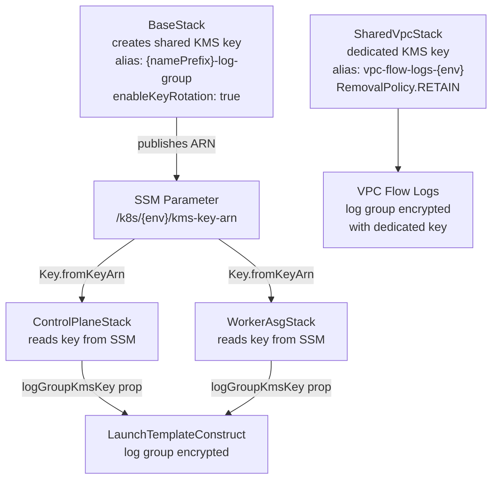

## Overview

CloudWatch Logs in this platform are managed through a set of CDK constructs
and stacks, each owning the log group for the service it provisions. Log groups
are never created outside of CDK except by SSM Automation (which writes
bootstrap/deploy/drift logs that CDK references but does not own). Retention
is tiered per environment, KMS encryption is applied selectively based on data
sensitivity and deployment environment, and a shared platform key is propagated
via SSM Parameter Store to avoid cross-stack hard dependencies.

## Retention tiers by environment

Retention is set globally per environment in
`infra/lib/config/kubernetes/configurations.ts` and passed as `logRetention`
props down to individual constructs:

| Environment | Retention | Source line |
|:------------|:----------|:------------|
| Development | `ONE_WEEK` | `configurations.ts:554` |
| Staging | `ONE_MONTH` | `configurations.ts:658` |
| Production | `THREE_MONTHS` | `configurations.ts:762` |

Constructs that use a fixed retention (not env-configured) are documented per
service below. Those are cases where the cost/signal ratio was explicit at
author time rather than inherited from the environment default.

## KMS encryption strategy

Encryption is applied at two levels: a shared platform key for EC2 and
Kubernetes-adjacent log groups, and a dedicated key for VPC Flow Logs.

`BaseStack` (`infra/lib/stacks/kubernetes/base-stack.ts:292-319`) creates the
shared key with a key policy granting the `logs.{region}.amazonaws.com`
service principal `kms:Encrypt*`, `kms:Decrypt*`, and `kms:GenerateDataKey*`
under an `ArnLike` condition. The key ARN is written to
`/k8s/{env}/kms-key-arn` in SSM. Consumer stacks (`ControlPlaneStack:161-164`,
`WorkerAsgStack:249-304`) read it via `ssm.StringParameter.valueForStringParameter`
and pass it as `logGroupKmsKey` — avoiding a CloudFormation `Fn::ImportValue`
cross-stack hard dependency (see [ADR-002](../adrs/0002-ssm-over-cloudformation-exports.md)).

VPC Flow Logs use a completely separate KMS key provisioned in
`SharedVpcStack` (`infra/lib/shared/vpc-stack.ts:780-822`) with
`RemovalPolicy.RETAIN`. This key is kept independent because VPC Flow Logs
may need to persist beyond a stack destroy, and the shared platform key's
lifecycle is tied to the Kubernetes cluster.

Log groups for Bedrock model invocations, Lambda functions, ACM providers,
and Step Functions are not KMS-encrypted in this codebase. The rationale is
that these log groups contain operational metadata (durations, errors, status
codes), not user data or secrets.

## CDK-managed log groups

### EC2 instance logs — LaunchTemplateConstruct

**Pattern:** `/ec2/{namePrefix}/instances`

Provisioned by `infra/lib/constructs/compute/constructs/launch-template.ts`.
Retention defaults to `ONE_MONTH` if not provided
(`props.logRetention ?? ONE_MONTH`). KMS encryption is applied when the
calling stack passes `logGroupKmsKey` (all Kubernetes node stacks do;
see KMS strategy above). The construct calls `logGroup.grantWrite(role)` on
the EC2 instance role so the CloudWatch agent running on the node can deliver
logs without requiring a managed policy.

**Why:** EC2 node logs (kubelet, systemd units, kernel) are the primary
diagnostic surface for cluster bootstrap failures and runtime incidents.
Without a dedicated log group, CloudWatch agent would auto-create one and
retention/encryption could not be enforced.

### Lambda function logs — LambdaFunctionConstruct

**Pattern:** `/aws/lambda/{functionName}`

Provisioned by `infra/lib/constructs/compute/constructs/lambda-function.ts:15-34`.
The construct creates the log group **before** the Lambda function and passes
it via the `logGroup` prop. This is a deliberate ordering — if Lambda
auto-creates its log group (the default CDK behaviour), subsequent deploys
that specify `logRetentionDays` fail with a CloudFormation
"log group already exists" error. Pre-creation transfers ownership to CDK.

Retention defaults to `ONE_MONTH` (`props.logRetention ?? ONE_MONTH`).
No KMS encryption by default; callers may supply `kmsKey` if needed.

### Step Functions execution logs — AmiRefreshConstruct

**Pattern:** `/aws/vendedlogs/states{ssmPrefix}-ami-refresh`

Provisioned by
`infra/lib/constructs/events/ami-refresh/ami-refresh-construct.ts:296-308`.
Fixed retention: `ONE_WEEK`. Log level: `sfn.LogLevel.ALL` with
`includeExecutionData: true`.

**Why the `vendedlogs` prefix:** AWS Step Functions requires the log group
name to start with `/aws/vendedlogs/states` when using CloudWatch logging.
Logs delivered outside this namespace are silently dropped by the SFN service.
This is an AWS constraint, not a platform choice.

**Why `includeExecutionData`:** The AMI refresh pipeline is a multi-step
orchestration (SSM parameter update → instance refresh → health verification).
Input/output data on each state transition is critical for debugging stalled
refreshes. The additional log volume is accepted for this infrequently-run
workflow.

### API Gateway access logs — ApiGatewayConstruct

**Pattern:** Auto-generated name (no hardcoded group name)

Provisioned by
`infra/lib/constructs/networking/api/api-gateway.ts:204-255`.
The log group is created without a `logGroupName` prop, so CloudFormation
assigns a random physical name. KMS encryption is applied when
`props.enableLogEncryption` is `true` (set to `true` in staging and
production configurations).

**Why no hardcoded name:** If a stack is rolled back and redeployed,
CloudFormation attempts to create a log group with the same name as the
deleted one. AWS retains deleted log groups in a deleted state for several
hours, causing the deploy to fail with "log group already exists". The
auto-generated name sidesteps this entirely.

### VPC Flow Logs — SharedVpcStack

**Pattern:** `/vpc/shared-{environment}/flow-logs`

Provisioned by `infra/lib/shared/vpc-stack.ts:780-822`. Traffic type:
`FlowLogTrafficType.ALL`. Retention defaults to `ONE_MONTH` unless overridden
by `props.retentionDays`. Encrypted with a dedicated KMS key with
`RemovalPolicy.RETAIN` (see KMS strategy above).

**Why ALL traffic:** Accepted traffic alongside rejected traffic is required
to reconstruct full session sequences for security investigation. Capturing
only REJECT traffic would miss the context of what preceded an anomaly.

### Bedrock model invocation logs — BedrockObservabilityConstruct

**Pattern:** `/aws/bedrock/{namePrefix}/model-invocations`

Provisioned by
`infra/lib/constructs/observability/bedrock-observability.ts:60-145`.
Fixed retention: 3 days (`LOG_RETENTION_DAYS = 3`). Text delivery only —
image, embedding, and video logging are explicitly disabled. Log delivery is
configured via an account-level API (`PutModelInvocationLoggingConfiguration`)
using `AwsCustomResource`.

**Why 3-day retention:** Bedrock invocation logs are high-volume when the
platform is active. The 3-day window covers operational debugging for recent
model calls without accumulating the significant cost of long-term storage.
No compliance requirement exists for retaining AI model inputs in this
workload.

**Why text only:** Image/embedding/video payloads are large. Enabling full
payload capture for all modalities would increase log ingestion cost by an
order of magnitude. Text-only delivery captures prompts and completions,
which are the diagnostic signal needed.

### ACM DNS validation Lambda logs — AcmCertificateDnsValidationConstruct

**Pattern:** `/aws/lambda/{namePrefix}-cert-provider-{environment}`

Provisioned by
`infra/lib/constructs/security/acm-certificate.ts:185-241`.
Retention is tiered at the construct level (not inherited from environment
config): production=`THREE_MONTHS`, staging=`ONE_MONTH`, development=`ONE_WEEK`.

This construct runs a custom resource Lambda that manages DNS validation
records in Route 53. The tiered retention mirrors the certificate lifecycle —
certificate events in production are audit-relevant for longer.

### Edge stack utility Lambda logs

**Pattern:** `/aws/lambda/{namePrefix}-dns-alias-provider-{envName}`

Provisioned inline in `infra/lib/stacks/kubernetes/edge-stack.ts:685-688`
via `LambdaFunctionConstruct`. Fixed retention: `TWO_WEEKS`. This Lambda
manages Route 53 alias records for the NLB and runs only during stack deploys.
Two-week retention is sufficient to cover post-deploy verification windows.

A second Lambda in the edge stack, the ACM DNS validation function, uses
`logRetention: logs.RetentionDays.TWO_WEEKS`
(`edge-stack.ts:280-293`) for the same reason.

## SSM-created log groups (CDK-referenced only)

Three log groups are created by SSM Automation documents at runtime. CDK does
not provision them — they are referenced exclusively by the Operations Dashboard
(`infra/lib/constructs/observability/operations-dashboard.ts`):

| Log Group | Created by | Purpose |
|:----------|:-----------|:--------|
| `/ssm{ssmPrefix}/bootstrap` | SSM Automation | Node bootstrap step output |
| `/ssm{ssmPrefix}/deploy` | SSM Automation | Script sync and deploy logs |
| `/ssm{ssmPrefix}/drift` | SSM Automation | Drift detection runs |

Retention for these groups is set by the SSM document configuration, not CDK.
The Operations Dashboard displays their content via CloudWatch log widget
queries but does not manage their lifecycle.

## CloudTrail — S3 only, not CloudWatch

CloudTrail is configured in
`infra/lib/constructs/security/account-security-baseline.ts` to deliver to
an S3 bucket (`{namePrefix}-cloudtrail-logs`) with a 90-day S3 lifecycle
expiry (`cloudTrailRetentionDays ?? 90`). CloudWatch delivery is not used for
CloudTrail in this platform.

**Why S3 only:** CloudWatch delivery for CloudTrail incurs per-event ingestion
costs that are significant at account-level audit volumes. S3 delivery is
cost-effective for long-term retention and integrates with Athena for
ad-hoc analysis. The Operations Dashboard uses CloudWatch metrics (not log
queries) for CloudTrail event signal.

## Complete log group inventory

| Log Group Pattern | Construct / Stack | Retention | KMS |
|:------------------|:------------------|:----------|:----|
| `/ec2/{namePrefix}/instances` | `LaunchTemplateConstruct` | Env-tiered (dev=1w, stg=1m, prod=3m) | Yes — shared platform key |
| `/aws/lambda/{functionName}` | `LambdaFunctionConstruct` | Default 1m, configurable | Optional |
| `/aws/vendedlogs/states{ssmPrefix}-ami-refresh` | `AmiRefreshConstruct` | ONE_WEEK (fixed) | No |
| Auto-named | `ApiGatewayConstruct` access logs | Configurable | Yes in stg/prod |
| `/vpc/shared-{env}/flow-logs` | `SharedVpcStack` | ONE_MONTH default | Yes — dedicated key (RETAIN) |
| `/aws/bedrock/{namePrefix}/model-invocations` | `BedrockObservabilityConstruct` | 3 DAYS (fixed) | No |
| `/aws/lambda/{namePrefix}-cert-provider-{env}` | `AcmCertificateDnsValidationConstruct` | Env-tiered at construct level | No |
| `/aws/lambda/{namePrefix}-dns-alias-provider-{env}` | `EdgeStack` | TWO_WEEKS (fixed) | No |
| `/ssm{ssmPrefix}/bootstrap` | SSM Automation (not CDK) | SSM-managed | No |
| `/ssm{ssmPrefix}/deploy` | SSM Automation (not CDK) | SSM-managed | No |
| `/ssm{ssmPrefix}/drift` | SSM Automation (not CDK) | SSM-managed | No |

## Tradeoffs

**Selective KMS encryption** — Only log groups containing infrastructure
event data from EC2 nodes and VPC traffic are encrypted. Lambda, API Gateway
(in dev), Bedrock, and ACM log groups are not encrypted. This balances
compliance posture with operational cost. For a production system handling
PII, all log groups would be encrypted.

**Pre-creation pattern for Lambda logs** — The `LambdaFunctionConstruct`
pre-creates log groups at the cost of a slight increase in stack resource
count. The alternative — relying on Lambda auto-creation — results in
"already exists" failures on any deploy following a rollback, which is a more
disruptive tradeoff.

**Short Bedrock retention** — 3-day retention makes Bedrock logs unsuitable
for security auditing or historical analysis. This is intentional given the
cost profile of model invocation payloads. If audit requirements change, the
`LOG_RETENTION_DAYS` constant in `BedrockObservabilityConstruct` is the
single change point.

## Related concepts

- [Monitoring Strategy](monitoring-strategy.md)
- [Self-Healing + SSM Integration](self-healing-ssm-integration.md)
- [SSM Cross-Stack Pattern](../patterns/ssm-cross-stack-pattern.md)
- [ADR-002: SSM over CloudFormation Exports](../adrs/0002-ssm-over-cloudformation-exports.md)

<!--
Evidence trail (auto-generated):
- Source: infra/lib/constructs/compute/constructs/launch-template.ts:230-265 (read on 2026-04-28)
- Source: infra/lib/constructs/compute/constructs/lambda-function.ts:15-34,225-235 (read on 2026-04-28)
- Source: infra/lib/constructs/events/ami-refresh/ami-refresh-construct.ts:296-308 (read on 2026-04-28)
- Source: infra/lib/constructs/networking/api/api-gateway.ts:204-255 (read on 2026-04-28)
- Source: infra/lib/shared/vpc-stack.ts:780-822 (read on 2026-04-28)
- Source: infra/lib/constructs/observability/bedrock-observability.ts:60-145 (read on 2026-04-28)
- Source: infra/lib/constructs/security/acm-certificate.ts:185-241 (read on 2026-04-28)
- Source: infra/lib/stacks/kubernetes/edge-stack.ts:280-293,685-688 (read on 2026-04-28)
- Source: infra/lib/stacks/kubernetes/base-stack.ts:292-319 (read on 2026-04-28)
- Source: infra/lib/stacks/kubernetes/control-plane-stack.ts:161-164,191 (read on 2026-04-28)
- Source: infra/lib/stacks/kubernetes/worker-asg-stack.ts:249-304 (read on 2026-04-28)
- Source: infra/lib/config/kubernetes/configurations.ts:554,658,762 (read on 2026-04-28)
- Source: infra/lib/constructs/observability/operations-dashboard.ts:179-180,275,303,315,385,513 (read on 2026-04-28)
- Source: infra/lib/constructs/security/account-security-baseline.ts (read on 2026-04-28)
-->
