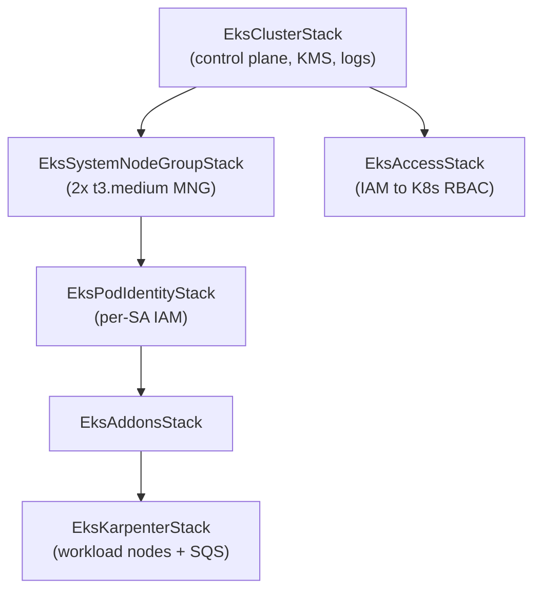

## What this is

The platform runs application workloads on **Amazon EKS** in `eu-west-1`,
replacing the earlier self-managed kubeadm cluster
([ADR-001](../decisions/0001-self-managed-k8s-vs-eks.md) records the original
self-managed rationale; the migration design lives in
[docs/superpowers/specs/2026-05-05-eks-migration-design.md](../superpowers/specs/2026-05-05-eks-migration-design.md)).
Live, the cluster is `k8s-eks-development` on Kubernetes **1.34**, platform
version `eks.24`, `ACTIVE` (verified via `aws eks describe-cluster` on
2026-06-16).

The EKS surface is defined as CDK in `infra/lib/stacks/kubernetes/` and deployed
through the `kubernetes` project factory. Everything that runs *inside* the
cluster (ArgoCD, Helm charts, in-cluster services) lives in the sibling
`kubernetes-bootstrap` repository, not here.

## One stack per failure domain

The cluster is decomposed into single-purpose stacks with an explicit dependency
order, so each stack is one failure domain that can be deployed and rolled back
independently:

`EksClusterStack` creates only the managed control plane, a KMS envelope key for
Kubernetes Secrets, and the control-plane CloudWatch log group — it deliberately
creates no node group
([eks-cluster-stack.ts](../../infra/lib/stacks/kubernetes/eks-cluster-stack.ts)).
In dev the cluster uses PUBLIC subnets only, running without a NAT Gateway per the
cost guardrail (same file). Independent edge and cost stacks
(`EksAlbCerts`, `EksPublicWaf`, `EksScheduler`) attach to the cluster but sit
outside this dependency chain.

## Node provisioning: system MNG + Karpenter

Node capacity is two-tier. A small **managed node group** of 2× `t3.medium`
instances is the landing zone for CoreDNS and Karpenter itself
([eks-system-node-group-stack.ts](../../infra/lib/stacks/kubernetes/eks-system-node-group-stack.ts)).
**Karpenter** then provisions workload nodes on demand and owns all workload
scaling — cluster-autoscaler is not used
([eks-karpenter-stack.ts](../../infra/lib/stacks/kubernetes/eks-karpenter-stack.ts)).
Karpenter requires an SQS interruption queue, provisioned in the same stack.

## IAM: Pod Identity over IRSA

Workload IAM uses **EKS Pod Identity** — one association per service account, per
namespace, defined in `EksPodIdentityStack`
([eks-pod-identity-stack.ts](../../infra/lib/stacks/kubernetes/eks-pod-identity-stack.ts)).
Pod Identity is preferred over IRSA for new service accounts. `EksAccessStack`
maps IAM principals to Kubernetes RBAC via EKS access entries and depends only on
the cluster
([eks-access-stack.ts](../../infra/lib/stacks/kubernetes/eks-access-stack.ts)).

## Edge and data

Public ingress enters through a single internet-facing ALB provisioned by the AWS
Load Balancer Controller, with ACM wildcard SNI certificates and a regional WAFv2
WebACL — see
[ADR-0010](../decisions/0010-alb-wafv2-edge-over-cloudfront-nlb.md). Application
data sits in a Platform RDS PostgreSQL **18** instance with pgvector
(`k8s-dev-platform-rds`, `db.t4g.micro`, verified via `aws rds
describe-db-instances` on 2026-06-16).

## Deeper detail

- [ALB + regional WAFv2 edge over CloudFront and NLB](../decisions/0010-alb-wafv2-edge-over-cloudfront-nlb.md)
  — the edge decision and WAF rule shape
- [CDK construct architecture](cdk-construct-architecture.md)
  — L1/L2/L3 hierarchy and the Project Factory pattern the EKS stacks use
- [Karpenter and Pod Identity provisioning](karpenter-pod-identity-provisioning.md)
  — NodePool/EC2NodeClass detail and Pod Identity association internals
- [EKS dev start/stop and restore order](../runbooks/eks-dev-start-stop-restore.md)
  — the `EksScheduler` dev start/stop lifecycle and restore order

<!--
Evidence trail (auto-generated):
- Source: infra/lib/stacks/kubernetes/eks-cluster-stack.ts (read 2026-06-16)
- Source: infra/lib/stacks/kubernetes/eks-public-waf-stack.ts (read 2026-06-16)
- Source: infra/lib/stacks/kubernetes/ (listed 2026-06-16) — active EKS stack set
- Source: .claude/CLAUDE.md project conventions (read 2026-06-16) — MNG/Karpenter/Pod Identity rules
- Live: aws eks describe-cluster --name k8s-eks-development (run 2026-06-16) — 1.34, eks.24, ACTIVE
- Live: aws rds describe-db-instances (run 2026-06-16) — k8s-dev-platform-rds, postgres 18.3
-->
