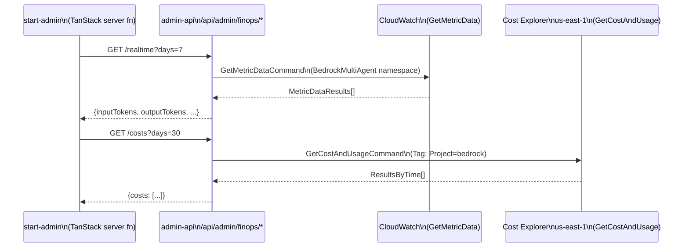

## Overview

The FinOps observability route exposes read-only access to CloudWatch custom
metrics and AWS Cost Explorer billing data directly from the `admin-api` BFF,
without an intermediate Lambda function. It powers the cost and usage
dashboard in the start-admin TanStack application by providing four HTTP
endpoints that query Bedrock AI token consumption, latency, safety signals,
and dollar-denominated AWS spend
([api/admin-api/src/routes/finops.ts](../../api/admin-api/src/routes/finops.ts#L1-L19)).

## How it works

All four endpoints accept a `?days=N` query parameter (default 7, max 365)
that controls the lookback window. Internally, `parseDays()` clamps the
value and `dateWindow()` derives `[startTime, endTime]`
([finops.ts L56-L73](../../api/admin-api/src/routes/finops.ts#L56-L73)).

CloudWatch and Cost Explorer clients are lazy singletons initialised on
first request and reused across warm invocations
([finops.ts L29-L46](../../api/admin-api/src/routes/finops.ts#L29-L46)).
The Cost Explorer client is always pinned to `us-east-1` because Cost
Explorer is a global AWS service with a single regional endpoint
([finops.ts L43](../../api/admin-api/src/routes/finops.ts#L43)).

Metric results are collapsed from AWS's time-series format into a flat
`Record<string, number>` using `collapseMetrics()`, which takes the first
value from each result's `Values` array
([finops.ts L83-L97](../../api/admin-api/src/routes/finops.ts#L83-L97)).

## Implementation in this codebase

### Route: GET /realtime

Queries the `BedrockMultiAgent` CloudWatch namespace (custom metrics emitted
by the multi-agent pipeline). Returns a flat stats record
([finops.ts L118-L196](../../api/admin-api/src/routes/finops.ts#L118-L196)):

| CloudWatch metric name | Stat | Response key |
|---|---|---|
| `InputTokens` | Sum | `inputTokens` |
| `OutputTokens` | Sum | `outputTokens` |
| `ThinkingTokens` | Sum | `thinkingTokens` |
| `ProcessingDurationMs` | Average | `processingDuration` |
| `BedrockConverseMs` | Average | `bedrockConverseDuration` |
| `InvocationCount` | Sum | `invocations` |

### Route: GET /costs

Queries Cost Explorer with `Granularity: DAILY`, filtered to resources tagged
`Project=bedrock`, and grouped by the `aws:bedrock:inference-profile` tag
([finops.ts L206-L231](../../api/admin-api/src/routes/finops.ts#L206-L231)).
The metric is `UnblendedCost`. Errors are caught and returned as
`{ costs: [] }` with a `console.warn` rather than a 500, because Cost
Explorer data may be unavailable in new accounts or before the first billing
period completes.

### Route: GET /chatbot

Queries the `BedrockChatbot` CloudWatch namespace with an
`Environment=development` dimension
([finops.ts L241-L330](../../api/admin-api/src/routes/finops.ts#L241-L330)).
Returns: `invocationCount`, `invocationLatency`, `invocationErrors`,
`promptLength`, `responseLength`, `blockedInputs`, `redactedOutputs`.
The `blockedInputs` and `redactedOutputs` metrics are safety signals from
Bedrock Guardrails.

### Route: GET /self-healing

Queries the `self-healing-development/SelfHealing` CloudWatch namespace for
token consumption by the self-healing CI pipeline
([finops.ts L340-L384](../../api/admin-api/src/routes/finops.ts#L340-L384)).
Returns: `inputTokens`, `outputTokens`.

### Mounting and auth

The router is mounted at `/api/admin/finops` and protected by the
`cognitoJwtAuth` middleware applied globally to all `/api/admin/*` routes
([index.ts L88](../../api/admin-api/src/index.ts#L88)). All AWS calls use
EC2 Instance Profile credentials via IMDS — no static credentials in the
pod environment.

### Required IAM permissions

The EC2 Instance Profile attached to the Kubernetes worker nodes must grant
the admin-api pod:

- `cloudwatch:GetMetricData` on `*`
- `ce:GetCostAndUsage` on `*` (Cost Explorer does not support resource-level
  scoping)

## Tradeoffs

**Direct BFF access vs dedicated Lambda** — the finops queries run inside
the BFF pod rather than delegating to a separate Lambda function. This
eliminates cold-start latency for dashboard loads and removes the need to
maintain a separate deployment artifact for read-only queries. The downside
is that the BFF pod's IAM role must hold `cloudwatch:GetMetricData` and
`ce:GetCostAndUsage` permissions, broadening the attack surface slightly
compared to a narrowly-scoped Lambda execution role.

**Collapsing time-series to a scalar** — `collapseMetrics()` takes only the
first value from each CloudWatch result array. For sum-stat metrics covering
the entire `?days=N` window, CloudWatch returns a single aggregated point,
so this is lossless. If the period is changed to something shorter than the
full window (currently `days * 24 * 60 * 60` seconds), multiple values could
be returned and all but the first would be dropped.

**Cost Explorer soft-fail** — errors on the `/costs` endpoint return
`{ costs: [] }` rather than a 500. This prevents the admin dashboard from
showing an error page when billing data is temporarily unavailable but makes
it harder to detect misconfigured IAM permissions silently. The `console.warn`
is collected by Loki and can be alerted on.

## Related concepts

- admin-api (the Hono BFF that exposes the FinOps route) is documented in the sibling [tucaken-app repo](https://github.com/Nelson-Lamounier/tucaken-app/blob/main/docs/projects/admin-api.md) — its code moved there.

<!--
Evidence trail (auto-generated):
- Source: api/admin-api/src/routes/finops.ts (read on 2026-04-28)
- Source: api/admin-api/src/index.ts (read on 2026-04-28)
- Source: api/admin-api/package.json (read on 2026-04-28)
-->
