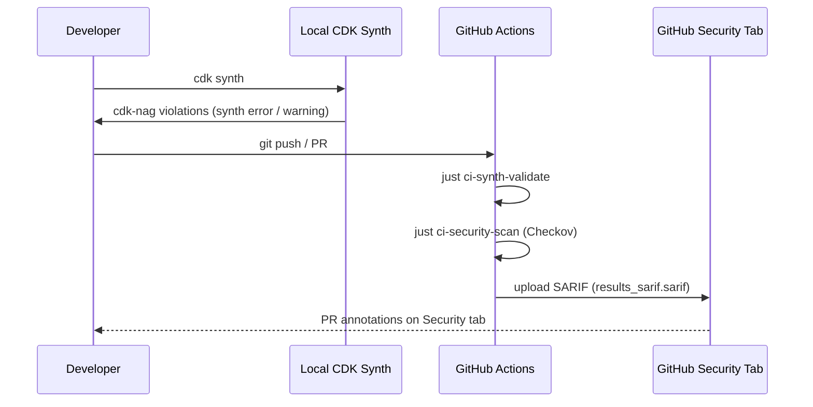

## Overview

This codebase enforces infrastructure-as-code security at two distinct phases of the development lifecycle. cdk-nag validates CDK constructs at synthesis time, surfacing rule violations as IDE feedback before any template is generated. Checkov then scans the synthesised CloudFormation templates in CI, blocking merges when CRITICAL or HIGH severity findings are detected.

The two tools are complementary and non-overlapping in scope: cdk-nag reasons about CDK L2/L3 construct-level semantics and compliance pack rules; Checkov reasons about the concrete CloudFormation resource graph after all CDK abstractions have been flattened.

## How It Works

### Layer 1 — cdk-nag at synth time

cdk-nag is applied as a CDK Aspect in `infra/lib/aspects/cdk-nag-aspect.ts` via the `applyCdkNag()` helper. The default compliance pack is `AwsSolutionsChecks`. Additional packs (`HIPAASecurityChecks`, `NIST80053R5Checks`, `PCIDSS321Checks`) are available via the `CompliancePack` enum. The aspect runs every time `cdk synth` executes, giving inline feedback without a CI round-trip.

Violations that are accepted as intentional are suppressed using `NagSuppressions.addStackSuppressions()` via `applyCommonSuppressions()`. Every suppression carries a mandatory `reason` string. Example suppressions from `infra/lib/aspects/cdk-nag-aspect.ts`:

- `AwsSolutions-IAM4` — AWS managed policies used for SSM and CloudWatch (standard for EC2 monitoring)
- `AwsSolutions-VPC7` — VPC flow logs are enabled and encrypted with KMS
- `AwsSolutions-EC28` — Detailed monitoring optional for cost optimisation in dev

### Layer 2 — Checkov in CI against synthesised CloudFormation

The `iac-security-scan` job in `.github/workflows/ci.yml` runs after the `validate-cdk` job succeeds. It synthesises templates, then executes `just ci-security-scan`, which invokes Checkov using `.checkov/config.yaml` as its configuration source.

Severity thresholds in `.checkov/config.yaml`:

- `soft-fail-on: [LOW, MEDIUM]` — reported but do not block the pipeline
- CRITICAL and HIGH findings block the pipeline (no explicit entry needed; soft-fail omits them)

## Implementation in This Codebase

### cdk-nag application point

`infra/bin/app.ts` imports `applyCdkNag` and `applyCommonSuppressions` from `infra/lib/aspects`. These are called after all stacks are created and before `app.synth()` completes.

### Checkov configuration

`.checkov/config.yaml` sets:

- `framework: cloudformation` — only CloudFormation templates are scanned
- `external-checks-dir: [custom_checks]` — loads 29 project-specific Python checks from `.checkov/custom_checks/`
- `compact: true` — reduces output noise in CI logs

### Documented skip-check entries

All skipped built-in checks in `.checkov/config.yaml` include inline rationale:

| Check ID | Reason |
| :--- | :--- |
| `CKV_AWS_111` | VPC Flow Logs handled by SharedVpcStack with encryption |
| `CKV_AWS_338` | CloudWatch Log retention explicitly set to 30 days in dev for cost optimisation |
| `CKV_AWS_178` | Single NAT Gateway used in dev for cost optimisation |
| `CKV_AWS_117` | Lambda VPC — CDK custom resources do not need VPC access |
| `CKV_AWS_116` | Lambda DLQ — CDK custom resources handle retries internally |
| `CKV_AWS_115` | Lambda concurrency — CDK custom resources are deployment-only |

### SARIF upload

After the Checkov step, `github/codeql-action/upload-sarif@v3` uploads `security-reports/results_sarif.sarif` with `category: checkov-ci`. The step runs with `if: always()` so results are uploaded even when findings block the job.

### Custom checks

`.checkov/custom_checks/` contains 29 checks across 11 domain files, auto-loaded via `external-checks-dir`. Domains include: security groups, IAM, CloudWatch logging, EC2 UserData, EBS, KMS, ASG, VPC, Lambda, SNS, and SQS. See `.checkov/custom_checks/README.md` for the full registry.

## Tradeoffs

**cdk-nag strengths:** Runs entirely locally with zero latency; rules express CDK intent (e.g. "S3 bucket must have versioning"); suppressions are co-located with the construct they describe.

**cdk-nag limitations:** Only sees the CDK construct tree. Rules are pack-defined and cannot easily encode project-specific patterns (e.g. "no hardcoded account IDs").

**Checkov strengths:** Operates on the final CloudFormation template, which is the true deployment artifact. Python-based custom checks can encode any project-specific policy. SARIF integration provides persistent, reviewable findings in the GitHub Security tab.

**Checkov limitations:** Runs only in CI (not at local edit time). Template-level reasoning can miss CDK intent that was not fully materialised into CloudFormation properties.

**Combined:** The two-layer model minimises both false negatives (Checkov catches what cdk-nag misses at the CloudFormation level) and developer friction (cdk-nag catches common violations before a push).

## Related Concepts

- [docs/tools/checkov.md](../tools/checkov.md) — Checkov tool reference
- [docs/projects/cdk-governance-aspects.md](../projects/cdk-governance-aspects.md) — CDK Aspects for DynamoDB access governance and tagging

<!-- evidence-trail
  .checkov/config.yaml: framework, soft-fail-on, skip-check entries with rationale, external-checks-dir
  .checkov/custom_checks/README.md: 29 custom checks, 11 domain files
  .github/workflows/ci.yml lines 387-436: iac-security-scan job, upload-sarif step, category: checkov-ci
  infra/lib/aspects/cdk-nag-aspect.ts: CompliancePack enum, applyCdkNag(), COMMON_SUPPRESSIONS with reason strings
  infra/bin/app.ts line 26: import { applyCdkNag, applyCommonSuppressions, TaggingAspect }
-->
