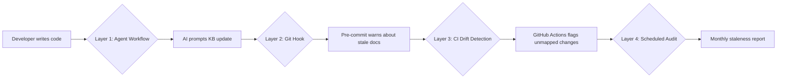

# Knowledge Base Synchronisation Strategy

## Problem

The KB contains 32 documents describing infrastructure, Kubernetes, observability, and AI/ML systems. When code changes — adding services, debugging issues, moving files, updating CDK stacks — the KB can silently drift out of date. Today, nothing enforces or even prompts KB updates during the development lifecycle.

## Proposed Solution — 4 Layers

Each layer catches drift at a different point in the workflow, from earliest (AI pair-programming) to latest (CI gate).



---

## Layer 1 — AI Agent Workflow (`.agents/workflows/kb-sync.md`)

**Trigger:** After any debugging session, implementation, infrastructure change, or troubleshooting.

This creates a slash-command `/kb-sync` that you or the AI can invoke at the end of any session. The workflow instructs the agent to:

1. Identify which KB documents relate to the work just completed
2. Update `last_updated`, `## Summary`, `## Keywords` as needed
3. Update the `.metadata.json` sidecar
4. If a new capability was added and no doc covers it → create one from the template

**File to create:** `.agents/workflows/kb-sync.md`

```yaml
---
description: Synchronise the Knowledge Base after code changes
---
```

**Instructions the agent follows:**

1. Review what was changed in this session (git diff, conversation context)
2. Consult `knowledge-base/.kb-map.yml` to find affected KB documents
3. For each affected doc:
   - Update `last_updated:` in frontmatter to today
   - Refresh `## Summary` if the change alters behaviour
   - Add/remove `## Keywords` if applicable
   - Ensure `.metadata.json` sidecar reflects any tag changes
4. If no KB document covers the changed area → propose a new document using the template in `README.md`
5. Run the validation: `find knowledge-base/ -name '*.md' ... ` (same as CI)

> [!TIP]
> Because you already use `.agents/` instruction files heavily, this is the lowest-friction layer — the AI assistant becomes your "KB co-maintainer" during every session.

---

## Layer 2 — Code-to-KB Mapping File (`knowledge-base/.kb-map.yml`)

A declarative mapping from code paths to KB documents. This is the **single source of truth** that all other layers consume.

```yaml
# knowledge-base/.kb-map.yml
# Maps code paths (glob patterns) to KB documents that describe them.
# Used by: agent workflow, git hook, CI drift detection.

mappings:
  # ─── Infrastructure ───────────────────────────────────────────
  - code_paths:
      - "infra/lib/stacks/**"
      - "infra/bin/**"
    kb_docs:
      - "infrastructure/stack-overview.md"

  - code_paths:
      - "infra/lib/stacks/shared/networking-*"
      - "infra/lib/stacks/shared/security-*"
    kb_docs:
      - "infrastructure/networking-implementation.md"
      - "infrastructure/security-compliance.md"

  - code_paths:
      - "infra/lib/stacks/bedrock/**"
      - "bedrock-publisher/**"
      - "bedrock-applications/**"
    kb_docs:
      - "ai-ml/bedrock-content-pipeline.md"

  - code_paths:
      - "infra/lib/stacks/self-healing/**"
    kb_docs:
      - "ai-ml/self-healing-agent.md"

  # ─── Kubernetes ────────────────────────────────────────────────
  - code_paths:
      - "kubernetes-app/**"
      - "scripts/k8s-*"
    kb_docs:
      - "kubernetes/bootstrap-pipeline.md"
      - "kubernetes/bootstrap-system-scripts.md"

  - code_paths:
      - "kubernetes-app/platform/charts/monitoring/**"
    kb_docs:
      - "observability/observability-stack.md"
      - "observability/frontend-performance.md"

  - code_paths:
      - "kubernetes-app/platform/charts/crossplane/**"
    kb_docs:
      - "kubernetes/crossplane-implementation.md"

  # ─── Frontend ──────────────────────────────────────────────────
  - code_paths:
      - "frontend-ops/**"
      - ".github/workflows/deploy-frontend.yml"
    kb_docs:
      - "frontend/frontend-integration.md"

  # ─── Observability ─────────────────────────────────────────────
  - code_paths:
      - "kubernetes-app/platform/charts/monitoring/chart/dashboards/**"
    kb_docs:
      - "observability/rum-dashboard-review.md"
      - "observability/frontend-performance.md"

  # ─── CI/CD ─────────────────────────────────────────────────────
  - code_paths:
      - ".github/workflows/**"
    kb_docs:
      - "operations/cicd-gitops-pipeline.md"

  # ─── MCP Servers ───────────────────────────────────────────────
  - code_paths:
      - "mcp-servers/**"
    kb_docs:
      - "operations/adrs/mcp-for-operations.md"

  # ─── Cost ──────────────────────────────────────────────────────
  - code_paths:
      - "infra/lib/stacks/**"
    kb_docs:
      - "finops/cost-breakdown.md"
```

> [!IMPORTANT]
> This file is what makes everything else work. Without it, automated sync is just guesswork.

---

## Layer 3 — CI/CD Drift Detection (GitHub Actions)

A new job in `ci.yml` (or a dedicated workflow) that runs on every PR:

1. Reads `.kb-map.yml`
2. Compares `git diff --name-only origin/main` against mapped code paths
3. For each matched code path, checks if the corresponding KB doc's `last_updated` was bumped in the same PR
4. If not → annotate the PR with a warning

**Severity levels:**
- ⚠️ **Warning** (default): KB doc wasn't updated — adds a PR comment
- 🔴 **Error** (optional, strict mode): Block merge if critical docs are stale

The advantage of warnings over errors is that not every code change needs a KB update (e.g., fixing a typo in a comment). The warning reminds you without blocking velocity.

### Implementation

A lightweight Python or bash script (`scripts/kb-drift-check.sh`) that:
```
1. Parse .kb-map.yml
2. Get changed files: git diff --name-only $BASE_SHA...$HEAD_SHA
3. For each mapping: if any code_path matches a changed file:
   a. Check if the corresponding kb_doc was also changed
   b. If not, emit a GitHub warning annotation
4. Summary: "3 KB documents may need review"
```

---

## Layer 4 — Scheduled Monthly Audit

A GitHub Actions cron workflow that:
1. Scans all KB docs for `last_updated` > 90 days (already in Phase 3 CI validation)
2. Creates a GitHub Issue titled "KB Staleness Report — March 2026"
3. Lists stale documents grouped by domain
4. Tags with `documentation` and `knowledge-base` labels

This catches documents that aren't mapped to any code path (e.g., career docs, ADRs that describe decisions rather than live code).

---

## User Review Required

> [!IMPORTANT]
> **Which layers do you want implemented?**
>
> | Layer | Effort | Impact | Recommendation |
> |:---|:---:|:---:|:---|
> | 1. Agent Workflow (`/kb-sync`) | 30 min | 🟢 High | **Do first** — zero infrastructure, immediate value |
> | 2. `.kb-map.yml` mapping file | 30 min | 🟢 High | **Do first** — enables layers 3 & 4 |
> | 3. CI drift detection job | 1 hr | 🟡 Medium | Do second — catches what the agent misses |
> | 4. Monthly staleness cron | 30 min | 🟡 Medium | Do second — safety net for unmapped docs |

> [!WARNING]
> **Strict mode decision**: Should the CI drift check **block PRs** (error) or just **warn** (annotation)? For a solo developer, I'd recommend **warn-only** to avoid friction, with the option to promote to error later.

## Open Questions

1. **Agent instruction scope**: Should the `/kb-sync` workflow also handle creating _new_ KB documents when entirely new services are added (e.g., a new CDK stack)? Or should it only update existing docs?

2. **Mapping granularity**: The proposed `.kb-map.yml` maps at the directory/glob level. Do you need file-level mapping for any areas (e.g., specific Helm values files → specific KB docs)?

3. **Sidecar auto-generation**: When the agent updates a KB doc, should it also auto-regenerate the `.metadata.json` sidecar, or should that only happen in CI?

4. **Knowledge item creation**: After completing a major sync, should the agent also update the Antigravity knowledge items (`~/.gemini/antigravity/knowledge/`) to keep the LLM context current?
