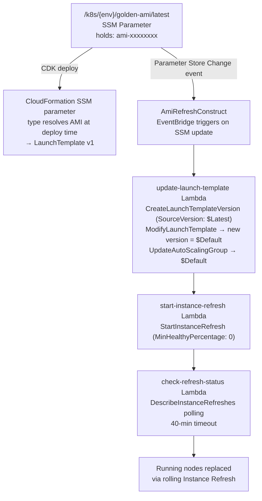
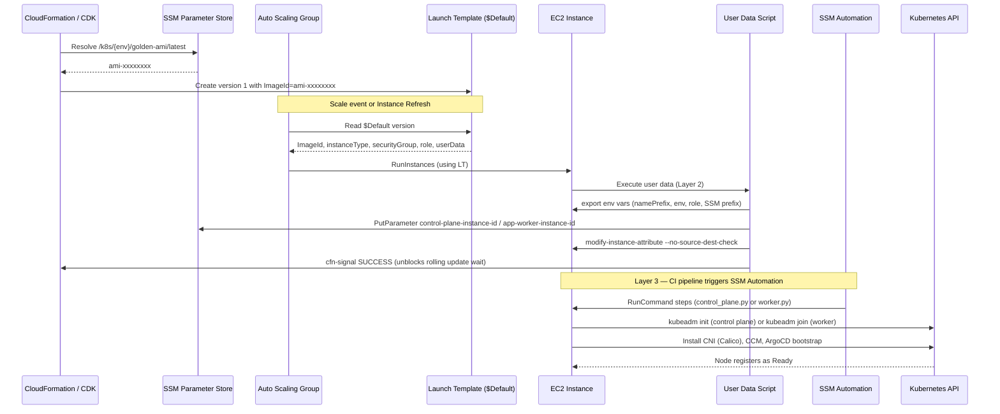

## Overview

Every Kubernetes node in this platform — control plane, general workers, and
monitoring workers — is launched from an EC2 Launch Template provisioned by
`LaunchTemplateConstruct`
(`infra/lib/constructs/compute/constructs/launch-template.ts`). The Launch
Template is the immutable blueprint for what a node looks like at boot: which
Golden AMI it uses, what EBS volumes it carries, which IAM role it assumes, what
user data it runs, and what security posture (IMDSv2, source/dest check disable)
it has. The ASG is the scaling policy and replacement controller that references
the blueprint.

## Why a Launch Template and not a plain EC2 instance

A plain `AWS::EC2::Instance` resource cannot back an Auto Scaling Group, and
without an ASG there is no automatic replacement when a node terminates. More
importantly, the Golden AMI workflow depends on EC2 Launch Template **versioning**
— the `AmiRefreshConstruct` Step Functions pipeline creates new LT versions
(`CreateLaunchTemplateVersion`) rather than modifying the CDK stack. This means:

1. AMI IDs can change without a CDK redeploy or CloudFormation change set.
2. The previous LT version is preserved as a rollback point — the ASG can be
   manually pointed at `$Latest - 1` if a new AMI proves bad.
3. An Instance Refresh (`StartInstanceRefresh`) replaces all running nodes
   with the new version in a controlled rolling operation.

All three properties require a Launch Template. A plain `LaunchConfiguration`
(deprecated) or inline ASG configuration does not support versioning and would
require a full ASG replacement to change the AMI.

## LaunchTemplateConstruct responsibilities

The construct is a pure blueprint — it never provisions Security Groups or ASG
policies. Its sole responsibility is the node's identity:

| Property | Value | Source |
|:---------|:------|:-------|
| AMI | CloudFormation SSM parameter type resolving `/k8s/{env}/golden-ami/latest` | `configurations.ts` `amiSsmPath` field |
| Instance type | Passed as `props.instanceType` by the calling stack | `worker-asg-stack.ts:157`, `control-plane-stack.ts:172` |
| Security group | Passed as `props.securityGroup` | Same |
| IAM role | Created internally; policies added by calling stacks | `launch-template.ts:103-150` |
| EBS (root) | 30 GB GP3, encrypted, 3000 IOPS, 125 MiB/s, `deleteOnTermination: true` | `launch-template.ts:172-195` |
| EBS (data) | Optional `/dev/xvdf`; control plane uses it for etcd | `launch-template.ts:196-214` |
| IMDSv2 | `requireImdsv2: true` | `launch-template.ts:230` |
| User data | Built by `UserDataBuilder` | `launch-template.ts:250-290` |
| Log group | `/ec2/{namePrefix}/instances`, pre-created, env-tiered retention | `launch-template.ts:155-170` |

### Concrete name — not a CDK token

The construct exposes `concreteTemplateName: string` built as a plain TypeScript
string (`${namePrefix}-lt`) at synth time
(`launch-template.ts:290`). This is intentional. CDK's
`launchTemplate.launchTemplateId` and `launchTemplate.launchTemplateName` both
resolve to CloudFormation `Ref` tokens, not the physical name. Passing a token
across stack boundaries via SSM would force `Fn::ImportValue`, which creates a
circular dependency when `AmiRefreshStack` depends on both the worker ASG stack
and the control plane stack. By building the name as a concrete string, all stacks
and the AMI refresh Lambda can reference it without cross-stack exports.

The same pattern is used in `AutoScalingGroupConstruct` for `concreteAsgName`.

### IMDSv2 enforcement

`requireImdsv2: true` (`launch-template.ts:230`) ensures all token requests
to the EC2 metadata endpoint use a session-oriented PUT/GET flow instead of the
legacy single-step GET. This prevents SSRF-based metadata credential theft, where
a pod running on the node could proxy a request to `169.254.169.254` and
exfiltrate the node's IAM credentials.

### Source/destination check disable

Calico, the CNI overlay, routes pod traffic via the node as a packet forwarder.
EC2 drops forwarded packets by default unless `SourceDestCheck` is `false`.
`AWS::EC2::LaunchTemplate` does not expose this property — only
`AWS::EC2::Instance` and the `ModifyInstanceAttribute` API support it. This
constraint is worked around by prepending a user data script that calls
`ec2:ModifyInstanceAttribute` on boot using IMDSv2 to resolve the instance ID:

```bash
INSTANCE_ID=$(curl -s -H "X-aws-ec2-metadata-token: $TOKEN" \
  http://169.254.169.254/latest/meta-data/instance-id)
aws ec2 modify-instance-attribute \
  --instance-id "$INSTANCE_ID" \
  --no-source-dest-check \
  --region "$AWS_REGION"
```

The instance role carries `ec2:ModifyInstanceAttribute` to allow this
(`launch-template.ts:135-145`).

## Relationship: Launch Template ↔ ASG

The ASG does not configure what a node looks like — it configures when and how
many nodes should exist. `AutoScalingGroupConstruct` receives the
`LaunchTemplateConstruct` as a dependency and reads `concreteTemplateName` to
point the underlying `AutoScalingGroup` CDK construct at the right blueprint:

```text
AutoScalingGroupConstruct
  └── props.launchTemplate: LaunchTemplateConstruct
       └── concreteTemplateName → "k8s-dev-general-lt"
```

When the ASG launches a replacement node (scale-up, instance termination, or
Instance Refresh), it fetches the LT version currently set as `$Default`.
`$Default` is the version pointer the `AmiRefreshConstruct` updates when a new
AMI is staged — so no CDK or CloudFormation change is needed for the ASG to
start using a new AMI.

## Relationship: Launch Template ↔ AMI



### Day-1 — CDK deploy

At CDK synth time, `configurations.ts` sets `amiSsmPath: '/k8s/{env}/golden-ami/latest'`
per environment. The CDK `MachineImage.fromSsmParameter()` call translates this
into a `resolve:ssm:/k8s/{env}/golden-ami/latest` dynamic reference inside the
CloudFormation template. CloudFormation resolves the reference at deploy time,
writing the concrete AMI ID into LT version 1. This is the only time CDK touches
the AMI ID directly.

### Day-2+ — AMI refresh without CDK

When CI publishes a new Golden AMI, it updates the SSM parameter. EventBridge
fires the AMI refresh SFN. The `update-launch-template` Lambda creates a new LT
version via `CreateLaunchTemplateVersionCommand` with `SourceVersion: '$Latest'`
and the new `ImageId`. It then calls `ModifyLaunchTemplateCommand` to set the
new version as `$Default`, and `UpdateAutoScalingGroupCommand` to point the ASG
at `$Default`. The old version remains in the version history as a rollback point.

The AMI ID inside the CDK template is now stale (it still reflects the value at
the last CDK deploy), but the LT `$Default` on AWS is always current. CDK
redeploys are non-destructive in this case — CloudFormation re-resolves the SSM
parameter at the next deploy and overwrites only if the template has changed.

## Problems solved by the Launch Template pattern

| Problem | Solved by |
|:--------|:----------|
| ASG cannot launch nodes without a blueprint | LT provides the blueprint |
| AMI updates would require CDK redeploy | LT versioning + AmiRefreshConstruct |
| CDK tokens create cross-stack circular deps | `concreteTemplateName` concrete string |
| EC2 metadata SSRF risk | `requireImdsv2: true` |
| Calico CNI needs source/dest check disabled | User data + `ec2:ModifyInstanceAttribute` |
| Log group pre-existence prevents CF conflicts | LT pre-creates log group before Lambda |
| Control plane etcd needs a separate disk | Optional `/dev/xvdf` in LT |
| IAM policies differ across node pools | Policies added by calling stack, not LT |
| ASG should not reset CA scaling decisions | `desiredCapacity` omitted (CDK #5215) |

## Node launch workflow

This is the complete sequence from LT version selection to a node joining the
Kubernetes cluster:



### Layer 1 — Golden AMI (pre-baked)

The AMI already contains all Kubernetes binaries (`kubelet`, `kubeadm`, `kubectl`,
`containerd`, CNI plugins) at the exact versions required by the cluster.
No `apt install` or `yum install` runs at boot — this removes network dependency
from the boot path and guarantees deterministic node startup time.

### Layer 2 — User data (per-boot configuration)

User data is built by `UserDataBuilder`
(`infra/lib/constructs/compute/builders/user-data-builder.ts`) and runs as the
first process on the instance. It does not install software — it configures
instance identity:

1. Exports environment variables (`NAME_PREFIX`, `ENVIRONMENT`, `K8S_ROLE`,
   `SSM_PREFIX`) so SSM Automation steps can discover their context.
2. Publishes the instance ID to SSM:
   `/k8s/{env}/bootstrap/control-plane-instance-id` or
   `/k8s/{env}/bootstrap/app-worker-instance-id`.
3. Disables source/destination check via `ec2:ModifyInstanceAttribute`.
4. Sends a CloudFormation `cfn-signal SUCCESS`, which unblocks the ASG's rolling
   update `WaitOnResourceSignals` (`AutoScalingGroupConstruct:192-198`).

The `/usr/bin/sh` symlink is patched if missing — required for SSM Agent on
Amazon Linux 2023 (`user-data-builder.ts:142`).

### Layer 3 — SSM Automation (Kubernetes bootstrap)

SSM Automation is triggered by the CI pipeline (`_deploy-ssm-automation.yml`)
after verifying that the instance ID SSM parameters from Layer 2 are present.
Control plane runs first:

- `control_plane.py` — `kubeadm init`, generates `kubeconfig`, installs Calico
  CNI and Cloud Controller Manager.

Workers run after control plane is healthy:

- `worker.py` — `kubeadm join`, installs node-local components via ArgoCD
  bootstrap.

SSM Automation reads bootstrap scripts from S3 (synced by CI at pipeline start),
not from the AMI — this allows script updates without rebuilding the AMI.

## Control plane specific configuration

The control plane LT has one additional property not present on worker LTs: a
second EBS volume `/dev/xvdf` for etcd data. This is conditionally added when
`props.dataVolumeSizeGb` is set, which `ControlPlaneStack` always provides from
`configs.storage.volumeSizeGb` (`control-plane-stack.ts:196-214`). Keeping etcd
on a separate volume allows the root volume to be replaced independently on an
AMI refresh without risk to cluster state stored in etcd.

## IAM role architecture

`LaunchTemplateConstruct` creates the EC2 instance role and attaches
`AmazonSSMManagedInstanceCore` + CloudWatch agent policies internally. It
exposes the role as `props.instanceRole` after creation so calling stacks can
attach additional policies. All Kubernetes-specific policies (S3 script access,
ECR pull, secretsmanager read, ASG `SetDesiredCapacity` for Cluster Autoscaler)
are added by `WorkerAsgStack` and `ControlPlaneStack` — not by the construct.
This keeps the construct reusable without encoding cluster-specific permissions.

## Tradeoffs

**AMI ID drift between CDK template and live state** — After the first AMI
refresh, the CDK template's resolved AMI ID is stale relative to the live LT
`$Default`. This is intentional and safe: CloudFormation re-resolves the SSM
parameter on the next CDK deploy and writes the current AMI into whatever version
it creates. The gap is observable via `aws ec2 describe-launch-template-versions`
but does not cause functional issues.

**Concrete names break CloudFormation physical ID randomness** — CDK normally
generates unique physical resource names to prevent collisions on stack
recreate. Setting explicit names (`${namePrefix}-lt`) means a destroy + redeploy
requires a delay while CloudFormation releases the name. In practice, a destroy
of a Kubernetes cluster stack is a planned operation, not an accident.

**User data script runs on every boot** — The env var export, SSM parameter
publish, and cfn-signal run every time an instance boots, not only on first boot.
The SSM PutParameter calls are idempotent (`overwrite: true`). The cfn-signal is
harmless if no CloudFormation `WaitCondition` is waiting. No side effects.

## Related concepts

- [ASG Configuration](asg-configuration.md)
- [Self-Healing + SSM Integration](self-healing-ssm-integration.md)
- [CloudWatch Logs Strategy](cloudwatch-logs-strategy.md)
- [Security Group Configuration](security-group-configuration.md)
- [ADR-002: SSM over CloudFormation Exports](../adrs/0002-ssm-over-cloudformation-exports.md)

<!--
Evidence trail (auto-generated):
- Source: infra/lib/constructs/compute/constructs/launch-template.ts (read on 2026-04-28)
- Source: infra/lib/constructs/compute/constructs/auto-scaling-group.ts (read on 2026-04-28)
- Source: infra/lib/constructs/compute/builders/user-data-builder.ts (read on 2026-04-28)
- Source: infra/lib/stacks/kubernetes/worker-asg-stack.ts (read on 2026-04-28)
- Source: infra/lib/stacks/kubernetes/control-plane-stack.ts:130-265 (read on 2026-04-28)
- Source: infra/lib/constructs/events/ami-refresh/ami-refresh-construct.ts (read on 2026-04-28)
- Source: infra/lib/constructs/events/ami-refresh/handlers/update-launch-template.ts (read on 2026-04-28)
- Source: infra/lib/constructs/events/ami-refresh/handlers/start-instance-refresh.ts (read on 2026-04-28)
- Source: infra/lib/constructs/events/ami-refresh/handlers/check-refresh-status.ts (read on 2026-04-28)
- Source: infra/lib/config/kubernetes/configurations.ts (grep on 2026-04-28)
-->
