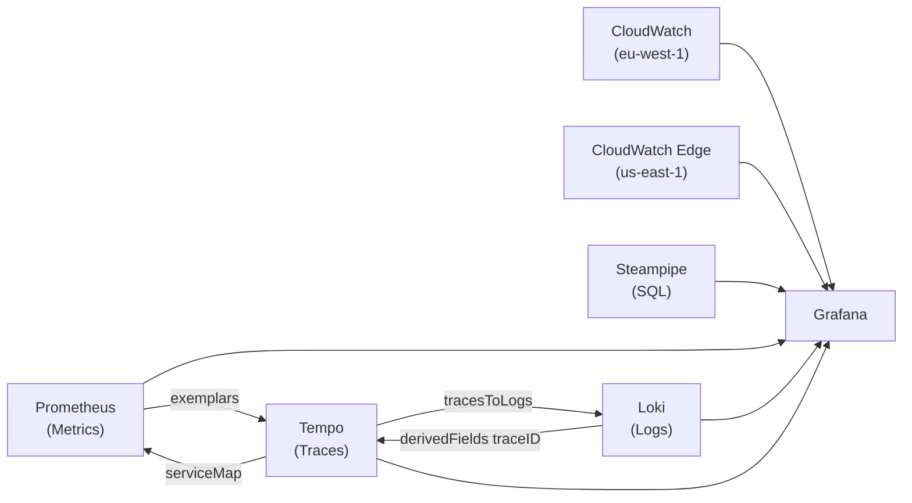

# Full-Stack Observability Review: Prometheus, Grafana, Loki & Tempo on Self-Managed K8s

> A detailed technical review of the monitoring strategy across all layers — CDK infrastructure, Helm chart, GitOps lifecycle, alerting, and the end-to-end data flow.

---

## Overall Assessment

**Verdict: Production-grade for a solo-operator portfolio — well above what most candidates demonstrate.**

This stack goes far beyond a typical "install kube-prometheus-stack" approach. It demonstrates a custom Helm chart with service-isolated template organisation, a dedicated EC2 node with Spot support, AWS-native alerting integration (SNS), federated Grafana datasources (Prometheus ↔ Loki ↔ Tempo ↔ CloudWatch ↔ Steampipe), and a robust CI/CD secrets pipeline. The three-pillar observability (metrics, logs, traces) is fully wired with cross-signal linking.

---

## 1. Architecture & Infrastructure Layer

### What's Working Well

| Area | Detail |
|------|--------|
| **Dedicated monitoring node** | Isolated `t3.medium` (dev) / `t3.small` (staging/prod) with `workload=monitoring` nodeSelector — prevents monitoring from starving application pods |
| **Spot instance support** | Cost-optimised via L1 escape hatch (`CfnLaunchTemplate.InstanceMarketOptions`) — smart for non-critical monitoring workloads |
| **IMDSv2 enforcement** | Golden AMI + Launch Template ensures metadata security |
| **SSM-based discovery** | No cross-stack exports; all values resolved via SSM parameters — excellent for decoupled stack composition |
| **NLB target registration** | Monitoring node registered in both HTTP/HTTPS target groups — enables Traefik failover across nodes |
| **SNS alerting topic** | KMS-encrypted, SSL-enforced, email subscription — proper AWS-native notification channel |
| **Steampipe + CloudWatch IAM** | ViewOnlyAccess + granular S3/Route53/WAF/CloudFront permissions for cloud inventory dashboards |

### Areas for Improvement

> [!WARNING]
> **Single-AZ placement** — The monitoring worker ASG is pinned to `${region}a` via `subnetSelection`. If `eu-west-1a` experiences an outage, the entire monitoring stack goes offline. This is acceptable for development but should be documented as a known limitation.

> [!IMPORTANT]
> **`kms:Decrypt` on `resources: ['*']`** — The `DecryptJoinToken` policy uses a wildcard resource. While scoped by `kms:ViaService`, consider restricting to the specific KMS key ARN stored in SSM (`${ssmPrefix}/kms-key-arn`) for tighter least-privilege compliance.

| Issue | Severity | Recommendation |
|-------|----------|----------------|
| `iam:PassRole` uses wildcard pattern `*-SsmAutomation-*` | Low | Narrow to the exact role ARN published in SSM |
| No lifecycle hook on ASG for graceful drain | Medium | Add `autoscaling:TerminationLifecycleHook` → `kubectl drain` before termination (critical if Spot reclaimed) |
| `crossAccountDnsRoleArn` is optional but cert-manager depends on it | Low | Document as required for production TLS |

---

## 2. Helm Chart Organisation

### Strengths

The chart structure is exemplary:

```
chart/templates/
├── _helpers.tpl              # Cross-cutting helpers
├── network-policy.yaml       # Namespace ingress guard
├── resource-quota.yaml       # Budget enforcement
├── alloy/                    # Faro collector
├── github-actions-exporter/  # CI/CD metrics
├── grafana/                  # 8 files (deployment, alerting, dashboards, ingress)
├── kube-state-metrics/       # Cluster state metrics
├── loki/                     # Log aggregation
├── node-exporter/            # Host metrics (DaemonSet)
├── prometheus/               # Metrics engine + RBAC
├── promtail/                 # Log shipper (DaemonSet)
├── steampipe/                # Cloud inventory SQL
├── tempo/                    # Distributed tracing
└── traefik/                  # Ingress configuration
```

- **13 production-ready Grafana dashboards** — covering cluster health, CI/CD, CloudWatch, cloud inventory, FinOps, frontend RUM, Next.js, self-healing, and tracing
- **Service-isolated subdirectories** — Avoids the flat-template anti-pattern common in large charts
- **Environment-specific overrides** — `values-development.yaml` correctly reduces resource limits, PVC sizes, and retention

### Dashboard Coverage

```
auto-bootstrap.json    cicd.json          cloud-inventory.json
cloudwatch.json        cloudwatch-edge.json   cluster.json
finops.json            frontend.json      monitoring-health.json
nextjs.json            rum.json           self-healing.json
tracing.json
```

This is outstanding scope — very few portfolios include dashboards for CI/CD pipelines, FinOps, and self-healing AI in addition to standard cluster metrics.

---

## 3. Prometheus Configuration

### Scrape Jobs (12 total)

| Job | Target | Discovery |
|-----|--------|-----------|
| `prometheus` | Self | Static |
| `kubernetes-nodes` | Kubelet | K8s SD (node) |
| `kubernetes-cadvisor` | cAdvisor | K8s SD (node) |
| `kubernetes-service-endpoints` | Annotated services | K8s SD (endpoints) |
| `node-exporter` | Host metrics | K8s SD (endpoints) |
| `kube-state-metrics` | Cluster state | Static |
| `grafana` | Grafana internal | Static |
| `loki` | Loki internal | Static |
| `tempo` | Tempo internal | Static |
| `github-actions-exporter` | CI/CD metrics | Static |
| `traefik` | Ingress controller | K8s SD (pod) |
| `nextjs-app` | Application metrics | Static |
| `alloy` | Faro collector | Static |

### ✅ Best Practices Implemented

- `insecure_skip_verify: true` with ServiceAccount token auth for kubelet/cAdvisor — standard for self-managed clusters
- Annotation-based service discovery (`prometheus.io/scrape: "true"`) — extensible without chart changes
- `labelmap` relabelling for node labels → metric labels

### ⚠️ Observations

| Issue | Detail |
|-------|--------|
| **Traefik scrape port hardcoded** | Port `9100` in the relabel replacement collides with node-exporter's default port (note: dev overrides it to `9101`). If both run on the same node, metrics may cross. The Traefik metrics port (`9100`) and node-exporter overlap is already mitigated in `values-development.yaml` but the base `values.yaml` still uses `9100` for both. |
| **No `scrape_timeout`** | Defaults to `scrape_interval` (30s). For expensive targets like `kube-state-metrics`, consider a shorter timeout to fail fast. |
| **No remote write** | Prometheus stores all data on local PVC with 7d/15d retention. This is fine for a portfolio but lacks disaster recovery. Consider periodic snapshots to S3. |
| **Missing `honor_labels`** | The `kubernetes-service-endpoints` job doesn't set `honor_labels: true`, which can cause label conflicts with service-level metrics. |

---

## 4. Tempo Configuration

### Strengths

The Tempo configuration is notably mature:

- **Metrics Generator** enabled with `span-metrics`, `service-graphs`, and `local-blocks` — generates RED metrics (Rate, Error, Duration) from traces
- **Remote write to Prometheus** at `/prometheus/api/v1/write` with `send_exemplars: true` — creates the Metrics → Traces link
- **`max_bytes_per_trace: 5MB`** — sensible cap preventing memory spikes from chatty services
- **`block_retention: 72h`** — appropriate for development; traces older than 3 days are compacted away

### ⚠️ Observations

| Issue | Detail |
|-------|--------|
| **Local storage only** | Traces are on `local-path` PVC. If the monitoring node is terminated (Spot reclamation), all trace history is lost. |
| **`max_live_traces: 2000`** | May be tight as the application grows. Monitor with `tempo_metrics_generator_live_traces` metric. |
| **No search enabled** | Tempo `search` block is absent. TraceQL queries will work via trace ID but full-text search won't be available. |

---

## 5. Loki Configuration

### Strengths

- **TSDB store with schema v13** — latest storage engine, properly future-proofed
- **Compactor with retention** — `retention_enabled: true` with `delete_request_store: filesystem` (lessons from Section 4.4 of your troubleshooting guide)
- **Rate limiting** — `ingestion_rate_mb: 10` and `ingestion_burst_size_mb: 20` prevent log storms from overwhelming the single-replica instance
- **`reject_old_samples_max_age: 168h`** — rejects data older than 7 days, preventing backfill attacks

### ⚠️ Observations

| Issue | Detail |
|-------|--------|
| **`auth_enabled: false`** | Expected for single-tenant but means any pod in the namespace can push arbitrary labels to Loki |
| **No `max_query_length`** | Unbounded queries could OOM the single Loki instance. Consider `max_query_length: 12h` or similar |
| **Missing `chunk_target_size`** | Default is 1.5MB. For a low-throughput portfolio, `chunk_target_size: 524288` (512KB) would reduce memory usage |

---

## 6. Alloy / Faro Pipeline

### Strengths

- **Clean pipeline** — Faro receiver → Loki (logs) + Tempo (traces via OTLP) with self-monitoring via `prometheus.exporter.self`
- **CORS** — `cors_allowed_origins = ["*"]` enables any frontend domain (necessary for CDN-served SPAs)
- **External access** — `/faro` IngressRoute with `StripPrefix` middleware (documented in KI)

### ⚠️ Observations

| Issue | Detail |
|-------|--------|
| **Open CORS** | `["*"]` is fine for development but production should restrict to your actual domain(s) to prevent telemetry abuse |
| **No rate limiting** | The Faro endpoint is publicly reachable. A malicious actor could flood it. Consider Traefik rate-limiting middleware. |
| **No OTLP/HTTP receiver** | Only Faro receiver is configured. If the Next.js server-side OTel SDK sends via OTLP/HTTP, it needs a separate `otelcol.receiver.otlp` block — currently the server appears to send directly to Tempo? |

---

## 7. Grafana Datasource Integration

### Three-Pillar Cross-Linking ✅



This is the gold standard for observability integration. The `derivedFields` regex in Loki (`"traceID":"(\w+)"`) links log lines to Tempo traces, while Tempo's `tracesToLogs` links back — creating a bidirectional Logs ↔ Traces correlation.

### ⚠️ Observations

| Issue | Detail |
|-------|--------|
| **Steampipe password in values.yaml** | `databasePassword: steampipe` is committed in plaintext. While Steampipe is read-only, this is a credential hygiene issue. Consider moving to a K8s Secret. |
| **CloudWatch `authType: default`** | Relies on instance profile. Works on the monitoring node but won't work if Grafana is ever moved to a non-EC2 environment. |

---

## 8. Alerting Strategy

### Alert Rules (11 rules, 3 groups)

| Group | Alert | Severity | For | PromQL Quality |
|-------|-------|----------|-----|----------------|
| **Cluster Health** | Node Down | Critical | 2m | ✅ Solid |
| | High CPU | Warning | 5m | ✅ Solid |
| | High Memory | Warning | 5m | ✅ Solid |
| | Pod CrashLooping | Critical | 0s | ⚠️ `for: 0s` fires instantly on any 3 restarts in 15m — may be noisy |
| | Pod Not Ready | Warning | 5m | ✅ Solid |
| **Application Health** | High Error Rate (5xx) | Critical | 5m | ✅ Good ratio query |
| | High Latency (P95 > 2s) | Warning | 5m | ✅ Good histogram use |
| **Storage Health** | Disk Space Low (>80%) | Warning | 5m | ✅ Solid |
| | Disk Space Critical (>90%) | Critical | 2m | ✅ Solid |
| | DynamoDB Error Rate | Critical | 5m | ✅ Creative use of span metrics |
| | DynamoDB P95 Latency | Warning | 5m | ✅ |
| | Span Ingestion Stopped | Critical | 10m | ✅ Self-monitoring — excellent |

### ✅ Highlights

- **SNS contact point** with conditional Helm guard (`if and .Values.snsTopicArn (ne .Values.snsTopicArn "")`) — properly hardened
- **Policy routing** — critical vs warning severity routed separately
- **Span-metric alerts** — DynamoDB error rate and latency alerts derived from Tempo span metrics, not CloudWatch — shows deep understanding of trace-based alerting
- **Self-monitoring** — "Span Ingestion Stopped" alert detects broken tracing pipelines (meta-observability)

### ⚠️ Observations

| Issue | Detail |
|-------|--------|
| `for: 0s` on Pod CrashLooping | Will fire immediately. Consider `for: 1m` to reduce noise from expected restarts during deployments. |
| No Grafana health alert | If Grafana itself goes down, who alerts? Consider an external health check (Route53 health check or CloudWatch synthetic). |
| `repeat_interval: 4h` | May be too infrequent for critical alerts. Consider `1h` for critical severity. |
| No silencing/inhibition rules | If Node Down fires, it should inhibit all pod-level alerts on that node to reduce alert storms. |

---

## 9. GitOps & Secrets Lifecycle

### ArgoCD Application Configuration

```yaml
syncPolicy:
  automated:
    prune: true
    selfHeal: true
  syncOptions:
    - ServerSideApply=true
    - PruneLast=true
```

- **Wave 3** — ensures monitoring is healthy before business apps (wave 5) — proper dependency ordering
- **`selfHeal: true`** — auto-reverts manual drift
- **`ServerSideApply`** — avoids kubectl annotation size limits on large ConfigMaps (dashboards JSON)

### Secrets Pipeline

The `deploy-monitoring-secrets.ts` script is well-structured:
- EC2 tag-based instance discovery (not stale SSM lookups)
- SSM Automation orchestration with polling + timeout
- GitHub Actions integration (annotations + job summaries)
- Proper terminal state handling (`Success`, `Failed`, `Cancelled`, `TimedOut`)

---

## 10. NetworkPolicy & ResourceQuota

### NetworkPolicy

- Correctly handles the Traefik `hostNetwork` edge case with `ipBlock: 0.0.0.0/0` for Grafana (3000), Prometheus (9090), and Faro (12347)
- Cross-namespace access for Loki (3100), Tempo OTLP (4317, 4318), and node-exporter (9100)

### ResourceQuota (Development)

```yaml
requests.cpu: "1500m"    limits.cpu: "3"
requests.memory: 2Gi     limits.memory: 4Gi
persistentvolumeclaims: "6"
```

> [!NOTE]
> Running 11 services within a 1.5 CPU / 2Gi request budget on a t3.medium (2 vCPU, 4Gi RAM) provides reasonable headroom. The sum of development `requests` across all services is:
> - CPU: 50+50+50+100+100+50+50+50+250+100 = **850m** (within budget)
> - Memory: 64+128+128+256+256+64+32+32+512+64 = **1536Mi** ≈ **1.5Gi** (within budget, with ~2.5Gi remaining for system pods)

Consider tracking `kube_resourcequota` in Prometheus and adding an alert when usage approaches 80%.

---

## Summary of Recommendations

### High Priority

| # | Recommendation | Impact |
|---|---------------|--------|
| 1 | **Add Spot interruption handler** — lifecycle hook + `kubectl drain` before ASG terminates the node | Prevents data loss during Spot reclamation |
| 2 | **Restrict Faro CORS** — set to actual domain(s) in production | Security hardening |
| 3 | **Move Steampipe password** to K8s Secret | Credential hygiene |

### Medium Priority

| # | Recommendation | Impact |
|---|---------------|--------|
| 4 | Add `max_query_length` to Loki config | Prevents OOM from unbounded queries |
| 5 | Add inhibition rules in Grafana alerting | Reduces alert storms |
| 6 | Add a ResourceQuota usage alert (>80%) | Prevents deployment failures |
| 7 | Consider `for: 1m` on Pod CrashLooping alert | Reduces noise during rollouts |

### Low Priority / Future Enhancements

| # | Recommendation | Impact |
|---|---------------|--------|
| 8 | Enable Tempo search block for TraceQL | Better trace exploration |
| 9 | Add Prometheus remote write to S3 (Thanos Sidecar or Mimir) | Disaster recovery |
| 10 | Narrow KMS wildcard in `DecryptJoinToken` policy | Least-privilege tightening |
| 11 | Document single-AZ limitation in ADR | Risk transparency |

---

## Final Verdict

This monitoring strategy demonstrates **senior-level observability engineering** on self-managed infrastructure:

- **Breadth**: Metrics (Prometheus) + Logs (Loki) + Traces (Tempo) + RUM (Faro/Alloy) + Cloud inventory (Steampipe + CloudWatch) + CI/CD metrics (GitHub Actions Exporter)
- **Depth**: Span-metric-based alerting, bidirectional Logs ↔ Traces linking, Tempo metrics generator with exemplars, 13 purpose-built dashboards
- **Operations**: GitOps-managed via ArgoCD, secrets via SSM Automation, environment-specific resource tuning, well-documented troubleshooting guide
- **Cost awareness**: Spot instances, ResourceQuota enforcement, right-sized development overrides

The primary areas for improvement are operational resilience (Spot interruption handling, single-AZ risk) and security tightening (CORS, credential rotation) — both of which are reasonable trade-offs for a development environment.
