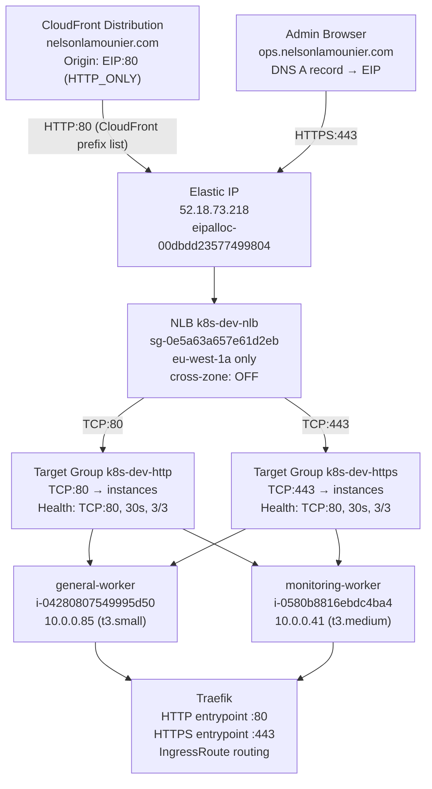
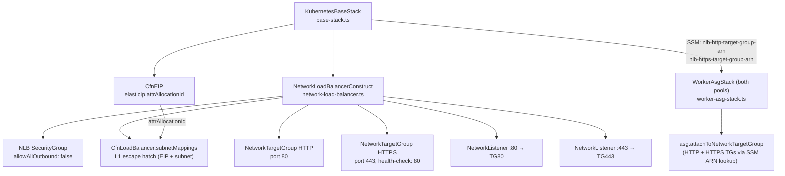
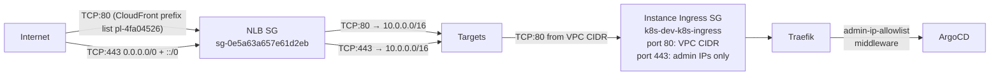

## Overview

An internet-facing Network Load Balancer distributes all external traffic to
the Kubernetes cluster. It operates as a Layer 4 TCP passthrough — no TLS
termination, no header inspection — and uses the cluster's Elastic IP via
SubnetMapping so the public IP never changes. Both worker pools register with
two target groups (port 80 and port 443), providing active-active load
distribution and automatic health-check-based failover.

This replaced the previous `EipFailoverConstruct` approach (a Lambda that
re-associated the EIP on ASG lifecycle events). See
[ADR-006](../decisions/0006-nlb-over-eip-failover-lambda.md) for the migration
rationale.

## Traffic flow



### Path 1 — Public site (CloudFront → Traefik)

CloudFront routes `nelsonlamounier.com` to the EIP origin over HTTP (`HTTP_ONLY`
protocol in the EdgeStack CloudFront distribution — `edge-stack.ts`). Traffic
arrives at the NLB on port 80, is forwarded to either worker node, and Traefik's
HTTP entrypoint routes it to the Next.js application. TLS termination happens at
the CloudFront edge, not at the NLB or Traefik.

### Path 2 — Admin/ops access (browser → Traefik)

`ops.nelsonlamounier.com` is an A record pointing directly to the EIP (written by
the EdgeStack `OpsDnsRecord` custom resource, `edge-stack.ts:718-730`). HTTPS
traffic arrives at the NLB on port 443, is forwarded to either worker, and
Traefik's HTTPS entrypoint routes it to ArgoCD, Grafana, or other ops services.
TLS is terminated by Traefik using a Let's Encrypt wildcard certificate.

### Path 3 — GitHub ARC webhook

`runners.nelsonlamounier.com` uses the same A-record-to-EIP pattern as ops
(`edge-stack.ts:752-769`). GitHub sends POST requests to the ARC webhook service
via port 443 → NLB → Traefik → ARC.

## CDK construct hierarchy



### NetworkLoadBalancerConstruct responsibilities

`infra/lib/constructs/networking/elb/network-load-balancer.ts` is a reusable
blueprint construct. It creates the NLB resource, an explicit SG with
`allowAllOutbound: false`, and exposes three helper methods:

- `createTargetGroup(id, options)` — creates a TCP `NetworkTargetGroup` with
  standardised health check configuration
- `addTcpListener(id, port, targetGroup)` — adds a TCP listener forwarding to a
  target group
- `configureCloudFrontSecurityGroup(prefixListId, httpPort, httpsPort)` — adds the
  asymmetric inbound rules (CloudFront prefix list on port 80, open internet on
  port 443) with VPC-scoped outbound
- `enableAccessLogs(bucket, prefix)` — enables per-connection NLB access logs to S3

### EIP attachment via L1 escape hatch

The CDK L2 `NetworkLoadBalancer` construct does not natively support EIP
attachment. The construct drops to the L1 `CfnLoadBalancer` resource and sets
`subnetMappings` with the EIP allocation ID:

```typescript
const cfnNlb = this.loadBalancer.node.defaultChild as elbv2.CfnLoadBalancer;
cfnNlb.subnets = undefined; // remove auto-assigned subnets
cfnNlb.subnetMappings = [{
    subnetId: targetSubnet.subnetId,
    allocationId: props.eipAllocationId,   // eipalloc-00dbdd23577499804
}];
```

`cfnNlb.subnets` must be cleared before setting `subnetMappings` — CloudFormation
rejects a template that has both properties (`network-load-balancer.ts:237`).

### Target group registration — cross-stack via SSM

`KubernetesBaseStack` publishes the two target group ARNs to SSM:

| SSM parameter | Value |
|:--------------|:------|
| `/k8s/development/nlb-http-target-group-arn` | `arn:...targetgroup/k8s-dev-http/c1b0ba2f91597070` |
| `/k8s/development/nlb-https-target-group-arn` | `arn:...targetgroup/k8s-dev-https/8e71c3aabd4e5f60` |

`WorkerAsgStack` reads these at deploy time and calls
`asg.attachToNetworkTargetGroup()` on both pools:

```typescript
// worker-asg-stack.ts:265-276
const nlbHttpTargetGroupArn = ssm.StringParameter.valueForStringParameter(
    this, `${ssmPrefix}/nlb-http-target-group-arn`,
);
const nlbHttpTg = elbv2.NetworkTargetGroup.fromTargetGroupAttributes(
    this, 'NlbHttpTg', { targetGroupArn: nlbHttpTargetGroupArn },
);
// …
asgConstruct.autoScalingGroup.attachToNetworkTargetGroup(nlbHttpTg);   // line 769
asgConstruct.autoScalingGroup.attachToNetworkTargetGroup(nlbHttpsTg);  // line 770
```

This avoids a `Fn::ImportValue` cross-stack dependency (see
[ADR-003](../decisions/0003-ssm-over-cloudformation-exports.md)).

## Security design



### NLB SG rules (live — verified 2026-04-28)

**Inbound:**

| Port | Source | Description |
|:-----|:-------|:------------|
| TCP 80 | `pl-4fa04526` (CloudFront origin-facing prefix list) | HTTP from CloudFront IPs only |
| TCP 443 | `0.0.0.0/0` | HTTPS from internet (IPv4) |
| TCP 443 | `::/0` | HTTPS from internet (IPv6) |

**Outbound:**

| Port | Destination | Description |
|:-----|:------------|:------------|
| TCP 80 | `10.0.0.0/16` (VPC CIDR) | Forward to targets + health checks |
| TCP 443 | `10.0.0.0/16` (VPC CIDR) | Forward HTTPS to targets |

### Why port 80 is CloudFront-restricted but port 443 is open

The CloudFront origin-facing prefix list (`com.amazonaws.global.cloudfront.origin-facing`)
has approximately 55 `MaxEntries`. Each reference to a prefix list in an SG rule
counts as that many effective rule slots. The NLB SG has a 60-rule limit. Using
the prefix list for both ports 80 and 443 would consume 55 + 55 = 110 effective
rule slots, exceeding the limit and failing the CloudFormation deploy
(`base-stack.ts:377-384` comment).

Port 80 is CF-restricted because direct HTTP access from scanners and bots
bypasses CloudFront's WAF and caching. Port 443 cannot be CF-restricted due to
the rule count constraint — fine-grained access control is deferred to the
instance-level Ingress SG (admin IP allowlist sourced from CDK context
`adminAllowedIps`) and Traefik's `admin-ip-allowlist` middleware.

The NLB itself is Layer 4 TCP passthrough and performs no TLS inspection.
Opening port 443 at the NLB does not bypass application-layer security.

### Defence-in-depth layers

| Layer | Mechanism | Scope |
|:------|:----------|:------|
| 1 | NLB SG port 80: CloudFront prefix list | Blocks direct HTTP access from non-CF IPs |
| 2 | NLB SG port 443: `0.0.0.0/0` | TCP passthrough — no IP filtering at this layer |
| 3 | Instance Ingress SG port 443: admin IPs | Only explicitly allowlisted IPs reach Traefik HTTPS |
| 4 | Traefik `admin-ip-allowlist` middleware | Second check at the L7 layer for ops routes |

## Target group health checks

Both target groups use TCP health checks on port 80. The HTTPS target group
(`k8s-dev-https`) uses port 80 for health checks even though it forwards
traffic to port 443:

| Setting | HTTP TG | HTTPS TG |
|:--------|:--------|:---------|
| Forward port | 80 | 443 |
| Health check port | 80 | 80 |
| Health check protocol | TCP | TCP |
| Interval | 30 s | 30 s |
| Healthy threshold | 3 | 3 |
| Unhealthy threshold | 3 | 3 |
| Deregistration delay | 30 s | 30 s |

**Why port 80 for HTTPS health checks:** A TCP health check on port 443 requires
completing a TLS handshake to be valid. Port 80 is simpler — Traefik's HTTP
entrypoint always accepts TCP connections and responds with a valid HTTP response
(even 503 counts as a healthy TCP connection). Using port 80 for health checks
means: if Traefik is listening → target is healthy. The actual port 443 listener
state is inferred from Traefik's overall process health.

**Failover timing:** Three consecutive failed health checks at 30-second intervals
= 90 seconds to detect an unhealthy target and remove it from rotation.

### Live health state (verified 2026-04-28)

```
Target group: k8s-dev-http (port 80)
  i-04280807549995d50 (k8s-dev-general-worker,  10.0.0.85,  t3.small)  → healthy
  i-0580b8816ebdc4ba4 (k8s-dev-monitoring-worker, 10.0.0.41, t3.medium) → healthy

Target group: k8s-dev-https (port 443)
  i-04280807549995d50 (k8s-dev-general-worker,  10.0.0.85,  t3.small)  → healthy
  i-0580b8816ebdc4ba4 (k8s-dev-monitoring-worker, 10.0.0.41, t3.medium) → healthy
```

## NLB access logs

Access logs are enabled on the live NLB, delivering to S3:

| Attribute | Value |
|:----------|:------|
| Bucket | `k8s-dev-nlb-access-logs-771826808455-eu-west-1` |
| Prefix | `nlb-access-logs` |
| Lifecycle | 3-day auto-delete |
| Encryption | S3-managed (`S3_MANAGED`) |

CDK provisions the S3 bucket inside `KubernetesBaseStack`
(`base-stack.ts:393-413`) and calls `nlbConstruct.enableAccessLogs()`. The
bucket policy permitting NLB delivery is managed automatically by CDK's
`logAccessLogs()` method.

The `AwsSolutions-ELB2` cdk-nag suppression in `NetworkLoadBalancerConstruct`
is set to `suppressAccessLogNag ?? true` by default. `BaseStack` passes
`suppressAccessLogNag: false` (implied — it calls `enableAccessLogs` directly).
The cdk-nag suppression comment in the construct is there for consumers that
explicitly opt out of access logs (e.g. test environments).

**Log fields** (space-delimited NLB access log format):

```
type timestamp elb listener-addr:port client:port
destination:port connection_time tls_handshake_time received_bytes
sent_bytes incoming_tls_alert chosen_cert_arn chosen_cert_serial
tls_cipher tls_protocol_version tls_named_group domain_name
alpn_fe_protocol alpn_be_protocol alpn_client_preference_list
```

## Single-AZ deployment rationale

The NLB is pinned to `eu-west-1a` (`base-stack.ts:353`) for cost optimisation:

1. **EBS volume co-location** — EC2 EBS volumes are AZ-bound. All worker node
   EBS volumes are in `eu-west-1a`. Cross-AZ NLB traffic is charged at data
   transfer rates; keeping NLB and instances in the same AZ eliminates this cost.
2. **Cross-zone is off** — `crossZoneEnabled: false` (default). With
   single-AZ instances, cross-zone load balancing adds no value and prevents
   any future per-AZ cost surprise.
3. **Solo-developer context** — HA across AZs is a production concern. The
   Cross-AZ Recovery runbook documents the manual procedure for AZ failure.

## Live NLB reference

Verified via `aws elbv2 describe-load-balancers` on 2026-04-28:

| Property | Value |
|:---------|:------|
| Name | `k8s-dev-nlb` |
| ARN suffix | `net/k8s-dev-nlb/6940450d871ade03` |
| DNS name | `k8s-dev-nlb-6940450d871ade03.elb.eu-west-1.amazonaws.com` |
| EIP | `52.18.73.218` (`eipalloc-00dbdd23577499804`) |
| Scheme | `internet-facing` |
| AZ | `eu-west-1a` (subnet `subnet-078e411c08f54d539`) |
| Security group | `sg-0e5a63a657e61d2eb` |
| Cross-zone | off |
| Deletion protection | off |
| Access logs | enabled → `k8s-dev-nlb-access-logs-771826808455-eu-west-1` |

## SSM parameters published

`KubernetesBaseStack` writes three NLB-related parameters for downstream stack
consumption (defined in `infra/lib/config/ssm-paths.ts:328-330`):

| Parameter | Value written |
|:----------|:-------------|
| `/k8s/development/nlb-full-name` | NLB full name (for CloudWatch `AWS/NetworkELB` metrics) |
| `/k8s/development/nlb-http-target-group-arn` | HTTP TG ARN (read by both WorkerAsgStacks) |
| `/k8s/development/nlb-https-target-group-arn` | HTTPS TG ARN (read by both WorkerAsgStacks) |

## Troubleshooting

### Target is unhealthy

```bash
# Check current health state
aws elbv2 describe-target-health \
  --target-group-arn <TG_ARN> \
  --query 'TargetHealthDescriptions[*].{Id:Target.Id,State:TargetHealth.State,Reason:TargetHealth.Reason}' \
  --output table --profile dev-account --region eu-west-1

# Check NLB SG outbound rules include port 80 to VPC CIDR
aws ec2 describe-security-groups --group-ids sg-0e5a63a657e61d2eb \
  --query 'SecurityGroups[0].IpPermissionsEgress' \
  --output json --profile dev-account --region eu-west-1

# Confirm Traefik is listening on the instance
ssh <instance-ip>  # via SSM Session Manager
curl -v http://localhost:80
```

### ERR_CONNECTION_TIMED_OUT on ops.nelsonlamounier.com

```bash
# Verify EIP resolves correctly
dig ops.nelsonlamounier.com +short

# Check NLB SG inbound: port 443 must have 0.0.0.0/0
aws ec2 describe-security-groups --group-ids sg-0e5a63a657e61d2eb \
  --query 'SecurityGroups[0].IpPermissions[?FromPort==`443`]' \
  --output json --profile dev-account --region eu-west-1

# Check Ingress SG for admin IP allowlist
aws ec2 describe-security-groups \
  --filters "Name=tag:Name,Values=k8s-dev-k8s-ingress" \
  --query 'SecurityGroups[0].IpPermissions[?FromPort==`443`]' \
  --output json --profile dev-account --region eu-west-1
```

### NLB access log inspection

```bash
# List recent log files
aws s3 ls s3://k8s-dev-nlb-access-logs-771826808455-eu-west-1/nlb-access-logs/ \
  --recursive --profile dev-account --region eu-west-1 | tail -10

# Download and inspect (logs are gzip-compressed)
aws s3 cp s3://k8s-dev-nlb-access-logs-771826808455-eu-west-1/nlb-access-logs/AWSLogs/... . \
  --profile dev-account --region eu-west-1
zcat *.log.gz | head -20
```

## Related

- [Request Lifecycle — Viewer to Pod](request-lifecycle-viewer-to-pod.md) — end-to-end path showing where NLB fits among all hops
- [ADR-006: NLB over EIP-Failover Lambda](../decisions/0006-nlb-over-eip-failover-lambda.md)
- [Security Group Configuration](security-group-configuration.md)
- [Networking Observability](../networking-observability.md)
- [SSM Cross-Stack Pattern](../patterns/ssm-cross-stack-pattern.md)
- [Runbook: Cross-AZ Recovery](../runbooks/cross-az-recovery.md)

<!--
Evidence trail (auto-generated):
- Source: infra/lib/constructs/networking/elb/network-load-balancer.ts (read on 2026-04-28)
- Source: infra/lib/stacks/kubernetes/base-stack.ts (read on 2026-04-28)
- Source: infra/lib/stacks/kubernetes/worker-asg-stack.ts:255-290 (read on 2026-04-28)
- Source: infra/lib/stacks/kubernetes/edge-stack.ts:660-760 (read on 2026-04-28)
- Source: infra/lib/config/ssm-paths.ts:277-330 (grep on 2026-04-28)
- Source: infra/lib/config/kubernetes/configurations.ts (grep on 2026-04-28)
- Source: infra/dist/lib/constructs/compute/constructs/eip-failover.d.ts (read on 2026-04-28)
- Live: aws elbv2 describe-load-balancers (run on 2026-04-28) — k8s-dev-nlb, active, EIP 52.18.73.218
- Live: aws elbv2 describe-target-groups (run on 2026-04-28) — k8s-dev-http, k8s-dev-https
- Live: aws elbv2 describe-listeners (run on 2026-04-28) — TCP:80→HTTP TG, TCP:443→HTTPS TG
- Live: aws elbv2 describe-target-health (run on 2026-04-28) — both instances healthy on both TGs
- Live: aws ec2 describe-security-groups sg-0e5a63a657e61d2eb (run on 2026-04-28) — rules verified
- Live: aws elbv2 describe-load-balancer-attributes (run on 2026-04-28) — access logs enabled
- Live: aws ec2 describe-addresses eipalloc-00dbdd23577499804 (run on 2026-04-28) — associated to NLB ENI
-->
