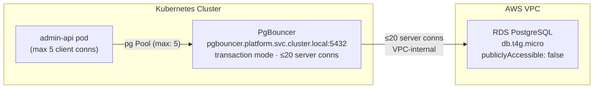

# Platform PostgreSQL + PgBouncer Architecture

## Overview

The Tucaken platform runs a single PostgreSQL instance on Amazon RDS, fronted by a PgBouncer connection pooler deployed inside the Kubernetes cluster. All application pods connect exclusively through PgBouncer — never directly to RDS.

The instance is `db.t4g.micro` running PostgreSQL (current CDK stack: `VER_18_2`) with `allowMajorVersionUpgrade: true`, enabling an in-place upgrade path to future major versions without stack replacement.

Sources: `infra/lib/stacks/kubernetes/platform-rds-stack.ts` lines 81–105.

## How it works

PgBouncer runs as a `Deployment` in the `platform` Kubernetes namespace and is reachable at the cluster-internal DNS name `pgbouncer.platform.svc.cluster.local:5432`. It operates in **transaction mode**, which is correct for stateless HTTP handlers that hold a connection only for the duration of a single database transaction.

The pooler maintains at most 20 server-side connections to RDS. Every application pod opens up to 5 client connections to PgBouncer, which are multiplexed into that shared server-side pool.



Sources: `infra/lib/stacks/kubernetes/platform-rds-stack.ts` header comment; `api/admin-api/src/lib/pg.ts` lines 13–27.

## Implementation in this codebase

### CDK stack — PlatformRdsStack

`infra/lib/stacks/kubernetes/platform-rds-stack.ts` provisions:

- A `db.t4g.micro` RDS instance in the `SharedVpc` PUBLIC subnets (`SubnetType.PUBLIC`). The SharedVpc has no private subnets (`natGateways: 0`), so PUBLIC placement with `publiclyAccessible: false` is the only viable option. The security group is the access boundary.
- A security group permitting TCP 5432 inbound from the VPC CIDR only (`ec2.Peer.ipv4(vpc.vpcCidrBlock)`), blocking all internet access.
- Auto-generated credentials stored in AWS Secrets Manager (`k8s-<env>/platform-rds/credentials`).
- Six SSM parameters under `/k8s/<env>/platform-rds/` (host, port, database, user, secret-arn, sg-id) consumed by pods via External Secrets Operator.
- Production: `deletionProtection: true`, `backupRetention: 7 days`. Non-production: both relaxed for easy teardown.

### Node.js pg client — lazy Pool singleton

`api/admin-api/src/lib/pg.ts` creates a single `Pool` instance on first call to `getPool()` and reuses it for the lifetime of the process:

```typescript
_pool = new Pool({
    host: config.pgHost,   // pgbouncer.platform.svc.cluster.local
    max:  5,               // client connections to PgBouncer
    idleTimeoutMillis:       30_000,
    connectionTimeoutMillis:  5_000,
    ssl: { rejectUnauthorized: false },
});
```

`max: 5` keeps the per-pod client footprint small. PgBouncer multiplexes these 5 connections across all concurrent requests in a single pod.

The PgBouncer host is supplied through `config.pgHost`, which is injected via the `PG_HOST` environment variable — populated from the ESO-synced `platform-rds-credentials` Secret at pod startup. Source: `api/admin-api/src/lib/config.ts` lines 130 and 179.

## Tradeoffs

**Why PgBouncer in transaction mode, not session mode?**

Session mode assigns a server connection for the full duration of a client session. HTTP handlers in admin-api are stateless — they open a connection, run a query, and release it immediately. Transaction mode reclaims the server connection as soon as the transaction commits, allowing far more client connections to share fewer server connections. The `db.t4g.micro` instance has a max_connections ceiling of approximately 85. Transaction mode keeps actual server connections well below that limit even as the number of pods scales.

**Why db.t4g.micro?**

The platform RDS instance is a cost-constrained portfolio deployment. At ≤20 server connections (enforced by PgBouncer) the instance is never connection-starved. The instance can be resized to `db.t4g.small` if PgBouncer were removed, but that would increase cost without architectural benefit.

**Why PUBLIC subnets with publiclyAccessible: false?**

The SharedVpc was provisioned with `natGateways: 0`, which means no private subnets exist. Placing RDS in PUBLIC subnets is unavoidable in this VPC design. `publiclyAccessible: false` (the RDS default for instances in public subnets when set explicitly) combined with the security group CIDR rule ensures the instance is unreachable from the internet. Source: `infra/lib/stacks/kubernetes/platform-rds-stack.ts` lines 75–95 and header comment.

## Related concepts

- [NLB Architecture](../adrs/nlb-architecture.md) — network boundary for the cluster
- [ADR-0002: SSM over CloudFormation Exports](../adrs/0002-ssm-over-cloudformation-exports.md) — why RDS parameters are published to SSM

<!-- evidence-trail
  platform-rds-stack.ts: lines 1–159 — full stack implementation read
  pg.ts: lines 1–33 — Pool singleton implementation read
  config.ts: lines 1–219 — pgHost/pgPort config fields confirmed at lines 130, 179
  2026-04-24-phase1-platform-rds.md: Pre-flight Gaps table — subnet type rationale
  ADR-0001 read to match document format
-->
