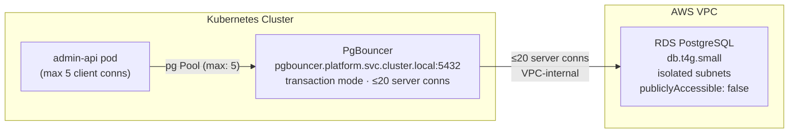

# Platform PostgreSQL + PgBouncer Architecture

## Overview

The Tucaken platform runs a single PostgreSQL instance on Amazon RDS, fronted by a PgBouncer connection pooler deployed inside the Kubernetes cluster. All application pods connect exclusively through PgBouncer — never directly to RDS.

The instance is `db.t4g.small` running PostgreSQL (current CDK stack: `VER_18_3`, matching the restored snapshot) with `allowMajorVersionUpgrade: true`, enabling an in-place upgrade path to future major versions without stack replacement.

Sources: `infra/lib/stacks/kubernetes/platform-rds-stack.ts` lines 81–105.

## How it works

PgBouncer runs as a `Deployment` in the `platform` Kubernetes namespace and is reachable at the cluster-internal DNS name `pgbouncer.platform.svc.cluster.local:5432`. It operates in **transaction mode**, which is correct for stateless HTTP handlers that hold a connection only for the duration of a single database transaction.

The pooler maintains at most 20 server-side connections to RDS. Every application pod opens up to 5 client connections to PgBouncer, which are multiplexed into that shared server-side pool.



Sources: `infra/lib/stacks/kubernetes/platform-rds-stack.ts` header comment; `api/admin-api/src/lib/pg.ts` lines 13–27.

## Implementation in this codebase

### CDK stack — PlatformRdsStack

`infra/lib/stacks/kubernetes/platform-rds-stack.ts` provisions:

- A `db.t4g.small` RDS instance in the `SharedVpc` isolated subnets (`SubnetType.PRIVATE_ISOLATED`) with `publiclyAccessible: false`.
- A database security group with no CIDR ingress. Approved source stacks add explicit SG-to-SG rules, such as the EKS cluster/workload SG rule in `EksClusterStack`.
- IAM database authentication enabled on the RDS instance. PgBouncer still uses the generated Secrets Manager credentials until a separate IAM-token connection rollout is implemented.
- Auto-generated credentials stored in AWS Secrets Manager (`k8s-<env>/platform-rds/credentials`).
- Six SSM parameters under `/k8s/<env>/platform-rds/` (host, port, database, user, secret-arn, sg-id) consumed by pods via External Secrets Operator.
- Production: `deletionProtection: true`, `backupRetention: 7 days`. Non-production: both relaxed for easy teardown.

### Node.js pg client — lazy Pool singleton

`api/admin-api/src/lib/pg.ts` creates a single `Pool` instance on first call to `getPool()` and reuses it for the lifetime of the process:

```typescript
_pool = new Pool({
    host: config.pgHost,   // pgbouncer.platform.svc.cluster.local
    max:  5,               // client connections to PgBouncer
    idleTimeoutMillis:       30_000,
    connectionTimeoutMillis:  5_000,
    ssl: { rejectUnauthorized: false },
});
```

`max: 5` keeps the per-pod client footprint small. PgBouncer multiplexes these 5 connections across all concurrent requests in a single pod.

The PgBouncer host is supplied through `config.pgHost`, which is injected via the `PG_HOST` environment variable — populated from the ESO-synced `platform-rds-credentials` Secret at pod startup. Source: `api/admin-api/src/lib/config.ts` lines 130 and 179.

## Deployment choreography

The RDS stack resolves the VPC from SSM (not `Vpc.fromLookup()`): `vpcId` via
`valueFromLookup` and the isolated subnet IDs via the deploy-time
`valueForStringParameter`. The rollout order is:

1. Deploy the shared VPC stack so the `Isolated` subnets exist and their IDs are
   published to `/shared/vpc/<env>/isolated-subnet-ids`.
2. Deploy the Platform RDS stack (resolves those SSM values at deploy time), then
   the EKS cluster stack. The EKS cluster stack depends on Platform RDS so the
   `/k8s/<env>/platform-rds/sg-id` SSM parameter exists before the narrow SG-to-SG
   ingress rule is created.

Moving the existing instance between subnets is a snapshot-and-restore, not an
in-place change — see
[Platform RDS — Networking, Isolated-Subnet Migration & PgBouncer](platform-rds-networking.md)
for the full migration, networking, protocol and cost detail.

## Tradeoffs

**Why PgBouncer in transaction mode, not session mode?**

Session mode assigns a server connection for the full duration of a client session. HTTP handlers in admin-api are stateless — they open a connection, run a query, and release it immediately. Transaction mode reclaims the server connection as soon as the transaction commits, allowing far more client connections to share fewer server connections. Transaction mode keeps actual server connections well below the RDS connection limit even as the number of pods scales.

**Why db.t4g.small?**

The platform RDS instance is a cost-constrained portfolio deployment. At <=20 server connections (enforced by PgBouncer) the instance is not expected to be connection-starved. It was resized to `db.t4g.small` after ingestion workloads exhausted the CPU-credit headroom on `db.t4g.micro`.

**Why isolated subnets with publiclyAccessible: false?**

The SharedVpc now provisions isolated data subnets without adding NAT Gateway cost. RDS belongs in those isolated subnets, and `publiclyAccessible: false` remains an explicit outer boundary. The database security group does not admit VPC-wide CIDR traffic; database client stacks must declare narrow source-security-group ingress.

## Related concepts

- [NLB Architecture](../adrs/nlb-architecture.md) — network boundary for the cluster
- [ADR-0002: SSM over CloudFormation Exports](../adrs/0002-ssm-over-cloudformation-exports.md) — why RDS parameters are published to SSM

<!-- evidence-trail
  platform-rds-stack.ts: lines 1–159 — full stack implementation read
  pg.ts: lines 1–33 — Pool singleton implementation read
  config.ts: lines 1–219 — pgHost/pgPort config fields confirmed at lines 130, 179
  2026-04-24-phase1-platform-rds.md: Pre-flight Gaps table — subnet type rationale
  ADR-0001 read to match document format
-->
