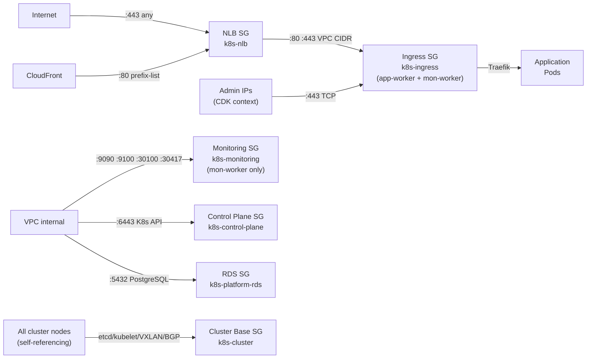

## Overview

Six security groups govern network access in this platform. They are created
by CDK and assigned to specific node roles — no node carries all six. Rules
are defined declaratively in the config layer (`configurations.ts`) and
applied at construction time via `SecurityGroupConstruct.fromK8sRules()`.
Runtime-dependent rules (CloudFront prefix list ID, admin IP allowlist) are
added imperatively after the config-driven loop completes.

The design applies a two-layer perimeter model:

1. **NLB SG** — internet edge. Controls what reaches the load balancer.
2. **Node SGs** — instance boundary. Control what the instances accept,
   independent of what reaches the NLB.

## Live state — development environment

Verified via `aws ec2 describe-security-groups` and
`aws ec2 describe-instances` on 2026-04-28.

**VPC CIDR:** `10.0.0.0/16` (SharedVpc `vpc-06c460143d78778fe`)
**Pod network CIDR:** `192.168.0.0/16`
**CloudFront origin-facing prefix list:** `pl-4fa04526`

### Active security groups (in use by running instances)

| Security Group | ID | Instance |
|:--------------|:---|:---------|
| `k8s-dev-k8s-cluster` | `sg-08ffa745e4b8a74dd` | control-plane, general-worker, monitoring-worker |
| `k8s-dev-k8s-control-plane` | `sg-0a7d312f10c8f3933` | control-plane only |
| `k8s-dev-k8s-ingress` | `sg-0f8c23e6d61ecaf68` | general-worker, monitoring-worker |
| `k8s-dev-k8s-monitoring` | `sg-03ce803caae0b1c22` | monitoring-worker only |
| `k8s-dev-platform-rds` | `sg-0c388c1bb6c0b9368` | RDS instance |
| NLB SG (`Base-development-Nlb...`) | `sg-0e5a63a657e61d2eb` | NLB `k8s-dev-nlb` |

### Historical note — pre-CloudFront ingress configuration

The `k8s-development-*` SG generation (deleted 2026-04-28) preserved evidence
of the migration from HTTP-01 ACME to the CloudFront prefix list model. The
old ingress SG had port 80 open to `0.0.0.0/0` with description
"HTTP from anywhere (LetsEncrypt HTTP-01 + CloudFront origin)". The current
configuration restricts port 80 to the CloudFront managed prefix list
(`pl-4fa04526`) only.

## Security group assignment per node role

| Node role | Security groups attached |
|:----------|:------------------------|
| Control plane | `k8s-cluster` (clusterBase) + `k8s-control-plane` |
| App worker | `k8s-cluster` (clusterBase) + `k8s-ingress` |
| Monitoring worker | `k8s-cluster` (clusterBase) + `k8s-ingress` + `k8s-monitoring` |
| NLB | `k8s-nlb` (auto-created by `NetworkLoadBalancerConstruct`) |
| Platform RDS | `k8s-platform-rds` |

Source: `infra/lib/stacks/kubernetes/worker-asg-stack.ts:279-286`,
`infra/lib/stacks/kubernetes/base-stack.ts:188-211`.

## Traffic flow — two-layer perimeter



## NLB security group — `k8s-nlb`

Provisioned by `NetworkLoadBalancerConstruct`
(`infra/lib/constructs/networking/elb/network-load-balancer.ts:211-215`).
`allowAllOutbound: false` — explicit egress rules only.

### Inbound rules

| Port | Protocol | Source | Reason |
|:-----|:---------|:-------|:-------|
| 80 | TCP | CloudFront managed prefix list (`com.amazonaws.global.cloudfront.origin-facing`) | Blocks direct HTTP access from scanners/bots bypassing CloudFront + WAF |
| 443 | TCP | `0.0.0.0/0` (IPv4) | HTTPS passthrough to Traefik — fine-grained filtering at Ingress SG |
| 443 | TCP | `::/0` (IPv6) | Same as above for IPv6 clients |

**Why port 80 uses the prefix list but port 443 does not:**
The CloudFront origin-facing prefix list has approximately 55 MaxEntries. Each
SG rule reference to a prefix list counts those entries against the 60-rule-per-SG
limit. Applying the prefix list to both ports 80 and 443 would consume
55 + 55 = 110 effective rule slots, exceeding the limit and causing CloudFormation
deployment failures. Port 443 is therefore left open to the internet at the NLB
layer; access restriction is enforced by the Ingress SG admin IP allowlist at the
instance level
(`infra/lib/constructs/networking/elb/network-load-balancer.ts:370-382`,
`infra/lib/stacks/kubernetes/base-stack.ts:374-384`).

**Why TCP and not UDP for ports 80/443:**
HTTP and HTTPS are application-layer protocols built on TCP. TCP's connection
state, ordering guarantees, and retransmission are required by HTTP/1.1 and
HTTP/2. The NLB operates at Layer 4 TCP passthrough — it does not inspect
payloads, simply forwarding the byte stream to Traefik which terminates TLS.

### Outbound rules

| Port | Protocol | Destination | Reason |
|:-----|:---------|:------------|:-------|
| 80 | TCP | VPC CIDR | Forward HTTP to worker targets + health checks |
| 443 | TCP | VPC CIDR | Forward HTTPS to worker targets + health checks |

Outbound is locked to VPC CIDR only — the NLB never initiates traffic outside
the VPC. This enforces the principle that the NLB is a forwarding device, not
an internet egress point.

## Cluster base security group — `k8s-cluster`

Attached to all nodes (control plane + all worker pools). Allows intra-cluster
communication between kubeadm components. `allowAllOutbound: true` — nodes
must reach AWS APIs (SSM, S3, ECR, CloudWatch) and external package
repositories without explicit per-endpoint egress rules.

Source: `infra/lib/config/kubernetes/configurations.ts:392-416`.

### Inbound rules — self-referencing (node-to-node)

| Port(s) | Protocol | Source | Component | Reason |
|:--------|:---------|:-------|:----------|:-------|
| 2379–2380 | TCP | self | etcd | Port 2379 = client API; 2380 = peer replication. Restricted to self so only cluster nodes can read/write cluster state |
| 10250 | TCP | self | kubelet API | Kubelet serves metrics, exec, and log streaming on this port. Self-only prevents external probing |
| 10257 | TCP | self | kube-controller-manager | Health and metrics endpoint. Internal only |
| 10259 | TCP | self | kube-scheduler | Health and metrics endpoint. Internal only |
| 4789 | **UDP** | self | VXLAN overlay (Calico) | VXLAN is an encapsulation protocol that wraps pod packets inside UDP frames for cross-node routing. UDP chosen by the VXLAN spec for connectionless low-overhead forwarding — TCP connection overhead would negate the performance benefit of the overlay |
| 179 | TCP | self | Calico BGP peering | Standard BGP port (RFC 4271). BGP uses TCP for its session reliability — route advertisements must be reliably delivered and ordered. Self-only: only cluster nodes peer with each other |
| 30000–32767 | TCP | self | NodePort services | Standard Kubernetes NodePort range. Inter-node traffic via kube-proxy DNAT uses this range for service-to-pod routing |
| 53 | TCP | self | CoreDNS | TCP DNS used for responses exceeding 512 bytes (DNSSEC, large TXT records). Self-referencing because CoreDNS pods run on cluster nodes |
| 53 | **UDP** | self | CoreDNS | Standard DNS query/response transport. UDP is the primary DNS protocol — low latency, single round-trip for small responses (the vast majority of pod DNS lookups) |
| 5473 | TCP | self | Calico Typha | Typha is a Calico datastore fan-out agent that reduces Felix→etcd connections at scale. TCP for reliable state synchronisation |
| 9100 | TCP | self | Traefik metrics | Traefik exposes Prometheus metrics on this port for scraping by the Prometheus pod on the monitoring worker |
| 9101 | TCP | self | Node Exporter metrics | Node Exporter hardware/OS metrics. Self-only: scraping happens intra-cluster |

### Inbound rules — VPC CIDR source

| Port | Protocol | Source | Component | Reason |
|:-----|:---------|:-------|:----------|:-------|
| 6443 | TCP | VPC CIDR | K8s API server | Allows SSM Session Manager port-forwarding from within the VPC to reach the Kubernetes API. VPC-scoped — no direct internet access to the API server |

### Inbound rules — Pod CIDR source (192.168.0.0/16)

| Port | Protocol | Source | Reason |
|:-----|:---------|:-------|:-------|
| 6443 | TCP | Pod CIDR | Pods call the Kubernetes API (controller reconciliation, webhooks, `kubectl exec`). kube-proxy DNAT preserves the pod source IP, so the SG must explicitly allow the pod CIDR |
| 10250 | TCP | Pod CIDR | Pods contact kubelet for exec and log streaming |
| 53 | UDP | Pod CIDR | Pod DNS resolution via CoreDNS |
| 53 | TCP | Pod CIDR | Large DNS responses from pods |
| 9100 | TCP | Pod CIDR | Prometheus pods scrape Traefik metrics from node IP |
| 9101 | TCP | Pod CIDR | Prometheus pods scrape Node Exporter from node IP |

**Why pod CIDR rules are separate from self-referencing rules:**
kube-proxy rewrites destination IPs for Service traffic (DNAT) but preserves
the source IP of the originating pod. When a pod on node A calls the K8s API
on node B, the source IP seen by node B's SG is the pod IP (in the 192.168.0.0/16
range), not node A's instance IP. Without explicit pod CIDR rules, this traffic
is dropped despite both nodes sharing the same cluster SG.
Source: `configurations.ts:409` comment — "kube-proxy DNAT preserves pod source IP".

## Control plane security group — `k8s-control-plane`

Attached to the control plane EC2 instance only, in addition to `k8s-cluster`.
`allowAllOutbound: false`.

Source: `configurations.ts:418-422`.

| Port | Protocol | Source | Reason |
|:-----|:---------|:-------|:-------|
| 6443 | TCP | VPC CIDR | K8s API from VPC — targeted at SSM Session Manager port-forwarding. Operators tunnel `kubectl` through SSM without needing a VPN or bastion |

**Why a separate control plane SG instead of using the cluster base SG?**
The cluster base SG allows 6443 from VPC CIDR too, but the control plane SG
makes the intent explicit and provides a named security group ID that is
published to SSM and read by worker stacks to verify connectivity constraints.
Separation also means the control plane SG can be tightened independently of
the shared cluster SG without affecting worker rules.

## Ingress security group — `k8s-ingress`

Attached to all worker nodes (app and monitoring pools). Governs HTTP/HTTPS
traffic from the NLB and from direct admin connections. `allowAllOutbound: false`.

Source: `configurations.ts:434-438` (config-driven rules) +
`base-stack.ts:258-292` (runtime-added rules).

### Inbound rules

| Port | Protocol | Source | Added by | Reason |
|:-----|:---------|:-------|:---------|:-------|
| 80 | TCP | VPC CIDR | Config | NLB health checks. The NLB health check for the HTTPS target group uses port 80 (`base-stack.ts:366`) because Traefik always has its HTTP entrypoint active, unlike TLS which requires a valid cert |
| 80 | TCP | CloudFront managed prefix list | Imperative (runtime) | CloudFront origin-facing IPs forwarded by the NLB. Applied at the Ingress SG as a secondary filter matching the NLB inbound rule |
| 443 | TCP | Admin IP allowlist (per-IP) | Imperative (runtime) | HTTPS admin access. IPs resolved from SSM at deploy time and passed as CDK context (`adminAllowedIps`). Supports both IPv4 (`Peer.ipv4`) and IPv6 (`Peer.ipv6`) addresses |

**Admin IP allowlist mechanism:**
Admin IPs are not hardcoded. Before CDK synth in CI, the deploy pipeline reads
allowed IPs from SSM and passes them via `-c adminAllowedIps=x.x.x.x/32,...`.
Each IP generates a separate SG rule. If `adminAllowedIps` is `NONE` (CI
synth-validate runs), no admin rules are added
(`base-stack.ts:268-292`).

**Why port 443 is TCP and not open UDP:**
HTTPS/TLS is TCP-only. UDP 443 would be QUIC/HTTP3. Traefik in this deployment
does not have QUIC enabled, so opening UDP 443 would be an unnecessary attack
surface.

## Monitoring security group — `k8s-monitoring`

Attached to the monitoring worker node only, alongside `k8s-cluster` and
`k8s-ingress`. Allows Prometheus, Loki, and Tempo to receive data from
other services in the VPC. `allowAllOutbound: false`.

Source: `configurations.ts:424-432`.

| Port | Protocol | Source | Service | Reason |
|:-----|:---------|:-------|:--------|:-------|
| 9090 | TCP | VPC CIDR | Prometheus | Remote write or query API from other VPC components |
| 9100 | TCP | VPC CIDR | Node Exporter | Prometheus scrapes Node Exporter on each node; VPC CIDR covers all node IPs |
| 9100 | TCP | Pod CIDR | Node Exporter | Prometheus pods scrape Node Exporter from pod IPs (kube-proxy DNAT source preservation — same issue as cluster base) |
| 30100 | TCP | VPC CIDR | Loki push API (NodePort) | Log shippers (Promtail, Alloy) push logs to Loki on this NodePort. NodePort used because SharedVpc has no private subnets and no internal load balancer |
| 30417 | TCP | VPC CIDR | Tempo OTLP gRPC (NodePort) | OpenTelemetry trace exporters send spans to Tempo on this NodePort. gRPC uses TCP for its HTTP/2 transport |

**Why NodePort (30100, 30417) instead of standard ports (3100, 4317):**
Loki and Tempo run as Kubernetes services on the monitoring worker. In a VPC
with no private subnets and no internal load balancer, the only externally
reachable endpoint for a service is its NodePort. The ports 30100 and 30417
are the assigned NodePorts for these services in the ArgoCD Helm configuration
(in `kubernetes-bootstrap`). They fall within the standard Kubernetes NodePort
range (30000–32767) covered by the cluster base SG for intra-cluster traffic,
but the monitoring SG explicitly opens them to the VPC CIDR for cross-stack
log and trace shipping from outside the cluster.

## Platform RDS security group — `k8s-platform-rds`

Provisioned inline in `PlatformRdsStack`
(`infra/lib/stacks/kubernetes/platform-rds-stack.ts:59-70`).
`allowAllOutbound: false`.

| Port | Protocol | Source | Reason |
|:-----|:---------|:-------|:-------|
| 5432 | TCP | VPC CIDR | PostgreSQL from K8s nodes and Lambda functions within the VPC |

**Why VPC CIDR and not the cluster SG ID:**
`PlatformRdsStack` is a separate stack that does not import the cluster SG
reference (avoiding `Fn::ImportValue` cross-stack coupling per ADR-002). VPC
CIDR is the broadest safe scope for this VPC — no external traffic enters the
VPC, and `publiclyAccessible: false` prevents the RDS endpoint from resolving
outside the VPC regardless of SG rules.

**Why the instance is in a PUBLIC subnet despite `publiclyAccessible: false`:**
SharedVpc has no private subnets (`natGateways: 0`). The `publiclyAccessible:
false` flag disables public DNS resolution and internet routing for the
instance endpoint. The security group is the sole access boundary for traffic
within the VPC. This is documented in the stack header comment
(`platform-rds-stack.ts:8-10`).

## SecurityGroupConstruct — config-driven pattern

Four of the six security groups (clusterBase, controlPlane, ingress,
monitoring) are created via a declarative config loop using
`SecurityGroupConstruct.fromK8sRules()`
(`infra/lib/constructs/security/security-group.ts`).

The construct accepts a typed `SecurityGroupRule[]` array with a discriminated
union `SecurityGroupRuleSource`:

```typescript
// Source types available (security-group.ts:43-50)
| { type: 'self' }                           // intra-group
| { type: 'cidr'; cidr: string }             // specific IPv4 CIDR
| { type: 'ipv6Cidr'; cidr: string }         // specific IPv6 CIDR
| { type: 'prefixList'; prefixListId: string } // AWS managed prefix list
| { type: 'securityGroup'; securityGroup }   // another SG reference
| { type: 'anyIpv4' }                        // 0.0.0.0/0
| { type: 'anyIpv6' }                        // ::/0
```

The K8s config layer uses a simplified set (`K8sPortRule.source`):
`'self' | 'vpcCidr' | 'podCidr' | 'anyIpv4'`. The `fromK8sRules()` static
adapter translates these to the full type, resolving `vpcCidr` to the actual
VPC CIDR block and `podCidr` to the configured pod network CIDR
(`configurations.ts:453`, `563`, `667`: `192.168.0.0/16` for all environments).

Rules requiring runtime values (CloudFront prefix list ID, admin IP addresses)
cannot be expressed in static config and are added imperatively after the
config-driven loop via `addIngressRule()` calls in `KubernetesBaseStack`.

## Protocol choice rationale — TCP vs UDP

| Protocol | Ports | Reason |
|:---------|:------|:-------|
| UDP | 4789 (VXLAN) | VXLAN spec requires UDP. Overlay encapsulation for cross-node pod routing. TCP overhead would negate performance |
| UDP | 53 (CoreDNS) | Standard DNS transport for queries ≤512 bytes — the vast majority of pod name resolution |
| TCP | 53 (CoreDNS) | DNS fallback for responses >512 bytes (DNSSEC, SRV records) |
| TCP | All others | Connection-state semantics required: etcd replication, kubelet exec, BGP sessions, HTTP/HTTPS, gRPC (HTTP/2), PostgreSQL |

## Tradeoffs

**`allowAllOutbound: true` on clusterBase** — nodes must reach AWS service
endpoints (SSM Agent, S3 for scripts, ECR for images, CloudWatch for logs),
OS package repositories, and Helm chart registries. Restricting outbound to
per-endpoint CIDR rules would require maintaining an ever-changing list of AWS
IP ranges. The compromise is that node compromise could be used as an egress
point, mitigated by VPC Flow Logs (`ALL` traffic) and CloudTrail capturing the
API calls.

**Port 443 open at NLB to internet** — the CloudFront prefix list SG rule
limit makes restricting 443 at the NLB impractical. The defence-in-depth
compensating control is the Ingress SG admin IP allowlist at the instance
level. For the application path (via CloudFront), CloudFront WAF rules provide
the filtering layer before traffic reaches the NLB.

**VPC CIDR as RDS source instead of SG reference** — avoids cross-stack
coupling at the cost of allowing any VPC resource to attempt a PostgreSQL
connection. Mitigated by credentials in Secrets Manager (accessed by pods
via External Secrets Operator) and no public resolvability.

## Related concepts

- [SSM Cross-Stack Pattern](../patterns/ssm-cross-stack-pattern.md)
- [ADR-002: SSM over CloudFormation Exports](../adrs/0002-ssm-over-cloudformation-exports.md)
- [Monitoring Strategy](monitoring-strategy.md)
- [NLB Security Group Configuration](../nlb-security-group-configuration.md)
- [Networking Observability](../networking-observability.md)

<!--
Evidence trail (auto-generated):
- Source: infra/lib/constructs/security/security-group.ts (read on 2026-04-28)
- Source: infra/lib/config/kubernetes/configurations.ts:391-440 (read on 2026-04-28)
- Source: infra/lib/stacks/kubernetes/base-stack.ts:178-292 (read on 2026-04-28)
- Source: infra/lib/constructs/networking/elb/network-load-balancer.ts:159-432 (read on 2026-04-28)
- Source: infra/lib/stacks/kubernetes/worker-asg-stack.ts:239-298 (read on 2026-04-28)
- Source: infra/lib/stacks/kubernetes/platform-rds-stack.ts:58-70 (read on 2026-04-28)
- Live: aws ec2 describe-security-groups --filters Name=group-name,Values=k8s-* (run on 2026-04-28, profile dev-account, eu-west-1)
- Live: aws ec2 describe-security-groups --filters Name=description,Values=*NLB* (run on 2026-04-28)
- Live: aws ec2 describe-instances (run on 2026-04-28) — verified active SG-to-instance attachment
- Live: aws ec2 describe-vpcs --filters Name=tag:Name,Values=shared-vpc-development (run on 2026-04-28) — VPC CIDR 10.0.0.0/16
- Remediation: aws ec2 revoke-security-group-ingress sg-0f8c23e6d61ecaf68 port 443 0.0.0.0/0 (2026-04-28) — removed drift rule (sgr-01e0812a50422c727)
- Remediation: aws ec2 delete-security-group for sg-03685810192a97ef3, sg-061eebc4aef10cd84, sg-07bd4ccc3611eaf57, sg-03a858bd82a2041e5 (2026-04-28) — deleted stale k8s-development-* generation
-->
