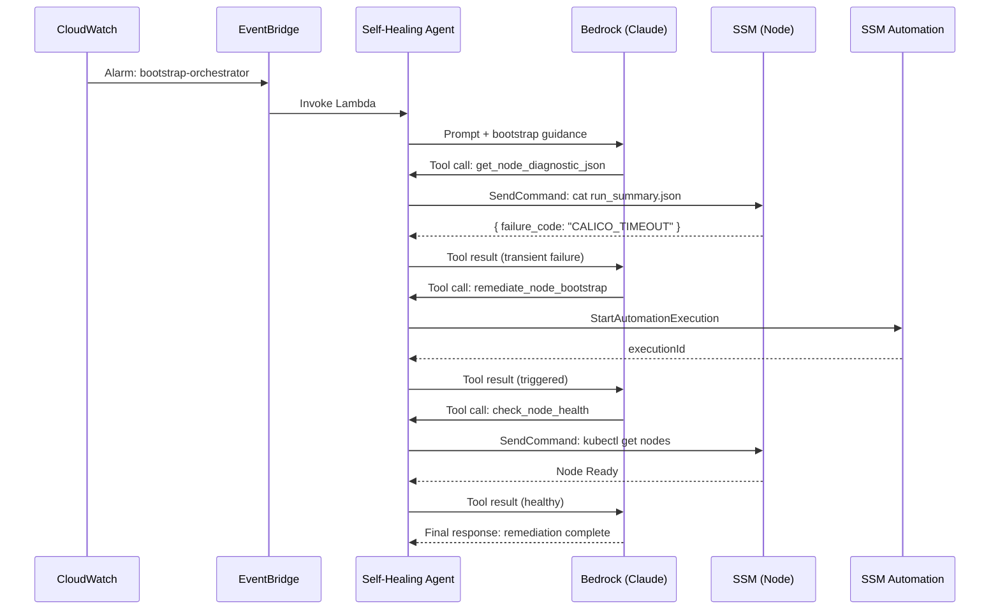

# SSM Bootstrap & Self-Healing Pipeline Integration Strategy

## Overview

This document describes the integration between the SSM Bootstrap
Automation system (Day-1 node lifecycle) and the Self-Healing Bedrock
Pipeline (autonomous incident response). The integration closes the
"Day-2 gap" where failed node replacements previously required manual
operator intervention.

## Architecture Boundary

```text
CloudWatch Alarm
     │
     ▼
EventBridge Rule ──► Self-Healing Lambda ──► Bedrock (Claude)
                                                 │
                          ┌──────────────────────┤
                          ▼                      ▼
                  get_node_diagnostic_json   check_node_health
                  (SSM → run_summary.json)   (SSM → kubectl)
                          │
                          ▼
                  Classify failure_code
                          │
              ┌───────────┴───────────┐
              ▼                       ▼
         TRANSIENT               PERMANENT
              │                       │
              ▼                       ▼
    remediate_node_bootstrap    Report to operator
    (SSM StartAutomation)       (SNS notification)
              │
              ▼
    check_node_health + analyse_cluster_health
    (Post-remediation verification)
```

## Key Design Decisions

### 1. SSM-Only Remediation Path

All remediation executes within the AWS control plane via
`ssm:StartAutomationExecution`. The agent does **not** trigger
GitHub Actions or access external CI/CD. This ensures:

- **Speed**: No CI queue delays; SSM executes in seconds
- **Security**: No external credentials needed
- **Auditability**: Full CloudTrail coverage

### 2. Machine-Readable Diagnostics

The Python `StepRunner` persists `/opt/k8s-bootstrap/run_summary.json`
on every step exit. This file contains:

- `overall_status`: `success` or `failed`
- `failure_code`: Classified code (e.g., `S3_FORBIDDEN`, `KUBEADM_FAIL`)
- `failed_steps`: Array of step names that failed
- `steps[]`: Full per-step timing and error details

The AI agent fetches this file via SSM `SendCommand` rather than
parsing unstructured CloudWatch logs.

### 3. Failure Classification Taxonomy

| Code | Description | Transient? |
| ------ | ----------- | ---------- |
| `AMI_MISMATCH` | Golden AMI validation failed | No |
| `S3_FORBIDDEN` | S3 bucket access denied | No |
| `KUBEADM_FAIL` | kubeadm init/join failed | Maybe |
| `CALICO_TIMEOUT` | Calico/Tigera CNI timeout | Yes |
| `ARGOCD_SYNC_FAIL` | ArgoCD application sync failed | Yes |
| `CW_AGENT_FAIL` | CloudWatch Agent setup failed | Yes |
| `UNKNOWN` | Unclassified failure | Investigate |

### 4. Dynamic SSM Document Discovery

The agent resolves SSM Document names from Parameter Store at
runtime, not from hardcoded values:

```text
/k8s/development/ssm-automation/cp-document-name
/k8s/development/ssm-automation/worker-document-name
/k8s/development/ssm-automation/role-arn
```

This ensures the agent always uses the latest deployed Document
version, even after stack updates.

## Components Modified

### Python Bootstrap (`common.py`)

- **`StepRunner._persist_run_summary()`**: Accumulates per-step
  results into `/opt/k8s-bootstrap/run_summary.json` on every
  step exit (success or failure).
- **`StepRunner._classify_failure()`**: Maps error strings to
  machine-readable failure codes using keyword matching.
- **`step_install_argocd_cli()`**: New shared step that downloads
  and installs the ArgoCD CLI binary for verify-step usage.

### Python Verify (`verify.py`)

- **ArgoCD Application Health**: Checks sync/health status of all
  ArgoCD Applications using `argocd app list --core` (no
  argocd-server dependency).
- **Outside-In API Connectivity**: Curls the NLB `/healthz` endpoint
  to validate end-to-end reachability from outside the cluster.

### TypeScript Agent (`index.ts`)

- **Bootstrap Alarm Detection**: `isBootstrapAlarm()` pattern-matches
  alarm names against known bootstrap-related patterns.
- **Diagnostic Guidance Injection**: `buildBootstrapDiagnosticGuidance()`
  injects a structured 4-step workflow into the agent prompt when a
  bootstrap alarm fires.
- **New Default Tools**: `get_node_diagnostic_json` and
  `remediate_node_bootstrap` added to the fallback tool registry.

### New MCP Tools

#### `get-node-diagnostic-json`

Fetches `run_summary.json` from a node via SSM `SendCommand`.
Returns structured JSON with the failure code, failed steps,
and per-step timing data.

#### `remediate-node-bootstrap`

Triggers an SSM Automation Document to re-run the bootstrap
sequence. Resolves the Document name and IAM role from
Parameter Store. Returns the execution ID for tracking.

## SSM Parameters Required

The following SSM parameters must exist for the integration
to function:

| Parameter | Purpose |
| --------- | ------- |
| `/k8s/{env}/ssm-automation/cp-document-name` | Control plane SSM Doc |
| `/k8s/{env}/ssm-automation/worker-document-name` | Worker SSM Doc |
| `/k8s/{env}/ssm-automation/role-arn` | Automation IAM role |
| `/k8s/{env}/api-server-dns` | NLB DNS for connectivity |

## Bootstrap Scripts Coverage

The following Python bootstrap scripts are integrated:

| Script | Role | Integration Point |
| ------ | ---- | ----------------- |
| `common.py` | Shared utilities | `run_summary.json` persistence |
| `verify.py` | Post-boot checks | ArgoCD + API connectivity |
| `step_01_validate_ami.py` | AMI validation | Failure code: `AMI_MISMATCH` |
| `step_02_pull_assets.py` | S3 asset download | Failure code: `S3_FORBIDDEN` |
| `step_03_kubeadm.py` | Cluster join | Failure code: `KUBEADM_FAIL` |
| `step_04_calico.py` | CNI setup | Failure code: `CALICO_TIMEOUT` |
| `step_05_argocd.py` | GitOps bootstrap | Failure code: `ARGOCD_SYNC_FAIL` |
| `step_06_cloudwatch.py` | Monitoring agent | Failure code: `CW_AGENT_FAIL` |

## Agent Workflow Sequence



## ConverseCommand Tool-Use Loop Detail

Detailed sequence inside the Agent Lambda: Cognito M2M auth, MCP tool discovery,
multi-turn Bedrock loop, and session persistence.

```mermaid
sequenceDiagram
    autonumber
    participant EB as EventBridge
    participant Agent as Agent Lambda
    participant Cognito as Cognito<br/>(User Pool)
    participant Bedrock as Bedrock<br/>(Claude Sonnet 4.6)
    participant GW as AgentCore Gateway<br/>(MCP Server)
    participant Tool as Tool Lambda<br/>(e.g. diagnose-alarm)
    participant S3 as S3<br/>(Session Memory)
    participant SNS as SNS<br/>(Reports)

    EB->>Agent: CloudWatch Alarm State Change
    Note over Agent: Idempotency check<br/>(dedup cache 5 min)

    %% OAuth2 Authentication
    rect rgb(40, 40, 60)
        Note over Agent,Cognito: Cognito M2M Authentication
        Agent->>Cognito: POST /oauth2/token<br/>(client_credentials grant)
        Cognito-->>Agent: access_token (JWT, 3600s TTL)
    end

    %% MCP Tool Discovery
    rect rgb(30, 50, 40)
        Note over Agent,GW: MCP Tool Discovery
        Agent->>GW: POST /mcp {method: "tools/list"}<br/>Authorization: Bearer JWT
        GW-->>Agent: 3 tools: [diagnose-alarm, ebs-detach, ...]
    end

    %% Load previous session
    Agent->>S3: GET sessions/{alarm}/latest.json
    S3-->>Agent: Previous session (or empty)
    Note over Agent: Build prompt from event<br/>+ previous session context

    %% Agentic Loop — Iteration 0
    rect rgb(50, 30, 30)
        Note over Agent,Tool: Agentic Loop (max 10 iterations)

        Agent->>Bedrock: ConverseCommand<br/>(system prompt + user message + toolConfig)
        Bedrock-->>Agent: stopReason: "tool_use"<br/>toolUse: {name: "diagnose-alarm", input: {alarmName: "..."}}

        Note over Agent: Extract tool_use block

        Agent->>GW: POST /mcp {method: "tools/call"}<br/>Authorization: Bearer JWT<br/>{name: "diagnose-alarm", arguments: {...}}
        GW->>Tool: Invoke Lambda
        Tool-->>GW: DiagnosticReport JSON
        GW-->>Agent: tool_result (742 chars)

        Agent->>Bedrock: ConverseCommand<br/>(conversation + toolResult)

        alt More tools needed
            Bedrock-->>Agent: stopReason: "tool_use"<br/>→ repeat loop
        else Final response
            Bedrock-->>Agent: stopReason: "end_turn"<br/>Remediation report (text)
        end
    end

    %% Post-processing
    Agent->>S3: PUT sessions/{alarm}/{timestamp}.json
    Agent->>SNS: Publish remediation report<br/>(✅ SUCCESS / ❌ ERROR)
    SNS-->>EB: Email notification to operator
    Agent-->>EB: {statusCode: 200, dryRun: true, result: "..."}
```



## Related

- [Self-Healing Platform](../projects/self-healing-platform.md) — canonical project-level entry point: all components, failure modes, manual intervention points, and AMI refresh pipeline in one view
- [Bootstrap Deadlock — CCM](../runbooks/bootstrap-deadlock-ccm.md) — manual fallback for CCM circular dependency
- [AMI Refresh IAM Permission Failures](../troubleshooting/ami-refresh-iam-permissions.md) — IAM debugging series for the AMI refresh Step Functions pipeline
