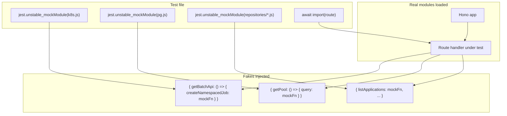

## Intent

Provide fast, hermetic unit tests for the admin-api Hono application that run without
a real Kubernetes cluster, a real PostgreSQL database, or real ECR image URIs. The suite
exercises route validation logic, error propagation paths, and business rules by replacing
all I/O boundaries with Jest mocks, while mounting a real Hono app instance so routing,
middleware, and handler composition are tested realistically.

## When to Apply

Use this architecture when adding a new admin-api route, repository function, or lib
utility:

- **Route test**: when the handler has validation, a K8s dispatch, or a PG write.
- **Repository test**: when the SQL shape or parameter binding matters.
- **Lib test**: when a utility function has conditional logic driven by environment
  variables or file system state.

## Structure

### Test hierarchy

```
api/admin-api/__tests__/
├── lib/
│   ├── config.test.ts                    — loadConfig() fail-fast + getJobImage() resolution
│   └── repositories/
│       ├── applications.test.ts          — SQL shape and mapping
│       ├── articles.test.ts
│       └── resumes.test.ts
└── routes/
    ├── applications.test.ts              — CRUD routes (GET /, GET /:slug, DELETE, POST status)
    ├── applications-coach.test.ts        — /:slug/coach K8s Job dispatch
    ├── articles.test.ts
    ├── health.test.ts
    ├── ingestion.test.ts                 — POST /trigger K8s Job dispatch
    ├── pipelines.test.ts                 — article-job, strategist-job, runs/:id
    └── resumes.test.ts
```

### Jest configuration

`api/admin-api/jest.config.js` delegates entirely to the shared base config:

```js
import { esmConfig } from '../../jest.config.base.mjs';
export default { ...esmConfig };
```

The base config (`jest.config.base.mjs`) uses `ts-jest/presets/default-esm` with
`useESM: true`, which enables native ES-module semantics. The `moduleNameMapper`
rule (`'^(\\.{1,2}/.*)\\.js$': '$1'`) strips the `.js` extension from TypeScript
import paths so `jest.unstable_mockModule` can intercept them.
[`jest.config.base.mjs`, lines 1–18]

`resetModules: true` in the base config means every test file starts with a clean
module registry, which is necessary for `jest.unstable_mockModule` to work correctly
with ESM dynamic imports. [`jest.config.base.mjs`, line 17]

### Mock strategy



All mocks are registered via `jest.unstable_mockModule()` **before** any `await import()`
calls. Dynamic `import()` is mandatory for ESM mocking — static `import` statements at
the top of the file are hoisted and would bypass the mock registry.

## Implementation in This Codebase

### Route test structure

Every route test file follows the same four-section layout:

**1. Mock registration** — all external modules mocked before any import:

```ts
const createNamespacedJobMock = jest.fn<() => Promise<object>>().mockResolvedValue({});

jest.unstable_mockModule('../../src/lib/k8s.js', () => ({
    getBatchApi: () => ({ createNamespacedJob: createNamespacedJobMock }),
    _resetBatchApi: () => {},
}));
```

[`api/admin-api/__tests__/routes/ingestion.test.ts`, lines 16–21]

**2. Dynamic imports** — resolved after all mocks are in place:

```ts
const { Hono } = await import('hono');
const { createIngestionRouter } = await import('../../src/routes/ingestion.js');
```

[`api/admin-api/__tests__/routes/ingestion.test.ts`, lines 27–28]

**3. App factory with JWT middleware stub** — injects a fake `jwtPayload` so route
handlers can call `ctx.get('jwtPayload').sub` without a real Cognito token:

```ts
function buildApp() {
  const app = new Hono();
  app.use('*', async (ctx, next) => {
    (ctx as any).set('jwtPayload', { sub: 'test-user' });
    await next();
  });
  app.route('/', createIngestionRouter(testConfig as any));
  return app;
}
```

[`api/admin-api/__tests__/routes/ingestion.test.ts`, lines 54–64]

**4. Describe blocks** — one block per endpoint or concern, using `beforeEach` to
reset mock state:

```ts
beforeEach(async () => {
  createNamespacedJobMock.mockReset();
  createNamespacedJobMock.mockResolvedValue({});
  process.env['INGESTION_IMAGE'] = '771826808455.dkr.ecr.eu-west-1.amazonaws.com/ingestion:latest';
  const { _resetJobImageCache } = await import('../../src/lib/config.js');
  _resetJobImageCache();
});
```

[`api/admin-api/__tests__/routes/ingestion.test.ts`, lines 71–79]

### Image URI test seam

`getJobImage()` caches results for 30 seconds. Tests that exercise the image-guard path
(`isImageConfigured`) must:

1. Set the env var fallback (`INGESTION_IMAGE`, `ARTICLE_PIPELINE_IMAGE`, or
   `STRATEGIST_PIPELINE_IMAGE`) so the guard passes, **and**
2. Call `_resetJobImageCache()` (exported from `src/lib/config.ts`) in `beforeEach` so
   a stale cached sentinel from a previous test does not cause a spurious `502`.

[`api/admin-api/src/lib/config.ts`, lines 103–106]

### BatchV1Api test seam

`getBatchApi()` uses a module-level `_batchApi` variable. Tests mock the entire
`k8s.js` module, so `_resetBatchApi()` is never called in practice — it exists to
document the seam and to allow future integration test setups that load the real module.
[`api/admin-api/src/lib/k8s.ts`, line 20]

### Repository test structure

Repository tests mock the `pg` module directly, not the repository functions:

```ts
const mockQuery = jest.fn<() => Promise<object>>();

jest.unstable_mockModule('pg', () => {
    class Pool { query = mockQuery; }
    return { Pool, default: { Pool } };
});

const { upsertApplication, getApplication } =
    await import('../../../src/lib/repositories/applications.js');
```

[`api/admin-api/__tests__/lib/repositories/applications.test.ts`, lines 7–22]

This lets tests assert on the exact SQL strings and parameter arrays passed to
`pool.query()`, verifying that `INSERT ... ON CONFLICT (id) DO UPDATE` or `WHERE`
clauses are formed correctly without running against a real database.

### Config / lib test structure

`config.test.ts` sets and unsets `process.env` keys directly in `beforeEach`/`afterEach`
blocks. Tests that exercise file-mount resolution create a real temp directory with
`fs.mkdtempSync`, write controlled content, point `JOB_IMAGES_DIR` at it, and call
`_resetJobImageCache()` to force a fresh read.
[`api/admin-api/__tests__/lib/config.test.ts`, lines 176–189]

This avoids fs mocking entirely and tests the actual file-read/cache/fallback logic
end-to-end at the process level.

<!--
Evidence trail (auto-generated):
- Source: api/admin-api/jest.config.js (read on 2026-04-28)
- Source: jest.config.base.mjs (read on 2026-04-28)
- Source: api/admin-api/__tests__/routes/applications.test.ts (read on 2026-04-28)
- Source: api/admin-api/__tests__/routes/ingestion.test.ts (read on 2026-04-28)
- Source: api/admin-api/__tests__/routes/pipelines.test.ts (read on 2026-04-28)
- Source: api/admin-api/__tests__/lib/config.test.ts (read on 2026-04-28)
- Source: api/admin-api/__tests__/lib/repositories/applications.test.ts (read on 2026-04-28)
- Source: api/admin-api/src/lib/k8s.ts (read on 2026-04-28)
- Source: api/admin-api/src/lib/config.ts (read on 2026-04-28)
-->
