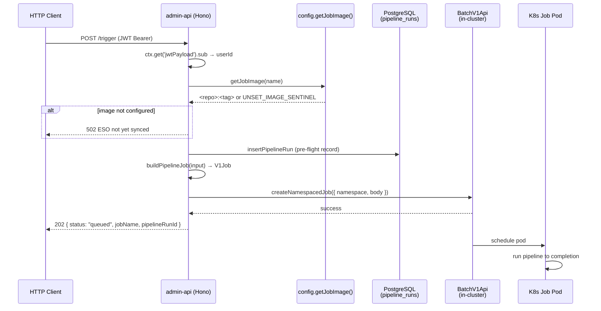

## Intent

Allow the admin-api BFF (Hono, Node.js) to launch background ML and ingestion workloads
as Kubernetes `batch/v1` Jobs without relying on intermediate queues, Lambda chains, or
external orchestrators. The route handler resolves an image URI, builds a strongly-typed
`V1Job` object, and dispatches it to the in-cluster `BatchV1Api` in a single HTTP call,
returning `202 Accepted` immediately. The Job runs to completion (or failure) independently
of the HTTP connection.

This pattern replaced the legacy API Gateway → Trigger Lambda → Fetcher Lambda → Worker
Lambda chain for ingestion, and the equivalent Lambda-based article and strategist pipeline
routes in Phase 4–5. [`api/admin-api/src/routes/ingestion.ts`, line 3–11]

## When to Apply

- A user action (HTTP POST) kicks off a workload that takes seconds to minutes and cannot
  run synchronously within a request timeout.
- The workload requires dedicated compute with resource bounds (memory/CPU requests and
  limits) and retry semantics.
- Image provenance must track independently of the BFF deploy cycle — the Job image is
  updated by pushing a new ECR tag and rotating a Secret; admin-api picks it up without
  a rollout. [`api/admin-api/src/lib/config.ts`, lines 4–18]
- The workload authenticates to AWS using a Kubernetes `ServiceAccount` mapped to an
  IAM role (IRSA), not BFF credentials.

## Structure



### Name-construction invariant

Job names are DNS labels and must not exceed 63 characters.
[`api/admin-api/src/lib/k8s-job-builder.ts`, line 15]

```
jobName = (stem[0..49] + "-" + sha1(suffixInput)[0..7]).slice(0, 63)
```

`sanitizeLabel()` lowercases, strips all non-`[a-z0-9-]` characters, and trims
leading/trailing hyphens before truncation.
[`api/admin-api/src/lib/k8s-job-builder.ts`, lines 17–23]

### Default resource envelope

Applied by `buildPipelineJob()` unless the caller overrides via `input.resources`.
[`api/admin-api/src/lib/k8s-job-builder.ts`, lines 42–45]

| | Requests | Limits |
|---|---|---|
| Memory | `768Mi` | `2Gi` |
| CPU | `300m` | `1000m` |

### Fixed Job spec fields

All jobs built by the shared builder share these spec defaults:
[`api/admin-api/src/lib/k8s-job-builder.ts`, lines 47–79]

| Field | Value |
|---|---|
| `restartPolicy` | `Never` |
| `ttlSecondsAfterFinished` | `3600` |
| `backoffLimit` | `2` |
| `activeDeadlineSeconds` | `1800` (default; overridable) |

### Image URI resolution

Image URIs are **not** in `AdminApiConfig`. They are resolved per-request by
`getJobImage(name)`, which reads from a kubelet-synced file mount
(`/etc/admin-api/images/<name>`) backed by the ESO Secret `admin-api-job-images`.
A 30-second in-process TTL cache (`JOB_IMAGE_CACHE_TTL_MS = 30_000`) prevents per-request
disk reads under sustained traffic. [`api/admin-api/src/lib/config.ts`, lines 57–101]

In local development and tests, the file mount is absent; `getJobImage()` falls back to
environment variables (`INGESTION_IMAGE`, `ARTICLE_PIPELINE_IMAGE`,
`STRATEGIST_PIPELINE_IMAGE`). [`api/admin-api/src/lib/config.ts`, lines 49–54]

`isImageConfigured(uri)` guards every dispatch: if the URI equals `UNSET_IMAGE_SENTINEL`
(`"image-uri-not-yet-set"`) or ends with `:`, the route returns `502` with a message
instructing the operator to wait ~60s for ESO/kubelet sync.
[`api/admin-api/src/lib/config.ts`, lines 34–39]

### Lazy singleton BatchV1Api

`getBatchApi()` initialises `KubeConfig.loadFromCluster()` once and reuses the client
for all subsequent calls. A `_resetBatchApi()` export exists solely as a test seam —
it sets the module-level `_batchApi` variable back to `undefined`.
[`api/admin-api/src/lib/k8s.ts`, lines 9–20]

## Implementation in This Codebase

Three routes currently use this pattern:

### Ingestion trigger — `POST /api/admin/ingestion/trigger`

File: `api/admin-api/src/routes/ingestion.ts`

- Image: `getJobImage('ingestion')` — Secret key `ingestion`
- Namespace/SA: `config.ingestionNamespace` / `config.ingestionServiceAccount`
  (defaults `ingestion` / `ingestion-sa`)
- Container name: `worker`, command: `['node', 'dist/run-ingestion.js']`
- `activeDeadlineSeconds`: `900` (overrides the 1800 default — ingestion jobs are
  expected to complete within 15 minutes)
- Resources: `512Mi/250m` requests, `1Gi/500m` limits (inline, not via shared builder)
- Secret refs: `platform-rds-credentials`, `ingestion-secrets`
- `suffixInput`: `${userId}:${repoFullName}:${timestamp}`
- Does **not** write a `pipeline_runs` row (stateless trigger)

### Article pipeline — `POST /api/admin/pipelines/article-job/:slug`

File: `api/admin-api/src/routes/pipelines.ts`

- Image: `getJobImage('article-pipeline')` — Secret key `article-pipeline`
- Namespace/SA: `config.articlePipelineNamespace` / `config.articlePipelineServiceAccount`
  (defaults `article-pipeline` / `article-pipeline-sa`)
- Container name: `pipeline`, command: `['node', 'dist/run-pipeline.js']`
- Inserts a `pipeline_runs` row with `pipelineType: 'article'` before Job creation;
  returns `500` without touching K8s if the PG insert fails
- Secret refs: `platform-rds-credentials`

### Strategist pipeline — `POST /api/admin/pipelines/strategist-job`

File: `api/admin-api/src/routes/pipelines.ts`

- Image: `getJobImage('job-strategist')` — Secret key `job-strategist`
- Namespace/SA: `config.strategistPipelineNamespace` / `config.strategistPipelineServiceAccount`
  (defaults `job-strategist` / `job-strategist-sa`)
- Container name: `pipeline`, command: `['node', 'dist/run-pipeline.js']`
- Inserts a `pipeline_runs` row with `pipelineType: 'strategist'`

### Coach pipeline — `POST /api/admin/applications/:slug/coach`

File: `api/admin-api/src/routes/applications.ts`

- Image: `getJobImage('job-strategist')` — reuses the strategist image
- Namespace/SA: `config.strategistPipelineNamespace` / `config.strategistPipelineServiceAccount`
- Container name: `pipeline`, command: `['node', 'dist/run-coach.js']`
- Inserts a `pipeline_runs` row with `pipelineType: 'coach'`
- Name stem: `coach-<slug>-<interviewStage>`

## Variants

### Shared builder (`buildPipelineJob`) vs. inline spec

`api/admin-api/src/lib/k8s-job-builder.ts` exports `buildPipelineJob(BuildJobInput)`
which is used by applications and pipelines routes. The ingestion route was written
before the shared builder existed and builds its `V1Job` inline — it uses different
resource defaults (512Mi/250m requests, 1Gi/500m limits) and a different
`activeDeadlineSeconds` (900 vs 1800). Future callers should prefer the shared builder
and pass `resources` and `activeDeadlineSeconds` explicitly when they differ from the
defaults. [`api/admin-api/src/lib/k8s-job-builder.ts`, lines 42–45, 61]

### Pre-flight `pipeline_runs` record

Ingestion does not write a `pipeline_runs` row — it is a fire-and-forget trigger.
All pipeline routes (article, strategist, coach) insert the row **before** calling
`createNamespacedJob()` so the row exists even if the K8s call fails, enabling
observability and retry logic at a higher level.

<!--
Evidence trail (auto-generated):
- Source: api/admin-api/src/lib/k8s-job-builder.ts (read on 2026-04-28)
- Source: api/admin-api/src/lib/k8s.ts (read on 2026-04-28)
- Source: api/admin-api/src/lib/config.ts (read on 2026-04-28)
- Source: api/admin-api/src/routes/applications.ts (read on 2026-04-28)
- Source: api/admin-api/src/routes/ingestion.ts (read on 2026-04-28)
- Source: api/admin-api/src/routes/pipelines.ts (read on 2026-04-28)
-->
