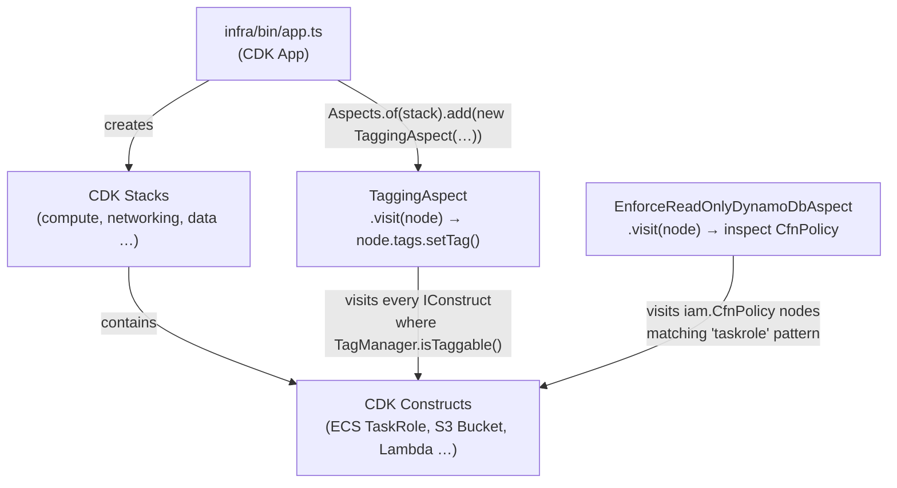

## What It Does

`@nelsonlamounier/cdk-governance-aspects` is a TypeScript npm package that provides two CDK Aspects for automated resource governance across CDK stacks.

**`EnforceReadOnlyDynamoDbAspect`** validates that ECS task roles never contain DynamoDB write or administrative actions. It enforces the dual-path architecture boundary: SSR reads DynamoDB directly, all writes go through API Gateway → Lambda (auditable and rate-limited). Forbidden actions are `dynamodb:PutItem`, `dynamodb:DeleteItem`, `dynamodb:UpdateItem`, `dynamodb:BatchWriteItem`, `dynamodb:CreateTable`, `dynamodb:DeleteTable`, `dynamodb:UpdateTable`, and `dynamodb:CreateGlobalTable`. The aspect also catches wildcard grants such as `dynamodb:*` and prefix wildcards like `dynamodb:Put*`.

**`TaggingAspect`** applies a consistent 7-tag kebab-case schema to every taggable resource in a stack. It is the single source of truth for tags — no manual `.tags.setTag()` calls are needed in individual constructs.

## Architecture



Both aspects are applied in `infra/bin/app.ts` after all stacks are constructed, in the cross-cutting aspects block.

## Runtime Contract

CDK Aspects implement the `IAspect` interface and execute during `cdk synth`, not at deploy time. The CDK framework calls `aspect.visit(node)` once for every node in the construct tree. Both aspects in this package are therefore:

- **Compile-time guardrails** — violations surface as `cdk synth` errors or warnings, not as runtime exceptions
- **Non-mutating in production** — `EnforceReadOnlyDynamoDbAspect` only calls `cdk.Annotations.of(node).addError()` or `addWarning()`; it never modifies IAM policies
- **Idempotent** — safe to apply to the same scope multiple times (tags are set via `TagManager.setTag()`, which is idempotent)

`EnforceReadOnlyDynamoDbAspect` defaults to `failOnViolation: true`, which causes `cdk synth` to exit non-zero. Setting `failOnViolation: false` downgrades to a warning.

## Repository Layout

```
packages/cdk-governance-aspects/
├── src/
│   ├── index.ts                          # Package entry point — re-exports both aspects
│   ├── enforce-readonly-dynamodb-aspect.ts
│   └── tagging-aspect.ts
├── test/
│   ├── enforce-readonly-dynamodb-aspect.test.ts
│   └── tagging-aspect.test.ts
├── lib/                                  # Compiled output (tsc → lib/)
├── package.json                          # name: @nelsonlamounier/cdk-governance-aspects, version: 1.0.0
├── jest.config.js
└── CHANGELOG.md
```

`lib/` is the published artefact. `src/` is excluded from the npm tarball via `.npmignore`. Published files are `lib/**/*.js` and `lib/**/*.d.ts` only.

## How to Run Locally

**Prerequisites:** `aws-cdk-lib ^2.170.0` and `constructs ^10.0.0` must be installed in the consuming project (declared as `peerDependencies`).

```bash
# Build TypeScript → lib/
yarn build         # runs tsc

# Run unit tests
yarn test          # runs jest

# Build and test together (also runs before publish)
yarn prepublish    # runs build && test
```

The test suite uses `ts-jest` and `aws-cdk-lib/assertions`. Tests synthesise real CDK stacks and use `Annotations.fromStack()` to assert presence or absence of error and warning annotations.

Example from `test/enforce-readonly-dynamodb-aspect.test.ts`:

```typescript
cdk.Aspects.of(stack).add(new EnforceReadOnlyDynamoDbAspect());
app.synth(); // triggers all aspect visitors
// then assert via Annotations.fromStack(stack)
```

The `TaggingAspect` test in `test/tagging-aspect.test.ts` expects exactly 7 tags (`EXPECTED_TAG_COUNT = 7`) on synthesised resources and verifies each key-value pair, including that `managed-by` is always `cdk`.

## Deploy

Publishing uses the Yarn Berry workflow:

```bash
yarn release   # runs: yarn npm publish --access public
```

The `prepublish` script (`yarn build && yarn test`) runs automatically before the tarball is packed, ensuring the compiled `lib/` is always up-to-date and all tests pass before any version reaches the registry.

The package is public on npm under the `@nelsonlamounier` scope. The repository field in `package.json` points to `https://github.com/Nelson-Lamounier/cdk-monitoring` with `directory: packages/cdk-governance-aspects`.

## Public API

Exported from `packages/cdk-governance-aspects/src/index.ts`:

| Export | Kind |
| :--- | :--- |
| `TaggingAspect` | class |
| `TagConfig` | interface |
| `CostCentre` | type (`'infrastructure' \| 'platform' \| 'application'`) |
| `EnforceReadOnlyDynamoDbAspect` | class |
| `EnforceReadOnlyDynamoDbProps` | interface |
| `DYNAMODB_WRITE_ACTIONS` | `readonly string[]` constant |
| `DYNAMODB_ADMIN_ACTIONS` | `readonly string[]` constant |
| `FORBIDDEN_DYNAMODB_ACTIONS` | `readonly string[]` constant |

## Related Projects

- [docs/concepts/iac-security-dual-layer.md](../concepts/iac-security-dual-layer.md) — how this package's aspects complement Checkov and cdk-nag
- [docs/projects/cdk-platform-stacks.md](cdk-platform-stacks.md) — the infra stacks that consume these aspects
- `infra/bin/app.ts` — the application entry point where `TaggingAspect` is applied to all stacks

<!-- evidence-trail
  packages/cdk-governance-aspects/package.json: name, version 1.0.0, scripts (build/test/prepublish/release), peerDependencies, files array, repository.directory
  packages/cdk-governance-aspects/src/index.ts: all exported symbols
  packages/cdk-governance-aspects/src/enforce-readonly-dynamodb-aspect.ts: FORBIDDEN_DYNAMODB_ACTIONS array, failOnViolation default, roleNamePattern default 'taskrole', wildcard detection logic
  packages/cdk-governance-aspects/src/tagging-aspect.ts: 7-tag schema, CostCentre type, managed-by hardcoded to 'cdk', TagConfig interface
  packages/cdk-governance-aspects/test/enforce-readonly-dynamodb-aspect.test.ts: buildStackWithPolicy helper, app.synth() pattern
  packages/cdk-governance-aspects/test/tagging-aspect.test.ts: EXPECTED_TAG_COUNT = 7, BASE_CONFIG
  infra/bin/app.ts lines 86-93: Aspects.of(stack).add(new TaggingAspect({...})) in forEach loop over all stacks
-->
