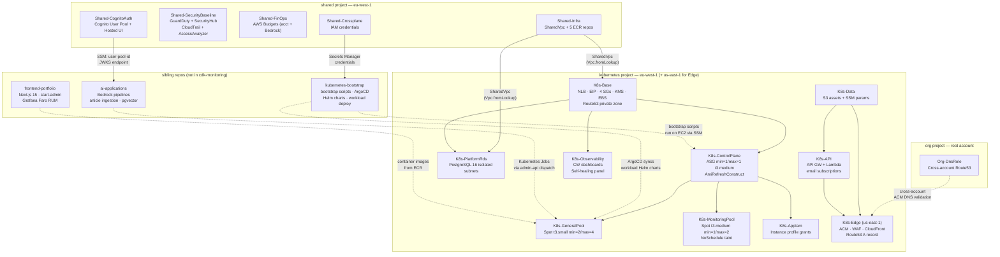

## What cdk-monitoring is

`cdk-monitoring` is the AWS infrastructure layer for the Tucaken SaaS platform. It provisions and manages every AWS resource that the platform and its workloads depend on — compute, networking, security, data stores, IAM, and self-healing automation — but it does not deploy application code or Kubernetes workloads. That separation is the repo's defining constraint: it changes when infrastructure changes, not when a feature ships.

The repo synthesises CloudFormation templates via AWS CDK v2 (TypeScript) and deploys them through 11 GitHub Actions workflows. Three CDK projects cover three distinct scopes: `org` (AWS root account), `shared` (account-level foundation), and `kubernetes` (platform runtime). Together they produce 16 CloudFormation stacks (`infra/lib/projects/kubernetes/factory.ts:8-27`, `infra/lib/projects/shared/factory.ts:102-281`, `infra/lib/projects/org/factory.ts:90-150`).

---

## What cdk-monitoring owns

### Compute

- **Kubernetes control plane** — EC2 `t3.medium`, ASG min=1/max=1, Launch Template, SSM-managed bootstrap (`K8s-ControlPlane`)
- **General worker pool** — EC2 Spot `t3.small`, ASG min=2/max=4, serves Next.js, ArgoCD, and general workloads (`K8s-GeneralPool`)
- **Monitoring worker pool** — EC2 Spot `t3.medium`, ASG min=1/max=2, `dedicated=monitoring:NoSchedule` taint, reserved for Prometheus, Grafana, Loki (`K8s-MonitoringPool`)
- **Golden AMI automation** — EventBridge → Step Functions → ASG instance refresh pipeline; rolls all three pools when `/k8s/{env}/golden-ami/latest` SSM parameter updates (`K8s-ControlPlane/AmiRefreshConstruct`)

### Networking

- **SharedVpc** — public, private, and isolated subnets in eu-west-1; VPC Flow Logs to CloudWatch; shared by all projects (`Shared-Infra`)
- **NLB** — Network Load Balancer with EIP SubnetMapping, TCP passthrough, CloudFront prefix-list ingress rules, target group health checks (`K8s-Base`)
- **CloudFront + WAF** — global CDN with 4 WAF managed rules, 8 cache behaviours, `X-CloudFront-Origin-Secret` origin bypass mitigation (`K8s-Edge`, us-east-1)
- **Security Groups** — 6 SGs: ClusterBase, ControlPlane, Ingress, Monitoring, NLB, PgBouncer; all rules config-driven with principle of least privilege (`K8s-Base`)
- **EIP** — stable external IP attached to NLB via SubnetMapping; DNS `ec2-52-18-73-218.eu-west-1.compute.amazonaws.com` (`K8s-Base`)
- **API Gateway + Lambda** — email subscription verification endpoint, SES integration (`K8s-API`)
- **Route53** — private hosted zone for internal API server DNS; A record ALIAS to CloudFront (`K8s-Edge`)

### Security

- **ACM** — wildcard certificate for `*.nelsonlamounier.com` validated via cross-account DNS role (`K8s-Edge`)
- **Cognito** — admin User Pool with Hosted UI, OAuth 2.0 PKCE, single admin user, `selfSignUpEnabled: false` (`Shared-CognitoAuth`)
- **GuardDuty + Security Hub + IAM Access Analyzer** — core threat detection, compliance findings, account-scope analyser (`Shared-SecurityBaseline`)
- **CloudTrail** — management event trail, S3 with 90-day retention (`Shared-SecurityBaseline`)
- **CDK-Nag** — AWS Solutions compliance pack applied at app level (`infra/bin/app.ts:125-131`)
- **Checkov** — 13 custom IaC security rules in `.checkov/custom_checks/` plus standard checks in CI

### Data

- **Platform RDS** — PostgreSQL 16, `db.t3.micro`, isolated subnets of SharedVpc, PgBouncer connection pool in transaction mode; serves articles, identity, career, and config domains (`K8s-PlatformRds`)
- **S3 buckets** — static assets (Next.js build output), scripts bucket (kubeadm bootstrap), CloudFront access logs, NLB access logs
- **ECR repositories (5)** — `nextjs-frontend`, `start-admin`, `public-api`, `admin-api`, `wiki-mcp`; URIs published to SSM (`Shared-Infra`)
- **SSM Parameter Store** — cross-repo secret and config distribution bus (see [SSM as integration bus](#ssm-as-integration-bus))

### IAM

- **Application-tier grants** — K8s node instance profile; S3, SSM, and ECR access scoped to specific resources (`K8s-AppIam`)
- **Crossplane IAM credentials** — dedicated IAM user with S3/SQS/KMS permissions; credentials in Secrets Manager for in-cluster Crossplane operator (`Shared-Crossplane`)
- **Cross-account DNS role** — assumable by dev/staging/prod accounts for ACM DNS validation in the root account (`Org-DnsRole`)
- **Self-healing agent role** — Lambda execution role for Bedrock ConverseCommand agent and tool Lambdas

### Observability

- **CloudWatch dashboards** — Infrastructure dashboard (VPC, NLB, EC2 metrics) and Operations dashboard (AMI builds, SSM bootstrap, self-healing pipeline) (`K8s-Observability`)
- **CloudWatch alarms** — AMI refresh failure alarm (`ami-refresh-failed`), bootstrap alarms that trigger the self-healing agent
- **CloudWatch Logs** — log groups for all Lambda functions, Step Functions execution data, VPC Flow Logs, bootstrap logs
- **AWS Budgets** — account-level budget (dev: $100/mo, staging: $200/mo, prod: $500/mo) and Bedrock-specific budget (dev: $30/mo) with SNS alerting (`Shared-FinOps`)

### Self-healing

- **Bedrock Agent pipeline** — CloudWatch → EventBridge → Agent Lambda → Bedrock (Claude Sonnet 4.6) → SSM Run Command; handles transient bootstrap failures autonomously
- **AMI Refresh pipeline** — SSM parameter change → EventBridge → Step Functions; rolls all ASG pools to new AMI without a CDK deploy
- Detailed coverage: [Self-Healing Platform](self-healing-platform.md)

### Published package

- **`@nelsonlamounier/cdk-governance-aspects`** — MIT-licensed npm package (v1.0.0) exporting `TaggingAspect` (7-tag schema applied at synth time) and `EnforceReadOnlyDynamoDbAspect` (blocks write access on ECS task roles at synth time). Peer dependencies: `aws-cdk-lib ≥ 2.170.0`, `constructs ≥ 10.0.0`.

---

## What cdk-monitoring does NOT own

| Concern | Where it lives |
|:--------|:---------------|
| Kubernetes bootstrap scripts (kubeadm init/join, Calico, CCM) | [`kubernetes-bootstrap`](https://github.com/Nelson-Lamounier/kubernetes-bootstrap) |
| Helm charts for Traefik, Grafana, Prometheus, Loki, Cert-Manager | [`kubernetes-bootstrap`](https://github.com/Nelson-Lamounier/kubernetes-bootstrap) |
| ArgoCD Application manifests (app-of-apps pattern) | [`kubernetes-bootstrap`](https://github.com/Nelson-Lamounier/kubernetes-bootstrap) |
| Kubernetes docs (cluster setup, node operations, GitOps) | [`kubernetes-bootstrap/docs`](https://github.com/Nelson-Lamounier/kubernetes-bootstrap/tree/main/docs) |
| Next.js 15 frontend application code | [`frontend-portfolio`](https://github.com/Nelson-Lamounier/frontend-portfolio) |
| `start-admin` TanStack Start dashboard application code | [`frontend-portfolio`](https://github.com/Nelson-Lamounier/frontend-portfolio) |
| Bedrock inference Lambda handlers, AI pipeline code | [`ai-applications`](https://github.com/Nelson-Lamounier/ai-applications) |
| Article ingestion pipeline, pgvector KB sync | [`ai-applications`](https://github.com/Nelson-Lamounier/ai-applications) |
| `admin-api` Hono BFF application code | separate service repo (containerised, deployed via ArgoCD) |
| `public-api` BFF application code | separate service repo (containerised, deployed via ArgoCD) |
| Pod deployments, Kubernetes namespace configuration | ArgoCD, managed from `kubernetes-bootstrap` |

**The boundary rule:** if the resource is an AWS resource managed by CloudFormation, it belongs here. If it runs inside a container or Kubernetes namespace, it belongs in the application or `kubernetes-bootstrap` repo.

---

## CDK app architecture

### Entry point — `infra/bin/app.ts`

`bin/app.ts` is a slim orchestrator. Its only responsibilities are:

1. **Parse and validate** `-c project=<X> -c environment=<Y>` from CDK context
2. **Delegate** to the correct factory via `getProjectFactoryFromContext()`
3. **Apply cross-cutting Aspects** — `TaggingAspect` per stack, `applyCdkNag` at app level

All config, VPC lookups, SSM resolution, and stack composition happen inside the factory. `app.ts` has no knowledge of stack names, resource types, or project-specific dependencies (`infra/bin/app.ts:70-73`).

Valid projects and environments (`infra/lib/config/projects.ts:8-19`):

```
-c project=  shared | kubernetes | org
-c environment=  dev | staging | prod
```

### Factory pattern

Each project has a typed factory class in `infra/lib/projects/<project>/factory.ts` that implements `IProjectFactory<TContext>`. The factory's `createAllStacks(app, context)` method creates every stack for the project, wires `addDependency()` calls, and returns `{ stacks, stackMap }`. No stack is instantiated outside of a factory.

The factory receives all config from `process.env` (via `fromEnv()` helpers in `configurations.ts`) — not from CDK context. CDK context is reserved for routing only (`project`, `environment`). CI sets env vars via GitHub Actions workflow `env:` blocks; local runs use a `.env` file loaded by `dotenv` before any CDK imports (`bin/app.ts:22`).

### Cross-cutting aspects

Two aspects are applied in `bin/app.ts` after stacks are created:

**`TaggingAspect`** — applied per stack, produces 7 tags on every taggable resource: `project`, `environment`, `owner`, `component`, `managed-by`, `version`, `cost-centre`. The `component` and `cost-centre` values are inferred from the stack name by `inferComponent()` / `inferCostCentre()` (`bin/app.ts:100-119`).

**`applyCdkNag`** (AWS Solutions compliance pack) — applied to the entire app (`Aspects.of(app)`). Common suppressions with documented rationale applied per stack via `applyCommonSuppressions()`. Skipped with `-c nagChecks=false`.

---

## Stack inventory

### Shared project — eu-west-1

| Stack | What it creates |
|:------|:----------------|
| `Shared-Infra-{env}` | SharedVpc (public/private/isolated subnets), VPC Flow Logs, 5 ECR repositories, SSM URIs |
| `Shared-SecurityBaseline-{env}` | GuardDuty, Security Hub, IAM Access Analyzer, CloudTrail, EventBridge CFn drift alerts |
| `Shared-FinOps-{env}` | AWS Budgets (account + Bedrock limits), SNS alerting at 50/80/100% thresholds |
| `Shared-Crossplane-{env}` | Crossplane IAM user (S3/SQS/KMS), Secrets Manager credential storage |
| `Shared-CognitoAuth-{env}` | Cognito User Pool + Hosted UI, admin OAuth app client, SSM parameter export |

### Kubernetes project — eu-west-1 (except Edge)

| Stack | Region | What it creates | Depends on |
|:------|:-------|:----------------|:-----------|
| `K8s-Data-{env}` | eu-west-1 | S3 assets bucket, SSM parameters | — |
| `K8s-Base-{env}` | eu-west-1 | VPC lookup, 4 SGs, KMS key, EBS volume, EIP, Route53 private zone, NLB, scripts S3 | — |
| `K8s-ControlPlane-{env}` | eu-west-1 | Control plane EC2 ASG (min=1/max=1), Launch Template, SSM document, `AmiRefreshConstruct` | Base |
| `K8s-GeneralPool-{env}` | eu-west-1 | General-purpose Spot ASG (t3.small, min=2/max=4), Launch Template | ControlPlane |
| `K8s-MonitoringPool-{env}` | eu-west-1 | Monitoring Spot ASG (t3.medium, min=1/max=2, NoSchedule taint), Launch Template | ControlPlane |
| `K8s-AppIam-{env}` | eu-west-1 | Instance profile IAM grants: S3, SSM, ECR, Secrets Manager | ControlPlane |
| `K8s-PlatformRds-{env}` | eu-west-1 | PostgreSQL 16, db.t3.micro, isolated subnets, SG, PgBouncer | Base |
| `K8s-API-{env}` | eu-west-1 | API Gateway + Lambda (email subscriptions), SES, SNS | Data |
| `K8s-Edge-{env}` | **us-east-1** | ACM wildcard cert, CloudFront + WAF, Route53 A record, cross-account cert validation | ControlPlane, Data, API |
| `K8s-Observability-{env}` | eu-west-1 | CloudWatch Infra dashboard, Operations dashboard (self-healing panel) | Base |

### Org project — root account

| Stack | Region | What it creates |
|:------|:-------|:----------------|
| `Org-DnsRole-{env}` | root account | Cross-account IAM role; trusted by dev/staging/prod accounts for Route53 DNS validation |

Full stack reference including SSM outputs and CfnOutputs: [CDK Platform Stack Reference](cdk-platform-stacks.md).

---

## Deployment topology

### Deployment order

The three projects have a hard deployment order:

```
1. org      → deploys once (root account) — creates cross-account DNS role
2. shared   → deploys per environment — creates VPC, ECR, Cognito, security baseline
3. kubernetes → deploys per environment — consumes SharedVpc, Cognito SSM outputs, org DNS role
```

Within the kubernetes project, stack dependencies enforce deployment order (`factory.ts`):

```
Data ──┐
       ├──▶ API ──▶ Edge
Base ──┤                └──▶ (CloudFront live)
       ├──▶ ControlPlane ──▶ GeneralPool
       │                 └──▶ MonitoringPool ──▶ AppIam
       └──▶ PlatformRds
       └──▶ Observability
```

### Region split

| Region | Stacks | Reason |
|:-------|:-------|:-------|
| eu-west-1 | All shared and kubernetes stacks except Edge | Workload location |
| us-east-1 | `K8s-Edge` | CloudFront + ACM require us-east-1 |
| Root account | `Org-DnsRole` | Route53 hosted zone lives in root account |

### GitHub Actions workflows

| Workflow | Trigger | Project deployed |
|:---------|:--------|:----------------|
| `ci.yml` | Every push | Lint + test + `cdk synth` validation (no deploy) |
| `deploy-shared.yml` | Push to `main` | `shared` project |
| `deploy-kubernetes.yml` | Push to `main` | `kubernetes` project |
| `deploy-api.yml` | Push to `main` | API stacks subset |
| `deploy-org.yml` | Push to `main` | `org` project |
| `day-1-orchestration.yml` | Manual dispatch | SSM Automation → K8s node bootstrap (not CDK) |

---

## SSM as integration bus

SSM Parameter Store is the runtime discovery mechanism between this repo and sibling repos. Neither CloudFormation cross-stack exports (`Fn::ImportValue`) nor hardcoded ARNs are used for cross-repo integration.

**Published by cdk-monitoring, consumed by sibling repos:**

| Parameter path | Published by | Consumed by |
|:---------------|:-------------|:------------|
| `/shared/ecr-{service}/{env}/repository-uri` | `Shared-Infra` | CI pipelines in `frontend-portfolio`, `ai-applications`, service repos |
| `/shared/ecr-{service}/{env}/repository-name` | `Shared-Infra` | ArgoCD image updater in `kubernetes-bootstrap` |
| `/shared/{env}/cognito/user-pool-id` | `Shared-CognitoAuth` | `admin-api` JWKS validation, `frontend-portfolio` auth config |
| `/k8s/{env}/elastic-ip` | `K8s-Base` | `kubernetes-bootstrap` (NLB external IP for health checks) |
| `/k8s/{env}/cloudfront-origin-secret` | Manual seed (CI) | `K8s-Edge` reads at deploy time; `kubernetes-bootstrap` sets in Traefik middleware |
| `/k8s/{env}/golden-ami/latest` | AMI bake CI job | `K8s-ControlPlane/AmiRefreshConstruct` — triggers Step Functions |
| `/k8s/{env}/ssm-automation/cp-document-name` | `K8s-ControlPlane` | Self-healing agent Lambda |
| `/k8s/{env}/api-server-dns` | `K8s-Base` | Self-healing agent, `kubernetes-bootstrap` kubeadm config |

**Read by cdk-monitoring from external sources:**

| Parameter path | Written by | Read by |
|:---------------|:-----------|:--------|
| `/admin/allowed-ips` | Manual (operator) | `K8s-Base` — Ingress SG allowlist |
| `/bedrock-{env}/content-table-name` | `ai-applications` CDK | `K8s-API` — DynamoDB table name for content API |

---

## Relationship with sibling repositories

### kubernetes-bootstrap

`kubernetes-bootstrap` is the Kubernetes platform layer. cdk-monitoring provisions the EC2 instances, ASGs, Launch Templates, and SSM Automation documents. `kubernetes-bootstrap` provides the Python scripts that run inside those instances at boot time (kubeadm init/join, Calico install, ArgoCD bootstrap) and the Helm charts and ArgoCD Application manifests that deploy all workloads into the cluster.

**Handoff point:** cdk-monitoring writes the SSM Automation document name and IAM role ARN to SSM (`/k8s/{env}/ssm-automation/*`). The GitHub Actions `day-1-orchestration.yml` workflow reads those parameters and triggers the SSM Automation execution. The bootstrap scripts in `kubernetes-bootstrap` then run on the EC2 instance.

**ArgoCD as the workload deploy mechanism:** cdk-monitoring does not manage pod deployments. Once the cluster is running, ArgoCD (deployed by `kubernetes-bootstrap`) syncs all application Helm releases from Git. CDK only manages the AWS-layer resources that workloads depend on.

### ai-applications

`ai-applications` contains the Bedrock inference Lambda handlers, article ingestion pipeline, `job-strategist` Lambda, and pgvector Knowledge Base sync jobs. These run as Kubernetes Jobs (dispatched by `admin-api`) or Lambda functions deployed independently.

**Infrastructure dependencies supplied by cdk-monitoring:**
- ECR repository `admin-api` (URI via SSM) — `admin-api` container images pushed here by CI
- Platform RDS credentials (Secrets Manager) — `admin-api` and AI jobs connect to PostgreSQL 16
- SharedVpc (private subnets) — Lambda functions in VPC use these subnets
- Cognito User Pool (JWKS endpoint) — `admin-api` validates bearer tokens from this pool

### frontend-portfolio

`frontend-portfolio` is the Next.js 15 frontend and `start-admin` TanStack Start dashboard. Both run as Kubernetes Deployments, deployed by ArgoCD from image tags in ECR.

**Infrastructure dependencies supplied by cdk-monitoring:**
- ECR repositories `nextjs-frontend` and `start-admin` (URIs via SSM)
- CloudFront distribution (`K8s-Edge`) — terminates TLS, caches static assets, enforces WAF
- Cognito Hosted UI (`Shared-CognitoAuth`) — admin sign-in for `start-admin`
- API Gateway (`K8s-API`) — email subscription endpoint for portfolio visitors

### admin-api / public-api

`admin-api` is a Hono BFF running as a Kubernetes Deployment. It receives authenticated requests from `start-admin`, dispatches Kubernetes Jobs for AI tasks, and exposes a FinOps route querying CloudWatch and Cost Explorer. `public-api` serves read-only portfolio data to visitors.

Both services are containerised applications deployed via ArgoCD. cdk-monitoring provides the ECR repositories, IAM instance profile grants for the worker nodes, Platform RDS connection pool (PgBouncer), and Cognito JWKS endpoint the `admin-api` uses for JWT validation.

Detailed `admin-api` architecture: [admin-api BFF](admin-api.md).

---

## Architecture overview



---

## Testing

The repo has 38 test files in `infra/tests/` covering unit tests for all constructs and integration tests for stack composition. Tests use `Template.fromStack()` assertions against synthesised CloudFormation templates. Every construct test uses `createTestApp()` (not bare `new cdk.App()`) to skip Lambda bundling in test runs.

Test commands:
```bash
yarn --cwd infra test              # all tests
yarn --cwd infra tsc --noEmit      # type check
npx cdk synth -c project=kubernetes -c environment=dev -c nagChecks=false   # synth without nag
```

---

## Related documentation

**Project docs (this repo):**
- [CDK Platform Stack Reference](cdk-platform-stacks.md) — full inventory of all 16 stacks with SSM outputs and CfnOutputs
- [Self-Healing Platform](self-healing-platform.md) — Bedrock Agent + AMI Refresh pipelines, failure modes, observability
- [admin-api BFF](admin-api.md) — Hono BFF architecture, K8s Job dispatch, Cognito JWKS auth
- [cdk-governance-aspects](cdk-governance-aspects.md) — published npm package details

**Architecture decisions:**
- [ADR-001: Self-Managed K8s vs EKS](../decisions/0001-self-managed-k8s-vs-eks.md) — rationale and cost analysis
- [ADR-002: Tucaken Architecture Migration](../decisions/0002-tucaken-architecture-migration.md) — Lambda/Step Functions → Kubernetes-native platform
- [ADR-003: SSM over CloudFormation Exports](../decisions/0003-ssm-over-cloudformation-exports.md) — why SSM is the integration bus
- [ADR-005: Cognito over Auth0](../decisions/0005-cognito-over-auth0.md)

**Concept docs:**
- [CDK Construct Architecture](../concepts/cdk-construct-architecture.md) — L1/L2/L3 model, factory pattern, compile-time validation
- [CDK Aspects Governance](../concepts/cdk-aspects-governance.md) — `TaggingAspect`, `EnforceReadOnlyDynamoDbAspect`, cdk-nag scheduling
- [Request Lifecycle — Viewer to Pod](../concepts/request-lifecycle-viewer-to-pod.md) — end-to-end path from DNS to container

<!--
Evidence trail (auto-generated):
- Source: README.md (read on 2026-04-29) — repo description, highlights, tech stack, related projects table, architecture diagram, repo structure
- Source: infra/bin/app.ts (read on 2026-04-29) — Project enum validation, factory delegation lines 70-73, TaggingAspect lines 85-94, inferComponent/inferCostCentre lines 100-119, INFRA_VERSION line 83, applyCdkNag lines 125-131
- Source: infra/lib/config/projects.ts (read on 2026-04-29) — Project enum (SHARED, ORG, KUBERNETES), PROJECT_CONFIGS with namespaces, requiresSharedVpc flags
- Source: infra/lib/projects/kubernetes/factory.ts (read on 2026-04-29) — Stack architecture comment lines 8-27, all stack instantiations and addDependency calls (lines 196-558), AmiRefreshConstruct lines 576-589, selfHealingConfig lines 547-553
- Source: infra/lib/projects/shared/factory.ts (read on 2026-04-29) — 5 stacks: Infra, SecurityBaseline, FinOps, Crossplane, CognitoAuth; ECR repo names lines 136-150; budget limits lines 41-55
- Source: infra/lib/projects/org/factory.ts (read on 2026-04-29) — OrgProjectFactory, DnsRole stack lines 129-137, trustedAccountIds requirement
- Source: packages/cdk-governance-aspects/README.md (read on 2026-04-29) — TaggingAspect 7-tag schema, EnforceReadOnlyDynamoDbAspect forbidden actions, peer deps
- Source: docs/projects/cdk-platform-stacks.md (read on 2026-04-29) — headings confirm 3 projects, 10+5+1 stacks structure
- Source: docs/projects/self-healing-platform.md (read on 2026-04-29) — self-healing pipeline components for cross-reference
- Source: docs/projects/admin-api.md (read on 2026-04-29) — admin-api architecture for cross-reference
-->
