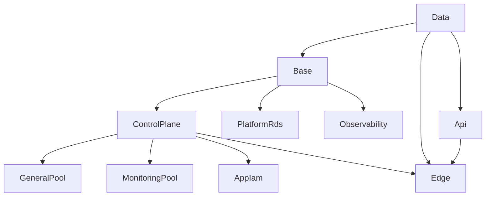

# CDK Platform Stack Reference

Complete reference for all stacks across the three CDK projects (`kubernetes`, `shared`, `org`). Each entry covers: what it creates, what problem it solves, its SSM outputs, deploy dependencies, and relevant lifecycle notes.

---

## Kubernetes project — 10 stacks

Deploy command: `npx cdk deploy --all -c project=kubernetes -c environment=dev`
Workflow: `.github/workflows/deploy-kubernetes.yml` → `_deploy-kubernetes.yml`

### Deployment order



---

### Stack 1: Data (`KubernetesDataStack`)

**Class:** `infra/lib/stacks/kubernetes/data-stack.ts`
**Stack ID:** `Kubernetes-Data-{env}` (namespace is empty string, see `projects.ts`)

**What it creates:**
- S3 assets bucket — article images, diagrams, and media files; versioned; block-all public access; served via CloudFront OAC; Intelligent-Tiering lifecycle in non-dev environments
- S3 access logs bucket — server access logs for the assets bucket; 90-day expiration; Checkov skip `CKV_AWS_18` (cannot log to itself — AWS limitation)
- SSM parameters publishing resource names for downstream discovery

**Why decoupled from compute:**
S3 lifecycle policies, CORS rules, and versioning changes have a different cadence than EC2 instances. A bucket policy update or OAC grant change should not touch the ASG or Launch Template.

**SSM outputs:** `/nextjs/{env}/assets-bucket-name`, `/nextjs/{env}/aws-region`

**CloudFormation outputs:** `AssetsBucketName`, `AssetsBucketArn`, `AssetsBucketRegionalDomainName`, `SsmParameterPrefix`

**Dependencies:** None — deploys first.

> **DynamoDB removal note:** DynamoDB was removed from this stack during the content pipeline consolidation into the Bedrock project's `AiContentStack` (`bedrock-{env}-ai-content`). The original `nextjs-personal-portfolio-{env}` table no longer lives in this stack. [Phase 5](../plans/2026-04-28-phase5-destroy-runbook.md) subsequently destroyed the remaining Bedrock DynamoDB tables (`bedrock-development-content`, `bedrock-development-strategist`). No DynamoDB resource remains anywhere in the kubernetes project — all persistence is now via PostgreSQL/RDS through PgBouncer.

---

### Stack 2: Base (`KubernetesBaseStack`)

**Class:** `infra/lib/stacks/kubernetes/base-stack.ts`
**Stack ID:** `Kubernetes-Base-{env}`

**What it creates:**
- VPC lookup (SharedVpc from `deploy-shared` — `Vpc.fromLookup` at synth time)
- 4 security groups (cluster base, control plane API, ingress/Traefik, monitoring)
- KMS key (CloudWatch log group encryption, auto-rotation enabled)
- Elastic IP (stable address — CloudFront origin and SSM access endpoint)
- Route 53 private hosted zone (`k8s.internal` — stable DNS for K8s API server)
- S3 scripts bucket (bootstrap scripts and manifests, synced by CI)
- NLB with HTTP (port 80) and HTTPS (port 443) target groups
- `SsmParameterStoreConstruct` publishing 12 SSM parameters

**Why decoupled from compute:**
The base layer is intentionally long-lived. VPC, SGs, KMS, and EIP rarely change. Decoupling avoids unnecessary ASG replacements when these change. Per the comment in `base-stack.ts`: "Lifecycle: Only re-deployed when hardware specs, networking rules, or storage configuration changes. Typically stable for weeks/months."

**SSM outputs (12 params at `/k8s/{env}/`):**
`vpc-id`, `elastic-ip`, `elastic-ip-allocation-id`, `security-group-id`, `control-plane-sg-id`, `ingress-sg-id`, `monitoring-sg-id`, `scripts-bucket`, `hosted-zone-id`, `api-dns-name`, `kms-key-arn`, `nlb-full-name`, `nlb-http-target-group-arn`, `nlb-https-target-group-arn`

**Dependencies:** None (VPC comes from `Vpc.fromLookup`, not a stack dependency).

---

### Stack 3: ControlPlane (`KubernetesControlPlaneStack`)

**Class:** `infra/lib/stacks/kubernetes/control-plane-stack.ts`
**Stack ID:** `Kubernetes-ControlPlane-{env}`

**What it creates:**
- Launch Template (Amazon Linux 2023, IMDSv2 enforced, Golden AMI from SSM `/k8s/{env}/golden-ami/latest`)
- ASG (min=1, max=1 — single control plane node with self-healing via ASG replacement)
- IAM role (SSM Session Manager, EBS attach/detach, S3 read, Route53 cert-manager DNS-01, KMS, CloudWatch)
- EIP-Failover Lambda (EventBridge lifecycle hook — migrates EIP from old to new instance on ASG replacement)
- CloudWatch log group (KMS-encrypted, `/k8s/{env}/control-plane`)
- SSM State Manager association (optional post-boot configuration)
- `AmiRefreshConstruct` (EventBridge + Step Functions — see note below)

**Why separate from Base:**
Runtime changes (new AMI, kubeadm upgrade, instance type change) redeploy this stack only. The VPC, SGs, and KMS key in Base are unaffected.

**Key design choice — `desiredCapacity` absent:**
CDK does NOT set `desiredCapacity` on the ASG. If set, every `cdk deploy` would reset capacity to that value, overriding Cluster Autoscaler decisions. `minCapacity=1` / `maxCapacity=1` constrains the control plane to exactly one node.

**SSM outputs:** `/k8s/{env}/instance-id` (written at runtime by the bootstrap script, not CDK)

**Dependencies:** BaseStack (`addDependency`).

**AmiRefreshConstruct note:**
The construct is scoped to `ControlPlaneStack` but receives `launchTemplateName` (a concrete string) from the worker stacks — not `launchTemplateId` (a CDK token). Using the ID would force `Fn::ImportValue` exports and create a cycle. Names are deterministic strings at synth time: `${poolId}-lt`.

---

### Stack 3b: GeneralPool (`KubernetesWorkerAsgStack`, `poolType: 'general'`)

**Class:** `infra/lib/stacks/kubernetes/worker-asg-stack.ts`
**Stack ID:** `Kubernetes-GeneralPool-{env}`

**What it creates:**
- Launch Template (Golden AMI from SSM, GP3 30 GiB root volume, IMDSv2)
- ASG (min=1, max=4, **On-Demand only**, Cluster Autoscaler discoverable via tags)
- IAM role (SSM + CloudWatch + ECR + S3 + EBS CSI + CA permissions)
- ASG lifecycle signals (40-minute timeout — bootstrap takes ~20 min for kubeadm join)

**Workloads:** Next.js frontend, start-admin, admin-api, public-api, wiki-mcp, ArgoCD, cert-manager, Traefik, crossplane

**Why On-Demand (not Spot):**
ArgoCD runs on this pool and manages BlueGreen promotions for all applications. A Spot interruption would evict ArgoCD mid-promotion, leaving the cluster in an indeterminate rollout state with no orchestrator to complete it. The cost delta for a single `t3.small` On-Demand vs Spot is negligible (~$8/mo).

**Node label (applied by bootstrap):** `node-pool=general`
**No taint** — accepts all pods without toleration.

**SSM consumed:** all `/k8s/{env}/` params from BaseStack (SGs, NLB TG ARNs, KMS, scripts bucket)

**Dependencies:** ControlPlaneStack (`addDependency`).

---

### Stack 3c: MonitoringPool (`KubernetesWorkerAsgStack`, `poolType: 'monitoring'`)

**Class:** `infra/lib/stacks/kubernetes/worker-asg-stack.ts`
**Stack ID:** `Kubernetes-MonitoringPool-{env}`

**What it creates:**
- Launch Template + ASG (min=1, max=2, **Spot instances**, `t3.medium`)
- IAM role (same grants as GeneralPool)
- SNS topic + email subscription for monitoring alerts (monitoring pool only)
- SSM parameter for SNS topic ARN

**Workloads:** Prometheus, Grafana, Loki, Tempo, Alloy, Steampipe

**Why Spot (unlike GeneralPool):**
Observability components tolerate interruption with a short gap. Prometheus is stateless (data in Loki/S3), Grafana re-initialises in <30 seconds. Spot provides ~70% cost reduction for these workloads.

**Node label (applied by bootstrap):** `node-pool=monitoring`
**Taint (applied by bootstrap):** `dedicated=monitoring:NoSchedule` — prevents general workloads from scheduling here without an explicit toleration.

**SSM outputs:** `/k8s/{env}/monitoring-sns-topic-arn`

**Dependencies:** ControlPlaneStack (`addDependency`).

---

### Stack 4: AppIam (`KubernetesAppIamStack`)

**Class:** `infra/lib/stacks/kubernetes/app-iam-stack.ts`
**Stack ID:** `Kubernetes-AppIam-{env}`

**What it creates:**
- IAM policy attachments on the control plane and general-pool instance roles
- Grants: S3 read — assets bucket + Bedrock KB data bucket (`arn:aws:s3:::bedrock-{env}-kb-data`)
- Grants: S3 write — assets bucket (admin image/video uploads — `PutObject`, `DeleteObject`)
- Grants: Lambda invoke — Bedrock pipeline-publish, pipeline-trigger, strategist-trigger (via IMDS, no static creds)
- Grants: Secrets Manager read — `nextjs/{env}/*` (Next.js auth secrets), `bedrock-{env}/bedrock-api-key*` (chatbot API key), `k8s-{env}/platform-rds/credentials-??????` (RDS credentials for ESO)
- Grants: SSM read — `/nextjs/{env}/*` and `/bedrock-{env}/*`
- Grants: DynamoDB read + write — **stale factory references** (`dynamoTableArns` prop still present in `infra/lib/projects/kubernetes/factory.ts` lines 377–388 pointing to tables destroyed in Phase 5; pending factory cleanup — these IAM statements are harmless but reference non-existent tables)

**Why decoupled from compute:**
Adding or removing a grant should not cause an ASG replacement. AppIam only modifies IAM policy documents — zero risk of EC2 churn.

**Dependencies:** ControlPlaneStack (`addDependency`).

---

### Stack 4b: PlatformRds (`PlatformRdsStack`)

**Class:** `infra/lib/stacks/kubernetes/platform-rds-stack.ts`
**Stack ID:** `Kubernetes-PlatformRds-{env}`

**What it creates:**
- RDS `DatabaseInstance` (PostgreSQL 16, `db.t3.micro` default)
- Security group (port 5432 open to VPC CIDR only — `publiclyAccessible: false`)
- Auto-generated Secrets Manager secret at `k8s-{env}/platform-rds/credentials`
- SSM parameters at `/k8s/{env}/platform-rds/endpoint`, `/k8s/{env}/platform-rds/port`, `/k8s/{env}/platform-rds/database-name`, `/k8s/{env}/platform-rds/secret-arn`
- Placement in public subnets (SharedVpc has no private subnets; access is controlled by SG, not subnet)

**Connection pooling:**
All K8s pods connect via PgBouncer (`pgbouncer.platform.svc.cluster.local:5432`). PgBouncer maintains ≤20 server connections to RDS, multiplexed to up to 200 pod-side clients. Direct-to-RDS connections are used only for migrations.

**Database name:** `tucaken` (hardcoded in factory — single platform database).

**Dependencies:** BaseStack (`addDependency` — needs the VPC object reference).

---

### Stack 5: Api (`NextJsApiStack`)

**Class:** `infra/lib/stacks/kubernetes/api-stack.ts`
**Stack ID:** `Kubernetes-Api-{env}`

**What it creates:**
- API Gateway REST API (CloudWatch access logging enabled)
- Lambda × 2 (`subscribe` + `verify`) with `NodejsFunction` esbuild bundling
- SQS Dead Letter Queue per Lambda (with CloudWatch alarm → SNS)
- Regional WAF (skipped via `skipWaf: true` — edge WAF on CloudFront covers this)
- SSM parameter for API Gateway URL

**Purpose:** Serverless email subscription API. Visitors submit their email; `subscribe` Lambda writes to DynamoDB and sends a verification email via SES; `verify` Lambda confirms the token.

**Why serverless (not K8s pod):**
Email subscriptions are low-volume and event-driven. A pod would idle at cost. API Gateway + Lambda scales to zero and costs ~$0.

**SSM outputs:** `/nextjs/{env}/api-gateway-url`

**Dependencies:** DataStack (`addDependency`).

---

### Stack 6: Edge (`KubernetesEdgeStack`)

**Class:** `infra/lib/stacks/kubernetes/edge-stack.ts`
**Stack ID:** `Kubernetes-Edge-{env}`
**Region:** `us-east-1` (mandatory — CloudFront and global WAF require us-east-1)

**What it creates:**
- ACM certificate (wildcard `*.{domain}` + root, cross-account DNS-01 validation via OrgProject DnsRole)
- WAF WebACL (`CLOUDFRONT` scope) — AWS managed rules (Core, BotControl, IP reputation) + IP allowlist for pre-launch restriction
- CloudFront distribution (dual origin: EIP for app traffic, S3 for static assets)
- Route 53 A alias record → CloudFront distribution
- SSM parameters for CloudFront distribution ID, domain, WAF ARN

**Traffic flow:**
`User → CloudFront (HTTPS/443) → Elastic IP (HTTP/80) → Traefik K8s ingress → Next.js pod`

CloudFront → EIP uses HTTP because Traefik's Let's Encrypt certificate (`ops.nelsonlamounier.com`) does not cover the main domain. CloudFront provides the HTTPS termination.

**Cross-region SSM reads:**
EIP and S3 bucket name are read from `eu-west-1` SSM using `AwsCustomResource` Lambda in `us-east-1`. The `eipSsmRegion` prop specifies the source region.

**Pre-launch IP restriction:**
WAF `allowedIps`/`allowedIpv6s` are populated from GitHub Secrets via `ALLOW_IPV4`/`ALLOW_IPV6`. Set `RESTRICT_ACCESS=false` in the GitHub Environment to disable on go-live.

**SSM outputs (in eu-west-1):** `/nextjs/{env}/cloudfront/distribution-id`, `/nextjs/{env}/cloudfront/distribution-domain`, `/nextjs/{env}/cloudfront/waf-arn`
Also writes admin service URLs: `/bedrock-{env}/admin-api-url`, `/bedrock-{env}/public-api-url`

**Dependencies:** ControlPlaneStack, DataStack, ApiStack (`addDependency` × 3).

---

### Stack 7: Observability (`KubernetesObservabilityStack`)

**Class:** `infra/lib/stacks/kubernetes/observability-stack.ts`
**Stack ID:** `Kubernetes-Observability-{env}`

**What it creates:**
- CloudWatch Infrastructure Dashboard (EC2, ASG, NLB, EBS, EIP metrics)
- CloudWatch Operations Dashboard (API GW, Lambda, self-healing agent, tool function invocations)

**Cost:** $3.00/month (CloudWatch custom dashboard resource).

**Purpose:** Pre-Grafana visibility. When the cluster is first bootstrapped or Grafana is unavailable, this dashboard provides EC2 health, NLB throughput, and self-healing Lambda metrics from the AWS Console.

**All resource references resolved via SSM** — no CDK token or props from other stacks. Fully decoupled from compute lifecycle.

**Dependencies:** BaseStack (`addDependency`).

---

## Shared project — 5 stacks

Deploy command: `npx cdk deploy --all -c project=shared -c environment=dev`
Workflow: `.github/workflows/deploy-shared.yml` (stacks 1–4 deploy in parallel)

### Stack 1: Infra (`SharedVpcStack`)

**What it creates:**
- VPC (3 AZs, public subnets only, no NAT gateway — `natGateways: 0`)
- VPC Flow Logs (CloudWatch, KMS-encrypted in non-dev environments)
- 5 ECR repositories: `nextjs-frontend`, `start-admin`, `public-api`, `admin-api`, `wiki-mcp`
- SSM parameters: `/shared/ecr-{service}/{env}/{repository-uri|arn|name}` per repo

**Why no private subnets:**
Private subnets require NAT gateways ($32/mo each × 3 AZs = $96/mo). The VPC relies on security groups as the access boundary. RDS and other resources use `publiclyAccessible: false` with SG rules restricting access to VPC CIDR only.

### Stack 2: SecurityBaseline (`SecurityBaselineStack`)

**What it creates:**
- GuardDuty (core detection — no S3 Protection or EKS extras)
- Security Hub (auto-enabled controls)
- IAM Access Analyzer (account scope — free tier)
- CloudTrail (1 free management trail, S3 retention 90 days)
- EventBridge rule: CloudFormation stack failures → SNS email alert

**Cost:** ~$3–8/month. GuardDuty core is usage-based; Security Hub free for 30 days then ~$0.001/resource/month.

### Stack 3: FinOps (`FinOpsStack`)

**What it creates:**
- AWS Budget (account total): dev=$100, staging=$200, prod=$500 per month
- AWS Budget (Bedrock-only): dev=$30, staging=$75, prod=$150 per month
- Alert thresholds: 50% actual, 80% actual, 100% forecasted → SNS email

**Cost:** Free (first 2 budgets per account).

### Stack 4: Crossplane (`CrossplaneStack`)

**What it creates:**
- IAM user `crossplane-{env}` with tightly scoped S3/SQS/KMS permissions
- Secrets Manager secret storing access key ID and secret access key

**Purpose:** Crossplane's AWS provider uses static IAM credentials (Secrets Manager → K8s Secret via ESO) to manage cloud resources from Kubernetes manifests (S3 buckets, SQS queues). The IAM user scope is minimal — only the resources Crossplane actually manages.

**Cost:** ~$0.40/month (single Secrets Manager secret).

### Stack 5: CognitoAuth (`CognitoAuthStack`)

**What it creates:**
- Cognito User Pool (`portfolio-admin`, self-sign-up disabled)
- Single admin user (seeded via `adminEmail` — `lamounierleao@gmail.com` as default)
- App client (OAuth 2.0, Authorization Code + PKCE flow)
- Hosted UI domain
- Callback URLs for local dev (`:3000`, `:5001`) and production (`nelsonlamounier.com`)
- SSM parameters under `/nextjs/{env}/auth/`: `cognito-user-pool-id`, `cognito-client-id`, `cognito-issuer-url`, `cognito-domain`

**Cost:** Free (Cognito free tier: 50,000 MAUs — this pool has 1 user).

**Removal policy:** `RETAIN` in production, `DESTROY` in dev/staging. Retaining in production prevents accidental pool deletion from clearing the admin user's password.

---

## Org project — 1 stack

Deploy command: `npx cdk deploy --all -c project=org -c environment=prod -c hostedZoneIds=Z123 -c trustedAccountIds=111,222`
Workflow: `.github/workflows/deploy-org.yml`

### Stack 1: DnsRole (`CrossAccountDnsRoleStack`)

**Class:** `infra/lib/stacks/org/dns-role-stack.ts`
**Stack ID:** `Org-DnsRole-prod`
**Account:** Management/root account (separate from the workload account)

**What it creates:**
- IAM role allowing child workload accounts to assume it
- Route 53 `ChangeResourceRecordSets` permission scoped to specified hosted zone IDs
- Optional `externalId` for additional security

**Purpose:** ACM certificates require DNS-01 validation. The domain's Route 53 hosted zone lives in the management account. CDK's `DnsValidatedCertificate` needs to create a CNAME record in that zone. Rather than giving the workload account broad Route 53 access, the DnsRole provides minimal scoped access via cross-account assume-role.

**Used by:** `KubernetesEdgeStack` (`crossAccountRoleArn` prop → passed to `AcmCertificate` construct).

---

## GitHub Actions pipeline — workflow index

| Workflow | Trigger | Stacks deployed |
|---|---|---|
| `ci.yml` | Every push | None — lint, test, synth validation |
| `deploy-kubernetes.yml` | Weekly (Mon 06:00) + manual | Calls `_deploy-kubernetes.yml` |
| `_deploy-kubernetes.yml` | `workflow_call` | 10 stacks in ordered sequence |
| `deploy-shared.yml` | Manual | 4 shared stacks (parallel) + CognitoAuth |
| `_deploy-stack.yml` | `workflow_call` | Single CDK stack (reusable) |
| `deploy-api.yml` | Manual | API stack only |
| `deploy-org.yml` | Manual | DnsRole stack |
| `day-1-orchestration.yml` | Manual | K8s SSM bootstrap (no CDK stacks) |
| `build-ci-image.yml` | Manual | Docker CI image build + push to GHCR |
| `_verify-stack.yml` | `workflow_call` | Integration tests post-deploy |

### Ordered deploy sequence (`_deploy-kubernetes.yml`)

```
0. Verify BFF ECR repo exists (pre-flight)
1. Data → verify-data
2. Base → verify-base
   2c. API (parallel with Base)
   2d. Observability (parallel after verify-base)
   2e. PlatformRds (parallel after verify-base)
3. ControlPlane
   3b. GeneralPool (parallel after ControlPlane)
   3c. MonitoringPool (parallel after ControlPlane)
4. AppIam
5. Edge → verify-edge
6. Failure alert + summary
```

Integration tests (verify-data, verify-base, verify-edge) run between stages. A failing test halts the pipeline before the next stage deploys.

<!--
Evidence trail (auto-generated):
- Source: infra/lib/projects/kubernetes/factory.ts (read on 2026-04-28)
- Source: infra/lib/projects/shared/factory.ts (read on 2026-04-28)
- Source: infra/lib/projects/org/factory.ts (read on 2026-04-28)
- Source: infra/lib/stacks/kubernetes/base-stack.ts (read on 2026-04-28)
- Source: infra/lib/stacks/kubernetes/control-plane-stack.ts (read on 2026-04-28)
- Source: infra/lib/stacks/kubernetes/worker-asg-stack.ts (read on 2026-04-28)
- Source: infra/lib/stacks/kubernetes/platform-rds-stack.ts (read on 2026-04-28)
- Source: infra/lib/stacks/kubernetes/api-stack.ts (read on 2026-04-28)
- Source: infra/lib/stacks/kubernetes/edge-stack.ts (read on 2026-04-28)
- Source: infra/lib/stacks/kubernetes/observability-stack.ts (read on 2026-04-28)
- Source: infra/lib/stacks/kubernetes/data-stack.ts (read on 2026-04-28) — DynamoDB removal confirmed
- Source: infra/lib/stacks/kubernetes/app-iam-stack.ts (read on 2026-04-28) — dynamoTableArns props still present, stale
- Source: docs/plans/2026-04-28-phase5-destroy-runbook.md (read on 2026-04-28) — Phase 5 destroyed bedrock DynamoDB tables
- Source: .github/workflows/_deploy-kubernetes.yml (read on 2026-04-28)
- Source: .github/workflows/deploy-shared.yml (read on 2026-04-28)
-->
