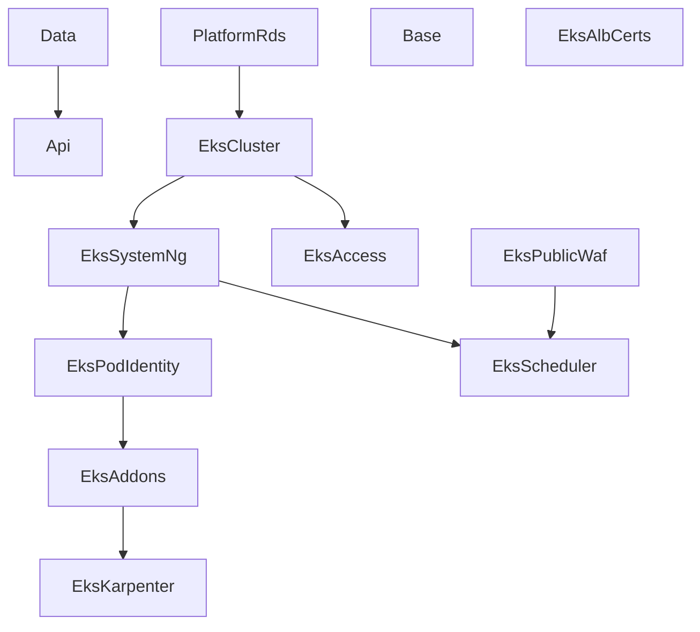

# CDK Platform Stack Reference

Complete reference for the **active** stacks across the three CDK projects
(`kubernetes`, `shared`, `org`). Each entry covers: what it creates, what problem
it solves, its SSM outputs (where verifiable), deploy dependencies, and relevant
lifecycle notes.

The platform now runs on **managed Amazon EKS** — Karpenter for node scaling, Pod
Identity for workload IAM, and the AWS Load Balancer Controller (public ALB) as
the sole public entrypoint. The earlier kubeadm control plane, worker ASG pools,
and CloudFront edge stacks are frozen reference implementations under
`infra/lib/stacks/kubernetes/deprecated/` and are **not** instantiated by any
factory — see [Deprecated (kubeadm-era)](#deprecated-kubeadm-era) below.

For the design behind this stack set, read
[EKS platform architecture](../concepts/eks-platform-architecture.md) and
[Karpenter and Pod Identity provisioning](../concepts/karpenter-pod-identity-provisioning.md).
For the repo, its ownership boundaries, and sibling repos, start at the canonical
entry point: [cdk-monitoring Platform](cdk-monitoring-platform.md).

## Stack inventory

**19 active stack classes** across the three projects:

| Project | Active stacks | Namespace prefix |
| --- | --- | --- |
| `kubernetes` | 13 (EKS set + Data/Base/PlatformRds/Api) | none — stack ID is `<Component>-<env>` |
| `shared` | 5 | `Shared-<Component>-<env>` |
| `org` | 1 | `Org-<Component>-<env>` |

Stack IDs come from `stackId(namespace, component, environment)` in
`infra/lib/utilities/naming.ts`. The `kubernetes` project namespace is the empty
string (`infra/lib/config/projects.ts`), so its stack IDs have **no** `Kubernetes-`
prefix — e.g. `EksCluster-development`, `Base-development`, not
`Kubernetes-EksCluster-development`.

Two of the 13 kubernetes stacks are conditional: `EksScheduler` is gated to
`Environment.DEVELOPMENT`, and `EksAlbCerts` is created only when the
`nelsonlamounier.com` plus both Tucaken hosted-zone IDs and the cross-account role
ARN are configured (factory soft-skip).

---

## Kubernetes project

Deploy command: `npx cdk deploy --all -c project=kubernetes -c environment=dev`
Factory: `infra/lib/projects/kubernetes/factory.ts`

### Deployment order

The graph below reflects the actual `addDependency()` wiring in the factory — not
a simplified diagram. `Base`, `EksPublicWaf`, and `EksAlbCerts` carry no explicit
stack dependency (they resolve inputs from SSM at deploy time or take only
context/props).

The EKS sequence is `EksCluster -> EksSystemNg -> EksPodIdentity -> EksAddons ->
EksKarpenter`, with `EksAccess` branching off `EksCluster` only. Notably
`EksCluster` depends on `PlatformRds`, and the dev-only `EksScheduler` depends on
both `EksSystemNg` and `EksPublicWaf`.

---

### Data (`KubernetesDataStack`)

**Class:** `infra/lib/stacks/kubernetes/data-stack.ts`
**Stack ID:** `Data-{env}`

**What it creates:**
- S3 assets bucket — images and media, read by in-cluster workloads via IAM
- S3 access-logs bucket — server access logs for the assets bucket
- SSM parameters — bucket name and region, for cross-stack discovery
- CloudFormation outputs consumed by downstream stacks

**Why decoupled from compute:** the data layer changes rarely — a bucket policy,
CORS rule, or lifecycle change should not ripple into the cluster stacks.

**DynamoDB note:** DynamoDB is no longer in this stack. It was consolidated into
the Bedrock project's `AiContentStack` (`bedrock-{env}-ai-content`); the old
`nextjs-personal-portfolio-{env}` table was removed during the content-pipeline
consolidation. ECR likewise moved to `SharedVpcStack`; applications discover it
via `/shared/ecr/{env}/repository-*`.

**Dependencies:** none — deploys first.

---

### Base (`KubernetesBaseStack`)

**Class:** `infra/lib/stacks/kubernetes/base-stack.ts`
**Stack ID:** `Base-{env}`

**What it creates (per the stack JSDoc):**
- VPC lookup (SharedVpc from `deploy-shared` — `Vpc.fromLookup` at synth time)
- 4 security groups via `SecurityGroupConstruct` (cluster base, control plane API,
  ingress, monitoring)
- KMS key (CloudWatch log-group encryption, auto-rotation enabled)
- Elastic IP (shared stable address)
- Route 53 private hosted zone (`k8s.internal`)
- S3 scripts bucket (bootstrap scripts and manifests, synced by CI)
- 12 SSM parameters via `SsmParameterStoreConstruct`

**Lifecycle:** intentionally long-lived — the stack JSDoc states it is "only
re-deployed when hardware specs, networking rules, or storage configuration
changes. Typically stable for weeks/months." It is retained across the
kubeadm-to-EKS migration as the shared, slow-moving base layer.

**Dependencies:** none (VPC comes from `Vpc.fromLookup`, not a stack dependency).

---

### PlatformRds (`PlatformRdsStack`)

**Class:** `infra/lib/stacks/kubernetes/platform-rds-stack.ts`
**Stack ID:** `PlatformRds-{env}`

**What it creates:**
- RDS `DatabaseInstance` — single PostgreSQL 16 + pgvector instance (replaces
  `RdsPgVectorStack` from `ai-applications`)
- Database security group — created here but with **no** CIDR ingress; approved
  client stacks add explicit SG-to-SG rules. `publiclyAccessible: false`
- Auto-generated Secrets Manager credentials
- SSM parameters for endpoint/port/database-name/secret discovery

**Placement:** isolated subnets resolved from SSM at deploy time (not
`Vpc.fromLookup`), so the stack never caches subnet discovery and does not depend
on the subnets existing at synth.

**Connection pooling:** all pods connect via PgBouncer
(`pgbouncer.platform.svc.cluster.local:5432`), which maintains <=20 server
connections to RDS multiplexed to up to 200 pod-side clients.

**Database name:** `tucaken` (set in the factory — single platform database).

**Dependencies:** none declared (resolves the VPC from SSM). Note `EksCluster`
declares a dependency **on** this stack, so it deploys before the cluster.

---

### Api (`NextJsApiStack`)

**Class:** `infra/lib/stacks/kubernetes/api-stack.ts`
**Stack ID:** `Api-{env}`

**What it creates:**
- API Gateway REST API with CloudWatch access logging
- Lambda x2 (`subscribe` + `verify`) for email subscriptions
- Per-function SQS Dead Letter Queue with CloudWatch alarm -> SNS
- Regional WAF (**skipped** — the factory passes `skipWaf: true`; edge/ALB WAF
  covers this surface)
- SSM parameter for the API Gateway URL

**Purpose:** serverless, event-driven email subscription API — scales to zero, so
no idle pod cost. Article endpoints were removed; articles are served in-cluster.

**Dependencies:** `Data` (`addDependency`).

---

### EksCluster (`EksClusterStack`)

**Class:** `infra/lib/stacks/kubernetes/eks-cluster-stack.ts`
**Stack ID:** `EksCluster-{env}`

**What it creates:**
- The managed EKS cluster (control plane) and its CDK-generated cluster IAM role
- KMS envelope key for Kubernetes Secrets (`alias/{clusterName}-secrets`,
  rotation enabled, `RemovalPolicy.RETAIN`)
- CloudWatch log group for control-plane logs
- Publishes cluster discovery parameters to SSM

**What it does NOT create:** any node group — that is owned by `EksSystemNg`.

**Subnets:** PUBLIC only (V1 dev runs without a NAT gateway, per the cost
guardrail). Exposes the looked-up SharedVpc so sibling stacks can read `vpcId`.

**Dependencies:** `PlatformRds` (`addDependency`).

---

### EksSystemNg (`EksSystemNodeGroupStack`)

**Class:** `infra/lib/stacks/kubernetes/eks-system-node-group-stack.ts`
**Stack ID:** `EksSystemNg-{env}`

**What it creates:**
- Managed node group — 2x `t3.medium` across 2 AZs, tainted
  `dedicated=system:NoSchedule`; hosts cluster-critical pods (Karpenter
  controller, CoreDNS, kube-proxy, addon controllers, monitoring stack)
- Node IAM role with the four EKS worker managed policies
  (`AmazonEKSWorkerNodePolicy`, `AmazonEC2ContainerRegistryReadOnly`,
  `AmazonEKS_CNI_Policy`, `AmazonSSMManagedInstanceCore`)
- The `vpc-cni` and `kube-proxy` `CfnAddon`s — deliberately placed here (not in
  `EksPodIdentity`) to break a timing deadlock: nodes need the CNI DaemonSet to
  reach Ready before this stack completes

**Subnets:** PUBLIC only (V1 dev — no NAT gateway).

**Dependencies:** `EksCluster` (`addDependency`).

---

### EksPodIdentity (`EksPodIdentityStack`)

**Class:** `infra/lib/stacks/kubernetes/eks-pod-identity-stack.ts`
**Stack ID:** `EksPodIdentity-{env}`

**What it creates:**
- One least-privilege IAM role per binding, each linked to a Kubernetes
  ServiceAccount via `CfnPodIdentityAssociation` (**replaces IRSA**)
- The `eks-pod-identity-agent` addon
- CoreDNS wiring

**Props of note:** takes the Karpenter interruption-queue ARN, the worker node
role ARN, hosted-zone IDs, an optional cross-account DNS role ARN (ExternalDNS
`sts:AssumeRole` for cross-account Route 53 writes), and the Grafana alerting SNS
topic ARN.

**Dependencies:** `EksSystemNg` (`addDependency`).

---

### EksAddons (`EksAddonsStack`)

**Class:** `infra/lib/stacks/kubernetes/eks-addons-stack.ts`
**Stack ID:** `EksAddons-{env}`

**What it creates:** Helm-installed cluster addons in order — External Secrets
Operator -> AWS Load Balancer Controller -> external-dns -> Karpenter (chart) ->
EBS CSI (VPC CNI is the managed addon, installed earlier). The ServiceAccounts
these charts declare are the ones `EksPodIdentity` binds IAM roles to.

**V1 scheduling detail:** these addons tolerate `dedicated=system:NoSchedule` so
they land on the system MNG before Karpenter has provisioned any workload node —
otherwise the ALB controller webhook has no endpoints and every Service create
fails admission.

**Props of note:** `hostedZoneDomains` (ExternalDNS `--domain-filter` per apex
domain) and an optional `crossAccountDnsRoleArn` (`--aws-assume-role`).

**Dependencies:** `EksPodIdentity` (`addDependency`).

---

### EksKarpenter (`EksKarpenterStack`)

**Class:** `infra/lib/stacks/kubernetes/eks-karpenter-stack.ts`
**Stack ID:** `EksKarpenter-{env}`

**What it creates:**
- SQS interruption queue (`{clusterName}-karpenter`, 5-minute retention,
  `enforceSSL`) with an EC2/Spot-interruption resource policy
- EventBridge rules wiring interruption events to the queue
- The `NodePool` and `EC2NodeClass` CRDs — the Karpenter runtime data plane
- Optional elastic system-tier NodePool (tainted `dedicated=system:NoSchedule`,
  labelled `node-role=system`, weight 10)

The Karpenter Helm **chart** is installed by `EksAddons`; this stack supplies the
queue and CRDs it needs at runtime.

**Dependencies:** `EksAddons` (`addDependency`).

---

### EksAccess (`EksAccessStack`)

**Class:** `infra/lib/stacks/kubernetes/eks-access-stack.ts`
**Stack ID:** `EksAccess-{env}`

**What it creates:** EKS **Access Entries** binding IAM principals to cluster
RBAC, replacing the `aws-auth` ConfigMap. Admins get
`AmazonEKSClusterAdminPolicy` at cluster scope. Principals are the union of config
admins, an SSM `StringList` of admin ARNs, and CI-injected env vars
(`GH_OIDC_ROLE_ARN`, `ADMIN_ROLE_ARN`).

**Dependencies:** `EksCluster` only (`addDependency`).

---

### EksPublicWaf (`EksPublicWafStack`)

**Class:** `infra/lib/stacks/kubernetes/eks-public-waf-stack.ts`
**Stack ID:** `EksPublicWaf-{env}`
**Region:** eu-west-1 (REGIONAL WebACL must share the ALB's region)

**What it creates:**
- REGIONAL WAF WebACL for the shared ALB — host-scoped IP allowlist + AWS managed
  rule sets + per-IP rate limit. Attached to workload Ingresses via
  `alb.ingress.kubernetes.io/wafv2-acl-arn`
- Empty IP sets populated at deploy time by the `IpSyncFn` Lambda from SSM (fired
  by EventBridge within seconds — no CDK redeploy to change allowlist IPs)
- Optional `waf-annotator` IAM role + Pod Identity association (when a cluster
  name is supplied)

**SSM output:** publishes the WebACL ARN to `{ssmPrefix}/eks/waf-acl-arn`.

**Factory config highlights:** operator hosts (`admin.*`, `ops.*`) stay IP-gated;
Tucaken product domains default-ALLOW behind managed rules + rate limit
(`rateLimitPerIp: 2000`); `/api/github/webhook` is exempted from the allowlist and
body-inspecting rules (HMAC-verified GitHub webhook).

**Dependencies:** none declared (independent).

---

### EksScheduler (`EksSchedulerStack`) — dev only

**Class:** `infra/lib/stacks/kubernetes/eks-scheduler-stack.ts`
**Stack ID:** `EksScheduler-{env}`

**Instantiated only for `Environment.DEVELOPMENT`** (factory gate).

**What it creates:** two Lambdas driven by EventBridge Scheduler on
Europe/Dublin cron:
- Scale-up (04:00 daily): MNG `minSize=1`/`desiredSize=1`, Karpenter -> 1,
  ArgoCD x7 -> 1, WAF IP sync
- Scale-down (23:00 daily): Karpenter -> 0, ArgoCD x7 -> 0, terminate all
  Karpenter EC2s, MNG `minSize=0`/`desiredSize=0`

Scale-down pre-zeros Karpenter and ArgoCD via the K8s API before draining the MNG
so no orphaned nodes survive shutdown; scale-up restores Karpenter and ArgoCD, and
everything else recovers through ArgoCD reconciliation.

**Dependencies:** `EksSystemNg` **and** `EksPublicWaf` (`addDependency` x2).

---

### EksAlbCerts (`EksAlbCertsStack`) — conditional

**Class:** `infra/lib/stacks/kubernetes/eks-alb-certs-stack.ts`
**Stack ID:** `EksAlbCerts-{env}`
**Region:** eu-west-1 (ALB requires certificates in its own region)

**Created only when** `nelsonlamounier.com` + both Tucaken hosted-zone IDs + the
cross-account role ARN are configured (factory soft-skip otherwise).

**What it creates:** one wildcard ACM certificate per apex domain —
`*.nelsonlamounier.com`, `*.tucaken.io`, `*.tucaken.com` (each with the apex SAN).
The AWS Load Balancer Controller attaches all of them to the shared ALB and serves
the right cert per Host via SNI. DNS-01 validation runs through the cross-account
validation Lambda against the management-account hosted zones.

**SSM outputs:** ARNs published under stable keys
`alb-cert-arns/{nelsonlamounier|tucaken-io|tucaken-com}` (workload Helm charts
reference these).

**Dependencies:** none declared (independent).

---

## Shared project

Deploy command: `npx cdk deploy --all -c project=shared -c environment=dev`
Factory: `infra/lib/projects/shared/factory.ts` (5 stacks)

### Infra (`SharedVpcStack`)

**Class:** `infra/lib/shared/vpc-stack.ts`
**Stack ID:** `Shared-Infra-{env}`

- VPC with public subnets and VPC Flow Logs (KMS-encrypted outside dev)
- 5 ECR repositories: `nextjs-frontend`, `tucaken-app`, `public-api`, `admin-api`,
  `wiki-mcp`
- SSM parameters `/shared/ecr-{service}/{env}/{repository-uri|arn|name}` per repo

This is the shared VPC the `kubernetes` stacks resolve via `Vpc.fromLookup` / SSM.
Deploy this project first.

### SecurityBaseline (`SecurityBaselineStack`)

**Class:** `infra/lib/stacks/shared/security-baseline-stack.ts`
**Stack ID:** `Shared-SecurityBaseline-{env}`

- GuardDuty (core detection), Security Hub, IAM Access Analyzer (account scope)
- CloudTrail (one management trail, S3 retention)
- EventBridge rule: CloudFormation failure -> SNS email

Cost: ~$3-8/month for a small account (per the stack/factory notes).

### FinOps (`FinOpsStack`)

**Class:** `infra/lib/stacks/shared/finops-stack.ts`
**Stack ID:** `Shared-FinOps-{env}`

- AWS Budget (account total): dev=$100, staging=$200, prod=$500 per month
- AWS Budget (Bedrock-scoped): dev=$30, staging=$75, prod=$150 per month
- Alert thresholds: 50%, 80%, 100% -> SNS email

Cost: free (first 2 budgets per account).

### Crossplane (`CrossplaneStack`)

**Class:** `infra/lib/stacks/shared/crossplane-stack.ts`
**Stack ID:** `Shared-Crossplane-{env}`

- Dedicated IAM user with tightly scoped S3/SQS/KMS permissions
- Access key stored in Secrets Manager (rotation-ready)

Cost: ~$0.40/month (single Secrets Manager secret). Pairs with the Crossplane
ArgoCD Application in the bootstrap repo.

### CognitoAuth (`CognitoAuthStack`)

**Class:** `infra/lib/stacks/shared/cognito-auth-stack.ts`
**Stack ID:** `Shared-CognitoAuth-{env}`

- Cognito User Pool + Hosted UI domain, single pre-seeded admin user
- App client (OAuth 2.0 Authorization Code flow, integrates with next-auth)
- SSM parameters under `/nextjs/{env}/auth/` (user pool ID, client ID, issuer URL,
  domain)

**Removal policy:** `RETAIN` in production, `DESTROY` in dev/staging. Replaced the
former Auth.js v5 Credentials provider that suffered Edge Runtime and CSRF issues
behind CloudFront.

---

## Org project

Deploy command:
`npx cdk deploy --all -c project=org -c environment=prod -c hostedZoneIds=Z123 -c trustedAccountIds=111,222`
Factory: `infra/lib/projects/org/factory.ts` (1 stack)

### DnsRole (`CrossAccountDnsRoleStack`)

**Class:** `infra/lib/stacks/org/dns-role-stack.ts`
**Stack ID:** `Org-DnsRole-{env}`
**Account:** management/root account (where the Route 53 hosted zones live)

- IAM role that trusted workload accounts assume to write ACM DNS-01 validation
  records, scoped to the specified hosted-zone IDs, with an optional `externalId`

**Used by:** `EksAlbCertsStack` (cross-account ACM validation for the ALB wildcard
certs). Formerly also used by the now-deprecated CloudFront edge stacks.

---

## Deprecated (kubeadm-era)

The pre-EKS stacks live in `infra/lib/stacks/kubernetes/deprecated/` and are
**frozen reference implementations** — no factory instantiates them, and the
factory registry skips any class whose name starts with `Deprecated_`. Do not
import or deploy them.

| File | Original purpose | Replaced by |
| --- | --- | --- |
| `control-plane-stack.ts` | kubeadm control-plane EC2 + ASG + EIP failover | EKS managed control plane (`EksClusterStack`) |
| `worker-asg-stack.ts` | Parameterised general/monitoring worker ASG pools | Karpenter (`EksKarpenterStack`) + system MNG |
| `app-iam-stack.ts` | Instance-role IAM grants for pods | Pod Identity (`EksPodIdentityStack`) |
| `edge-stack.ts` | CloudFront + WAF + ACM for `nelsonlamounier.com` | ALB + `EksAlbCertsStack` + `EksPublicWafStack` + ExternalDNS |
| `tucaken-edge-stack.ts` | CloudFront edge for the Tucaken domains | same as above (shared ALB) |
| `observability-stack.ts` | Pre-Grafana CloudWatch dashboard | in-cluster Prometheus/Grafana |
| `oidc-stack.ts` | IRSA OIDC provider | Pod Identity |

The migration rationale and destroy ordering are captured in
`docs/superpowers/specs/2026-05-05-eks-migration-design.md`. The edge stacks were
removed from the kubernetes factory in Plan 5b Phase 5; run
`cdk destroy Edge-<env>` and `cdk destroy TucakenEdge-<env>` post-merge to
deprovision the legacy CloudFront distributions.

---

## Related

- [cdk-monitoring Platform](cdk-monitoring-platform.md) — canonical project entry
  point: what this repo is, what it owns, and how sibling repos relate
- [EKS platform architecture](../concepts/eks-platform-architecture.md) — the
  deeper design behind the EKS stack set and failure-domain decomposition
- [Karpenter and Pod Identity provisioning](../concepts/karpenter-pod-identity-provisioning.md)
  — how node scaling and workload IAM are wired

<!--
Evidence trail (auto-generated):
- Source: infra/lib/projects/kubernetes/factory.ts (read on 2026-07-06) — active stack set + addDependency wiring; EksCluster depends on PlatformRds; EksScheduler dev-only + depends on EksSystemNg & EksPublicWaf; EksAlbCerts conditional
- Source: infra/lib/projects/shared/factory.ts (read on 2026-07-06) — 5 shared stacks incl. SharedVpc; 5 ECR repos
- Source: infra/lib/projects/org/factory.ts (read on 2026-07-06) — DnsRole is the sole org stack
- Source: infra/lib/utilities/naming.ts (read on 2026-07-06) — stackId returns `<component>-<env>` when namespace is empty
- Source: infra/lib/config/projects.ts (read on 2026-07-06) — kubernetes namespace = '' (no prefix); Shared/Org namespaces confirmed
- Source: infra/lib/stacks/kubernetes/data-stack.ts (read on 2026-07-06) — DynamoDB moved to Bedrock AiContentStack; ECR moved to SharedVpcStack
- Source: infra/lib/stacks/kubernetes/base-stack.ts (read on 2026-07-06) — 4 SGs, KMS, EIP, k8s.internal PHZ, 12 SSM params
- Source: infra/lib/stacks/kubernetes/platform-rds-stack.ts (read on 2026-07-06) — PostgreSQL 16 + pgvector; SG with no CIDR ingress; SSM-resolved subnets
- Source: infra/lib/stacks/kubernetes/api-stack.ts (read on 2026-07-06) — subscribe/verify Lambdas; skipWaf true in factory
- Source: infra/lib/stacks/kubernetes/eks-cluster-stack.ts (read on 2026-07-06) — cluster + secrets KMS key; no node group; public subnets
- Source: infra/lib/stacks/kubernetes/eks-system-node-group-stack.ts (read on 2026-07-06) — 2x t3.medium; system taint; vpc-cni/kube-proxy CfnAddons here
- Source: infra/lib/stacks/kubernetes/eks-pod-identity-stack.ts (read on 2026-07-06) — one role per binding; CfnPodIdentityAssociation; replaces IRSA
- Source: infra/lib/stacks/kubernetes/eks-addons-stack.ts (read on 2026-07-06) — ESO/ALB/external-dns/Karpenter/EBS CSI Helm order
- Source: infra/lib/stacks/kubernetes/eks-karpenter-stack.ts (read on 2026-07-06) — SQS interruption queue + NodePool/EC2NodeClass CRDs
- Source: infra/lib/stacks/kubernetes/eks-access-stack.ts (read on 2026-07-06) — EKS Access Entries replacing aws-auth
- Source: infra/lib/stacks/kubernetes/eks-alb-certs-stack.ts (read on 2026-07-06) — eu-west-1 ACM wildcards; alb-cert-arns/* SSM keys
- Source: infra/lib/stacks/kubernetes/eks-public-waf-stack.ts (read on 2026-07-06) — REGIONAL WebACL; IpSyncFn; {ssmPrefix}/eks/waf-acl-arn
- Source: infra/lib/stacks/kubernetes/eks-scheduler-stack.ts (read on 2026-07-06) — dev-only start/stop scheduler
- Source: infra/lib/shared/vpc-stack.ts (read on 2026-07-06) — SharedVpc + 5 ECR repos
- Source: infra/lib/stacks/shared/{security-baseline,finops,crossplane,cognito-auth}-stack.ts (read on 2026-07-06)
- Source: infra/lib/stacks/org/dns-role-stack.ts (read on 2026-07-06) — cross-account Route53 validation role
- Source: infra/lib/stacks/kubernetes/deprecated/{control-plane,worker-asg,app-iam,edge,tucaken-edge,observability,oidc}-stack.ts (listed + headers read on 2026-07-06) — frozen kubeadm-era references
- Source: docs/superpowers/specs/2026-05-05-eks-migration-design.md (exists; referenced by deprecated stack headers, verified on 2026-07-06)
-->
