## What self-healing means in this platform

Self-healing is the platform's ability to detect and recover from known infrastructure failure modes without human intervention — or to narrow the blast radius and surface the root cause clearly when manual intervention is unavoidable.

Two independent automation pipelines cover different failure classes:

| Pipeline | Trigger | Failure class covered |
|:---------|:--------|:----------------------|
| **Bedrock Agent** | CloudWatch Alarm → EventBridge | Node bootstrap failures, cluster health degradation |
| **AMI Refresh** | SSM Parameter Store change → EventBridge | Golden AMI drift — nodes running stale AMI after a new bake |

Neither pipeline replaces all human intervention. Cross-AZ recovery (AZ failure requiring CDK redeploy), CCM deadlock (circular bootstrap dependency), and permanent failure codes (classified non-transient by the agent) still require operator action. The platform reduces the frequency and severity of pages, not their possibility.

---

## Architecture overview

```mermaid
graph TD
    subgraph "Trigger Layer"
        CW[CloudWatch Alarm<br/>bootstrap-orchestrator]
        SSM_PARAM[SSM Parameter<br/>/k8s/&#123;env&#125;/golden-ami/latest<br/>updated by AMI bake CI job]
    end

    subgraph "Event Routing"
        EB1[EventBridge Rule<br/>bootstrap alarm]
        EB2[EventBridge Rule<br/>SSM Parameter Store Change]
    end

    subgraph "Bedrock Agent Pipeline"
        AGENT[Agent Lambda<br/>self-healing-dev-agent]
        BEDROCK[Bedrock<br/>Claude Sonnet 4.6<br/>ConverseCommand loop]
        S3_SESSION[S3 Session Store<br/>previous context]

        subgraph "MCP Tool Lambdas"
            T1[diagnose-alarm]
            T2[ebs-detach]
            T3[analyse-cluster-health]
        end

        subgraph "SSM Actions"
            SSM_CMD[SSM SendCommand<br/>run_summary.json fetch<br/>kubectl get nodes]
            SSM_AUTO[SSM StartAutomationExecution<br/>cp-document / worker-document]
        end
    end

    subgraph "AMI Refresh Pipeline"
        SFN[Step Functions<br/>ami-refresh state machine<br/>2h timeout, X-Ray traced]
        LT_FN[UpdateLt Lambda<br/>CreateLaunchTemplateVersion<br/>ModifyLaunchTemplate]
        REFRESH_FN[StartRefresh Lambda<br/>autoscaling:StartInstanceRefresh]
        STATUS_FN[CheckStatus Lambda<br/>poll every 60s / 40min max]
    end

    subgraph "Observability"
        OPS_DASH[Operations Dashboard<br/>self-healing panel]
        ALARM[CloudWatch Alarm<br/>ami-refresh-failed]
        SNS_TOPIC[SNS Topic<br/>ami-refresh-alerts]
        SFN_LOGS[CloudWatch Logs<br/>/aws/vendedlogs/states/<br/>...ami-refresh]
    end

    subgraph "Manual Tooling"
        AUTOFIX[control-plane-autofix.ts<br/>pipeline post-repair script]
        TROUBLESHOOT[control-plane-troubleshoot.ts<br/>diagnostic CLI]
    end

    CW --> EB1
    SSM_PARAM --> EB2

    EB1 --> AGENT
    EB2 --> SFN

    AGENT --> BEDROCK
    BEDROCK -->|tool_use| T1
    BEDROCK -->|tool_use| T2
    BEDROCK -->|tool_use| T3
    T1 --> SSM_CMD
    T3 --> SSM_CMD
    BEDROCK -->|remediate_node_bootstrap| SSM_AUTO
    AGENT --> S3_SESSION
    AGENT -->|SNS report| SNS_TOPIC

    SFN --> LT_FN
    SFN --> REFRESH_FN
    SFN --> STATUS_FN
    SFN --> ALARM
    ALARM --> SNS_TOPIC

    SFN --> SFN_LOGS
    AGENT --> OPS_DASH
    LT_FN --> OPS_DASH

    AUTOFIX --> SSM_CMD
    TROUBLESHOOT --> SSM_CMD
```



---

## Components

### Bedrock Agent Pipeline

**Agent Lambda** — `self-healing-dev-agent`

Triggered by EventBridge when a CloudWatch alarm fires. Performs Cognito M2M authentication (`client_credentials` grant), loads previous session context from S3, builds a prompt with diagnostic guidance injected when a bootstrap alarm pattern is matched, and drives a multi-turn `ConverseCommand` loop with Bedrock (Claude Sonnet 4.6). Maximum 10 iterations. After the loop completes, the session is persisted to S3 and a remediation report is published to SNS (`infra/lib/projects/kubernetes/factory.ts:547-554`).

**Bootstrap alarm detection** — `isBootstrapAlarm()` pattern-matches the alarm name. When matched, `buildBootstrapDiagnosticGuidance()` injects a structured 4-step workflow into the agent prompt: fetch `run_summary.json` → classify failure code → decide transient vs permanent → call `remediate_node_bootstrap` or escalate (`self-healing-ssm-integration.md`).

**MCP tool Lambdas** — three tools registered in the `selfHealingConfig`:

| Function name | Tool | Action |
|:-------------|:-----|:-------|
| `self-healing-dev-tool-diagnose-alarm` | `diagnose-alarm` | Fetches CloudWatch alarm detail, recent log events |
| `self-healing-dev-tool-ebs-detach` | `ebs-detach` | Detaches a stale EBS volume to unblock instance replacement |
| `self-healing-dev-tool-analyse-cluster-health` | `analyse-cluster-health` | Runs `kubectl get nodes` + pod status via SSM `SendCommand` |

**New bootstrap-specific tools** (added as default tools in the agent, not MCP-registered):

| Tool | Action |
|:-----|:-------|
| `get-node-diagnostic-json` | Fetches `/opt/k8s-bootstrap/run_summary.json` via SSM `SendCommand`. Returns structured `{ failure_code, failed_steps, steps[] }` |
| `remediate-node-bootstrap` | Calls `ssm:StartAutomationExecution` with document name and role ARN resolved from SSM at runtime |

**SSM parameter discovery** — document names and IAM role are not hardcoded. The agent reads them from:

```
/k8s/{env}/ssm-automation/cp-document-name
/k8s/{env}/ssm-automation/worker-document-name
/k8s/{env}/ssm-automation/role-arn
/k8s/{env}/api-server-dns
```

This ensures the agent always uses the latest deployed document version after a CDK update.

**Idempotency** — the agent deduplicates alarm invocations with a 5-minute in-memory cache to prevent parallel re-entry from EventBridge retries.

---

### AMI Refresh Pipeline

**Trigger** — EventBridge rule watches for `aws.ssm` `Parameter Store Change` events where `detail.name` ends with `/golden-ami/latest` and `operation` is `Update` (`ami-refresh-construct.ts:351-365`). When the golden AMI CI job updates this SSM parameter, the state machine starts automatically — no `cdk deploy` is needed.

**State machine** — `k8s-development-ami-refresh` (or `k8s-staging-*`, `k8s-production-*`). Standard type, 2-hour timeout, X-Ray tracing enabled, full execution data logged to CloudWatch (`ami-refresh-construct.ts:302-309`). Two-phase execution:

```
Phase 1 (Workers):
  UpdateWorkerTemplates → StartWorkerRefresh → WaitForWorkerRefresh
       ↓ success
Phase 2 (Control Plane):
  UpdateControlPlaneTemplate → StartControlPlaneRefresh → WaitForControlPlaneRefresh
       ↓ success
  AmiRefreshComplete
```

Both phases use the same three Lambda handlers. Each has retry logic with exponential backoff (3 attempts, 30s interval, 1.5× rate) and catch-to-Fail transitions for unrecoverable errors.

**Lambda handlers** (all `NODEJS_22_X`, 128 MB, role: shared `LambdaRole`):

| Handler | Entry | Action |
|:--------|:------|:-------|
| `UpdateLtFn` | `handlers/update-launch-template.ts` | Creates a new LT version with the new AMI ID, sets it as `$Default` |
| `StartRefreshFn` | `handlers/start-instance-refresh.ts` | Calls `autoscaling:StartInstanceRefresh` on the target ASG |
| `CheckStatusFn` | `handlers/check-refresh-status.ts` | Polls `DescribeInstanceRefreshes` until `Successful` or timeout (40 min max) |

**LT and ASG names** — `AmiRefreshConstruct` receives concrete LT name strings (e.g. `general-pool-lt`), not CDK tokens. This avoids CloudFormation `Fn::ImportValue` cross-stack exports that would create dependency cycles. The SSM parameters that store these names are written by the construct itself at deploy time (`ami-refresh-construct.ts:52-67`).

**Failure alarm** — `k8s-development-ami-refresh-failed`. Fires when `ExecutionsFailed ≥ 1` over 5 minutes. Wired to SNS topic `k8s-development-ami-refresh-alerts` (`ami-refresh-construct.ts:319-342`). This alarm was added after a 48-hour silent failure where the state machine failed on `ec2:CreateTags` while the golden-AMI SSM parameter appeared healthy — see [AMI Refresh IAM Permission Failures](../troubleshooting/ami-refresh-iam-permissions.md).

---

### Machine-readable bootstrap diagnostics (`run_summary.json`)

The Python `StepRunner` in the bootstrap scripts persists `/opt/k8s-bootstrap/run_summary.json` on every step exit. Structure:

```json
{
  "overall_status": "failed",
  "failure_code": "CALICO_TIMEOUT",
  "failed_steps": ["step_04_calico"],
  "steps": [
    { "name": "step_04_calico", "status": "failed", "duration_s": 180, "error": "..." }
  ]
}
```

**Failure classification taxonomy** (`self-healing-ssm-integration.md`):

| Code | Transient? | Automated remediation |
|:-----|:----------|:----------------------|
| `CALICO_TIMEOUT` | Yes | `remediate_node_bootstrap` re-runs SSM Automation |
| `ARGOCD_SYNC_FAIL` | Yes | `remediate_node_bootstrap` re-runs SSM Automation |
| `CW_AGENT_FAIL` | Yes | `remediate_node_bootstrap` re-runs SSM Automation |
| `KUBEADM_FAIL` | Maybe | Agent investigates before deciding |
| `AMI_MISMATCH` | No | SNS report — operator deploys new AMI |
| `S3_FORBIDDEN` | No | SNS report — operator fixes IAM |
| `UNKNOWN` | — | SNS report — operator investigates |

---

### Local operator tooling

**`control-plane-autofix.ts`** — pipeline-friendly post-automation repair script. Watches an SSM Automation execution, then automatically detects and repairs three known failure modes (`scripts/local/control-plane-autofix.ts:81-103`):

| Failure ID | Detection | Repair |
|:-----------|:----------|:-------|
| `missing-pod-subnet` | kubeadm-config lacks `podSubnet` | Patches `192.168.0.0/16` into the ConfigMap via inline Python |
| `ccm-taint-timeout` | `uninitialized` taint still present after CCM install | Removes `.ccm-installed` marker, re-runs bootstrap |
| `calico-not-deployed` | Calico pods absent | Removes `.calico-installed` marker, re-runs bootstrap |

Usage:
```bash
yarn tsx scripts/local/control-plane-autofix.ts --bucket k8s-dev-scripts-xxx
yarn tsx scripts/local/control-plane-autofix.ts --automation-id <id> --dry-run
```

**`control-plane-troubleshoot.ts`** — comprehensive diagnostic CLI. Four phases:
1. **Infrastructure** — SSM parameters, instance metadata, EBS volume state
2. **Automation** — SSM Automation execution history and failure analysis
3. **DR Restore** — backup artefacts, certificate SANs vs current IPs
4. **Kubernetes** — API server health, node status, pod state, Calico/CNI, kubelet logs, kubeadm-config validation

Produces a consolidated summary with root cause analysis and next steps. Run with `--fix` to attempt automatic certificate and config repair.

---

### EIP Failover Lambda (deprecated)

`infra/lambda/eip-failover/index.py` is kept for reference only. It handled EIP re-association on ASG launch/terminate events. It has been superseded by NLB SubnetMapping: the EIP is now permanently attached to the NLB via `CfnLoadBalancer.subnetMappings`, and NLB TCP health checks route traffic to healthy targets automatically. The Lambda no longer runs in production (`infra/lambda/eip-failover/index.py:1-7`).

---

## Failure modes and remediation flows

### Bootstrap failure — transient (CALICO_TIMEOUT, ARGOCD_SYNC_FAIL, CW_AGENT_FAIL)

```
CloudWatch alarm fires (bootstrap-orchestrator)
  → EventBridge invokes self-healing-dev-agent
  → Agent authenticates with Cognito, loads session from S3
  → Bedrock calls get-node-diagnostic-json
  → SSM SendCommand returns { failure_code: "CALICO_TIMEOUT" }
  → Bedrock classifies as TRANSIENT
  → Bedrock calls remediate_node_bootstrap
  → SSM StartAutomationExecution (document from SSM parameter)
  → Agent calls check_node_health + analyse_cluster_health post-remediation
  → Node reaches Ready → agent reports SUCCESS to SNS
```

Expected duration: 10-15 minutes (SSM Automation bootstrap ~8 min + verification).

### Bootstrap failure — permanent (AMI_MISMATCH, S3_FORBIDDEN)

```
Agent receives failure_code: "AMI_MISMATCH"
  → Bedrock classifies as PERMANENT (no automated fix available)
  → Agent publishes SNS report: "Non-transient failure — operator required"
  → Operator receives email → investigates
```

For `AMI_MISMATCH`: trigger a new AMI bake or roll back the `golden-ami/latest` SSM parameter.
For `S3_FORBIDDEN`: audit the instance profile IAM policy and CDK-managed S3 bucket policy.

### AMI drift — golden AMI updated

```
CI job completes new golden AMI bake
  → Updates /k8s/{env}/golden-ami/latest SSM parameter
  → EventBridge fires → Step Functions state machine starts
  → Phase 1: worker LT updated → worker ASG instance refresh begins
  → Phase 2 (after worker refresh): control plane LT updated → CP ASG refresh
  → All nodes replaced with new AMI
  → State machine reaches AmiRefreshComplete
```

No operator action required for a successful refresh. If the state machine fails: alarm fires → SNS email → operator investigates via `aws stepfunctions get-execution-history`.

### CCM deadlock (manual fallback)

Automatic prevention: `step_install_ccm()` in `control_plane.py` (step 4b) installs the CCM via Helm before ArgoCD bootstrap, guarded by idempotency marker `/etc/kubernetes/.ccm-installed`.

If a cluster bootstraps from a stale script before the fix is synced to S3:

```
Symptoms: all pods Pending, 'uninitialized' taint on all nodes, ArgoCD absent
  → Manual Helm install of aws-cloud-controller-manager from operator workstation
  → CCM removes taint within seconds → ArgoCD and CoreDNS schedule
  → Full platform sync via ArgoCD sync waves (~15 min total)
```

See [Bootstrap Deadlock — CCM](../_archive/runbooks/bootstrap-deadlock-ccm.md) for exact commands. The deadlock was observed in practice on 2026-03-25 with 15-minute recovery time.

### Cross-AZ recovery (always manual)

No automated recovery path exists for AZ failure — CDK stack updates are required to move the EBS volume and control plane to a different AZ.

```
AZ eu-west-1a fails
  → Suspend ASG (stop wasted launch attempts)
  → Create EBS volume in healthy AZ from DLM snapshot
  → Edit base-stack.ts + control-plane-stack.ts AZ references
  → Update EBS volume ID in SSM
  → cdk deploy Base + resume ASG + cdk deploy ControlPlane
  → Bootstrap runs: restores etcd + certs from S3 backup
  → Worker nodes rejoin (or re-bootstrap if fresh init)
```

Expected duration: ~45 minutes with S3 backups. See [Cross-AZ Recovery](../_archive/runbooks/cross-az-recovery.md).

---

## Manual intervention points

| Scenario | Automation | Human action required |
|:---------|:-----------|:----------------------|
| Transient bootstrap failure | Automatic — agent re-runs SSM Automation | None |
| Permanent bootstrap failure | Agent escalates via SNS | Fix AMI or IAM, trigger re-bootstrap |
| AMI refresh — normal | Automatic — Step Functions rolls ASGs | None |
| AMI refresh — state machine fails | Alarm fires, SNS email | Diagnose via `stepfunctions get-execution-history`, fix IAM if needed, re-trigger |
| CCM deadlock (old script) | Prevention via step 4b | Manual Helm install if old script ran |
| Cross-AZ recovery | None | Full runbook execution (~45 min) |
| S3 etcd backup missing | None (bootstrap completes fresh, state lost) | Restore from Git, re-issue join tokens |
| UNKNOWN failure code | Agent escalates | Inspect CloudWatch bootstrap logs, `run_summary.json` |

---

## Observability into the self-healing system

The self-healing system is monitored by the Operations Dashboard in the `KubernetesObservabilityStack`. The dashboard `selfHealingConfig` wires the agent and tool Lambdas for invocation-level metrics (`factory.ts:547-553`):

```ts
selfHealingConfig: {
    agentFunctionName: 'self-healing-dev-agent',
    toolFunctions: [
        { functionName: 'self-healing-dev-tool-diagnose-alarm',  label: 'Diagnose Alarm' },
        { functionName: 'self-healing-dev-tool-ebs-detach',      label: 'EBS Detach' },
        { functionName: 'self-healing-dev-tool-analyse-cluster-health', label: 'Analyse Cluster' },
    ],
},
```

**AMI Refresh observability:**
- CloudWatch Alarm: `k8s-development-ami-refresh-failed` — fires on any state machine failure
- SNS topic: `k8s-development-ami-refresh-alerts` — email notification (operator address from `notificationEmail` in CDK props)
- Step Functions logs: `/aws/vendedlogs/states/k8s-development-ami-refresh` — ALL log level, includes execution data, 1-week retention
- X-Ray tracing: enabled on the state machine (`tracingEnabled: true`)

**Agent pipeline observability:**
- CloudWatch Lambda logs for each tool function and the agent function
- S3 session store: `sessions/{alarmName}/latest.json` — previous context for the agent
- SNS remediation reports: published as either `✅ SUCCESS` or `❌ ERROR` after each agent run

**Diagnostic commands:**

```bash
# Check most recent agent invocations
aws logs tail /aws/lambda/self-healing-dev-agent --since 1h --profile <profile>

# Check AMI refresh state machine for failures
aws stepfunctions list-executions \
  --state-machine-arn <arn> \
  --status-filter FAILED \
  --profile <profile>

# Read bootstrap run_summary.json directly
yarn tsx scripts/local/control-plane-troubleshoot.ts --profile <profile>
```

---

## Deeper detail

- [SSM Bootstrap & Self-Healing Pipeline Integration](../concepts/self-healing-ssm-integration.md) — technical deep dive: `run_summary.json` structure, failure classification, agent tool loop, Cognito M2M auth, `ConverseCommand` sequence diagrams
- [AMI Refresh IAM Permission Failures](../troubleshooting/ami-refresh-iam-permissions.md) — six-commit IAM debugging series; why `aws:CalledVia` breaks AutoScaling simulation; final correct policy
- [Bootstrap Deadlock — CCM](../_archive/runbooks/bootstrap-deadlock-ccm.md) — CCM deadlock diagnosis, manual Helm fix, 2026-03-25 incident timeline
- [Cross-AZ Recovery](../_archive/runbooks/cross-az-recovery.md) — step-by-step AZ failover including EBS volume migration, CDK changes, bootstrap restore
- [cdk-monitoring Platform](cdk-monitoring-platform.md) — canonical project entry point: where self-healing fits in the full infrastructure picture

---

> **Asset note:** `docs/self-healing-architecture.png` is superseded by the Mermaid diagram above. Recommend deleting the PNG file once the Mermaid diagram has been verified to render correctly in your documentation viewer. The PNG is no longer linked from any document.

<!--
Evidence trail (auto-generated):
- Source: docs/concepts/self-healing-ssm-integration.md (read on 2026-04-29) — failure classification taxonomy, SSM parameter paths, agent tool descriptions, ConverseCommand loop sequence diagrams
- Source: docs/runbooks/bootstrap-deadlock-ccm.md (read on 2026-04-29) — CCM deadlock root cause, permanent fix (step 4b), 2026-03-25 incident timeline (17:00–05:30), 15-min recovery
- Source: docs/runbooks/cross-az-recovery.md (read on 2026-04-29) — AZ failure recovery steps, 45-min timeline, EBS snapshot restore, worker re-bootstrap
- Source: docs/troubleshooting/ami-refresh-iam-permissions.md (read on 2026-04-29) — 6-commit IAM series, 48h silent failure, ec2:CreateTags root cause
- Source: infra/lib/constructs/events/ami-refresh/ami-refresh-construct.ts (read on 2026-04-29) — EventBridge rule lines 351-365, state machine lines 302-309, Lambda handlers lines 148-189, failure alarm lines 319-342, SNS topic lines 319-327
- Source: infra/lib/projects/kubernetes/factory.ts (read on 2026-04-29) — selfHealingPrefix = flatName('self-healing','',env) line 532, selfHealingConfig lines 547-553, AmiRefreshConstruct instantiation lines 576-589
- Source: infra/lib/stacks/kubernetes/observability-stack.ts (read on 2026-04-29) — OperationsDashboard with selfHealingConfig lines 174-179
- Source: scripts/local/control-plane-autofix.ts (read on 2026-04-29) — FAILURE_PATTERNS lines 81-103, RETRYABLE_MARKERS lines 75-78, BOOTSTRAP_TIMEOUT_S=1800 line 69, 7-step main() flow
- Source: infra/lambda/eip-failover/index.py (read on 2026-04-29) — DEPRECATED notice lines 1-7, superseded by NLB SubnetMapping
-->
