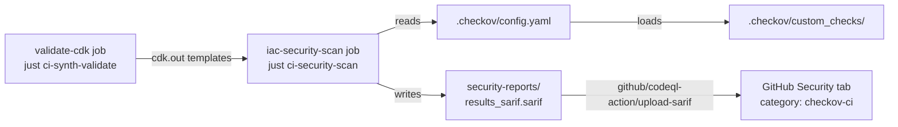

## What It Does

Checkov is an open-source static analysis tool for infrastructure-as-code. In this project it scans synthesised CloudFormation templates for security misconfigurations, comparing each resource's properties against a library of built-in checks and project-specific custom checks written in Python.

Checkov is configured to use the `cloudformation` framework exclusively. It is not used to scan Terraform, Kubernetes manifests, or Dockerfile resources in this repository.

Results are written to `security-reports/results_sarif.sarif` in SARIF format and uploaded to the GitHub Security tab as inline PR annotations, making findings visible without leaving the pull request review interface.

## How It Is Configured

The single configuration file is `.checkov/config.yaml`. Every key Checkov reads in this project is specified there — no flags are passed ad-hoc in the CI command.

### Severity thresholds

```yaml
soft-fail-on:
  - LOW
  - MEDIUM
```

LOW and MEDIUM findings are reported but do not block CI. CRITICAL and HIGH findings block the pipeline by default (they are absent from `soft-fail-on`).

### Skipped built-in checks

The following built-in checks are permanently skipped. Each entry in the config file carries an inline rationale comment:

| Check ID | Rationale |
| :--- | :--- |
| `CKV_AWS_111` | VPC Flow Logs handled by SharedVpcStack with encryption |
| `CKV_AWS_338` | CloudWatch Log retention set to 30 days in dev for cost optimisation |
| `CKV_AWS_178` | Single NAT Gateway used in dev for cost optimisation |
| `CKV_AWS_117` | CDK custom resource Lambdas do not need VPC access |
| `CKV_AWS_116` | CDK custom resource Lambdas handle retries internally (no DLQ needed) |
| `CKV_AWS_115` | CDK custom resource Lambdas are deployment-only (no concurrency limit needed) |

### Custom checks

Twenty-nine project-specific checks live in `.checkov/custom_checks/`, loaded automatically via:

```yaml
external-checks-dir:
  - custom_checks
```

The checks are grouped by domain across 11 Python files:

| File | Domain | Check IDs |
| :--- | :--- | :--- |
| `sg_rules.py` | Security Groups | `CKV_CUSTOM_SG_1` – `CKV_CUSTOM_SG_5` |
| `iam_rules.py` | IAM | `CKV_CUSTOM_IAM_1` – `CKV_CUSTOM_IAM_5` |
| `logging_rules.py` | CloudWatch Log Groups | `CKV_CUSTOM_VPC_1` – `CKV_CUSTOM_VPC_3` |
| `compute_rules.py` | EC2 UserData | `CKV_CUSTOM_COMPUTE_1`, `CKV_CUSTOM_COMPUTE_2`, `CKV_CUSTOM_COMPUTE_4` |
| `ebs_rules.py` | EBS Volumes | `CKV_CUSTOM_EBS_1`, `CKV_CUSTOM_EBS_3` |
| `kms_rules.py` | KMS Keys | `CKV_CUSTOM_KMS_1`, `CKV_CUSTOM_KMS_2` |
| `asg_rules.py` | Auto Scaling Groups | `CKV_CUSTOM_ASG_1`, `CKV_CUSTOM_ASG_2` |
| `vpc_rules.py` | VPC / Subnets | `CKV_CUSTOM_VPC_5`, `CKV_CUSTOM_VPC_6` |
| `lambda_rules.py` | Lambda | `CKV_CUSTOM_LAMBDA_1`, `CKV_CUSTOM_LAMBDA_2` |
| `sns_rules.py` | SNS | `CKV_CUSTOM_SNS_1`, `CKV_CUSTOM_SNS_2` |
| `sqs_ssl_enabled.py` | SQS | `CKV_CUSTOM_SQS_1` |

Selected check details from `iam_rules.py` and `lambda_rules.py`:

- `CKV_CUSTOM_IAM_1` — Ensure IAM Role has a permissions boundary configured (exception: service-linked roles)
- `CKV_CUSTOM_IAM_2` — Ensure no hardcoded 12-digit AWS account IDs in resource ARNs
- `CKV_CUSTOM_IAM_3` — Ensure IAM Roles do not use static `RoleName` strings (prevents safe CloudFormation updates)
- `CKV_CUSTOM_IAM_4` — At most 3 AWS managed policies per role (threshold accommodates ECS EC2 instance roles that need ECS + SSM + CloudWatch)
- `CKV_CUSTOM_IAM_5` — Role has at least one policy attached
- `CKV_CUSTOM_LAMBDA_1` — Lambda has `ReservedConcurrentExecutions` configured
- `CKV_CUSTOM_LAMBDA_2` — Lambda has a Dead Letter Queue `TargetArn` configured

### Output settings

`compact: true` in `.checkov/config.yaml` suppresses per-resource verbose output in CI logs.

## How It Integrates with the Rest of the System



The `iac-security-scan` job in `.github/workflows/ci.yml` declares `needs: [setup, build, validate-cdk, detect-changes]` and runs only when `validate-cdk` succeeds. The CI container is `ghcr.io/nelson-lamounier/cdk-monitoring/ci:latest`.

The SARIF upload step uses a pinned action hash (`github/codeql-action/upload-sarif@b5ebac6f4c00c8ccddb7cdcd45fdb248329f808a`) and runs `if: always()` — results are uploaded even when the Checkov step fails so findings are visible in the Security tab regardless of gate outcome. The step itself uses `continue-on-error: true` to prevent an upload failure from masking the underlying Checkov result.

## Failure Modes

**CRITICAL/HIGH finding blocks merge.** The `iac-security-scan` job exits non-zero when Checkov finds a violation not in `soft-fail-on`. The `ci-success` gate job lists `iac-security-scan` in its `needs` list, so a blocked scan blocks the entire CI summary.

**Template synthesis failure upstream.** If `validate-cdk` fails, `iac-security-scan` is skipped entirely (`if: needs.validate-cdk.result == 'success'`). No SARIF file is produced.

**SARIF upload fails silently.** The upload step has `continue-on-error: true`. If the CodeQL action is unavailable (e.g. network issue), the pipeline continues and the Checkov exit code remains the authoritative gate.

**Custom check import error.** A Python syntax error or missing import in any file under `.checkov/custom_checks/` will cause Checkov to fail at startup, blocking CI without producing a SARIF report.

## Operational Notes

**Running locally** (from `.checkov/custom_checks/README.md`):

```bash
# With custom checks, using the project config file
checkov -d cdk.out --config-file .checkov/config.yaml
```

**Adding a new custom check:** Add a Python class extending `BaseResourceCheck` in the appropriate domain file. Register the instance at module level (e.g. `check = MyNewCheck()`). The check is auto-discovered on next Checkov run. Use a new `CKV_CUSTOM_<DOMAIN>_<N>` ID.

**Adding a new skip-check entry:** Add the check ID and a rationale comment to the `skip-check` list in `.checkov/config.yaml`. The comment format used throughout the file is: `- CKV_AWS_NNN # reason`.

**Critical checks that are never skipped** are documented in the comments section of `.checkov/config.yaml` (EBS encryption `CKV_AWS_145`, S3 access logging `CKV_AWS_18`, S3 SSE `CKV_AWS_19`, S3 versioning `CKV_AWS_21`, API Gateway authorizer `CKV_AWS_59`, unrestricted SG ingress `CKV_AWS_23`, IAM wildcard actions `CKV_AWS_62`, IAM wildcard resources `CKV_AWS_63`).

<!-- evidence-trail
  .checkov/config.yaml: framework, soft-fail-on, skip-check with rationale comments, external-checks-dir, compact
  .checkov/custom_checks/README.md: full 29-check registry across 11 domain files
  .checkov/custom_checks/iam_rules.py: CKV_CUSTOM_IAM_1-5 implementations and docstrings
  .checkov/custom_checks/lambda_rules.py: CKV_CUSTOM_LAMBDA_1-2 implementations
  .github/workflows/ci.yml lines 400-437: iac-security-scan job definition, needs, container, upload-sarif with pinned hash and continue-on-error
-->
