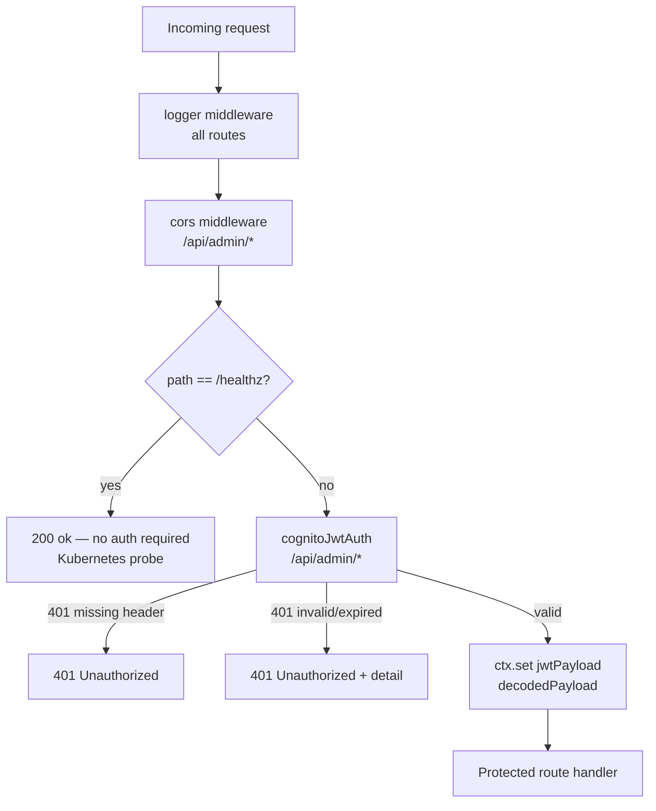

# Cognito JWKS JWT Middleware

## What it does

`cognitoJwtAuth` is a Hono middleware factory that validates Cognito-issued ID tokens using JWKS (JSON Web Key Sets) fetched from the Cognito User Pool's well-known endpoint ([api/admin-api/src/middleware/auth.ts](../api/admin-api/src/middleware/auth.ts#L1)).

It enforces bearer authentication on every route it is applied to by:

1. Extracting the `Authorization: Bearer <token>` header.
2. Fetching (and caching) the JWKS from `https://cognito-idp.{region}.amazonaws.com/{userPoolId}/.well-known/jwks.json`.
3. Verifying the JWT's signature, `iss` claim, `aud` claim, and expiry using the `jose` library.
4. Attaching the decoded payload to `ctx.set('jwtPayload', payload)` so downstream route handlers can read it without re-parsing the token.

This approach avoids storing static signing secrets. Key rotation is handled transparently: when a new JWT references a `kid` not present in the in-memory cache, `jose`'s `createRemoteJWKSet` fetches the updated keyset automatically ([api/admin-api/src/middleware/auth.ts](../api/admin-api/src/middleware/auth.ts#L17)).

## How it is configured

The middleware is instantiated once at startup inside `index.ts` using values from `loadConfig()` ([api/admin-api/src/index.ts](../api/admin-api/src/index.ts#L75)):

```ts
const jwtMiddleware = cognitoJwtAuth(
  config.cognitoUserPoolId,
  config.cognitoClientId,
  config.cognitoIssuerUrl,
  config.awsRegion,
);

app.use('/api/admin/*', jwtMiddleware);
```

The four parameters map directly to environment variables ([api/admin-api/src/lib/config.ts](../api/admin-api/src/lib/config.ts#L109)):

| Parameter | Env var | K8s source | JWT claim validated |
|---|---|---|---|
| `userPoolId` | `COGNITO_USER_POOL_ID` | Secret `admin-api-secrets` | Used to build JWKS URL |
| `clientId` | `COGNITO_CLIENT_ID` | Secret `admin-api-secrets` | `aud` claim |
| `issuerUrl` | `COGNITO_ISSUER_URL` | Secret `admin-api-secrets` | `iss` claim |
| `region` | `AWS_DEFAULT_REGION` | ConfigMap `admin-api-config` | Used to build JWKS URL |

The JWKS URL pattern constructed internally is ([api/admin-api/src/middleware/auth.ts](../api/admin-api/src/middleware/auth.ts#L40)):

```
https://cognito-idp.{region}.amazonaws.com/{userPoolId}/.well-known/jwks.json
```

### Per-pool JWKS cache

A module-level `Map<string, RemoteJWKSet>` keyed on `userPoolId` prevents redundant HTTP fetches when the middleware is called repeatedly ([api/admin-api/src/middleware/auth.ts](../api/admin-api/src/middleware/auth.ts#L26)). Since admin-api serves a single User Pool, there is always exactly one entry in this map.

## How it integrates with the rest of the system

### Route topology

The middleware is applied with a glob pattern so that every route under `/api/admin/*` is protected, while `/healthz` is registered before the middleware and remains unauthenticated ([api/admin-api/src/index.ts](../api/admin-api/src/index.ts#L72)):



### JWT payload consumption by routes

Route handlers that need the authenticated user's identity read the payload via `ctx.get('jwtPayload')`. For example, the ingestion trigger route extracts `sub` as `userId` to label the Kubernetes Job and enforce authorisation on pipeline run reads ([api/admin-api/src/routes/ingestion.ts](../api/admin-api/src/routes/ingestion.ts#L103)):

```ts
const jwtPayload = ctx.get('jwtPayload');
const userId = typeof jwtPayload?.sub === 'string' ? jwtPayload.sub : '';
if (!userId) return ctx.json({ error: 'Authenticated subject missing' }, 401);
```

The same pattern is used in `pipelines.ts` ([api/admin-api/src/routes/pipelines.ts](../api/admin-api/src/routes/pipelines.ts#L104)) and the pipeline run ownership check ([api/admin-api/src/routes/pipelines.ts](../api/admin-api/src/routes/pipelines.ts#L251)).

## Failure modes

| Condition | HTTP response | Detail field |
|---|---|---|
| `Authorization` header absent or does not start with `Bearer ` | `401` | `"Missing or invalid Authorization header"` |
| Token signature invalid (wrong pool, tampered) | `401` | jose error message |
| Token expired (`exp` claim in the past) | `401` | jose error message |
| `aud` claim does not match `clientId` | `401` | jose error message |
| `iss` claim does not match `issuerUrl` | `401` | jose error message |
| JWKS endpoint unreachable (network partition) | `401` | jose fetch error message |

All 401 responses are returned as `application/json` with `{ "error": "Unauthorised", "detail": "<message>" }` ([api/admin-api/src/middleware/auth.ts](../api/admin-api/src/middleware/auth.ts#L87)).

When the `Authorization` header is missing entirely, the response body uses `"Missing or invalid Authorization header"` without the `detail` field ([api/admin-api/src/middleware/auth.ts](../api/admin-api/src/middleware/auth.ts#L70)).

## Operational notes

### /healthz exemption

Kubernetes liveness and readiness probes call `GET /healthz`. Because probes cannot send JWTs, this path is registered on the app **before** the JWT middleware is applied and is therefore exempt from authentication ([api/admin-api/src/index.ts](../api/admin-api/src/index.ts#L72)). The test suite asserts this behaviour explicitly ([api/admin-api/__tests__/routes/health.test.ts](../api/admin-api/__tests__/routes/health.test.ts#L32)).

### JWKS key rotation

`jose`'s `createRemoteJWKSet` caches signing keys in-memory per instance. When Cognito rotates keys, the next JWT carrying an unknown `kid` causes `jose` to re-fetch the JWKS endpoint. No admin-api restart is required ([api/admin-api/src/middleware/auth.ts](../api/admin-api/src/middleware/auth.ts#L17)).

### No static secrets in the pod

AWS SDK credentials come from IMDS; Cognito IDs come from the ESO-synced `admin-api-secrets` Secret. The middleware never reads any long-lived signing secret ([api/admin-api/src/index.ts](../api/admin-api/src/index.ts#L13)).

### CORS and the BFF pattern

After the BFF migration, API calls come from start-admin server functions (pod-to-pod). The `Authorization` header is forwarded by the TanStack server function, not set by the browser directly. CORS is still configured as defence-in-depth for any future client-side fetch, but is not the primary trust boundary — the JWT is ([api/admin-api/src/index.ts](../api/admin-api/src/index.ts#L56)).

<!--
Evidence trail (auto-generated):
- Source: api/admin-api/src/middleware/auth.ts (read on 2026-04-28)
- Source: api/admin-api/src/index.ts (read on 2026-04-28)
- Source: api/admin-api/__tests__/routes/health.test.ts (read on 2026-04-28)
- Source: api/admin-api/src/lib/config.ts (read on 2026-04-28)
- Source: api/admin-api/src/routes/ingestion.ts (read on 2026-04-28)
- Source: api/admin-api/src/routes/pipelines.ts (read on 2026-04-28)
-->
