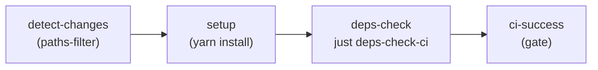

## What it does

dependency-cruiser (`^17.3.7`) statically analyses TypeScript and JavaScript
import graphs to enforce architectural rules and catch dependency problems
before they reach production
([infra/package.json L91](../../infra/package.json#L91)). In this repository
it runs against the CDK infrastructure code under `bin/`, `lib/`, and
`lambda/` and fails the CI pipeline when any **error**-severity rule is
violated. Generated SVG and HTML dependency graphs are written to
`infra/docs/` as living architecture documentation.

## How it is configured

The shared configuration lives at
[`.dependency-cruiser.cjs`](../../.dependency-cruiser.cjs) in the repository
root and is referenced by all `depcruise` invocations via
`--config ../.dependency-cruiser.cjs`.

### Enforced rules

Rules are divided by severity. **Error** rules block CI; **warn** rules are
advisory.

#### Error-severity rules (block CI)

| Rule name | What it catches |
|---|---|
| `no-non-package-json` | Import of an npm package absent from `package.json` `dependencies` — would be unavailable at runtime |
| `not-to-unresolvable` | Import that cannot be resolved to disk — broken import path |
| `not-to-test` | Production code (`bin/`, `lib/`) importing from a test folder |
| `not-to-spec` | Any module importing a `.spec.ts` or `.test.ts` file |
| `not-to-dev-dep` | Production code (`bin/`, `lib/`) importing a `devDependency`; Lambda code under `lambda/` is explicitly excluded because CDK bundles it with esbuild at synth time |

#### Warn-severity rules (advisory)

| Rule name | What it catches |
|---|---|
| `no-circular` | Circular dependency relationships |
| `no-orphans` | Modules with no imports and no importers (likely dead code); dot-files, `.d.ts` files, `tsconfig.json`, and build configs are excluded from this check |
| `no-deprecated-core` | Use of deprecated Node.js built-in modules (`punycode`, `domain`, `async_hooks`, etc.) |
| `not-to-deprecated` | Use of a deprecated npm package version |
| `no-duplicate-dep-types` | Package declared in both `dependencies` and `devDependencies`; type-only imports are excluded |
| `optional-deps-used` | Use of an `optionalDependency` (flagged for review) |
| `peer-deps-used` | Use of a `peerDependency` outside of a plugin context |

### Resolver options

Key options from the `options` block
([.dependency-cruiser.cjs L216-L390](../../.dependency-cruiser.cjs#L216-L390)):

```cjs
doNotFollow: { path: ['node_modules'] },
tsPreCompilationDeps: true,        // detect pre-compilation TypeScript imports
tsConfig: { fileName: 'tsconfig.json' },
enhancedResolveOptions: {
  exportsFields: ['exports'],
  conditionNames: ['import', 'require', 'node', 'default', 'types'],
  mainFields: ['main', 'types', 'typings'],
},
skipAnalysisNotInRules: true,      // skip expensive analysis not needed by the ruleset
```

`tsPreCompilationDeps: true` ensures that TypeScript-only type imports are
detected before the compiler erases them, which matters for catching
misplaced type imports between production and test code.

## How it integrates with the rest of the system

### NPM scripts (infra/package.json)

```jsonc
"deps:check":      "depcruise bin lib lambda --config ../.dependency-cruiser.cjs",
"deps:check:ci":   "depcruise bin lib lambda --config ../.dependency-cruiser.cjs --output-type err-long",
"deps:orphans":    "depcruise bin lib lambda --config ../.dependency-cruiser.cjs --output-type err --focus orphan",
"deps:graph":      "depcruise bin lib --include-only '^(bin|lib)/' ... | dot -T svg > docs/dependency-graph.svg",
"deps:graph:stacks": "... > docs/stacks-graph.svg",
"deps:graph:common": "... > docs/common-graph.svg",
"deps:graph:lambda": "... > docs/lambda-graph.svg",
"deps:graph:html": "... > docs/dependency-report.html",
"deps:archi":      "... --output-type archi ... > docs/architecture.svg",
```

([infra/package.json L17-L28](../../infra/package.json#L17-L28))

### CI pipeline

The `deps-check` job runs on every push or pull request when any source file
under `infra/lib/**/*.ts` or `bin/**/*.ts` changes
([.github/workflows/ci.yml L226-L250](../../.github/workflows/ci.yml#L226-L250)).
It is a parallel peer of the `lint`, `typecheck`, and `build` jobs — a
failure here does not block the build job.

The job executes `just deps-check-ci`, which resolves to
`yarn deps:check:ci`, which runs `depcruise` with `--output-type err-long`
for verbose CI error details. The comment in the workflow step explains the
intent: "Runs dependency-cruiser to enforce architectural boundaries (e.g.,
no circular imports, layer violations)."



## Failure modes

**CI fails with `not-to-unresolvable`** — an import path was renamed or a
package removed from `package.json` without updating the import. Fix by
correcting the path or adding the missing dependency.

**CI fails with `no-non-package-json`** — a package is used in production
code but declared only in `devDependencies`. Either move it to `dependencies`
or, for Lambda code, verify the file path is under `lambda/` (which is
exempt from this rule via `pathNot: ['^lambda/']`).

**CI fails with `not-to-dev-dep` from `lib/` or `bin/`** — production CDK
code is importing a `devDependency`. Verify that the import is legitimate
(e.g., type-only), or move the package to `dependencies`.

**`no-circular` warnings accumulate** — circular imports in CDK constructs
typically cause `Construct` scope resolution failures at synth time. Treat
circular warnings as errors during active development.

**Graph generation fails with `dot: command not found`** — Graphviz is not
installed locally. Install with `brew install graphviz` (macOS). The CI
pipeline does not run the graph-generation scripts; they are a local
developer tool.

## Operational notes

**Version** — `dependency-cruiser@17.3.7` as recorded in the auto-generated
footer of [`.dependency-cruiser.cjs`](../../.dependency-cruiser.cjs#L391):
`// generated: dependency-cruiser@17.3.7 on 2026-02-06T04:37:09.973Z`.

**Scope** — only the `infra/` package runs dependency-cruiser. The `api/`
packages (`admin-api`, `public-api`) have their own TypeScript compilation
guard (`tsc --noEmit`) and ESLint but do not currently run `depcruise`.

**Graph outputs** — SVG and HTML files written to `infra/docs/` are not
committed to the repository. Regenerate locally with `yarn deps:graphs` when
reviewing architecture changes.

**`skipAnalysisNotInRules: true`** — this option makes the cruise faster by
skipping analysis (e.g., orphan detection on excluded paths) that no active
rule needs. If new rules are added that require broader analysis, this option
may need revisiting.

<!--
Evidence trail (auto-generated):
- Source: .dependency-cruiser.cjs (read on 2026-04-28)
- Source: infra/package.json (read on 2026-04-28)
- Source: .github/workflows/ci.yml (read on 2026-04-28)
-->
