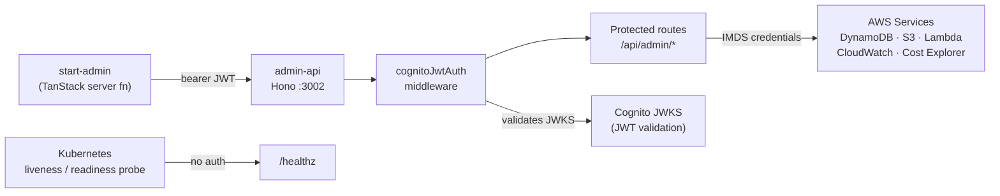

## What it does

Hono (`^4.6.14`) is the HTTP framework powering `admin-api`, the Backend for
Frontend (BFF) that serves the start-admin TanStack application
([api/admin-api/src/index.ts](../../api/admin-api/src/index.ts#L1-L17)).
It handles all write-heavy REST operations for the admin dashboard — content
management, S3 asset uploads, pipeline triggers, FinOps metrics, and Kubernetes
job management — behind a Cognito JWT authentication layer. The server listens
on **port 3002**; the sibling `public-api` uses 3001.

## How it is configured

### Port and startup

The server port is resolved from `config.port`, loaded by `loadConfig()` at
startup ([index.ts L38](../../api/admin-api/src/index.ts#L38)). If any
required environment variable is absent, `loadConfig()` throws immediately,
causing a Kubernetes `CrashLoopBackOff` visible in ArgoCD rather than a silent
runtime failure hours later.

### Credential model

Three injection sources are used; no credentials are hardcoded or passed as
plain environment variables in the pod ([index.ts L10-L16](../../api/admin-api/src/index.ts#L10-L16)):

| Source | What it provides |
|---|---|
| EC2 Instance Metadata Service (IMDS) | AWS SDK credentials for DynamoDB, S3, Lambda, CloudWatch, Cost Explorer |
| Kubernetes Secret `admin-api-secrets` | Cognito User Pool ID, Client ID, Issuer URL |
| Kubernetes ConfigMap `admin-api-config` | DynamoDB table names, S3 bucket, Lambda ARNs, AWS region |

### CORS configuration

CORS is applied only to `/api/admin/*` routes and permits two production
origins and two local development origins
([index.ts L48-L68](../../api/admin-api/src/index.ts#L48-L68)):

```ts
cors({
  origin: [
    'https://nelsonlamounier.com',
    'http://localhost:3000',
    'http://localhost:5001',
  ],
  allowMethods: ['GET', 'POST', 'PUT', 'DELETE', 'OPTIONS'],
  allowHeaders: ['Authorization', 'Content-Type'],
  maxAge: 600,
})
```

After the BFF migration, all API calls originate from TanStack server
functions (pod-to-pod), so the browser never sends cross-origin requests to
`admin-api` directly. The CORS config is retained as a defence-in-depth
measure for any future client-side fetch path.

### Middleware chain order

The order of middleware registration in `index.ts` is significant:

1. `logger()` on `*` — structured request logging consumed by Loki via Alloy
2. `cors(...)` on `/api/admin/*` — applied before the JWT guard
3. `cognitoJwtAuth(...)` on `/api/admin/*` — blocks unauthenticated requests
4. Route handlers mounted under `/api/admin/<resource>`

`/healthz` is registered before the JWT middleware and is explicitly exempt
so Kubernetes liveness and readiness probes can succeed without a token
([index.ts L72](../../api/admin-api/src/index.ts#L72)).

## How it integrates with the rest of the system



The seven protected route groups and their modules
([index.ts L85-L91](../../api/admin-api/src/index.ts#L85-L91)):

| Mount path | Module |
|---|---|
| `/api/admin/articles` | `routes/articles.ts` |
| `/api/admin/applications` | `routes/applications.ts` |
| `/api/admin/assets` | `routes/assets.ts` |
| `/api/admin/finops` | `routes/finops.ts` |
| `/api/admin/ingestion` | `routes/ingestion.ts` |
| `/api/admin/pipelines` | `routes/pipelines.ts` |
| `/api/admin/resumes` | `routes/resumes.ts` |

## Failure modes

**`CrashLoopBackOff` on startup** — `loadConfig()` throws if any required env
var is absent. Check the pod logs for the specific missing key; verify the
Secret and ConfigMap are mounted and contain the expected keys.

**401 on all `/api/admin/*` requests** — the Cognito JWT middleware failed
JWKS validation. Common causes: wrong `cognitoUserPoolId`, `cognitoClientId`,
or `cognitoIssuerUrl` in the Secret; expired token; clock skew between pod
and Cognito.

**CORS rejection for future client-side fetches** — if a new feature needs to
call admin-api directly from the browser on a new origin, add the origin to
the `cors()` array in `index.ts` and redeploy.

**Unhandled errors return 500** — the `app.onError` handler
([index.ts L97-L100](../../api/admin-api/src/index.ts#L97-L100)) logs the
error with path to stdout (captured by Loki) and returns `{"error":"Internal
server error"}`. Check Grafana → Loki with label `app=admin-api` for the
full stack trace.

**404 from `/api/admin/*`** — a route prefix mismatch. `app.notFound`
([index.ts L94](../../api/admin-api/src/index.ts#L94)) returns
`{"error":"Not found"}`. Confirm the mount path in `index.ts` matches the
client call.

## Operational notes

**Development server** — `npm run dev` uses `tsx watch` for hot-reload
([package.json L8](../../api/admin-api/package.json#L8)). The production
image runs `node dist/index.js` against the compiled output.

**Node.js adapter** — Hono's Node.js adapter (`@hono/node-server ^1.13.7`)
is used rather than the Cloudflare Workers or Bun runtimes, consistent with
the Kubernetes deployment target ([package.json L22](../../api/admin-api/package.json#L22)).

**Structured logging** — Hono's built-in `logger()` middleware writes request
lines to stdout. These are collected by Grafana Alloy running as a DaemonSet
and forwarded to Loki.

**Scaling** — `admin-api` is a stateless pod; horizontal scaling requires
no session-stickiness because all state lives in DynamoDB/S3 and AWS SDK
credentials come from IMDS (available on every node).

<!--
Evidence trail (auto-generated):
- Source: api/admin-api/src/index.ts (read on 2026-04-28)
- Source: api/admin-api/package.json (read on 2026-04-28)
-->
