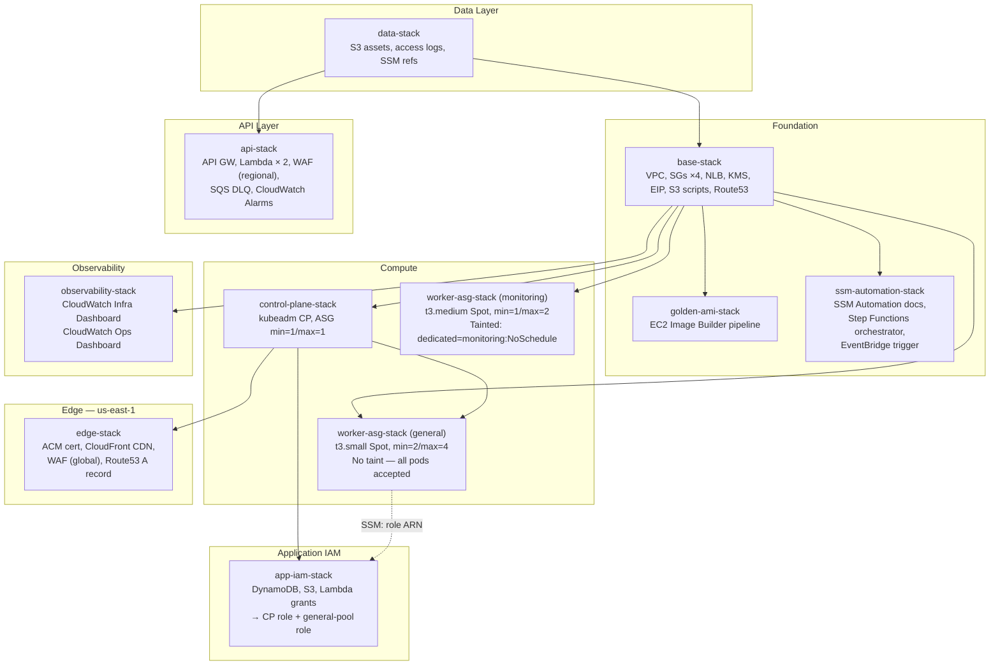

# Kubernetes Stacks

> Self-managed Kubernetes cluster on EC2 — 10 stacks covering networking, compute,
> security, edge delivery, observability, and automated bootstrap.

## Stack Map



> **Note on SSM wiring**: dashed arrows represent SSM parameter lookups (no `Fn::ImportValue` /
> CloudFormation exports). Every consumer calls `ssm.StringParameter.valueForStringParameter()`
> at synth time. This removes all hard delete-order constraints between stacks.

---

## Stack Reference

| # | Stack | File | Lines | Class | Purpose |
|---|-------|------|------:|-------|---------|
| 1 | **Data** | `data-stack.ts` | 427 | `KubernetesDataStack` | S3 static-assets bucket (CloudFront OAC), S3 access-logs bucket, SSM parameters; DynamoDB removed — consolidated into `AiContentStack` |
| 2 | **Base** | `base-stack.ts` | 561 | `KubernetesBaseStack` | VPC lookup via `Vpc.fromLookup`, Security Groups ×4 (`clusterBase`, `controlPlane`, `ingress`, `monitoring`), NLB (TCP 80/443 → Traefik), KMS key (auto-rotation), Elastic IP, Private Route 53 hosted zone (`k8s.internal`), S3 scripts bucket, publishes 12 SSM parameters |
| 2b | **Golden AMI** | `golden-ami-stack.ts` | 154 | `GoldenAmiStack` | EC2 Image Builder pipeline — bakes Docker, `kubeadm`, AWS CLI, `ecr-credential-provider`, Calico manifests into a Golden AMI; AMI ID published to SSM |
| 2c | **SSM Automation** | `ssm-automation-stack.ts` | 726 | `K8sSsmAutomationStack` | 6 SSM Automation Documents (CP, general-pool, monitoring-pool, secrets), Step Functions bootstrap orchestrator, Lambda tag router, EventBridge rule (ASG launch → Step Functions), CloudWatch alarm + SNS |
| 3 | **Control Plane** | `control-plane-stack.ts` | 763 | `KubernetesControlPlaneStack` | Launch Template (Golden AMI from SSM, IMDSv2, GP3), ASG min=1/max=1, IAM role (SSM + EBS + S3 + Route53 + KMS + CloudWatch), EIP failover Lambda, CloudWatch log group (KMS-encrypted) |
| 3b | **Worker ASG — general** | `worker-asg-stack.ts` | 791 | `KubernetesWorkerAsgStack` | `poolType: 'general'` — t3.small Spot, min=2/max=4, no taint; hosts Next.js, start-admin, ArgoCD, public-api, admin-api |
| 3c | **Worker ASG — monitoring** | `worker-asg-stack.ts` | *(same file)* | `KubernetesWorkerAsgStack` | `poolType: 'monitoring'` — t3.medium Spot, min=1/max=2; tainted `dedicated=monitoring:NoSchedule`; hosts Prometheus, Grafana, Loki, Tempo, Alloy; SNS alerts topic |
| 4 | **App IAM** | `app-iam-stack.ts` | 371 | `KubernetesAppIamStack` | Attaches application-tier IAM grants (DynamoDB read, S3 assets, Secrets Manager, Lambda invoke) to the control-plane role **and** the general-pool worker role; fully decoupled from compute lifecycle |
| 5 | **API** | `api-stack.ts` | 618 | `NextJsApiStack` | API Gateway REST API, Lambda ×2 (subscribe + verify email), SQS DLQ per function, regional WAF, CloudWatch alarms on DLQs, SSM parameter for API URL |
| 6 | **Edge** | `edge-stack.ts` | 923 | `KubernetesEdgeStack` | Deployed to `us-east-1` — ACM certificate (cross-account DNS-01 validation), CloudFront distribution (dual-origin: EIP + S3 OAC, WAF global WebACL), Route 53 A record (`RemovalPolicy.RETAIN`) |
| 7 | **Observability** | `observability-stack.ts` | 194 | `KubernetesObservabilityStack` | CloudWatch Infrastructure Dashboard (EC2 ASG, NLB, CloudFront metrics) + CloudWatch Operations Dashboard (AMI builds, SSM bootstrap, Step Functions, self-healing agent) |

---

## Deploy Order

The `KubernetesProjectFactory` creates all stacks in this sequence during `cdk deploy`:

```
1. deploy-data         # S3 assets + SSM refs (no AWS VPC dependency)
2. deploy-base         # VPC lookup, SGs, NLB, KMS, EIP → publishes 12 SSM params
   deploy-goldenami    # Image Builder pipeline (reads SSM: VPC, SG, scripts bucket)
   deploy-ssmautomation# Bootstrap docs + Step Functions (reads SSM: scripts bucket)
3. deploy-controlplane # ASG + IAM role → publishes role ARN to SSM
   deploy-workers      # general-pool ASG (reads SSM: SG, NLB TGs, golden AMI)
                       # monitoring-pool ASG (reads SSM: SG, monitoring-SG, NLB TGs)
4. deploy-appiam       # Attaches grants to CP role + general-pool role (reads SSM)
5. deploy-api          # API GW + Lambda (reads SSM: DynamoDB ARN, assets bucket)
6. deploy-edge         # CloudFront + ACM (reads SSM: EIP, assets bucket — cross-region)
7. deploy-observability# CloudWatch dashboards (reads SSM: NLB full name, CF distro ID)
```

> The pipeline (`_deploy-kubernetes.yml`) enforces this ordering via GitHub Actions `needs:`.

---

## Key Design Patterns

### 1. Parameterised Worker Pool (`worker-asg-stack.ts`)

The three legacy named worker stacks (`AppWorkerStack`, `MonitoringWorkerStack`,
`ArgocdWorkerStack`) were **consolidated into a single parameterised
`KubernetesWorkerAsgStack`** driven by the `WorkerPoolType` discriminant:

```typescript
export type WorkerPoolType = 'general' | 'monitoring';
```

The factory instantiates the same class **twice** with different `poolType` values:

```typescript
// Stack 3b — general pool
const generalPoolStack = new KubernetesWorkerAsgStack(scope, 'GeneralPool-dev', {
    poolType: 'general',   // t3.small, min=2, max=4, no taint
    ...
});

// Stack 3c — monitoring pool
const monitoringPoolStack = new KubernetesWorkerAsgStack(scope, 'MonPool-dev', {
    poolType: 'monitoring', // t3.medium, min=1, max=2, taint applied by bootstrap
    ...
});
```

**Benefits**: one file to maintain, identical SSM wiring, identical Spot configuration,
conditional IAM policies and SNS topic added solely for `monitoring` pool.

### 2. SSM-Based Cross-Stack Wiring (no `Fn::ImportValue`)

All inter-stack dependencies are resolved at **synth time** via
`ssm.StringParameter.valueForStringParameter()` rather than CloudFormation exports.

```
base-stack publishes:
  /k8s/{env}/vpc-id
  /k8s/{env}/security-group-id
  /k8s/{env}/ingress-sg-id
  /k8s/{env}/monitoring-sg-id
  /k8s/{env}/kms-key-arn
  /k8s/{env}/scripts-bucket
  /k8s/{env}/nlb-http-target-group-arn
  /k8s/{env}/nlb-https-target-group-arn
  /k8s/{env}/elastic-ip
  /k8s/{env}/private-hosted-zone-id
  /k8s/{env}/nlb-full-name

control-plane-stack publishes:
  /k8s/{env}/join-token          (written by bootstrap, not CDK)
  /k8s/{env}/ca-hash             (written by bootstrap, not CDK)
  /k8s/{env}/control-plane-endpoint

worker-asg-stack (general) publishes:
  /k8s/{env}/general-instance-role-arn

golden-ami-stack publishes:
  /k8s/{env}/golden-ami/latest

edge-stack publishes:
  /nextjs/{env}/cloudfront/distribution-id
```

**Why SSM over `Fn::ImportValue`?** During the ECS → Kubernetes migration,
`Fn::ImportValue` prevented deletion of the old `NextJsNetworkingStack` because
downstream stacks held live import references. SSM parameters have no such
delete-time constraint — any stack can be torn down independently.

### 3. NLB Persistent Connectivity (no Elastic IPs on workers)

The Network Load Balancer (`base-stack.ts`) is the **single stable ingress point**:

```
Internet → CloudFront (HTTPS/TLS) → EIP (static IP) → NLB (TCP passthrough)
         → Traefik DaemonSet (HTTP/HTTPS on all nodes) → Pod
```

- `TCP 80` and `TCP 443` listeners on the NLB forward to **one target group each**
- **Every** worker ASG registers its instances with both target groups at launch
- Traefik runs as a `DaemonSet` so any node can handle traffic
- If a Spot instance is reclaimed, the NLB health check removes it; no IP update needed

### 4. Golden AMI → Immutable Instances

All EC2 instances (control plane + both worker pools) launch from a **Golden AMI**
baked by EC2 Image Builder (`golden-ami-stack.ts`). The AMI contains:

- Amazon Linux 2023 base
- Docker Engine + containerd
- `kubeadm` / `kubelet` / `kubectl`
- AWS CLI v2 + `ecr-credential-provider`
- Calico CNI manifests (vendored)

The AMI ID is published to SSM (`/k8s/{env}/golden-ami/latest`). Launch Templates
reference this SSM path, so a **new AMI = replace Launch Template version = rolling ASG
instance refresh** — no AMI ID is ever hard-coded.

### 5. Bootstrap Orchestration (`ssm-automation-stack.ts`)

Instance boot is zero-touch. The chain is:

```
ASG instance launches
  → EC2 user-data runs trigger-bootstrap.ts
  → EventBridge rule fires (instance state: running)
  → Step Functions state machine starts
  → Lambda reads ASG tag (k8s:bootstrap-role) → resolves SSM Automation doc name
  → SSM Automation RunCommand executes on the instance
  → Bootstrap script joins cluster (kubeadm join) + labels node
  → Control plane publishes join-token / ca-hash to SSM (for subsequent workers)
```

Bootstrap failure → CloudWatch Alarm → SNS → email notification.

### 6. Construct Composition

Each stack **delegates** to constructs in `../../constructs/` — stacks own the
deployment policy (IAM, naming, SSM paths); constructs own the mechanism (L2/L1
resource creation). Examples:

| Construct | Used by |
|---|---|
| `SecurityGroupConstruct` | `base-stack` (×4 instantiations, data-driven loop) |
| `NetworkLoadBalancerConstruct` | `base-stack` |
| `LaunchTemplateConstruct` | `control-plane-stack`, `worker-asg-stack` (×2) |
| `AutoScalingGroupConstruct` | `control-plane-stack`, `worker-asg-stack` (×2) |
| `UserDataBuilder` | `control-plane-stack`, `worker-asg-stack` |
| `SsmParameterStoreConstruct` | `base-stack` |
| `LambdaFunctionConstruct` | `api-stack`, `edge-stack` |
| `BootstrapOrchestratorConstruct` | `ssm-automation-stack` |
| `InfrastructureDashboard` | `observability-stack` |
| `OperationsDashboard` | `observability-stack` |

### 7. EBS CSI Driver — Node-Level Block Devices

Worker nodes (both pools) include an **additional EBS volume** (`/dev/xvdf`) in the
Launch Template for persistent workload storage (Loki chunks, Prometheus TSDB).
The AWS EBS CSI driver (`ebs-sc` StorageClass) manages volume attachment/detachment.
State is recovered from S3 etcd snapshots on node replacement — no EBS snapshots needed.

### 8. Security Group Architecture (4-SG Blast Radius)

```
clusterBase SG  — intra-cluster (etcd :2380, kubelet :10250, Calico VXLAN :4789)
controlPlane SG — API server (:6443) from VPC CIDR only
ingress SG      — Traefik HTTP/HTTPS from CloudFront prefix list + admin IPs (SSM)
monitoring SG   — Prometheus (:9090), Node Exporter (:9100), Loki (:3100), Tempo
```

The `ingress` and `monitoring` SGs are **attached to worker nodes only**. The control
plane node only carries `clusterBase` + `controlPlane`.

---

## Files

```
lib/stacks/kubernetes/
├── index.ts                   # Re-exports all stack classes and prop types
├── base-stack.ts              # Long-lived foundation (VPC, SGs, NLB, KMS, EIP)
├── golden-ami-stack.ts        # Image Builder pipeline for node AMI
├── ssm-automation-stack.ts    # Step Functions + SSM Automation bootstrap orchestrator
├── control-plane-stack.ts     # kubeadm control-plane ASG (single-node, self-healing)
├── worker-asg-stack.ts        # Parameterised worker pool (general + monitoring)
├── app-iam-stack.ts           # Application-tier IAM grants (decoupled from compute)
├── data-stack.ts              # S3 static-assets bucket + access-logs bucket
├── api-stack.ts               # API Gateway + Lambda (email subscriptions)
├── edge-stack.ts              # CloudFront + ACM + WAF (us-east-1)
├── observability-stack.ts     # CloudWatch dashboards (Infra + Ops)
└── README.md                  # ← you are here
```

---

## Related

- [`../../constructs/README.md`](../../constructs/README.md) — reusable construct library
- [`../../projects/kubernetes/factory.ts`](../../projects/kubernetes/factory.ts) — factory that instantiates all stacks
- [`../../config/kubernetes/configurations.ts`](../../config/kubernetes/configurations.ts) — per-environment resource config
- [`../../../../docs/CDK-infra-stack/base-stack-review.md`](../../../../docs/CDK-infra-stack/base-stack-review.md) — full architectural deep-dive
